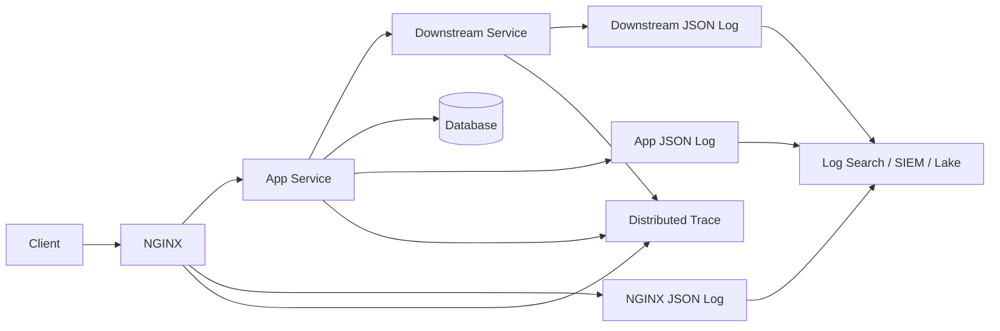

------
title: Learn NGINX In Action - Part 092
description: JSON logs, correlation ID, dan trace context untuk menghubungkan NGINX edge logs dengan application logs, metrics, dan distributed traces.
series: learn-nginx-in-action
seriesTitle: Learn NGINX In Action
order: 92
partTitle: JSON Logs, Correlation ID, and Trace Context
tags:
- nginx
- observability
- json-logs
- tracing
- correlation-id
- w3c-trace-context
- series
date: 2026-07-07
---

# Part 092 — JSON Logs, Correlation ID, and Trace Context

> Target bagian ini: kamu mampu membuat log NGINX yang **machine-readable**, aman dari escaping bug, bisa di-join dengan application logs, dan kompatibel dengan model tracing modern seperti W3C Trace Context. Fokusnya bukan “agar log terlihat keren dalam JSON”, tetapi agar edge traffic bisa dianalisis lintas NGINX, app, upstream, queue, database, dan incident timeline.

Part sebelumnya membahas access log dan error log sebagai RCA ledger. Sekarang kita naik satu level: membuat log NGINX menjadi bagian dari **distributed observability contract**.

Masalah yang ingin diselesaikan:

- request masuk lewat NGINX, tapi error muncul di service Java;
- app log punya request ID berbeda dari NGINX;
- trace ID ada di APM, tapi access log tidak bisa di-join;
- JSON log rusak karena quote/newline dari user agent;
- header correlation bisa dipalsukan client;
- trace context hilang saat proxy ke upstream;
- log terlalu kaya sampai membocorkan token/cookie/PII;
- log pipeline tidak bisa membedakan NGINX-generated error vs upstream-generated error.

---

## 1. Mental model: log line sebagai event envelope

JSON access log adalah **event envelope**.



Agar bisa di-join, semua event harus punya minimal:

- timestamp;
- request/correlation ID;
- trace context jika ada;
- service/component identity;
- route/operation;
- status/outcome;
- latency;
- upstream relation.

Tanpa itu, JSON hanyalah plain text yang memakai kurung kurawal.

---

## 2. Kenapa JSON logs?

JSON log memberi struktur eksplisit.

Kelebihan:

- field dapat di-index;
- query lebih stabil;
- nested naming lebih jelas;
- parser tidak bergantung pada spasi;
- log pipeline lebih mudah normalize;
- dashboard dan alert lebih mudah;
- bisa join dengan app logs.

Kekurangan:

- escaping harus benar;
- tipe data bisa tricky karena NGINX variable sering string;
- log line panjang;
- cardinality bisa mahal;
- sensitive field lebih mudah tersebar ke banyak sistem.

JSON log bukan otomatis lebih aman. JSON log yang salah escaping bisa lebih berbahaya daripada text log.

---

## 3. `log_format escape=json`

NGINX `log_format` mendukung parameter escaping. Untuk JSON, gunakan:

```nginx
log_format main_json escape=json '{ ... }';
```

`escape=json` membuat variable di-escape agar valid sebagai JSON string.

Contoh buruk:

```nginx
log_format bad_json '{"ua":"$http_user_agent"}';
```

Jika user agent berisi quote atau newline, JSON bisa rusak.

Contoh benar:

```nginx
log_format good_json escape=json
    '{"ua":"$http_user_agent"}';
```

Rule sederhana:

> Semua value dari NGINX variable sebaiknya diperlakukan sebagai string, kecuali kamu benar-benar tahu nilainya selalu numeric dan valid.

Kenapa?

- variable bisa bernilai `-`;
- upstream variables bisa berisi `0.001, 0.200` karena retry;
- header bisa kosong;
- URI/user agent bisa berisi karakter aneh;
- JSON numeric invalid akan merusak parse.

---

## 4. JSON log baseline untuk NGINX HTTP

```nginx
log_format edge_json escape=json
'{'
  '"@timestamp":"$time_iso8601",'
  '"nginx":{'
    '"request_id":"$request_id",'
    '"connection":"$connection",'
    '"connection_requests":"$connection_requests"'
  '},'
  '"client":{'
    '"ip":"$remote_addr",'
    '"port":"$remote_port",'
    '"realip_original":"$realip_remote_addr",'
    '"xff":"$http_x_forwarded_for"'
  '},'
  '"http":{'
    '"method":"$request_method",'
    '"host":"$host",'
    '"server_name":"$server_name",'
    '"scheme":"$scheme",'
    '"uri":"$uri",'
    '"request_uri":"$request_uri",'
    '"protocol":"$server_protocol",'
    '"status":"$status",'
    '"referer":"$http_referer",'
    '"user_agent":"$http_user_agent"'
  '},'
  '"network":{'
    '"bytes_sent":"$bytes_sent",'
    '"body_bytes_sent":"$body_bytes_sent",'
    '"request_length":"$request_length"'
  '},'
  '"timing":{'
    '"request_time_s":"$request_time",'
    '"upstream_connect_time_s":"$upstream_connect_time",'
    '"upstream_header_time_s":"$upstream_header_time",'
    '"upstream_response_time_s":"$upstream_response_time"'
  '},'
  '"upstream":{'
    '"addr":"$upstream_addr",'
    '"status":"$upstream_status",'
    '"bytes_received":"$upstream_bytes_received",'
    '"bytes_sent":"$upstream_bytes_sent",'
    '"cache_status":"$upstream_cache_status"'
  '}'
'}';

access_log /var/log/nginx/access.json edge_json;
```

Catatan:

- semua value dibuat string;
- field names stabil;
- `@timestamp` mengikuti convention banyak log systems;
- `nginx.request_id` tetap ada meskipun correlation ID dari client tidak ada;
- `upstream_*` tetap string karena bisa multi-attempt.

---

## 5. Correlation ID: apa yang sebenarnya dibutuhkan?

Correlation ID adalah ID yang dipakai untuk menghubungkan event yang berhubungan dengan request yang sama.

Di edge, kamu punya tiga pilihan:

1. menerima correlation ID dari client;
2. membuat correlation ID baru di NGINX;
3. menerima trace context standar dan meneruskannya.

Production biasanya butuh kombinasi:

- **external request ID**: dari client/CDN/API consumer jika ada;
- **edge request ID**: dibuat oleh NGINX untuk setiap request;
- **trace ID**: dari distributed tracing standard jika ada.

Jangan mengandalkan satu ID untuk semua kebutuhan.

---

## 6. Header naming: pilih contract eksplisit

Header umum:

| Header | Fungsi |
|---|---|
| `X-Request-ID` | Correlation ID legacy/common |
| `X-Correlation-ID` | Correlation ID business/platform |
| `traceparent` | W3C Trace Context core |
| `tracestate` | Vendor-specific trace state |
| `baggage` | Context propagation tambahan, hati-hati PII/cardinality |

Saran praktis:

- gunakan `traceparent` untuk tracing bila platform mendukung;
- gunakan `X-Request-ID` sebagai compatibility/fallback;
- jangan memasukkan PII ke correlation headers;
- validasi/normalize externally supplied IDs;
- generate ID di edge jika absent/invalid;
- forward ID ke upstream;
- log inbound dan effective ID.

---

## 7. Masalah: NGINX Open Source tidak punya conditional random generation kompleks

NGINX punya `$request_id`, tetapi melakukan validasi conditional yang canggih terhadap inbound header tidak sefleksibel bahasa pemrograman.

Kita bisa memakai `map` untuk fallback sederhana:

```nginx
map $http_x_request_id $effective_request_id {
    default $http_x_request_id;
    ""      $request_id;
}
```

Lalu forward:

```nginx
proxy_set_header X-Request-ID $effective_request_id;
proxy_set_header X-Edge-Request-ID $request_id;
```

Dan log:

```nginx
"request":{
  "id":"$effective_request_id",
  "edge_id":"$request_id",
  "inbound_id":"$http_x_request_id"
}
```

Namun ini belum memvalidasi karakter/panjang. Header inbound bisa berisi value sangat panjang atau format aneh. Untuk safety, kamu bisa membatasi dengan regex map.

---

## 8. Validasi ringan inbound request ID

Contoh hanya menerima ID alphanumeric, underscore, dash, dot dengan panjang kira-kira aman:

```nginx
map $http_x_request_id $valid_inbound_request_id {
    default "";
    ~^[A-Za-z0-9_.-]{8,128}$ $http_x_request_id;
}

map $valid_inbound_request_id $effective_request_id {
    default $valid_inbound_request_id;
    ""      $request_id;
}
```

Forward:

```nginx
proxy_set_header X-Request-ID $effective_request_id;
proxy_set_header X-Edge-Request-ID $request_id;
```

Invariant:

> Jangan forward correlation ID yang tidak kamu bersedia log, index, dan tampilkan ke operator.

---

## 9. Spoofing boundary

Client bisa mengirim `X-Request-ID`, `traceparent`, `X-Forwarded-For`, dan header lain.

Itu bukan berarti semuanya trustworthy.

Pisahkan:

| Field | Meaning |
|---|---|
| inbound ID | klaim dari client/hop sebelumnya |
| effective ID | ID yang dipakai platform setelah validasi/fallback |
| edge ID | ID yang dibuat NGINX |
| trusted trace | trace context yang lolos policy |

Untuk public edge, inbound correlation ID boleh dipakai untuk support/debug compatibility, tetapi jangan membuatnya satu-satunya authoritative identity.

---

## 10. W3C Trace Context: `traceparent` dan `tracestate`

W3C Trace Context mendefinisikan header HTTP untuk propagasi trace identity lintas vendor.

Header utama:

```txt
traceparent: 00-<trace-id>-<parent-id>-<trace-flags>
```

Contoh:

```txt
traceparent: 00-0af7651916cd43dd8448eb211c80319c-b7ad6b7169203331-01
```

Komponen:

| Bagian | Makna |
|---|---|
| `version` | versi format |
| `trace-id` | ID trace global |
| `parent-id` | ID parent/span caller |
| `trace-flags` | flag, biasanya sampled bit |

`tracestate` membawa state vendor-specific.

NGINX sebagai reverse proxy umumnya tidak membuat span tracing sendiri secara native seperti application instrumentation. Tapi NGINX dapat:

- menerima `traceparent`;
- meneruskan `traceparent` ke upstream;
- mencatat `traceparent` di log;
- mencatat `tracestate` bila policy mengizinkan;
- membuat fallback request ID;
- menjaga trace context tidak hilang di edge.

---

## 11. Propagate trace context through NGINX

Basic pass-through:

```nginx
proxy_set_header traceparent $http_traceparent;
proxy_set_header tracestate  $http_tracestate;
```

Tapi basic pass-through punya risiko:

- header invalid tetap diteruskan;
- header terlalu panjang bisa masuk log/pipeline;
- malicious value bisa membingungkan downstream;
- client bisa membuat trace ID arbitrary;
- `tracestate` bisa membawa data sensitif/cardinality tinggi.

Lebih baik minimal validasi `traceparent`.

---

## 12. Validasi ringan `traceparent`

Format `traceparent` versi `00`:

```txt
00-32hex-16hex-2hex
```

Contoh `map`:

```nginx
map $http_traceparent $valid_traceparent {
    default "";
    ~^00-[0-9a-f]{32}-[0-9a-f]{16}-[0-9a-f]{2}$ $http_traceparent;
}
```

Forward hanya jika valid:

```nginx
proxy_set_header traceparent $valid_traceparent;
```

Catatan penting:

- Ini validasi sederhana, bukan full W3C conformance.
- Ia tidak mengecek forbidden all-zero trace-id/span-id.
- Ia tidak membuat traceparent baru bila absent.
- Untuk trace generation penuh, gunakan instrumentation di app, OpenTelemetry collector/agent, atau NGINX module/ecosystem yang memang dirancang untuk tracing.

Tetap, validasi sederhana lebih baik daripada blindly forwarding arbitrary trace header.

---

## 13. Apa yang harus dilakukan bila traceparent absent?

Pilihan:

### Option A — App membuat trace

NGINX hanya forward bila ada, app instrumentation membuat trace baru bila absent.

Cocok ketika app sudah OpenTelemetry-instrumented.

### Option B — Edge membuat `X-Request-ID`, app mengubahnya menjadi trace root metadata

NGINX:

```nginx
proxy_set_header X-Request-ID $effective_request_id;
```

App:

- menerima `X-Request-ID`;
- log sebagai correlation ID;
- tracing SDK membuat trace ID sendiri;
- memasukkan request ID sebagai attribute.

### Option C — Dedicated edge tracing layer

Gunakan sidecar/module/mesh/gateway yang benar-benar membuat spans.

Cocok untuk platform maturity tinggi.

Jangan pura-pura membuat traceparent penuh dengan string concatenation asal di NGINX. Trace context punya format dan semantics. Salah format akan merusak interoperability.

---

## 14. JSON log dengan correlation dan trace context

```nginx
map $http_x_request_id $valid_inbound_request_id {
    default "";
    ~^[A-Za-z0-9_.-]{8,128}$ $http_x_request_id;
}

map $valid_inbound_request_id $effective_request_id {
    default $valid_inbound_request_id;
    ""      $request_id;
}

map $http_traceparent $valid_traceparent {
    default "";
    ~^00-[0-9a-f]{32}-[0-9a-f]{16}-[0-9a-f]{2}$ $http_traceparent;
}

log_format edge_trace_json escape=json
'{'
  '"@timestamp":"$time_iso8601",'
  '"event":{'
    '"kind":"event",'
    '"category":"web",'
    '"type":"access",'
    '"dataset":"nginx.access"'
  '},'
  '"service":{'
    '"name":"nginx-edge",'
    '"type":"nginx",'
    '"environment":"prod"'
  '},'
  '"request":{'
    '"id":"$effective_request_id",'
    '"edge_id":"$request_id",'
    '"inbound_id":"$http_x_request_id"'
  '},'
  '"trace":{'
    '"traceparent":"$valid_traceparent",'
    '"tracestate":"$http_tracestate"'
  '},'
  '"client":{'
    '"ip":"$remote_addr",'
    '"port":"$remote_port",'
    '"realip_original":"$realip_remote_addr",'
    '"xff":"$http_x_forwarded_for"'
  '},'
  '"http":{'
    '"method":"$request_method",'
    '"host":"$host",'
    '"server_name":"$server_name",'
    '"scheme":"$scheme",'
    '"uri":"$uri",'
    '"request_uri":"$request_uri",'
    '"protocol":"$server_protocol",'
    '"status":"$status",'
    '"referer":"$http_referer",'
    '"user_agent":"$http_user_agent"'
  '},'
  '"nginx":{'
    '"connection":"$connection",'
    '"connection_requests":"$connection_requests"'
  '},'
  '"network":{'
    '"bytes_sent":"$bytes_sent",'
    '"body_bytes_sent":"$body_bytes_sent",'
    '"request_length":"$request_length"'
  '},'
  '"timing":{'
    '"request_time_s":"$request_time",'
    '"upstream_connect_time_s":"$upstream_connect_time",'
    '"upstream_header_time_s":"$upstream_header_time",'
    '"upstream_response_time_s":"$upstream_response_time"'
  '},'
  '"upstream":{'
    '"addr":"$upstream_addr",'
    '"status":"$upstream_status",'
    '"cache_status":"$upstream_cache_status"'
  '}'
'}';

access_log /var/log/nginx/access.json edge_trace_json;
```

Proxy:

```nginx
location /api/ {
    proxy_set_header Host $host;
    proxy_set_header X-Request-ID $effective_request_id;
    proxy_set_header X-Edge-Request-ID $request_id;
    proxy_set_header traceparent $valid_traceparent;
    proxy_set_header tracestate $http_tracestate;

    proxy_pass http://api_backend;
}
```

---

## 15. Problem: empty `proxy_set_header` behavior

Kalau `$valid_traceparent` kosong, behavior forwarding bisa bergantung pada directive semantics: header dengan empty value tidak dikirim.

Itu biasanya baik: invalid/absent traceparent tidak diteruskan.

Namun downstream app harus siap membuat trace baru bila header tidak ada.

Invariant:

> NGINX edge boleh menjaga/menyaring trace context, tapi application instrumentation harus tetap robust ketika trace context absent.

---

## 16. Extract trace ID from `traceparent`?

Pure NGINX Open Source tidak nyaman untuk parsing capture group menjadi variable reusable di semua context tanpa bantuan `map` regex capture tricks atau modules tambahan.

Contoh dengan named capture pada `map` tidak sesederhana bahasa app. Kamu bisa log seluruh `traceparent`, lalu parsing di log pipeline.

Saran:

- log `traceparent` utuh;
- parse `trace.id` di collector/log pipeline;
- app logs harus mencatat trace ID dari tracing SDK;
- dashboard join bisa berdasarkan trace ID yang diekstrak di pipeline.

Jangan membuat config NGINX terlalu kompleks hanya untuk parsing yang lebih cocok dilakukan di collector.

---

## 17. Baggage header: hati-hati

W3C Baggage memungkinkan propagasi key-value context.

Risiko:

- PII leakage;
- cardinality explosion;
- header size growth;
- vendor-specific coupling;
- abuse dengan arbitrary values.

Untuk public edge, default yang aman:

```nginx
proxy_set_header baggage "";
```

Atau allowlist baggage hanya dari trusted internal ingress, bukan dari internet-facing edge.

---

## 18. Correlation contract dengan application logs

Agar NGINX log dan app log bisa di-join, app harus mengikuti contract yang sama.

### 18.1 NGINX forwards

```nginx
proxy_set_header X-Request-ID $effective_request_id;
proxy_set_header X-Edge-Request-ID $request_id;
proxy_set_header traceparent $valid_traceparent;
```

### 18.2 App logs

Application log harus mencatat:

```json
{
  "timestamp": "2026-07-07T10:00:00.000Z",
  "service.name": "order-service",
  "request.id": "same-as-x-request-id",
  "edge.request_id": "same-as-x-edge-request-id",
  "trace.id": "trace-id-from-sdk",
  "span.id": "span-id-from-sdk",
  "http.method": "GET",
  "http.route": "/api/orders/{id}",
  "http.status_code": 200,
  "duration_ms": 42
}
```

### 18.3 NGINX log

```json
{
  "service": { "name": "nginx-edge" },
  "request": { "id": "same-as-x-request-id", "edge_id": "edge-only-id" },
  "trace": { "traceparent": "00-..." },
  "http": { "method": "GET", "uri": "/api/orders/123", "status": "200" }
}
```

Now query:

```txt
request.id:"abc-123"
```

menemukan:

- edge request;
- app request;
- downstream calls;
- errors;
- audit events.

---

## 19. Route label alignment

NGINX sees URI. App knows route template.

NGINX:

```json
"http": {
  "uri": "/api/orders/123",
  "route_hint": "api.orders.get"
}
```

App:

```json
"http": {
  "route": "/api/orders/{orderId}",
  "operation": "OrderController.getOrder"
}
```

Jangan berharap NGINX menggantikan app route telemetry. NGINX route hint cukup untuk edge grouping. App route template tetap sumber utama semantic route.

---

## 20. Status ownership: NGINX vs upstream

JSON log harus membantu membedakan final response dari upstream behavior.

Contoh:

```json
{
  "http": { "status": "502" },
  "upstream": {
    "addr": "10.0.1.11:8080",
    "status": "502",
    "response_time_s": "0.001"
  }
}
```

Atau NGINX-generated 413:

```json
{
  "http": { "status": "413" },
  "upstream": {
    "addr": "",
    "status": ""
  }
}
```

Jika upstream fields kosong, request mungkin tidak pernah sampai upstream.

Namun jangan menyimpulkan terlalu cepat: static file, auth_request, internal redirect, cache HIT, dan NGINX-generated errors semuanya punya behavior berbeda. Gunakan route/policy fields.

---

## 21. Cache and trace interaction

Cache HIT berarti upstream app tidak dipanggil. Maka app trace/log tidak akan ada untuk request itu.

JSON log harus menandai:

```json
"upstream": { "cache_status": "HIT" }
```

RCA implication:

- request user ada di NGINX log;
- tidak ada app log karena cache served response;
- bukan observability gap, itu expected behavior.

Untuk cache MISS:

- NGINX log harus punya request ID;
- app log harus punya request ID sama;
- join harus berhasil.

---

## 22. External CDN/load balancer in front

Jika NGINX berada di belakang CDN/LB, kamu mungkin menerima ID dari upstream edge:

- `CF-Ray`;
- `X-Amzn-Trace-Id`;
- `X-Request-ID` dari ALB/API Gateway;
- custom gateway ID.

Log sebagai external edge dimension:

```nginx
log_format edge_json escape=json
'{'
  '"external":{'
    '"cf_ray":"$http_cf_ray",'
    '"amzn_trace_id":"$http_x_amzn_trace_id"'
  '},'
  '"request":{'
    '"id":"$effective_request_id",'
    '"edge_id":"$request_id"'
  '}'
'}';
```

Jangan otomatis mempercayai header tersebut kecuali hanya bisa datang dari trusted network/hop dan Real IP boundary sudah benar.

---

## 23. JSON typing strategy

Ada dua gaya:

### 23.1 All strings

```json
"status": "200",
"request_time_s": "0.123"
```

Kelebihan:

- aman terhadap `-`;
- aman terhadap multi-upstream values;
- tidak merusak JSON;
- mudah raw ingestion.

Kekurangan:

- perlu convert di pipeline/dashboard.

### 23.2 Numeric for safe fields

```json
"status": 200,
"request_time_s": 0.123
```

Kelebihan:

- analytics langsung numeric.

Kekurangan:

- field kosong/multi-value bisa merusak JSON;
- NGINX tidak punya type guard nyaman;
- unsafe untuk upstream multi-attempt values.

Saran production awal:

> Gunakan string di NGINX, lakukan type conversion di collector/log pipeline.

Collector lebih cocok untuk parsing/typing/enrichment dibanding NGINX config.

---

## 24. ECS/OpenTelemetry semantic conventions alignment

Kamu tidak harus mengikuti Elastic Common Schema atau OpenTelemetry semantic conventions secara penuh, tapi pilih naming yang mudah dimapping.

Contoh mapping ringan:

| NGINX JSON field | ECS/OTel-ish meaning |
|---|---|
| `@timestamp` | event time |
| `service.name` | component name |
| `client.ip` | client IP |
| `http.method` | HTTP method |
| `http.status` | HTTP status |
| `url.path`/`http.uri` | request path/URI |
| `user_agent.original` | user agent |
| `trace.traceparent` | trace context raw |
| `request.id` | correlation id |

Jangan terlalu memaksakan standard jika membuat config menjadi tidak terbaca. Tapi jangan juga membuat nama field random tanpa governance.

---

## 25. Enrichment: edge metadata

Tambahkan metadata yang membantu blast-radius analysis:

- environment;
- cluster;
- region;
- availability zone;
- instance/pod name;
- NGINX role;
- config version;
- deployment version;
- canary group.

Contoh via environment templating:

```nginx
log_format edge_json escape=json
'{'
  '"service":{'
    '"name":"nginx-edge",'
    '"environment":"${ENVIRONMENT}",'
    '"region":"${REGION}",'
    '"instance":"${HOSTNAME}",'
    '"config_version":"${CONFIG_VERSION}"'
  '},'
  '"request":{'
    '"id":"$effective_request_id"'
  '}'
'}';
```

NGINX config itself does not expand shell variables unless templating/preprocessing is used. In container images, use `envsubst`, Helm, Kustomize, Ansible, Terraform template, or another controlled renderer.

Invariant:

> Metadata harus berasal dari deployment pipeline, bukan diedit manual di server.

---

## 26. Multi-line JSON is not multi-line log

`log_format` bisa ditulis multi-line di config, tetapi output harus satu JSON object per log line.

Hindari output actual newline di log value.

`escape=json` membantu escape newline pada variables.

Log collectors umumnya menganggap satu line = satu event. Jika log event pecah menjadi beberapa line, ingestion dan parsing bisa kacau.

---

## 27. Avoid logging raw query string for sensitive surfaces

`$request_uri` mengandung query string. Query string sering membawa token atau PII pada sistem buruk.

Safer pattern:

- log `$uri` untuk path normalized;
- log `$is_args`/presence of args if needed;
- log allowlisted query dimensions via `map` only;
- enforce API contract: no secrets in URL.

Contoh route sensitive:

```nginx
map $uri $log_request_uri {
    default $request_uri;
    ~^/reset-password $uri;
    ~^/oauth/callback $uri;
}
```

Lalu log `"request_uri":"$log_request_uri"`.

---

## 28. Correlation in error logs

Access log punya structured format. Error log tidak sefleksibel JSON per request.

Beberapa error log line menyertakan request/client/server context, tapi jangan bergantung pada error log sebagai satu-satunya correlation source.

Praktik:

- access log selalu mencatat request id;
- app log mencatat request id;
- error log digunakan untuk message-level diagnosis;
- query timeframe + client + upstream + status untuk join kasar;
- untuk targeted debug, gunakan debug log/debug_connection di window sempit.

Jika kamu membutuhkan error logs JSON-native, pertimbangkan collector-level parsing atau platform wrapper. Jangan over-engineer NGINX config untuk hal yang bukan capability utamanya.

---

## 29. Example full production snippet

```nginx
# 1. Validate and choose correlation id
map $http_x_request_id $valid_inbound_request_id {
    default "";
    ~^[A-Za-z0-9_.-]{8,128}$ $http_x_request_id;
}

map $valid_inbound_request_id $effective_request_id {
    default $valid_inbound_request_id;
    ""      $request_id;
}

# 2. Validate W3C traceparent lightly
map $http_traceparent $valid_traceparent {
    default "";
    ~^00-[0-9a-f]{32}-[0-9a-f]{16}-[0-9a-f]{2}$ $http_traceparent;
}

# 3. Route labels
map $uri $route_hint {
    default "unknown";
    =/healthz "health";
    ~^/assets/ "static.assets";
    ~^/api/orders/[^/]+$ "api.orders.get";
    ~^/api/orders$ "api.orders.collection";
}

# 4. Conditional logging that never drops errors/writes
map $status $is_error_status {
    default 0;
    ~^[45] 1;
}

map $request_method $is_write_method {
    default 0;
    POST 1;
    PUT 1;
    PATCH 1;
    DELETE 1;
}

map "$is_error_status:$is_write_method:$uri" $access_loggable {
    default 1;
    ~^0:0:/assets/ 0;
    "0:0:/healthz" 0;
}

# 5. JSON log
log_format edge_json escape=json
'{'
  '"@timestamp":"$time_iso8601",'
  '"event":{"kind":"event","category":"web","type":"access","dataset":"nginx.access"},'
  '"service":{"name":"nginx-edge","type":"nginx","environment":"prod"},'
  '"request":{"id":"$effective_request_id","edge_id":"$request_id","inbound_id":"$http_x_request_id"},'
  '"trace":{"traceparent":"$valid_traceparent","tracestate":"$http_tracestate"},'
  '"client":{"ip":"$remote_addr","port":"$remote_port","realip_original":"$realip_remote_addr","xff":"$http_x_forwarded_for"},'
  '"http":{"method":"$request_method","host":"$host","server_name":"$server_name","scheme":"$scheme","uri":"$uri","request_uri":"$request_uri","route_hint":"$route_hint","protocol":"$server_protocol","status":"$status","referer":"$http_referer","user_agent":"$http_user_agent"},'
  '"network":{"bytes_sent":"$bytes_sent","body_bytes_sent":"$body_bytes_sent","request_length":"$request_length"},'
  '"timing":{"request_time_s":"$request_time","upstream_connect_time_s":"$upstream_connect_time","upstream_header_time_s":"$upstream_header_time","upstream_response_time_s":"$upstream_response_time"},'
  '"upstream":{"addr":"$upstream_addr","status":"$upstream_status","cache_status":"$upstream_cache_status","bytes_received":"$upstream_bytes_received","bytes_sent":"$upstream_bytes_sent"},'
  '"tls":{"protocol":"$ssl_protocol","cipher":"$ssl_cipher","server_name":"$ssl_server_name","client_verify":"$ssl_client_verify"}'
'}';

access_log /var/log/nginx/access.json edge_json if=$access_loggable;
error_log  /var/log/nginx/error.log warn;
```

Proxy usage:

```nginx
location /api/ {
    proxy_set_header Host $host;

    # Client and protocol identity
    proxy_set_header X-Forwarded-For $proxy_add_x_forwarded_for;
    proxy_set_header X-Forwarded-Proto $scheme;
    proxy_set_header X-Forwarded-Host $host;

    # Correlation identity
    proxy_set_header X-Request-ID $effective_request_id;
    proxy_set_header X-Edge-Request-ID $request_id;

    # Trace context
    proxy_set_header traceparent $valid_traceparent;
    proxy_set_header tracestate $http_tracestate;

    proxy_pass http://api_backend;
}
```

---

## 30. Testing JSON validity

After reload, generate requests with weird headers:

```bash
curl -H 'User-Agent: quote" newline test' \
     -H 'X-Request-ID: abc-123-valid' \
     http://localhost/api/orders/123
```

Validate log:

```bash
tail -n 1 /var/log/nginx/access.json | jq .
```

Test invalid request ID fallback:

```bash
curl -H 'X-Request-ID: bad id with spaces and $$$' http://localhost/api/orders/123
```

Expected:

- `request.inbound_id` contains inbound raw value;
- `request.id` uses `$request_id` fallback if regex rejected it;
- JSON remains valid.

Test traceparent:

```bash
curl \
  -H 'traceparent: 00-0af7651916cd43dd8448eb211c80319c-b7ad6b7169203331-01' \
  http://localhost/api/orders/123
```

Expected:

- `trace.traceparent` populated;
- upstream app receives same header.

Invalid traceparent:

```bash
curl -H 'traceparent: lol' http://localhost/api/orders/123
```

Expected:

- `trace.traceparent` empty;
- invalid header not forwarded;
- app creates a new trace if instrumented.

---

## 31. Incident query examples

### 31.1 Find all logs for a request ID

```txt
request.id:"abc-123"
```

### 31.2 Find edge logs by traceparent trace id

If pipeline extracts trace ID:

```txt
trace.id:"0af7651916cd43dd8448eb211c80319c"
```

If not extracted:

```txt
trace.traceparent:"0af7651916cd43dd8448eb211c80319c"
```

### 31.3 502 from one upstream only

```txt
service.name:"nginx-edge" AND http.status:"502" AND upstream.addr:"10.0.1.11:8080"
```

### 31.4 Latency dominated by upstream

```txt
service.name:"nginx-edge" AND timing.upstream_response_time_s:>1
```

Actual syntax depends on log system and typing.

### 31.5 Cache HIT but user reports stale content

```txt
http.route_hint:"api.catalog" AND upstream.cache_status:"HIT" AND request.id:"..."
```

Then inspect:

- cache key dimensions;
- deploy/invalidation event;
- response headers;
- origin version;
- tenant/user dimensions.

---

## 32. Cardinality management

High-cardinality fields can make observability expensive.

High-cardinality examples:

- request ID;
- trace ID;
- full URI with IDs;
- query string;
- user ID;
- session ID;
- IP address;
- user agent;
- tenant ID if many tenants;
- upstream address in autoscaling environment.

Do not blindly index every field.

Strategy:

- store all fields in raw log;
- index route/status/latency/upstream/cache/env;
- selectively index request ID/trace ID for lookup;
- avoid indexing raw query string/cookies;
- hash or drop PII;
- sample high-volume 2xx if cost requires, but keep errors/writes.

---

## 33. Security controls for log propagation

Correlation and trace headers are input. Treat them as untrusted.

Controls:

- regex validation;
- max length assumptions via regex;
- never log Authorization/Cookie by default;
- clear baggage unless trusted;
- preserve edge-generated request ID;
- restrict Real IP to trusted proxies;
- avoid exposing internal upstream address to clients;
- do not return full trace/log IDs in sensitive error pages unless policy allows.

---

## 34. App-side contract checklist

For every service behind NGINX:

- Read `X-Request-ID`.
- If absent, generate one.
- Log it on every application log event.
- Return it in response header only if safe.
- Accept/propagate `traceparent` if OpenTelemetry/W3C trace is enabled.
- Do not overwrite valid trace context blindly.
- Do not trust user identity headers from NGINX unless NGINX strips spoofed inbound headers and sets them itself.
- Include `http.route` template in app logs.
- Include deployment version and service name.

NGINX cannot fix application observability alone. It can only provide the edge contract.

---

## 35. Response header echo: useful but bounded

It is often useful to return request ID to clients:

```nginx
add_header X-Request-ID $effective_request_id always;
```

Benefits:

- support can ask user for request ID;
- browser/API client can log it;
- incident report can correlate.

Risks:

- request ID becomes externally visible;
- if inbound ID accepted, client can control value;
- avoid embedding secrets/PII in ID;
- avoid trace state exposure unless needed.

Do not return `tracestate` or internal debugging metadata to clients by default.

---

## 36. Difference between correlation ID and authorization identity

Correlation ID is not user identity.

Do not use request ID or trace ID for authorization, rate-limit identity, tenant lookup, or audit subject.

They are observability identifiers. They can be supplied by clients. They are not proof of who the user is.

---

## 37. Failure modes

### 37.1 JSON parse failures

Cause:

- missing `escape=json`;
- numeric field receives `-`;
- invalid control characters;
- multiline output.

Mitigation:

- use `escape=json`;
- quote variables;
- validate with `jq` in CI/smoke;
- canary log format before global rollout.

### 37.2 Correlation ID mismatch

Cause:

- NGINX forwards `$request_id`, app generates new ID;
- app reads different header;
- multiple proxies overwrite ID;
- invalid inbound ID rejected but app logs inbound raw.

Mitigation:

- define one effective header;
- log inbound/effective/edge IDs;
- document app contract;
- add integration test.

### 37.3 Trace context lost

Cause:

- proxy does not forward `traceparent`;
- invalid traceparent stripped;
- app instrumentation disabled;
- service boundary uses non-HTTP without propagation;
- cache HIT means no upstream trace.

Mitigation:

- forward valid trace headers;
- app creates trace if absent;
- instrument downstream clients;
- educate operators about cache HIT behavior.

### 37.4 Sensitive data leakage

Cause:

- raw `$request_uri` with tokens;
- raw cookies;
- Authorization header logged;
- baggage propagated from public clients;
- mTLS subject contains PII.

Mitigation:

- no secrets in URL;
- redact at source;
- route-specific URI logging;
- baggage allowlist;
- privacy review log schema.

---

## 38. CI checks for logging config

Automate:

```bash
nginx -t -c ./nginx.conf
```

Smoke container:

```bash
curl -H 'User-Agent: bad"agent' http://localhost/api/test
jq . < access.json
```

Contract tests:

- valid `X-Request-ID` preserved;
- invalid `X-Request-ID` replaced;
- `X-Edge-Request-ID` always present upstream;
- valid `traceparent` forwarded;
- invalid `traceparent` dropped;
- `/healthz` success not logged if intended;
- `/healthz` error still logged if failure path enabled;
- `Authorization` not present in logs;
- `Cookie` not present in logs.

---

## 39. Operational maturity ladder

### Level 1 — Basic logs

- access log on;
- error log on;
- status and latency visible.

### Level 2 — RCA logs

- upstream fields;
- cache status;
- route hints;
- request ID;
- JSON format.

### Level 3 — Cross-service correlation

- request ID propagated;
- app logs same ID;
- traceparent forwarded;
- log pipeline extracts trace ID;
- dashboard can jump from edge log to app log.

### Level 4 — Governance

- schema versioning;
- privacy review;
- indexed-field policy;
- CI validation;
- incident playbooks;
- correlation contract enforced across services.

### Level 5 — Integrated observability

- traces, metrics, logs linked;
- SLO burn alerts include sample request IDs;
- deployment version/canary labels everywhere;
- edge/app/cache/upstream causal path visible.

---

## 40. Final production invariant

A production NGINX JSON logging contract should satisfy:

```txt
valid JSON per line
stable schema
request id always present
edge id always present
trace context preserved when valid
upstream attempt fields logged
latency fields separated
cache status logged when cache exists
route/environment metadata present
sensitive fields excluded
errors/writes never silently dropped
app logs can join on the same request id
```

If any invariant is false, observability will fail exactly when the incident is most complex.

---

## 41. Penutup

JSON logs and trace context are not “nice-to-have formatting”. They are the join layer between:

- NGINX edge behavior;
- application execution;
- upstream dependency latency;
- cache behavior;
- policy enforcement;
- distributed traces;
- incident timeline.

NGINX cannot replace application tracing. But NGINX can preserve and expose the boundary facts that make tracing and logs trustworthy.

Part berikutnya akan membahas status/metrics boundary: `stub_status`, NGINX Plus API, exporters, dan apa yang seharusnya masuk metrics vs logs.

---

## References

- NGINX `ngx_http_log_module`: https://nginx.org/en/docs/http/ngx_http_log_module.html
- NGINX Configuring Logging: https://docs.nginx.com/nginx/admin-guide/monitoring/logging/
- NGINX `ngx_http_proxy_module`: https://nginx.org/en/docs/http/ngx_http_proxy_module.html
- NGINX `ngx_http_upstream_module` variables: https://nginx.org/en/docs/http/ngx_http_upstream_module.html#variables
- W3C Trace Context: https://www.w3.org/TR/trace-context/
- W3C Trace Context Level 2: https://www.w3.org/TR/trace-context-2/
