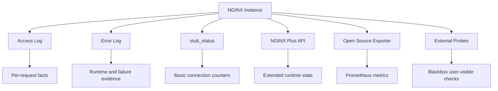
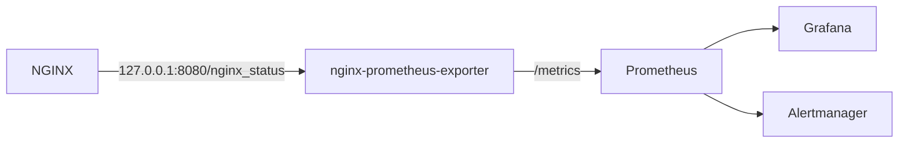
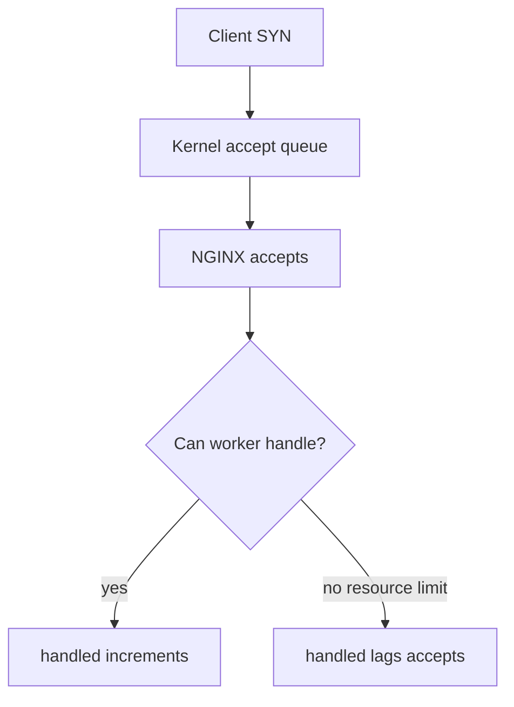
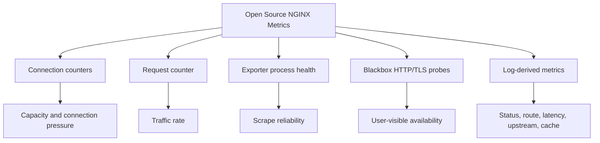
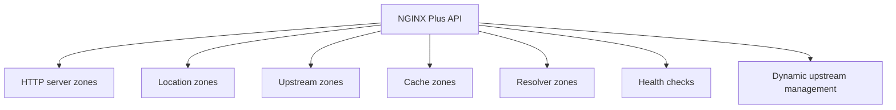
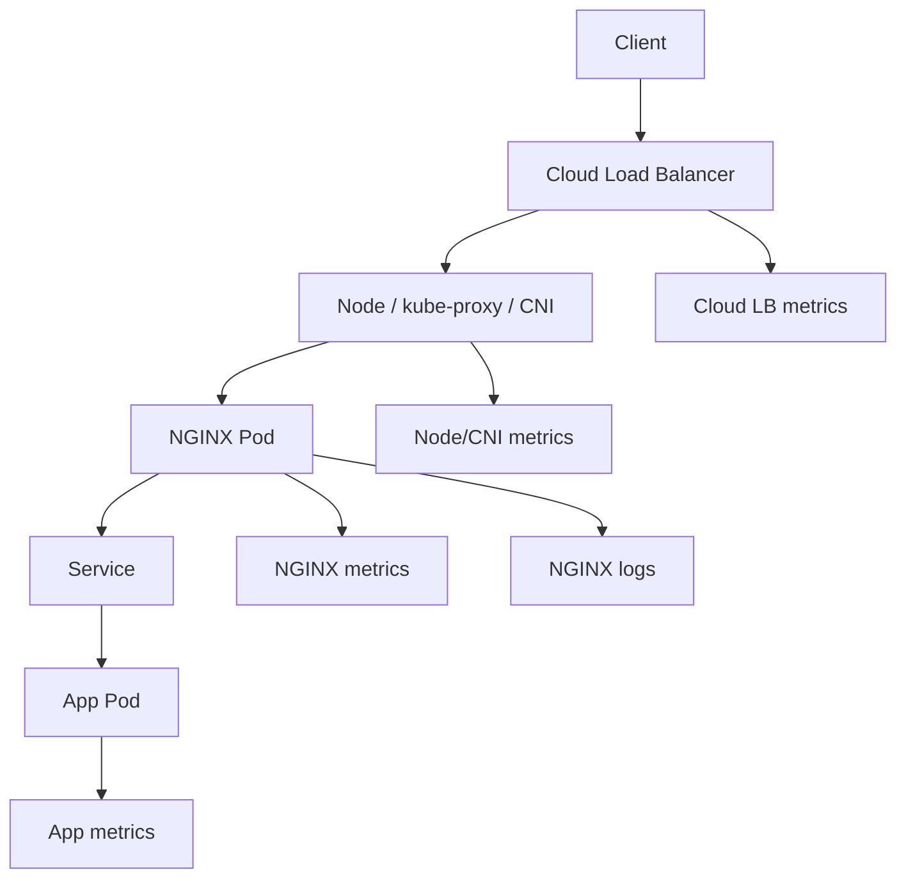
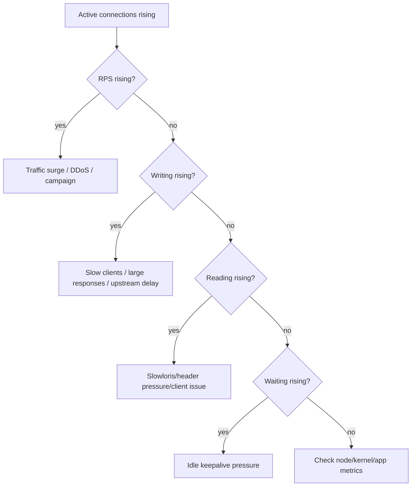
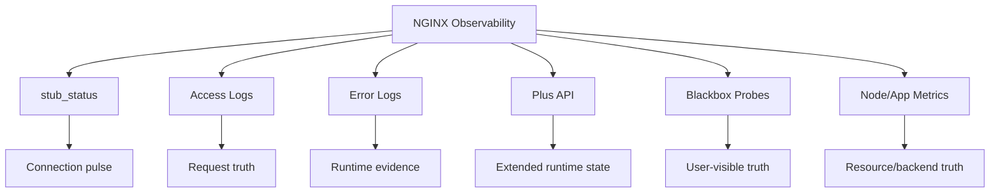

# Part 093 — `stub_status`, Status API, and Metrics Boundary

> Target mental model: **metrics tell you that the system is moving; logs tell you what happened; traces tell you where a request went.** NGINX metrics are not a replacement for request logs. They are the low-cardinality control panel for detecting pressure, saturation, traffic shape, and runtime health.

In the previous parts, we made NGINX observable through logs: access logs, error logs, JSON log schemas, correlation IDs, and trace context. That gives you high-cardinality per-request evidence.

This part moves to **metrics**.

The distinction matters:

- A log entry answers: *what happened to this request?*
- A metric answers: *what is happening to this class of behavior over time?*
- A trace answers: *where did this request spend time across services?*
- A dashboard answers: *which model should an operator hold during an incident?*
- An alert answers: *which symptom is bad enough to wake someone up?*

Bad NGINX monitoring usually fails in one of two ways:

1. It exposes only `stub_status` and assumes that is enough.
2. It exports every label imaginable and creates an expensive, noisy, high-cardinality mess.

Top-level operators do neither. They define a **metrics boundary**.

---

## 1. The observability surface of NGINX

NGINX has several observability surfaces. Each has a different job.



Use the right surface for the right question.

| Question | Best signal |
|---|---|
| Is NGINX accepting connections? | `stub_status`, process check, blackbox probe |
| Are clients stuck waiting? | `stub_status` active/writing/waiting trends, request latency logs |
| Which route is slow? | Access logs with route label + histograms |
| Which upstream is failing? | Access logs using `$upstream_*`, NGINX Plus upstream metrics, app metrics |
| Is cache effective? | `$upstream_cache_status` logs, cache metrics if available |
| Did config reload succeed? | deployment event, `nginx -t`, error log, synthetic probes |
| Is a cert close to expiry? | external TLS probe, certificate inventory |
| Is a backend dead before traffic hits it? | active health check, Kubernetes readiness, external probe |

`stub_status` is useful but intentionally small. It is a pulse check, not a full diagnostic model.

---

## 2. `stub_status`: what it is and what it is not

The official `ngx_http_stub_status_module` exposes **basic status information**.

A typical response looks like this:

```txt
Active connections: 291
server accepts handled requests
 16630948 16630948 31070465
Reading: 6 Writing: 179 Waiting: 106
```

The fields mean:

| Field | Meaning |
|---|---|
| `Active connections` | Current active client connections, including idle keepalive waiting connections |
| `accepts` | Total accepted client connections |
| `handled` | Total handled connections |
| `requests` | Total client requests |
| `Reading` | Connections where NGINX is reading request headers |
| `Writing` | Connections where NGINX is writing response back to clients |
| `Waiting` | Idle keepalive connections waiting for a request |

The embedded variables include:

```nginx
$connections_active
$connections_reading
$connections_writing
$connections_waiting
```

Important boundary: `stub_status` does **not** tell you:

- per-upstream health;
- per-route latency;
- response status distribution;
- cache hit ratio;
- TLS handshake failure reason;
- retry count;
- which virtual host is hot;
- which tenant is abusing traffic;
- whether 504s are caused by app, network, DNS, or timeout policy.

It gives global connection/request counters for the NGINX process.

That is still valuable. It just has to be interpreted correctly.

---

## 3. Build and packaging boundary

`stub_status` is a module. When building NGINX from source, it is not part of the default build and must be enabled explicitly:

```bash
./configure --with-http_stub_status_module
```

In many distribution packages and container images, it may already be included. Do not assume. Verify:

```bash
nginx -V 2>&1 | tr ' ' '\n' | grep http_stub_status
```

Expected if enabled:

```txt
--with-http_stub_status_module
```

Production invariant:

> Monitoring config must be checked against the actual NGINX binary, not just against a copied config snippet.

A beautiful `/metrics` setup is useless if the module is absent in the runtime image.

---

## 4. Safe `stub_status` exposure

Never expose `stub_status` publicly.

A safe baseline:

```nginx
server {
    listen 127.0.0.1:8080;
    server_name localhost;

    access_log off;

    location = /nginx_status {
        stub_status;
        allow 127.0.0.1;
        deny all;
    }
}
```

For a host-local Prometheus exporter, this is usually enough.

If a monitoring system scrapes over the network, bind to a private interface and restrict by CIDR:

```nginx
server {
    listen 10.20.30.10:8080;
    server_name _;

    location = /nginx_status {
        stub_status;
        allow 10.20.0.0/16;  # monitoring subnet
        deny all;
    }
}
```

Better still: keep `stub_status` local and run the exporter as a sidecar or host agent.

---

## 5. Minimal Prometheus exporter topology

The common Open Source setup is:



NGINX exposes `stub_status`; exporter converts it to Prometheus metrics.

Example Docker Compose pattern:

```yaml
services:
  nginx:
    image: nginx:stable
    ports:
      - "80:80"
    volumes:
      - ./nginx.conf:/etc/nginx/nginx.conf:ro

  nginx-exporter:
    image: nginx/nginx-prometheus-exporter:latest
    command:
      - -nginx.scrape-uri=http://nginx:8080/nginx_status
    ports:
      - "9113:9113"
```

Example NGINX status server inside the container network:

```nginx
server {
    listen 8080;
    server_name _;

    location = /nginx_status {
        stub_status;
        allow 127.0.0.1;
        allow 172.16.0.0/12;
        deny all;
    }
}
```

For production, do not blindly allow the whole Docker/Kubernetes pod CIDR unless that is your deliberate monitoring trust boundary.

---

## 6. How to read `stub_status` like an operator

A single scrape is almost useless. Trends matter.

### 6.1 `accepts` vs `handled`

Normally:

```txt
accepts ~= handled
```

If `accepts` is greater than `handled`, NGINX accepted a connection but could not handle it. This usually points to resource limits such as `worker_connections`, file descriptors, or OS backlog pressure.

Mental model:



Watch the **delta** between `accepts` and `handled`, not just the absolute value.

### 6.2 `requests / handled`

This approximates how many HTTP requests are served per handled client connection.

High value can mean keepalive reuse is effective.

Low value can mean:

- clients are not reusing connections;
- load balancer closes aggressively;
- HTTP/1.0 or bad clients;
- TLS termination is happening upstream;
- keepalive timeout is too short;
- connection churn during incident.

### 6.3 `Reading`

High `Reading` means many connections are in request-header read phase.

Possible causes:

- slow clients;
- header flood;
- large request headers;
- network issues;
- bot traffic;
- clients opening connections and dripping bytes.

Correlate with:

```nginx
client_header_timeout
large_client_header_buffers
limit_conn
error_log
```

### 6.4 `Writing`

High `Writing` means NGINX is sending responses to clients.

Possible causes:

- slow clients;
- large responses;
- streaming responses;
- upstream latency causing long response windows;
- client network bottleneck;
- excessive download traffic;
- `send_timeout` too lenient.

Correlate with access logs:

```nginx
$request_time
$body_bytes_sent
$status
$upstream_response_time
```

If `$upstream_response_time` is low but `$request_time` is high, the upstream finished but NGINX spent time delivering to the client. That is a client/edge/network delivery problem, not necessarily app slowness.

### 6.5 `Waiting`

`Waiting` means idle keepalive connections.

High `Waiting` is not automatically bad. It can mean clients are reusing connections efficiently.

It becomes suspicious when:

- active connections approach capacity;
- `Waiting` consumes too many file descriptors;
- keepalive timeout is too long for traffic shape;
- a load balancer opens too many idle connections;
- connection pools from clients are over-provisioned.

---

## 7. Deriving useful metrics from `stub_status`

Raw counters should become rates and ratios.

| Derived metric | Formula | Meaning |
|---|---|---|
| Requests per second | `rate(requests_total[1m])` | Incoming request rate |
| Connection accepts per second | `rate(accepts_total[1m])` | New connection churn |
| Requests per connection | `rate(requests_total[5m]) / rate(handled_total[5m])` | Keepalive efficiency |
| Connection handling loss | `rate(accepts_total[5m]) - rate(handled_total[5m])` | Resource pressure indicator |
| Active minus waiting | `active - waiting` | Non-idle active work approximation |
| Reading ratio | `reading / active` | Header-read pressure |
| Writing ratio | `writing / active` | Response-delivery pressure |

PromQL-style examples:

```promql
rate(nginx_http_requests_total[1m])
```

```promql
rate(nginx_connections_accepted[5m]) - rate(nginx_connections_handled[5m])
```

```promql
nginx_connections_active - nginx_connections_waiting
```

Metric names vary by exporter. Do not cargo-cult names; map them to your exporter output.

---

## 8. Metrics boundary for NGINX Open Source

With NGINX Open Source + `stub_status`, the metrics boundary is simple:



For Open Source, many rich metrics are better derived from structured logs:

- status code rate;
- route-level latency;
- upstream latency;
- retry rate;
- cache HIT/MISS rate;
- tenant-level abuse;
- 499 distribution;
- 502/504 by upstream;
- CORS/preflight volume;
- rate-limit rejections.

That does not mean logs should be your only metrics source. It means you should be honest about where the signal comes from.

Production pattern:

```txt
stub_status metrics = process/connection pulse
access-log metrics = request behavior and upstream/cache truth
blackbox metrics = user-visible truth
app metrics = domain/backend truth
```

---

## 9. NGINX Plus API boundary

NGINX Plus has a different monitoring surface: the NGINX Plus REST API and dashboard.

The Plus API can expose extended status information, reset statistics, manage upstream servers on the fly, and manage key-value store. That changes the observability boundary.

Conceptually:



But do not confuse **availability of metrics** with **quality of monitoring**.

You still need:

- route labels that match business ownership;
- correct alert thresholds;
- synthetic probes;
- deployment event correlation;
- request logs for RCA;
- app-level metrics for backend truth.

Plus gives richer runtime state. It does not automatically give good operational thinking.

---

## 10. Shared memory zones and why metrics sometimes disappear

Many extended NGINX Plus statistics require shared memory zones.

Example upstream zone:

```nginx
upstream api_backend {
    zone api_backend 64k;
    server 10.0.1.10:8080;
    server 10.0.1.11:8080;
}
```

Example cache zone:

```nginx
proxy_cache_path /var/cache/nginx/api
    keys_zone=api_cache:100m
    levels=1:2
    max_size=20g
    inactive=30m;
```

Example server/location status zone in NGINX Plus:

```nginx
server {
    listen 443 ssl;
    server_name api.example.com;

    status_zone api_server;

    location /v1/ {
        status_zone api_v1;
        proxy_pass http://api_backend;
    }
}
```

If a dashboard does not show an object, the reason is often not “monitoring broke.” It may be that the object has no configured zone.

Operational invariant:

> If you want runtime state aggregated across workers, the object usually needs an explicit shared memory zone.

---

## 11. Do not expose status APIs casually

Status endpoints reveal topology and runtime pressure. Some APIs may also support management operations.

Hardening rules:

1. Bind to a private address or loopback.
2. Use allow/deny or network ACLs.
3. Prefer mTLS if exposed over network.
4. Separate read-only monitoring from write-capable control APIs.
5. Do not route status endpoints through public virtual hosts.
6. Do not reuse customer-facing authentication for infra endpoints.
7. Log access to status APIs separately.
8. Put management APIs behind change-management controls.

Bad:

```nginx
server {
    listen 443 ssl;
    server_name public.example.com;

    location /nginx_status {
        stub_status;
    }
}
```

Better:

```nginx
server {
    listen 127.0.0.1:8080;
    server_name localhost;

    location = /nginx_status {
        stub_status;
        allow 127.0.0.1;
        deny all;
    }
}
```

For Plus API:

```nginx
server {
    listen 10.20.30.10:8080 ssl;
    server_name nginx-admin.internal;

    ssl_certificate     /etc/nginx/tls/admin.fullchain.pem;
    ssl_certificate_key /etc/nginx/tls/admin.key;

    ssl_client_certificate /etc/nginx/tls/monitoring-ca.pem;
    ssl_verify_client on;

    allow 10.20.0.0/16;
    deny all;

    location /api/ {
        api write=off;
    }
}
```

Whether the exact `api` options are available depends on your NGINX Plus version. The architectural point is stable: read-only telemetry and write-capable control must not share the same blast radius.

---

## 12. Dashboards: what to show first

A useful NGINX dashboard should not start with every metric. It should start with the operator’s decision tree.

### 12.1 Instance overview

Show:

- NGINX up/down;
- config reload events;
- worker process count;
- requests per second;
- active connections;
- reading/writing/waiting;
- accepted vs handled delta;
- 4xx/5xx rates from logs;
- 499 rate;
- 502/504 rate;
- p50/p95/p99 `$request_time` from logs;
- p95/p99 `$upstream_response_time` from logs.

### 12.2 Edge vs upstream split

Show:

| Signal | Interpretation |
|---|---|
| High request time + low upstream time | Client/edge delivery problem |
| High upstream time + high request time | Backend or network-to-backend problem |
| 504 spike | Upstream did not respond before timeout |
| 502 spike | Bad gateway, connection reset, invalid upstream response, or no live upstream |
| 499 spike | Client disconnected before response completed |
| Active connections rising with RPS flat | Slow clients, streaming, backend slowness, or stuck delivery |

### 12.3 Capacity panel

Show:

- active connections;
- non-idle active connections;
- file descriptor usage;
- worker connections configured vs estimated usage;
- CPU saturation;
- memory usage;
- disk usage for temp files/cache;
- network TX/RX;
- SYN backlog / accept queue if available from node metrics.

### 12.4 Cache panel

From logs or Plus metrics:

- HIT/MISS/BYPASS/EXPIRED/STALE/UPDATING/REVALIDATED;
- cache hit ratio by route;
- origin request rate;
- stale served rate;
- cache lock wait symptoms;
- cache disk usage;
- purge/deploy events.

### 12.5 Upstream panel

From logs, Plus, or app metrics:

- upstream status distribution;
- upstream response time;
- upstream connect time;
- retry attempts inferred from comma-separated `$upstream_addr`/`$upstream_status`;
- backend pool capacity;
- backend health;
- deployment events.

---

## 13. Alerting: symptoms before internals

Bad alert:

```txt
Active connections > 10000
```

Maybe that is normal at peak traffic.

Better alerts:

```txt
User-visible 5xx rate > SLO burn threshold
```

```txt
p99 request latency > SLO threshold and traffic > minimum volume
```

```txt
accepts-handled delta positive for 5 minutes
```

```txt
502/504 spike correlated with upstream retries
```

```txt
cache HIT ratio drops sharply on high-traffic cacheable routes
```

```txt
blackbox TLS probe failing for public host
```

Metrics should wake someone only when there is a probable customer impact or imminent capacity failure.

Use `stub_status` for alerts like:

- NGINX status endpoint unavailable;
- accepts vs handled divergence;
- active connections near worker capacity;
- connection state ratio abnormal relative to baseline.

Do not wake someone because `Waiting` is high without context.

---

## 14. Estimating worker connection capacity

A rough capacity model:

```txt
max_client_connections ~= worker_processes * worker_connections
```

But that is not the full story.

Each proxied request can consume:

- one client connection;
- possibly one upstream connection;
- file descriptors for temp files/cache/logs;
- idle keepalive connections;
- TLS state;
- buffers;
- OS socket memory.

For reverse proxy workloads:

```txt
effective_fd_pressure ~= client_connections + upstream_connections + temp/cache/log fds + overhead
```

If you configure:

```nginx
worker_processes auto;

events {
    worker_connections 4096;
}
```

and run 8 workers, the theoretical connection slot count is about:

```txt
8 * 4096 = 32768
```

But the OS file descriptor limit might be lower. The kernel backlog might be lower. Upstream connection pressure might be the actual limit.

Metrics boundary:

- `stub_status` tells you active/reading/writing/waiting.
- Node exporter tells you file descriptors, CPU, memory, network, disk.
- Access logs tell you request latency/status/upstream behavior.
- App metrics tell you backend saturation.

No single metric owns the truth.

---

## 15. Log-derived metrics without blowing up cardinality

It is tempting to turn every log field into a Prometheus label. Do not.

Bad labels:

- full URI;
- user ID;
- request ID;
- raw query string;
- IP address;
- session ID;
- arbitrary header values;
- upstream address if backend churn is high;
- tenant ID if tenant count is huge and unbounded.

Safer labels:

- route template (`/api/v1/orders/{id}`);
- service name;
- virtual host class;
- environment;
- status class (`2xx`, `4xx`, `5xx`);
- cache status;
- method;
- upstream group;
- region/zone.

Recommended pattern:

```nginx
map $uri $route_name {
    default                      "unknown";
    ~^/api/v1/orders/[^/]+$      "orders_get";
    ~^/api/v1/orders$           "orders_collection";
    ~^/api/v1/payments/[^/]+$    "payments_get";
}
```

Then log:

```nginx
log_format edge_json escape=json
'{'
  '"ts":"$time_iso8601",'
  '"host":"$host",'
  '"route":"$route_name",'
  '"method":"$request_method",'
  '"status":$status,'
  '"request_time":$request_time,'
  '"upstream_response_time":"$upstream_response_time",'
  '"upstream_status":"$upstream_status",'
  '"cache":"$upstream_cache_status"'
'}';
```

Metrics pipeline can aggregate on `route`, not raw URI.

---

## 16. Metrics for reload safety

NGINX reloads should become visible events.

Minimum deployment telemetry:

- config test success/failure;
- reload command timestamp;
- process start timestamp;
- new worker count;
- old worker drain duration;
- synthetic probe result after reload;
- error log scan for emerg/alert/crit;
- config version label.

You can expose config version as a static endpoint:

```nginx
location = /__edge/version {
    default_type application/json;
    return 200 '{"edge_config_version":"2026-07-07T10:30:00Z-gitsha"}\n';
}
```

Lock it down if it exposes internal deployment metadata.

Better: add config version to access logs as a variable generated by config management:

```nginx
map "" $edge_config_version {
    default "2026-07-07-gitsha";
}
```

Now incidents can answer:

```txt
Did the error start at the same time as config version X?
```

---

## 17. Metrics boundary for Kubernetes

In Kubernetes, NGINX metrics have extra layers.



Failure can sit at any layer:

- cloud LB health check;
- node networking;
- pod readiness;
- NGINX config reload;
- service endpoint churn;
- upstream pod saturation;
- DNS resolution;
- NetworkPolicy;
- TLS/cert-manager renewal.

For NGINX in Kubernetes, do not look only at NGINX metrics. Correlate with:

- pod restarts;
- deployment rollout events;
- endpoint count;
- ingress/controller reload events;
- cert-manager events;
- CNI drops;
- node pressure;
- cloud LB health.

---

## 18. Red/USE method mapping

Two common models help structure NGINX dashboards.

### 18.1 RED for request-facing behavior

RED means:

- Rate;
- Errors;
- Duration.

For NGINX:

| RED dimension | NGINX source |
|---|---|
| Rate | access logs, request counter |
| Errors | access logs status codes, error log, upstream status |
| Duration | `$request_time`, `$upstream_response_time` |

### 18.2 USE for resource behavior

USE means:

- Utilization;
- Saturation;
- Errors.

For NGINX host/container:

| USE dimension | Source |
|---|---|
| CPU utilization | node/container metrics |
| Memory utilization | node/container metrics |
| FD utilization | node metrics/process metrics |
| Connection saturation | `stub_status`, worker limits |
| Disk saturation | temp/cache disk metrics |
| Network saturation | node/network metrics |
| Errors | error log, kernel counters, scrape errors |

`stub_status` mostly supports the **saturation** side of USE for connections.

---

## 19. Incident example: active connections climbing

Symptom:

```txt
Active connections rising quickly
RPS flat
p99 request_time rising
```

Decision tree:



Correlate:

```bash
curl -s http://127.0.0.1:8080/nginx_status
```

```bash
tail -f /var/log/nginx/access.log | jq '{status, request_time, upstream_response_time, body_bytes_sent}'
```

```bash
grep -E "worker_connections|too many open files|upstream timed out" /var/log/nginx/error.log
```

Candidate mitigations:

- reduce `keepalive_timeout` if idle pressure dominates;
- tighten `client_header_timeout` if slow header reads dominate;
- use `limit_conn` for abusive keys;
- add upstream capacity if upstream latency dominates;
- enable buffering if slow clients are pinning upstreams;
- add CDN/static offload for large downloads;
- tune worker/file descriptor limits if capacity is legitimate.

Do not blindly restart NGINX. You may erase evidence and make client reconnect storm worse.

---

## 20. Incident example: 504 spike

Symptom:

```txt
504 rate rises
Active connections rises
Upstream response time at timeout boundary
```

Likely cause:

- upstream app slow;
- upstream dependency slow;
- network issue between NGINX and upstream;
- too low `proxy_read_timeout` for route;
- retry amplification;
- backend overload.

Metrics needed:

- 504 rate by route;
- `$upstream_response_time`;
- `$upstream_addr`;
- `$upstream_status`;
- retry attempts;
- app p95/p99 latency;
- DB/cache dependency latency;
- upstream pool CPU/memory/thread saturation.

`stub_status` alone cannot answer this. It only shows connection state pressure.

---

## 21. Incident example: exporter down, NGINX healthy

Symptom:

```txt
Prometheus target down for nginx-exporter
Blackbox probe healthy
Traffic logs normal
```

Possible causes:

- exporter crashed;
- status endpoint ACL changed;
- status endpoint path changed;
- `stub_status` module missing in new image;
- network policy blocked scrape;
- exporter cannot resolve NGINX hostname;
- NGINX admin port not listening after config reload.

Runbook:

```bash
curl -i http://127.0.0.1:8080/nginx_status
```

```bash
curl -i http://127.0.0.1:9113/metrics
```

```bash
nginx -V 2>&1 | grep http_stub_status
```

```bash
nginx -T | sed -n '/nginx_status/,+20p'
```

Do not page application owners if only the exporter is broken and user-visible probes are healthy.

---

## 22. Reference config: Open Source metrics baseline

```nginx
worker_processes auto;

error_log /var/log/nginx/error.log warn;
pid /var/run/nginx.pid;

events {
    worker_connections 4096;
}

http {
    include /etc/nginx/mime.types;
    default_type application/octet-stream;

    log_format edge_json escape=json
    '{'
      '"ts":"$time_iso8601",'
      '"remote_addr":"$remote_addr",'
      '"host":"$host",'
      '"method":"$request_method",'
      '"uri":"$uri",'
      '"status":$status,'
      '"request_time":$request_time,'
      '"upstream_addr":"$upstream_addr",'
      '"upstream_status":"$upstream_status",'
      '"upstream_response_time":"$upstream_response_time",'
      '"cache":"$upstream_cache_status",'
      '"request_id":"$request_id"'
    '}';

    access_log /var/log/nginx/access.log edge_json;

    server {
        listen 127.0.0.1:8080;
        server_name localhost;

        access_log off;

        location = /nginx_status {
            stub_status;
            allow 127.0.0.1;
            deny all;
        }
    }

    upstream app_backend {
        server 127.0.0.1:9000;
        keepalive 32;
    }

    server {
        listen 80;
        server_name app.local;

        location / {
            proxy_http_version 1.1;
            proxy_set_header Connection "";
            proxy_set_header Host $host;
            proxy_set_header X-Request-ID $request_id;
            proxy_set_header X-Forwarded-For $proxy_add_x_forwarded_for;
            proxy_set_header X-Forwarded-Proto $scheme;
            proxy_pass http://app_backend;
        }
    }
}
```

---

## 23. Production checklist

### Build/package

- [ ] Confirm `http_stub_status_module` exists in the running binary.
- [ ] Confirm exporter version and metric names.
- [ ] Confirm container image includes required modules.
- [ ] Confirm reload workflow preserves monitoring endpoint.

### Exposure

- [ ] `stub_status` is not public.
- [ ] Monitoring endpoint is bound to loopback/private network.
- [ ] ACL/mTLS protects status APIs.
- [ ] Write-capable APIs are separated from read-only scrape endpoints.
- [ ] Access to monitoring endpoints is logged or audited where needed.

### Dashboard

- [ ] Shows RPS, active, reading, writing, waiting.
- [ ] Shows accepts vs handled delta.
- [ ] Shows status code rates from logs.
- [ ] Shows route/service latency from logs.
- [ ] Shows upstream/cache health where applicable.
- [ ] Correlates deploy/reload events.

### Alerting

- [ ] Alerts are symptom-based where possible.
- [ ] Alerts include minimum traffic thresholds.
- [ ] Connection alerts consider baseline and capacity.
- [ ] Blackbox probes cover public endpoints.
- [ ] Cert expiry is monitored externally.

### RCA

- [ ] Logs contain route/service/request ID.
- [ ] Metrics link to logs by time window, host, route, and status.
- [ ] Runbooks distinguish edge vs upstream vs client symptoms.
- [ ] Dashboards show enough context to avoid blind restarts.

---

## 24. Common mistakes

### Mistake 1: Exposing `/nginx_status` publicly

This leaks runtime state and can become a reconnaissance endpoint.

### Mistake 2: Alerting on `Waiting` without context

Idle keepalive connections are not inherently bad.

### Mistake 3: Treating `stub_status` as full observability

It does not tell you route latency, upstream health, or cache correctness.

### Mistake 4: Using raw URI as metric label

This creates high-cardinality metrics and expensive dashboards.

### Mistake 5: No deployment event correlation

Without config version/reload markers, you cannot quickly answer whether an incident was caused by a change.

### Mistake 6: Monitoring endpoint depends on public app routing

Admin/metrics endpoints should not disappear because an app virtual host changed.

### Mistake 7: Plus API exposed with write capability by accident

Telemetry and control plane must have different blast radii.

---

## 25. Mental model recap



The core invariant:

> `stub_status` tells you whether NGINX is breathing. Logs and richer metrics tell you why it is breathing badly.

Use `stub_status` as a low-cardinality runtime pulse. Use logs for request truth. Use Plus API or exporters where appropriate. Use blackbox probes for user-visible truth. Use node and app metrics for resource and backend truth.

A production NGINX dashboard is not a collection of charts. It is a decision system for answering:

1. Is the edge reachable?
2. Is the edge saturated?
3. Are clients, NGINX, upstreams, or dependencies causing latency?
4. Is the failure global, route-specific, tenant-specific, or backend-specific?
5. Did a recent config/deploy/cert change cause this?

When your metrics answer those questions quickly, you have crossed from “monitoring exists” to “operability exists.”

---

## References

- NGINX `ngx_http_stub_status_module`: https://nginx.org/en/docs/http/ngx_http_stub_status_module.html
- NGINX Plus Live Activity Monitoring: https://docs.nginx.com/nginx/admin-guide/monitoring/live-activity-monitoring/
- NGINX logging admin guide: https://docs.nginx.com/nginx/admin-guide/monitoring/logging/
- NGINX Plus API reference: https://docs.nginx.com/nginx/admin-guide/monitoring/live-activity-monitoring/
