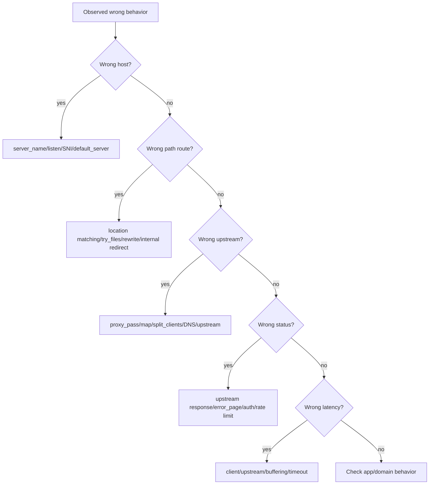
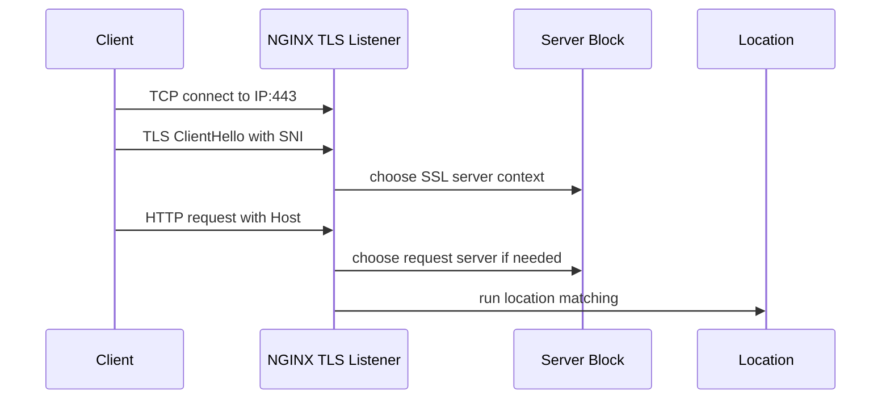
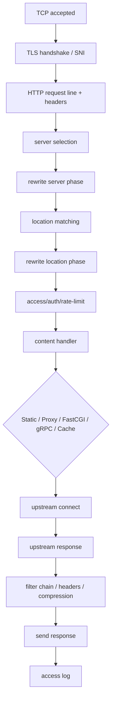

# Part 094 — Debug Log, `debug_connection`, and Request-Level Investigation

> Target mental model: **debug logging is a surgical instrument, not a monitoring strategy.** Enable it narrowly, collect evidence quickly, and turn it off before it becomes the incident.

The previous part focused on metrics. Metrics tell you that something is wrong. Logs tell you what happened. But sometimes regular access/error logs are not enough.

You may need to answer questions like:

- Why did NGINX choose this `server` block?
- Why did this `location` win?
- Was this request internally redirected?
- Did `rewrite` run more than once?
- Did NGINX connect to the expected upstream?
- Did TLS/SNI behave as expected?
- Did a variable evaluate to the value we expected?
- Was the client slow, the upstream slow, or NGINX buffering?
- Is this 502 from upstream reset, invalid response, DNS, or timeout?

That is where debug logging helps.

But debug logging is dangerous in production because it can produce huge volume, leak sensitive data, add disk pressure, and make an outage worse. Top-level operators know how to use it with blast-radius control.

---

## 1. Error log levels are not all equal

NGINX `error_log` supports levels such as:

```txt
debug, info, notice, warn, error, crit, alert, emerg
```

A normal production baseline is often:

```nginx
error_log /var/log/nginx/error.log warn;
```

During incident investigation, you may temporarily use:

```nginx
error_log /var/log/nginx/error-debug.log debug;
```

But do not confuse `debug` with a harmless verbosity flag. Debug mode can emit detailed internal state at very high volume.

---

## 2. The build/package boundary for debug logs

To use full debug logging, NGINX must be built with debug support.

When building from source:

```bash
./configure --with-debug
```

Verify the running binary:

```bash
nginx -V 2>&1 | tr ' ' '\n' | grep -- --with-debug
```

Expected:

```txt
--with-debug
```

If the binary does not include debug support, setting:

```nginx
error_log /var/log/nginx/error.log debug;
```

will not give the full debug signal you expect.

Production invariant:

> A debug runbook must specify both config change and binary capability.

Some distributions provide separate debug packages or images. Your standard runtime image may not include `--with-debug`, which is often good for production safety but must be known before incidents.

---

## 3. Why not just set global debug?

Bad emergency move:

```nginx
error_log /var/log/nginx/error.log debug;
```

at global scope on a busy edge.

Possible consequences:

- massive disk write amplification;
- log rotation failure;
- node disk pressure;
- CPU overhead from formatting/writing logs;
- sensitive headers or request details in logs;
- harder investigation because evidence is buried in noise;
- cascading outage if log volume fills disk used by temp/cache files.

Debug logging should be scoped by:

- IP address with `debug_connection`;
- dedicated test host;
- dedicated port;
- short time window;
- low-traffic canary instance;
- reproduction request ID/curl script;
- separate debug log file.

---

## 4. `debug_connection`: narrow the blast radius

NGINX core module provides `debug_connection` inside the `events` context. It enables debug logging for selected client connections.

Example:

```nginx
events {
    worker_connections 4096;
    debug_connection 203.0.113.10;
}

error_log /var/log/nginx/error-debug.log debug;
```

You can target:

- IPv4 address;
- IPv6 address;
- CIDR range;
- `unix:` for UNIX-domain socket connections depending on version/build behavior.

Example with a small CIDR:

```nginx
events {
    worker_connections 4096;
    debug_connection 10.20.30.0/24;
}
```

Use the smallest possible target.

If traffic enters through a load balancer, `debug_connection` sees the immediate peer address at the connection layer. If the immediate peer is a load balancer, targeting the end-user IP may not work. In that case, reproduce from a known source that reaches NGINX directly or use a dedicated debug path/instance.

---

## 5. Safe debug logging pattern

A safer pattern:

```nginx
error_log /var/log/nginx/error.log warn;
error_log /var/log/nginx/error-debug.log debug;

events {
    worker_connections 4096;
    debug_connection 10.20.30.44;
}
```

This keeps normal errors in the main log and debug noise in a separate file.

Operational workflow:

```bash
sudo nginx -t
sudo nginx -s reload
```

Then reproduce:

```bash
curl -v \
  -H 'Host: api.example.com' \
  -H 'X-Debug-Case: INC-12345' \
  https://edge.example.com/api/v1/orders/123
```

Collect:

```bash
grep -n "10.20.30.44" /var/log/nginx/error-debug.log | tail -200
```

Then remove debug config:

```bash
sudo nginx -t && sudo nginx -s reload
```

Do not leave debug config behind.

---

## 6. Debugging request routing without debug logs first

Before enabling debug, exhaust low-risk evidence.

### 6.1 Dump effective config

```bash
nginx -T > /tmp/nginx-effective-config.txt
```

Search for the host/path:

```bash
grep -n "server_name api.example.com" /tmp/nginx-effective-config.txt
```

```bash
grep -n "location" /tmp/nginx-effective-config.txt | head -100
```

### 6.2 Add temporary route labels in access logs

```nginx
map $uri $route_name {
    default                 "unknown";
    ~^/api/v1/orders        "orders_v1";
    ~^/api/v1/payments      "payments_v1";
}

log_format debug_access escape=json
'{'
  '"ts":"$time_iso8601",'
  '"host":"$host",'
  '"server":"$server_name",'
  '"uri":"$uri",'
  '"request_uri":"$request_uri",'
  '"route":"$route_name",'
  '"status":$status,'
  '"upstream_addr":"$upstream_addr",'
  '"upstream_status":"$upstream_status",'
  '"request_time":$request_time'
'}';
```

### 6.3 Use deterministic curl

```bash
curl -vk \
  --resolve api.example.com:443:203.0.113.20 \
  https://api.example.com/api/v1/orders/123?debug=1
```

This removes DNS ambiguity.

### 6.4 Check response headers

Add safe temporary diagnostic headers only in non-public debug environments:

```nginx
add_header X-Debug-Server $server_name always;
add_header X-Debug-Route $route_name always;
```

Do not expose internal topology headers publicly unless controlled and temporary.

---

## 7. Request investigation model

Use this flow before jumping into low-level details:



Debug logs are most useful when you know which branch you are investigating.

---

## 8. Debugging server selection

Symptoms:

- certificate mismatch;
- request served by wrong virtual host;
- default server responding unexpectedly;
- HTTP Host mismatch;
- SNI/Host inconsistency;
- mTLS applies to wrong host.

Start with:

```bash
openssl s_client \
  -connect 203.0.113.20:443 \
  -servername api.example.com \
  -showcerts </dev/null
```

Then:

```bash
curl -vk \
  --resolve api.example.com:443:203.0.113.20 \
  https://api.example.com/
```

Check effective config:

```bash
nginx -T | grep -nE "listen .*443|server_name|default_server" -A2 -B2
```

Mental model:



If SNI chooses one cert but HTTP Host says another hostname, your config must decide whether to tolerate or reject that mismatch.

A common hardening pattern:

```nginx
server {
    listen 443 ssl default_server;
    server_name _;

    ssl_certificate     /etc/nginx/tls/default.fullchain.pem;
    ssl_certificate_key /etc/nginx/tls/default.key;

    return 444;
}
```

---

## 9. Debugging location matching

Symptoms:

- wrong backend;
- SPA fallback catches API path;
- regex location overrides prefix unexpectedly;
- `alias` path wrong;
- `try_files` loops;
- named location not reached.

Start with the algorithm:

1. Exact `location =` can win immediately.
2. Longest prefix is selected.
3. `^~` prefix can stop regex search.
4. Regex locations are evaluated in config order.
5. If no regex matches, longest prefix wins.

Create a temporary diagnostic log field:

```nginx
set $debug_location "root";

location = /api/health {
    set $debug_location "exact_api_health";
    return 200 "ok\n";
}

location ^~ /assets/ {
    set $debug_location "assets_prefix_stop_regex";
    root /srv/www/app;
}

location ~ \.php$ {
    set $debug_location "php_regex";
    return 403;
}

location / {
    set $debug_location "fallback";
    try_files $uri /index.html;
}
```

Then log:

```nginx
'"debug_location":"$debug_location"'
```

Caution: `set` has rewrite-module semantics. Use temporary diagnostics carefully and remove after investigation.

---

## 10. Debugging internal redirects

Internal redirects can come from:

- `try_files` fallback;
- `error_page`;
- `rewrite last`;
- `index` processing;
- named locations;
- auth subrequests;
- X-Accel internal redirect patterns.

Symptoms:

- request unexpectedly becomes `/index.html`;
- status code changes after `error_page`;
- API route returns SPA HTML;
- 500 due to rewrite/internal redirect cycle.

Useful variables:

```nginx
$uri
$request_uri
$args
$is_args
```

Remember:

- `$request_uri` is the original URI with arguments as received.
- `$uri` can be normalized and changed during internal redirects.

Log both:

```nginx
'"request_uri":"$request_uri",'
'"uri":"$uri",'
```

If `$request_uri` is `/api/orders/123` but `$uri` is `/index.html`, something performed an internal redirect/fallback.

---

## 11. Debugging `rewrite`

Symptoms:

- redirect loop;
- internal rewrite loop;
- query string duplication;
- route unexpectedly loses path prefix;
- URI normalized differently than expected.

Use `rewrite_log` carefully:

```nginx
rewrite_log on;
error_log /var/log/nginx/rewrite-debug.log notice;
```

This logs rewrite processing at `notice` level.

Example:

```nginx
location /old/ {
    rewrite_log on;
    rewrite ^/old/(.*)$ /new/$1 last;
}
```

`rewrite_log` is much narrower than full debug logging and often enough for URI rewrite problems.

Still, remove it after investigation.

---

## 12. Debugging upstream selection

Symptoms:

- wrong backend receives traffic;
- canary split inconsistent;
- tenant route goes to default backend;
- DNS target stale;
- retry hits unexpected upstream;
- keepalive hides backend recovery.

Log these fields:

```nginx
$upstream_addr
$upstream_status
$upstream_connect_time
$upstream_header_time
$upstream_response_time
```

Example JSON fragment:

```nginx
'"upstream_addr":"$upstream_addr",'
'"upstream_status":"$upstream_status",'
'"upstream_connect_time":"$upstream_connect_time",'
'"upstream_header_time":"$upstream_header_time",'
'"upstream_response_time":"$upstream_response_time"'
```

Multiple upstream attempts are often comma-separated. Example:

```json
{
  "upstream_addr": "10.0.1.10:8080, 10.0.1.11:8080",
  "upstream_status": "502, 200",
  "upstream_response_time": "0.003, 0.091"
}
```

This means the first upstream failed with 502 and the retry succeeded.

Ask:

- Was the method idempotent?
- Did the first attempt send a body?
- Was `proxy_next_upstream` too broad?
- Is retry hiding a real backend instability?

---

## 13. Debugging latency: client, NGINX, or upstream?

Use timing variables:

| Variable | Meaning |
|---|---|
| `$request_time` | Total time from first byte read from client to last byte sent/logged |
| `$upstream_connect_time` | Time to establish upstream connection |
| `$upstream_header_time` | Time until upstream response header received |
| `$upstream_response_time` | Time until upstream response completed |

Interpretation patterns:

| Pattern | Likely meaning |
|---|---|
| request high, upstream low | slow client, large response, buffering/client delivery |
| request high, upstream high | backend/dependency latency |
| connect high | upstream network/TCP/TLS connect issue |
| header high, response low-ish | backend slow to first byte |
| response high, body large | streaming/large response/backend slow body |
| 499 with high request time | client gave up before completion |
| 504 near timeout boundary | upstream read timeout |

Debug logs are rarely the first tool for latency. Start with timing logs and metrics.

---

## 14. Debugging buffering and temp files

Symptoms:

- disk usage spikes under `/var/lib/nginx/proxy` or configured temp path;
- upstream fast but request slow;
- streaming endpoint not streaming;
- slow clients cause disk pressure;
- large uploads fail or stall.

Relevant directives:

```nginx
proxy_buffering
proxy_buffers
proxy_buffer_size
proxy_busy_buffers_size
proxy_max_temp_file_size
proxy_temp_path
proxy_request_buffering
client_body_temp_path
```

Diagnostic questions:

- Is response buffering on?
- Are clients slower than upstream?
- Are responses larger than memory buffers?
- Is NGINX writing temp files?
- Is upload body buffered before upstream?
- Is disk shared with cache/logs?

Useful commands:

```bash
du -sh /var/lib/nginx/* /var/cache/nginx/* 2>/dev/null
```

```bash
lsof -p $(pgrep -n nginx) | grep -E 'proxy|client_body|cache'
```

```bash
iostat -xz 1
```

If temp files fill disk, debug logging can make the incident worse. Control disk pressure first.

---

## 15. Debugging TLS

Symptoms:

- cert mismatch;
- handshake failure;
- old clients fail after TLS config change;
- HTTP/2 not negotiated;
- mTLS client cert rejected;
- upstream TLS verification fails.

Client-side:

```bash
openssl s_client \
  -connect api.example.com:443 \
  -servername api.example.com \
  -showcerts \
  -alpn h2,http/1.1 </dev/null
```

Check negotiated protocol:

```bash
curl -vk --http2 https://api.example.com/
```

For mTLS:

```bash
curl -vk \
  --cert client.pem \
  --key client.key \
  https://admin.example.com/
```

Log useful TLS fields:

```nginx
'"ssl_protocol":"$ssl_protocol",'
'"ssl_cipher":"$ssl_cipher",'
'"ssl_server_name":"$ssl_server_name",'
'"ssl_client_verify":"$ssl_client_verify",'
'"ssl_client_s_dn":"$ssl_client_s_dn"'
```

Do not log full client certificates or sensitive identities unless there is a defined audit purpose and retention policy.

---

## 16. Debugging HTTP/2 and HTTP/3 boundaries

HTTP/2 and HTTP/3 introduce protocol translation boundaries.

Questions:

- Did the client negotiate HTTP/2/HTTP/3?
- Is NGINX proxying to upstream over HTTP/1.1, HTTP/2 gRPC, or something else?
- Are header size limits different between protocols?
- Is a problem only visible on HTTP/2 clients?
- Is HTTP/3 path blocked by UDP firewall/LB?

Log:

```nginx
'"server_protocol":"$server_protocol",'
'"http2":"$http2",'
'"http3":"$http3"'
```

Variables depend on module/version. Verify with your runtime.

Testing:

```bash
curl -vk --http1.1 https://api.example.com/path
curl -vk --http2 https://api.example.com/path
curl -vk --http3 https://api.example.com/path
```

If HTTP/3 fails but HTTP/2 works, investigate UDP listener, `Alt-Svc`, firewall, load balancer UDP forwarding, QUIC build/module support, and TLS 1.3 requirements.

---

## 17. Debugging rate limiting and access control

Symptoms:

- legitimate users get 403/429;
- attackers bypass limits;
- NAT causes many users to share one bucket;
- Real IP trust misconfigured;
- allowlist does not work behind proxy.

Log the decision variables:

```nginx
map $binary_remote_addr $limit_key_label {
    default "client_ip";
}
```

Use `limit_req_dry_run` during rollout:

```nginx
limit_req_zone $binary_remote_addr zone=api_per_ip:10m rate=10r/s;

server {
    location /api/ {
        limit_req_dry_run on;
        limit_req zone=api_per_ip burst=20 nodelay;
        proxy_pass http://api_backend;
    }
}
```

Dry-run allows observation before enforcement.

For IP allowlists, verify actual client identity:

```nginx
'"remote_addr":"$remote_addr",'
'"realip_remote_addr":"$realip_remote_addr",'
'"xff":"$http_x_forwarded_for"'
```

If `$remote_addr` is your load balancer, your access rules may be protecting the wrong identity.

---

## 18. Debugging DNS and dynamic upstreams

Symptoms:

- NGINX sends traffic to old pod/IP;
- resolver timeout;
- works after reload but not before;
- variable `proxy_pass` behaves differently;
- Kubernetes service changes not reflected.

Check effective config:

```bash
nginx -T | grep -nE "resolver|proxy_pass|upstream|resolve" -A4 -B4
```

Investigate DNS from the NGINX environment:

```bash
getent hosts service.namespace.svc.cluster.local
```

```bash
dig service.namespace.svc.cluster.local
```

If inside a container:

```bash
cat /etc/resolv.conf
```

Debug questions:

- Is `proxy_pass` using a static upstream name resolved at startup/reload?
- Is a variable used in `proxy_pass` requiring runtime resolver?
- Is `resolver` configured?
- Does DNS TTL match expected failover timing?
- Are upstream keepalive connections still pinned to old endpoints?

---

## 19. Debugging cache behavior

Symptoms:

- expected HIT is MISS;
- private response cached;
- stale not served;
- cache bypass always true;
- query strings create cache fragmentation;
- cache poisoning suspicion.

Log:

```nginx
'"cache":"$upstream_cache_status",'
'"cache_key":"$scheme$proxy_host$request_uri",'
'"bypass":"$cache_bypass",'
'"no_cache":"$no_cache"'
```

Do not log full cache keys if they contain sensitive data.

Add explicit reason variables:

```nginx
map $http_authorization $has_authorization {
    default 1;
    "" 0;
}

map $http_cookie $has_cookie {
    default 1;
    "" 0;
}

map "$has_authorization:$has_cookie" $cache_policy_reason {
    default "private_or_unclear";
    "0:0" "public_candidate";
}
```

Then log:

```nginx
'"cache_policy_reason":"$cache_policy_reason"'
```

This is often more useful than debug logs.

---

## 20. Request ID workflow for investigation

A request ID is the join key between systems.

Baseline:

```nginx
proxy_set_header X-Request-ID $request_id;
add_header X-Request-ID $request_id always;
```

Log:

```nginx
'"request_id":"$request_id"'
```

Investigation workflow:

1. Reproduce request with known marker header.
2. Capture response `X-Request-ID`.
3. Query NGINX access log by request ID.
4. Query app log by request ID.
5. Query upstream metrics around the timestamp.
6. Only enable debug if normal evidence cannot explain behavior.

Example:

```bash
RID=$(curl -skD - https://api.example.com/debug-case -o /dev/null | awk 'tolower($1)=="x-request-id:" {print $2}')
echo "$RID"
```

Then:

```bash
grep "$RID" /var/log/nginx/access.log
```

---

## 21. Ring buffer debug logging

NGINX supports writing debug logs to memory using a cyclic buffer syntax in `error_log` on systems where supported by the build/platform.

Example pattern:

```nginx
error_log memory:32m debug;
```

The point of a memory ring buffer is to avoid unlimited disk writes while keeping recent debug evidence.

Caveats:

- extraction may require a debugger or platform-specific workflow;
- not every operations team is comfortable with it;
- it is less convenient than a file during normal incident response;
- it should be tested before relying on it.

For most teams, a short-lived file-based debug log scoped by `debug_connection` is simpler.

---

## 22. Safe production debug runbook

Use this template.

### Step 1 — State the hypothesis

```txt
Hypothesis: requests from test IP 10.20.30.44 to /api/v1/orders are routed to fallback SPA because regex location overrides prefix location.
```

If you do not have a hypothesis, start with access logs and config dump, not debug logs.

### Step 2 — Choose the narrowest target

```txt
Target client IP: 10.20.30.44
Target host: api.example.com
Target path: /api/v1/orders/123
Time window: 10 minutes
```

### Step 3 — Add scoped debug

```nginx
error_log /var/log/nginx/error-debug-inc-12345.log debug;

events {
    worker_connections 4096;
    debug_connection 10.20.30.44;
}
```

### Step 4 — Validate and reload

```bash
nginx -t && nginx -s reload
```

### Step 5 — Reproduce once or a few times

```bash
curl -vk \
  --resolve api.example.com:443:203.0.113.20 \
  -H 'X-Debug-Case: INC-12345' \
  https://api.example.com/api/v1/orders/123
```

### Step 6 — Collect and compress evidence

```bash
grep -n "INC-12345\|10.20.30.44" /var/log/nginx/error-debug-inc-12345.log > /tmp/inc-12345-debug.txt
```

### Step 7 — Remove debug config

```bash
# revert config change
nginx -t && nginx -s reload
```

### Step 8 — Confirm debug is off

```bash
nginx -T | grep -n "debug_connection\|error-debug"
```

Expected: no debug config remains, unless intentionally preserved in a disabled snippet.

---

## 23. Debug evidence hygiene

Debug logs can contain sensitive material.

Treat them as incident artifacts:

- store in restricted location;
- redact tokens/cookies/client cert identity where needed;
- define retention period;
- do not paste raw logs into public tickets;
- include config version and NGINX version;
- include reproduction command;
- include exact timestamp with timezone;
- include whether debug was from production, staging, or canary.

Minimum debug artifact header:

```txt
Incident: INC-12345
Environment: production
NGINX version: nginx/1.xx.x
Config version: gitsha
Debug window: 2026-07-07T10:10:00+07:00 to 2026-07-07T10:20:00+07:00
Target client: 10.20.30.44
Target host/path: api.example.com /api/v1/orders/123
Hypothesis: location regex override
Debug disabled at: 2026-07-07T10:21:00+07:00
```

---

## 24. Common debug traps

### Trap 1: Debugging the wrong client IP

If NGINX receives traffic from a load balancer, `debug_connection` may need to target the load balancer IP, not the original client IP. This can explode log volume. Prefer a dedicated debug path or canary instance.

### Trap 2: Forgetting build support

No `--with-debug`, no full debug logs.

### Trap 3: Leaving debug enabled

Always have a cleanup step and a verification command.

### Trap 4: Debugging without a hypothesis

You will drown in logs. Start with a concrete branch of the request lifecycle.

### Trap 5: Using production global debug during traffic peak

This can create a disk/CPU incident independent of the original issue.

### Trap 6: Confusing `$uri` and `$request_uri`

`$uri` can change during internal processing. `$request_uri` is closer to what the client sent.

### Trap 7: Missing SNI/Host distinction

TLS server selection can happen before HTTP Host is parsed.

### Trap 8: Treating 499 as upstream error

499 means the client closed the connection before NGINX finished the response. It may be caused by upstream slowness, but the status itself is client-disconnect from NGINX’s perspective.

---

## 25. Request lifecycle debug map



Debug logging can reveal internal movement through this lifecycle. But the fastest RCA usually comes from combining:

- effective config;
- deterministic reproduction;
- request/access log fields;
- error log;
- metrics;
- then scoped debug.

---

## 26. Practical investigation recipes

### 26.1 Wrong backend receives request

Collect:

```nginx
$server_name
$host
$uri
$request_uri
$upstream_addr
$upstream_status
$route_name
```

Check:

```bash
nginx -T | grep -nE "server_name|location|proxy_pass|map|split_clients" -A5 -B5
```

Hypotheses:

- wrong server block;
- regex location override;
- `proxy_pass` slash semantics;
- `map` default branch;
- canary/split key unstable;
- DNS target stale.

### 26.2 SPA fallback returns HTML for API route

Check:

```nginx
location /api/ { ... }
location / { try_files $uri /index.html; }
```

Common fix:

```nginx
location ^~ /api/ {
    proxy_pass http://api_backend;
}

location / {
    try_files $uri $uri/ /index.html;
}
```

Add tests:

```bash
curl -i https://app.example.com/api/not-found
# should not return text/html SPA shell unless deliberately designed
```

### 26.3 502 after deploy

Collect:

```nginx
$upstream_addr
$upstream_status
$upstream_connect_time
$upstream_response_time
```

Check error log:

```bash
grep -E "connect\(\) failed|upstream prematurely closed|no live upstreams|invalid header" /var/log/nginx/error.log
```

Interpretation:

| Error clue | Likely direction |
|---|---|
| `connect() failed` | backend not listening/network/security group |
| `upstream prematurely closed connection` | app crash/reset/timeout |
| `no live upstreams` | health/passive failure/upstream config |
| `upstream sent invalid header` | backend protocol/header bug |

### 26.4 504 after traffic spike

Check:

- `$upstream_response_time` near `proxy_read_timeout`;
- backend saturation;
- retry amplification;
- connection pool starvation;
- DB dependency metrics;
- app thread pool.

Mitigation may be app capacity, load shedding, cache stale, or route-specific timeout—not simply increasing timeout.

---

## 27. Debug in Kubernetes

Kubernetes changes the workflow.

You need to know whether you are debugging:

- the NGINX container;
- the ingress controller generated config;
- the controller process;
- the Service/Endpoints layer;
- the application pod;
- the cloud load balancer;
- cert-manager/TLS secret;
- NetworkPolicy/CNI.

Useful commands:

```bash
kubectl exec -n edge deploy/nginx -- nginx -T > nginx-effective.conf
```

```bash
kubectl logs -n edge deploy/nginx --tail=200
```

```bash
kubectl get endpoints -n app api-service -o wide
```

```bash
kubectl describe ingress -n app api-ingress
```

For NGINX Ingress Controller, generated config and controller logs matter as much as your YAML. Do not debug a Kubernetes Ingress object as if it were hand-written `nginx.conf` unless you have inspected generated NGINX config.

---

## 28. Debugging without changing production config

Sometimes changing production config is too risky.

Alternatives:

- reproduce in staging with production config snapshot;
- run a shadow/canary NGINX instance;
- use `nginx -T` and static reasoning;
- use blackbox probes with controlled headers;
- increase access-log fields temporarily but not full debug;
- mirror traffic to test environment if policy allows;
- use packet capture at host/network boundary;
- use app logs and upstream metrics.

Packet capture example:

```bash
sudo tcpdump -i any -nn host 10.0.1.10 and port 8080 -w /tmp/upstream-debug.pcap
```

Use with care. Packet captures can contain sensitive data.

---

## 29. Production debug checklist

### Before enabling debug

- [ ] Clear hypothesis written down.
- [ ] Effective config captured with `nginx -T`.
- [ ] Normal access/error logs checked.
- [ ] Reproduction command prepared.
- [ ] Target client/source identified.
- [ ] Disk space checked.
- [ ] Sensitive data handling understood.
- [ ] Debug binary support verified with `nginx -V`.

### While debug is enabled

- [ ] Scoped with `debug_connection` or canary instance.
- [ ] Separate debug log file used.
- [ ] Time window is short.
- [ ] Reproduction count is minimal.
- [ ] Disk/log volume watched.

### After debug

- [ ] Debug config removed.
- [ ] NGINX reloaded safely.
- [ ] Verification confirms debug disabled.
- [ ] Evidence stored/redacted.
- [ ] Incident notes include config version and reproduction steps.
- [ ] Permanent fix includes regression test or config invariant.

---

## 30. Mental model recap

Debugging NGINX at production level means tracking a request through a deterministic machine:

```txt
listener -> TLS/SNI -> server selection -> rewrite -> location -> access/auth -> content handler -> upstream/cache/static -> filters -> response -> log
```

The correct order of investigation is usually:

1. State the symptom precisely.
2. Identify the lifecycle branch.
3. Inspect effective config.
4. Reproduce deterministically.
5. Use normal logs and metrics.
6. Add route/debug fields if needed.
7. Enable scoped debug only when still necessary.
8. Disable debug and preserve evidence.

The invariant:

> Debug logging should reduce uncertainty faster than it increases risk.

If enabling debug creates more operational risk than the bug itself, choose a different diagnostic strategy: canary instance, staging reproduction, richer access logs, packet capture, or generated config analysis.

Production expertise is not knowing every debug line by heart. It is knowing when a debug log is the right tool, how to scope it, how to interpret it, and how to turn it off before it becomes a second incident.

---

## References

- NGINX debugging log guide: https://nginx.org/en/docs/debugging_log.html
- NGINX core module, including `error_log` and `debug_connection`: https://nginx.org/en/docs/ngx_core_module.html
- NGINX rewrite module and `rewrite_log`: https://nginx.org/en/docs/http/ngx_http_rewrite_module.html
- NGINX proxy module variables and upstream diagnostics: https://nginx.org/en/docs/http/ngx_http_proxy_module.html
- NGINX upstream module variables: https://nginx.org/en/docs/http/ngx_http_upstream_module.html
