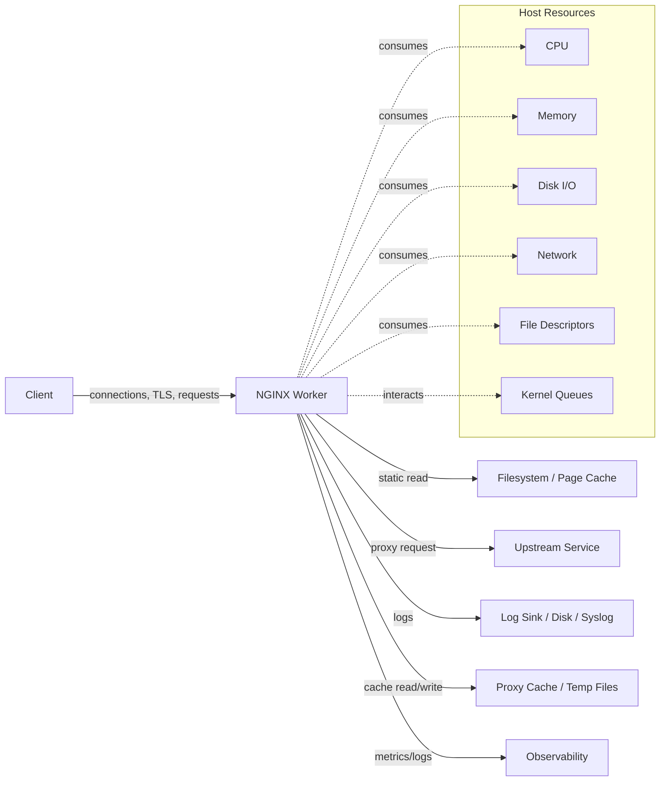
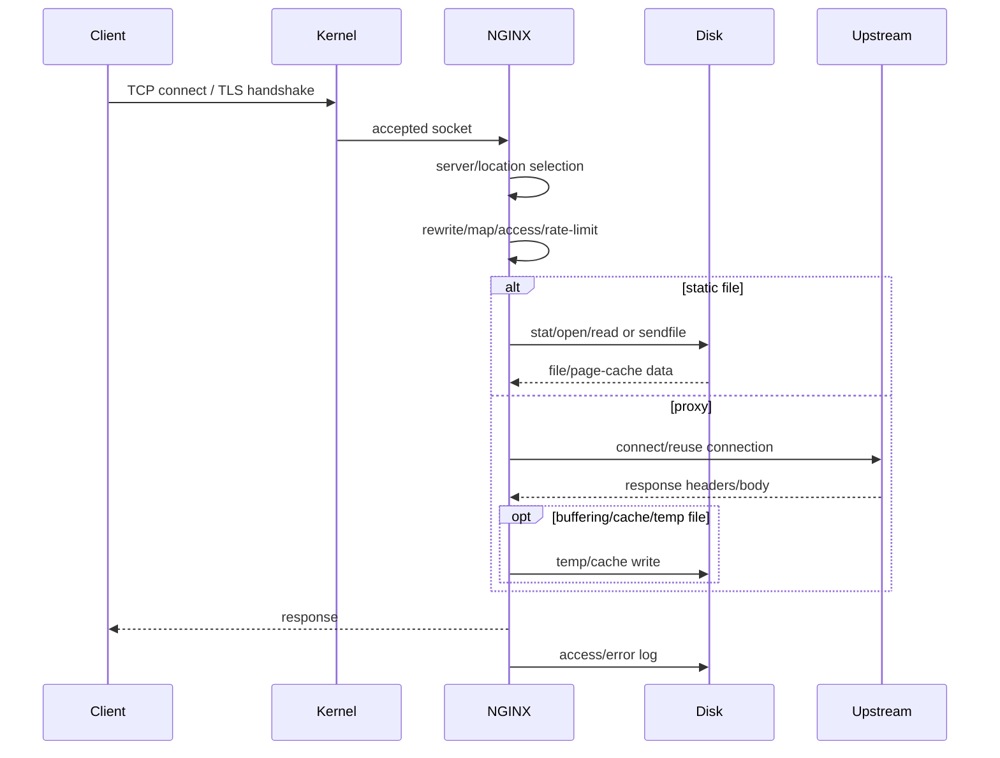
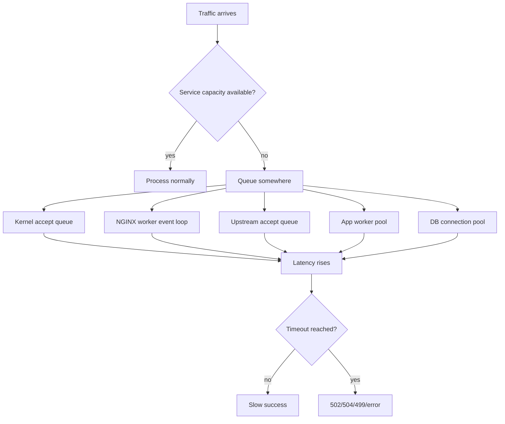
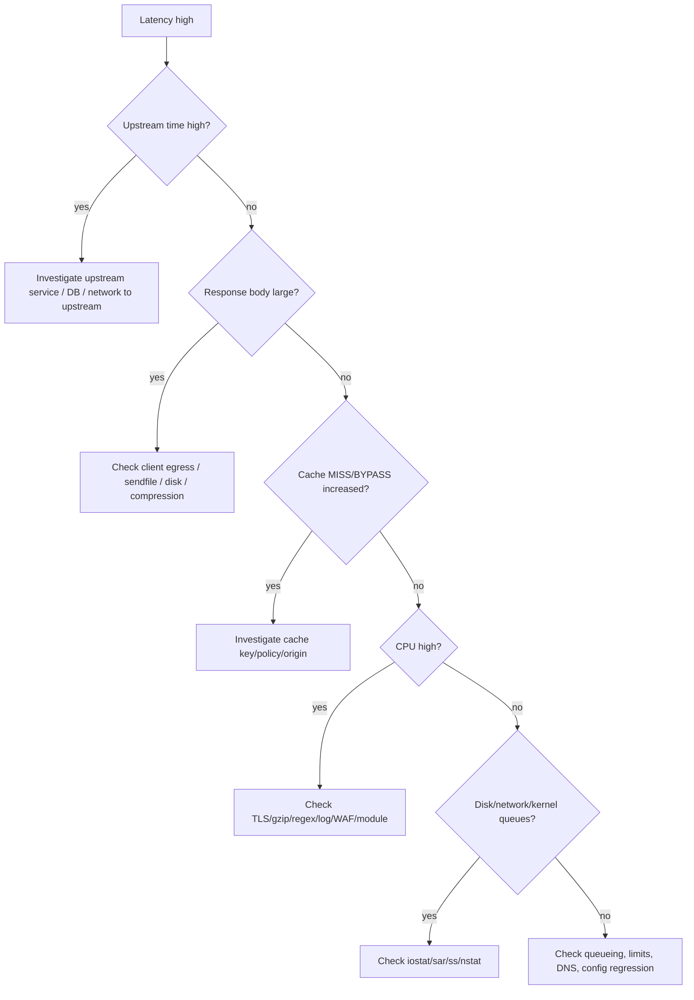

# Part 095 — Performance Model: CPU, Memory, Disk, Network, and Bottleneck Taxonomy

> Goal part ini: membangun mental model untuk membaca performa NGINX sebagai sistem, bukan sebagai kumpulan directive tuning.

Banyak engineer melakukan tuning NGINX dengan pola:

```nginx
worker_processes auto;
worker_connections 65535;
sendfile on;
tcp_nopush on;
tcp_nodelay on;
keepalive_timeout 65;
```

Lalu berharap performa naik.

Itu bukan performance engineering. Itu konfigurasi tanpa diagnosis.

NGINX biasanya sangat cepat. Ketika NGINX terasa lambat, penyebabnya sering bukan “NGINX kurang kencang”, melainkan salah satu dari ini:

1. CPU habis karena TLS, compression, regex, logging, WAF, atau request rate tinggi.
2. Memory habis karena buffering, cache metadata, connection state, atau module tambahan.
3. Disk menjadi bottleneck karena access log, temp files, proxy buffering, cache, atau sendfile fallback.
4. Network menjadi bottleneck karena bandwidth, packet loss, backlog, SYN flood, NAT, MTU, atau upstream path.
5. Upstream lambat, lalu NGINX hanya menjadi tempat gejala terlihat.
6. Queueing tidak terlihat, lalu latency naik sebelum error rate naik.
7. Retry memperbesar traffic ketika sistem sedang sakit.

Top 1% engineer tidak mulai dari “setting apa yang harus dinaikkan?” Mereka mulai dari pertanyaan:

> Resource mana yang menjadi boundary? Request class mana yang memakan resource itu? Apakah bottleneck berada di client edge, NGINX, upstream, disk, kernel, DNS, TLS, atau control plane?

---

## 1. Model mental: NGINX sebagai resource transformer

NGINX menerima traffic, melakukan transformasi, lalu mengirim traffic ke target lain atau filesystem.



NGINX tidak “menghilangkan” cost. Ia memindahkan, menunda, membatasi, atau mengamortisasi cost.

Contoh:

- `proxy_buffering on` melindungi upstream dari slow client, tetapi memakai memory dan mungkin disk temp file.
- `gzip on` mengurangi network bytes, tetapi memakai CPU.
- `proxy_cache` mengurangi upstream load, tetapi memakai disk, memory metadata, dan invalidation discipline.
- `keepalive` mengurangi connection churn, tetapi menahan file descriptor dan memory lebih lama.
- HTTP/2 mengurangi jumlah TCP connection, tetapi multiplexing dapat mengubah fairness dan head-of-line behavior di layer berbeda.
- TLS termination memusatkan crypto cost di edge, tetapi menyederhanakan backend.

Jadi tuning yang benar selalu berbentuk trade-off.

---

## 2. Request lifecycle sebagai resource accounting

Setiap request melewati beberapa fase. Tidak semua fase selalu aktif.



Untuk menganalisis performa, pecah request menjadi resource cost:

| Fase | Resource dominan | Gejala umum |
|---|---|---|
| Accept connection | CPU, kernel queue, FD | connect timeout, SYN backlog drop, uneven worker load |
| TLS handshake | CPU, entropy/session cache, network RTT | high CPU, low RPS, slow handshake |
| Header parsing | CPU, memory buffers | 400/414/494-like errors, large header issues |
| Location/rewrite/map | CPU | latency mikro naik, regex hotspot |
| Static file | page cache, disk, network | high disk read, sendfile behavior, cache miss at OS page cache |
| Proxy connect | network, upstream availability | 502/504, `$upstream_connect_time` high |
| Upstream wait | upstream CPU/DB, queue | `$upstream_header_time` high |
| Response transfer | network, buffering, disk temp | high `$request_time` with low upstream time |
| Logging | disk/syslog/CPU | worker stalls, high iowait, delayed log shipping |
| Cache | disk, shared memory, lock | MISS storm, HIT ratio drop, disk saturation |

---

## 3. Throughput, latency, concurrency: jangan disamakan

Tiga angka ini sering dicampur.

### 3.1 Throughput

Throughput menjawab:

> Berapa request/second atau bytes/second yang dapat diproses?

Throughput tinggi belum tentu user experience bagus. Sistem bisa memiliki RPS tinggi tetapi p99 latency buruk.

### 3.2 Latency

Latency menjawab:

> Berapa lama request selesai?

Untuk NGINX, latency minimal perlu dipisah:

- client-to-NGINX latency,
- NGINX processing latency,
- upstream connect latency,
- upstream header latency,
- upstream response latency,
- response transfer latency,
- queueing latency.

`$request_time` sendirian tidak cukup.

### 3.3 Concurrency

Concurrency menjawab:

> Berapa request/connection aktif secara bersamaan?

Concurrency tidak sama dengan RPS.

Approximation:

```text
concurrency ≈ throughput × average service time
```

Jika request rata-rata 100 ms dan traffic 10.000 RPS:

```text
concurrency ≈ 10.000 × 0,1 = 1.000 active requests
```

Jika request rata-rata naik menjadi 2 detik pada traffic sama:

```text
concurrency ≈ 10.000 × 2 = 20.000 active requests
```

Itulah kenapa upstream latency spike dapat membuat NGINX kehabisan connection/file descriptor walau RPS tidak naik.

---

## 4. Bottleneck taxonomy

### 4.1 CPU-bound NGINX

NGINX CPU-bound ketika worker menghabiskan CPU untuk pekerjaan komputasi.

Common causes:

- TLS handshake tinggi.
- TLS termination tanpa session reuse efektif.
- gzip compression level terlalu tinggi.
- regex location/rewrite/map yang kompleks.
- WAF/security module berat.
- JSON log sangat besar pada traffic tinggi.
- Lua/njs/custom module melakukan logic mahal.
- high request rate dengan response kecil.
- excessive `if`/rewrite/variable expansion.

Gejala:

- CPU worker mendekati 100% per core.
- RPS plateau meskipun network/disk/upstream masih longgar.
- p99 naik saat CPU saturation.
- `perf top` menunjukkan OpenSSL, regex, compression, logging, module function.
- load average naik, tetapi iowait tidak dominan.

Diagnosis cepat:

```bash
pidof nginx
ps -o pid,ppid,psr,pcpu,pmem,cmd -C nginx
mpstat -P ALL 1
pidstat -u -p $(pidof nginx | tr ' ' ',') 1
perf top -p <worker_pid>
```

NGINX-specific probes:

- Bandingkan request kecil vs besar.
- Bandingkan TLS vs plain HTTP di lab internal.
- Matikan gzip sementara di staging dan ukur CPU delta.
- Pisahkan route static, proxy, cache HIT, cache MISS.
- Cek apakah satu worker panas sendiri karena imbalance.

### 4.2 Memory-bound NGINX

NGINX memory-bound ketika resident memory, shared memory, buffers, cache metadata, atau module memory menjadi boundary.

Common causes:

- terlalu banyak concurrent connections,
- request/response buffering besar,
- `proxy_buffers` terlalu besar,
- upload buffering ke memory,
- large headers,
- cache shared zone terlalu besar/kecil,
- WAF/module tambahan,
- long-lived WebSocket/SSE/gRPC streams,
- too many idle keepalive connections,
- container memory limit terlalu rendah.

Gejala:

- OOM kill pada container/host.
- swap activity.
- latency spike tanpa CPU penuh.
- error allocation di logs.
- kernel memory pressure.
- cache metadata churn.

Diagnosis cepat:

```bash
free -h
vmstat 1
cat /proc/meminfo | egrep 'MemAvailable|Cached|Buffers|Swap|Slab|SReclaimable'
ps -o pid,rss,vsz,cmd -C nginx
pmap -x <worker_pid> | tail -20
cat /sys/fs/cgroup/memory.max 2>/dev/null || true
cat /sys/fs/cgroup/memory.current 2>/dev/null || true
```

Important mental model:

> OS page cache is not wasted memory.

Untuk static file dan proxy cache, Linux page cache dapat membantu performa. Jangan salah membaca memory “used” sebagai masalah tanpa melihat `MemAvailable`, reclaimable slab, swap, dan OOM evidence.

### 4.3 Disk-bound NGINX

NGINX disk-bound ketika disk I/O menjadi boundary untuk file serving, logs, temp files, atau cache.

Common causes:

- access log volume tinggi,
- synchronous logging ke disk lambat,
- proxy temp files besar karena buffering response besar,
- client body temp files karena upload besar,
- cache write/read heavy,
- inode pressure,
- cache loader/manager activity,
- filesystem penuh,
- disk latency tinggi,
- container overlay filesystem lambat untuk temp/cache.

Gejala:

- iowait naik.
- `await`/latency disk tinggi.
- `$request_time` naik tetapi `$upstream_response_time` normal.
- temp file warnings.
- cache HIT tidak mempercepat karena disk lambat.
- log write lag.
- 500/502 karena temp/cache path failure.

Diagnosis cepat:

```bash
iostat -xz 1
pidstat -d -p $(pidof nginx | tr ' ' ',') 1
df -h
df -i
sudo du -sh /var/cache/nginx /var/lib/nginx /var/log/nginx 2>/dev/null
sudo find /var/cache/nginx -maxdepth 2 -type f | head
```

Disk paths to inventory:

```nginx
client_body_temp_path /var/lib/nginx/client_body_temp;
proxy_temp_path       /var/lib/nginx/proxy_temp;
fastcgi_temp_path     /var/lib/nginx/fastcgi_temp;
proxy_cache_path      /var/cache/nginx levels=1:2 keys_zone=edge_cache:100m max_size=20g inactive=1h;
access_log            /var/log/nginx/access.log main;
error_log             /var/log/nginx/error.log warn;
```

Anti-pattern:

> Menaruh logs, proxy temp, cache, dan application data pada filesystem kecil yang sama.

Jika cache mengisi disk, logging dan temp file juga bisa gagal. Jika temp file mengisi disk, cache manager tidak selalu bisa menyelamatkan sistem cukup cepat.

### 4.4 Network-bound NGINX

NGINX network-bound ketika link bandwidth, packet processing, socket queues, upstream path, DNS, or connection churn menjadi boundary.

Common causes:

- bandwidth egress penuh,
- high packet rate dengan response kecil,
- packet loss,
- MTU mismatch,
- SYN backlog overflow,
- ephemeral port exhaustion pada outbound upstream,
- NAT gateway limit,
- upstream connection churn,
- TLS handshake RTT tinggi,
- HTTP/2 stream contention,
- slow clients.

Gejala:

- retransmission tinggi.
- network interface near line rate.
- `connect()` timeout ke upstream.
- banyak socket `SYN-SENT`, `TIME-WAIT`, `CLOSE-WAIT`.
- `$upstream_connect_time` tinggi.
- `$request_time` tinggi tetapi upstream time rendah, biasanya slow client/egress.
- client 499 naik.

Diagnosis cepat:

```bash
ss -s
ss -tan state established '( sport = :443 or sport = :80 )' | wc -l
ss -tan state time-wait | wc -l
sar -n DEV,TCP,ETCP 1
ip -s link
nstat -az | egrep 'TcpRetransSegs|TcpExtListenOverflows|TcpExtListenDrops|TcpOutSegs|TcpInSegs'
```

---

## 5. NGINX observability variables for performance analysis

Minimal high-signal log format:

```nginx
log_format perf_json escape=json
  '{'
    '"ts":"$time_iso8601",'
    '"request_id":"$request_id",'
    '"remote_addr":"$remote_addr",'
    '"host":"$host",'
    '"method":"$request_method",'
    '"uri":"$uri",'
    '"status":$status,'
    '"bytes_sent":$bytes_sent,'
    '"body_bytes_sent":$body_bytes_sent,'
    '"request_length":$request_length,'
    '"request_time":$request_time,'
    '"upstream_addr":"$upstream_addr",'
    '"upstream_status":"$upstream_status",'
    '"upstream_connect_time":"$upstream_connect_time",'
    '"upstream_header_time":"$upstream_header_time",'
    '"upstream_response_time":"$upstream_response_time",'
    '"upstream_cache_status":"$upstream_cache_status",'
    '"connection":"$connection",'
    '"connection_requests":$connection_requests,'
    '"http2":"$http2",'
    '"ssl_protocol":"$ssl_protocol",'
    '"ssl_cipher":"$ssl_cipher",'
    '"user_agent":"$http_user_agent"'
  '}';

access_log /var/log/nginx/access_perf.json perf_json;
```

Interpretasi dasar:

| Pattern | Makna awal |
|---|---|
| `$request_time` high, `$upstream_response_time` high | upstream/service/backend lambat |
| `$request_time` high, upstream time low/empty | slow client, static transfer, disk, buffering, network egress |
| `$upstream_connect_time` high | upstream network/connect backlog/DNS/routing |
| multiple `$upstream_addr` values | retry terjadi |
| `$upstream_status` `502, 200` | first upstream failed, retry succeeded |
| `$upstream_cache_status` `MISS` storm | cache ineffective atau key terlalu granular |
| 499 naik | client/proxy upstream dari client side menutup koneksi |
| 504 naik | timeout upstream atau proxy read timeout boundary |

---

## 6. Performance profile by workload class

### 6.1 Static asset server

Resource profile:

- CPU rendah kecuali TLS/gzip.
- Disk/page cache penting.
- Network egress dominan untuk file besar.
- Logging bisa menjadi bottleneck tersembunyi.

Primary levers:

```nginx
sendfile on;
tcp_nopush on;
open_file_cache max=10000 inactive=60s;
open_file_cache_valid 120s;
open_file_cache_min_uses 2;
open_file_cache_errors on;
```

Caution:

- `open_file_cache_errors on` dapat cache negative lookups; ini bagus untuk mengurangi stat storm tetapi perlu dipahami saat deploy file baru.
- `sendfile` sangat efektif untuk static file, tetapi interaksi dengan filesystem, container, TLS, dan kernel tetap harus diuji.
- Precompressed assets sering lebih predictable daripada dynamic gzip untuk file static besar.

### 6.2 Reverse proxy API gateway

Resource profile:

- Upstream latency dominan.
- Connections dan keepalive penting.
- Buffering melindungi upstream dari slow clients.
- Rate limit dan timeout menentukan overload behavior.

Primary levers:

```nginx
upstream api_backend {
    zone api_backend 64k;
    server 10.0.1.10:8080 max_fails=2 fail_timeout=10s;
    server 10.0.1.11:8080 max_fails=2 fail_timeout=10s;
    keepalive 128;
}

server {
    location /api/ {
        proxy_http_version 1.1;
        proxy_set_header Connection "";
        proxy_connect_timeout 1s;
        proxy_send_timeout 10s;
        proxy_read_timeout 30s;
        proxy_buffering on;
        proxy_pass http://api_backend;
    }
}
```

Caution:

- More keepalive is not always better; backend FD and idle memory matter.
- Retry can amplify load.
- `proxy_read_timeout` is not a business SLA; it is a transport idle boundary.

### 6.3 Cache layer

Resource profile:

- Disk and memory metadata dominate.
- Origin latency hidden on HIT.
- MISS/stale behavior determines resilience.
- Cache key correctness determines safety.

Primary levers:

```nginx
proxy_cache_path /var/cache/nginx/api
    levels=1:2
    keys_zone=api_cache:100m
    max_size=20g
    inactive=30m
    use_temp_path=off;

proxy_cache_lock on;
proxy_cache_use_stale error timeout updating http_500 http_502 http_503 http_504;
proxy_cache_background_update on;
```

Caution:

- Cache can hide upstream sickness until invalidation or deploy causes MISS storm.
- Cache HIT ratio without origin load metric is incomplete.
- Disk full is a functional outage, not just a performance issue.

### 6.4 TLS-heavy edge

Resource profile:

- CPU from handshake and crypto.
- Session reuse matters.
- Certificate chain size matters.
- Client compatibility matters.

Primary levers:

```nginx
ssl_protocols TLSv1.2 TLSv1.3;
ssl_session_cache shared:SSL:50m;
ssl_session_timeout 1d;
ssl_session_tickets off;
```

Caution:

- TLS 1.3 behavior differs from TLS 1.2.
- 0-RTT has replay risk.
- More ciphers/protocols is not “more compatible” if it weakens policy.

### 6.5 Long-lived connections: WebSocket, SSE, gRPC

Resource profile:

- concurrency high.
- memory and FD matter.
- request rate may be low while connection count is high.
- timeout must match heartbeat behavior.

Primary levers:

```nginx
proxy_http_version 1.1;
proxy_set_header Upgrade $http_upgrade;
proxy_set_header Connection $connection_upgrade;
proxy_read_timeout 1h;
proxy_buffering off;
```

Caution:

- `worker_connections` must be sized for concurrent open connections, not RPS.
- Load balancer algorithms behave differently for long-lived sessions.
- Idle timeout mismatch creates false disconnect incidents.

---

## 7. Worker sizing is not capacity planning

Common formula:

```text
max_connections ≈ worker_processes × worker_connections
```

This is incomplete.

Why?

1. Reverse proxy uses client-side and upstream-side sockets.
2. Idle keepalive connections also consume FDs.
3. Files, logs, cache files, temp files, and eventfd/timerfd also consume FDs.
4. OS limits may cap process FDs.
5. Backend capacity may be lower than NGINX socket capacity.
6. Memory per connection may become boundary before FD limit.

A safer mental model:

```text
required_fds ≈ client_connections
             + upstream_connections
             + idle_upstream_keepalive
             + open_files
             + logs
             + cache/temp files
             + safety_margin
```

For reverse proxy, a rough upper bound under heavy active proxying:

```text
fd_needed ≈ active_client_connections × 2 + idle_keepalive + files + margin
```

Example:

```text
20.000 active client connections
15.000 active upstream connections
2.000 idle upstream keepalive
1.000 file/log/cache/temp margin
------------------------------------------------
≈ 38.000 FD required
```

Setting `worker_connections 65535` without raising OS limits and backend limits only creates a false sense of capacity.

---

## 8. Queueing: latency rises before failure

A system near saturation does not fail instantly. It queues.



The dangerous phase is “slow success”.

Dashboards often alert on error rate. But overload often appears first as:

- p95/p99 latency rising,
- upstream connect time rising,
- queue depth rising,
- active connections rising,
- idle worker capacity disappearing,
- retry count rising,
- cache MISS storm,
- 499 rising from impatient clients.

Error rate is late.

---

## 9. Performance counter map

| Question | NGINX data | OS data | Interpretation |
|---|---|---|---|
| Are clients slow? | `$request_time` high, upstream low | egress saturation, socket send queues | NGINX waits sending to clients |
| Is upstream slow? | `$upstream_response_time` high | backend CPU/DB metrics | backend/service issue |
| Is connect slow? | `$upstream_connect_time` high | SYN-SENT, retransmits | network/upstream accept queue |
| Is disk hurting? | temp/cache warnings | iostat await/util | log/temp/cache pressure |
| Is CPU saturated? | latency all routes | mpstat/perf | TLS/gzip/regex/module cost |
| Is cache helping? | `$upstream_cache_status` | origin RPS | HIT ratio and origin offload |
| Are retries happening? | multiple upstream addr/status | upstream error logs | load amplification risk |
| Are FDs exhausted? | accept/connect errors | `ulimit`, `lsof`, `ss` | OS/process limit issue |
| Are limits rejecting? | 429/503 + limit logs | traffic/key distribution | rate/conn limiting active |

---

## 10. Diagnostic workflow: from symptom to bottleneck

### Step 1 — classify the symptom

Do not start by editing config.

Classify:

- high latency,
- low throughput,
- high error rate,
- high CPU,
- high memory,
- disk full/high iowait,
- connection failures,
- upstream errors,
- cache regression,
- specific route issue,
- global issue.

### Step 2 — compare NGINX time components

Use log fields:

```text
request_time
upstream_connect_time
upstream_header_time
upstream_response_time
upstream_cache_status
upstream_addr
upstream_status
body_bytes_sent
request_length
```

Decision tree:



### Step 3 — isolate route class

Never average all traffic when diagnosing NGINX.

Group by:

- `server_name`,
- `location`/route label,
- status class,
- cache status,
- upstream group,
- method,
- response size bucket,
- protocol HTTP/1.1 vs HTTP/2 vs HTTP/3,
- TLS vs non-TLS in controlled lab,
- canary vs stable upstream.

### Step 4 — inspect OS boundary

```bash
# CPU
mpstat -P ALL 1
pidstat -u -p $(pidof nginx | tr ' ' ',') 1

# Memory
free -h
vmstat 1
ps -o pid,rss,vsz,cmd -C nginx

# Disk
iostat -xz 1
pidstat -d -p $(pidof nginx | tr ' ' ',') 1
df -h; df -i

# Network and sockets
ss -s
sar -n DEV,TCP,ETCP 1
nstat -az | egrep 'Listen|Retrans|Reset|Timeout|Backlog|Overflow|Drop'
```

### Step 5 — change one variable

Performance tuning without experiment control is guesswork.

Bad:

- change worker count,
- increase buffers,
- change timeout,
- enable gzip,
- change cache,
- raise sysctl,
- redeploy app,
- change load test scenario,

all at once.

Good:

1. State hypothesis.
2. Capture baseline.
3. Change one variable.
4. Run same load scenario.
5. Compare p50/p95/p99, RPS, CPU, memory, disk, network, upstream health.
6. Roll back if no improvement or side effect appears.

---

## 11. Common false conclusions

### False conclusion 1: “NGINX is slow.”

Maybe.

But often:

- upstream is slow,
- disk is slow,
- clients are slow,
- retries amplify traffic,
- cache stopped hitting,
- TLS handshakes increased,
- logging pipeline stalls,
- connection churn increased,
- DNS changed.

### False conclusion 2: “Increase worker_connections.”

Only if connection capacity is the boundary and OS/process/backend limits agree.

If upstream is slow, raising connection limit may increase queueing and make the incident worse.

### False conclusion 3: “Turn off buffering for lower latency.”

Sometimes correct for streaming.

Often wrong for APIs and file responses. Buffering protects upstream from slow clients. Turning it off can make application workers spend time blocked on slow network clients.

### False conclusion 4: “Cache HIT ratio is high, so cache is healthy.”

Maybe.

Need also inspect:

- origin RPS,
- MISS burst,
- stale usage,
- cache key cardinality,
- disk latency,
- cache lock contention,
- privacy leaks,
- negative caching.

### False conclusion 5: “CPU is low, so system has capacity.”

Maybe not.

System can be blocked on:

- disk,
- network,
- upstream queue,
- file descriptors,
- kernel accept queue,
- DB pool,
- memory cgroup,
- DNS resolver.

---

## 12. Performance invariants for production NGINX

Use these as review checklist.

### Invariant 1 — Every critical route has a known resource profile

For each route class:

```text
route: /api/orders
expected response size: small JSON
expected request body: small/medium
cache: no
streaming: no
timeout budget: 1s connect, 10s read
retry: safe only for GET/HEAD
rate limit: per identity/IP
upstream group: orders_api
owner: orders team
```

### Invariant 2 — Logs distinguish NGINX time from upstream time

Without `$upstream_*`, NGINX access logs are too weak for production RCA.

### Invariant 3 — Timeout is aligned across layers

Timeout order should be intentional:

```text
client/CDN timeout >= NGINX timeout >= app timeout >= DB timeout
```

Not always exactly, but never accidental.

### Invariant 4 — Retry cannot exceed idempotency boundary

Retries on non-idempotent writes can duplicate effects.

### Invariant 5 — Disk paths are isolated and monitored

At minimum:

- logs monitored,
- cache monitored,
- temp monitored,
- inode monitored,
- filesystem free monitored,
- cache fill rate monitored.

### Invariant 6 — Load test models real connection behavior

A load test with no TLS, no keepalive, no HTTP/2, no large body, no slow clients, and no upstream delay does not validate production behavior.

### Invariant 7 — Tuning changes have rollback

Performance tuning is configuration change. It needs rollback like application code.

---

## 13. Minimal performance review template

```md
# NGINX Performance Review

## Context
- service:
- date:
- traffic class:
- deployment substrate:
- NGINX version/build:

## Symptoms
- latency:
- throughput:
- error rate:
- CPU:
- memory:
- disk:
- network:
- upstream:

## Route breakdown
| route | RPS | p95 | p99 | status mix | cache | upstream group |
|---|---:|---:|---:|---|---|---|

## NGINX timing
| route | request_time p95 | upstream_connect p95 | upstream_response p95 | cache status |
|---|---:|---:|---:|---|

## OS evidence
- CPU:
- memory:
- disk:
- network:
- fd/socket:

## Hypothesis

## Experiment
- change:
- expected effect:
- rollback:

## Result

## Decision
```

---

## 14. Practical lab: locate the bottleneck

Create three route classes:

1. Static small file.
2. Static large file.
3. Proxied delayed API.

Example NGINX:

```nginx
log_format perf_json escape=json
  '{"ts":"$time_iso8601","route":"$route_label","status":$status,'
  '"request_time":$request_time,"upstream_response_time":"$upstream_response_time",'
  '"bytes_sent":$bytes_sent,"upstream_cache_status":"$upstream_cache_status"}';

map $uri $route_label {
    default unknown;
    /small.txt static_small;
    /large.bin static_large;
    /api/delay api_delay;
}

server {
    listen 8080;
    access_log /var/log/nginx/perf.json perf_json;

    location = /small.txt {
        root /srv/www;
    }

    location = /large.bin {
        root /srv/www;
    }

    location /api/ {
        proxy_pass http://127.0.0.1:9000;
        proxy_connect_timeout 1s;
        proxy_read_timeout 10s;
    }
}
```

Run scenarios:

```bash
# small file: CPU/request-rate pressure
wrk -t4 -c200 -d60s http://127.0.0.1:8080/small.txt

# large file: network/disk/page-cache pressure
wrk -t4 -c100 -d60s http://127.0.0.1:8080/large.bin

# delayed API: upstream latency/concurrency pressure
wrk -t4 -c200 -d60s http://127.0.0.1:8080/api/delay
```

Observe:

```bash
mpstat -P ALL 1
iostat -xz 1
ss -s
pidstat -u -d -p $(pidof nginx | tr ' ' ',') 1
tail -f /var/log/nginx/perf.json
```

Expected learning:

- small static response stresses request rate and CPU/event loop more than bandwidth,
- large file stresses egress and page cache/disk,
- delayed upstream stresses concurrency and upstream time,
- `$request_time` must be interpreted with `$upstream_response_time`.

---

## 15. What “good performance” means

Good performance is not “maximum benchmark number”.

Good production performance means:

1. p95/p99 fit product SLO.
2. overload behavior is bounded and intentional.
3. upstream is protected from slow clients and retry storms.
4. disk/cache/log paths cannot silently kill the edge.
5. resource limits are explicit and monitored.
6. observability can identify bottleneck class quickly.
7. tuning changes are reversible.
8. benchmark scenario resembles production traffic.

Performance engineering is not about making NGINX impressive in a benchmark. It is about keeping the edge predictable when reality becomes messy.

---

## References

- NGINX Core Module: `worker_processes`, `worker_rlimit_nofile`, `events`, `worker_connections`, `accept_mutex`, and core runtime directives.
- NGINX HTTP Core Module: `sendfile`, `tcp_nopush`, `tcp_nodelay`, `keepalive_timeout`, buffering-related directives, static serving behavior.
- NGINX Proxy Module: proxy buffering, temporary files, upstream timeouts, retry behavior.
- NGINX Upstream Module: upstream timing variables, keepalive, upstream state.
- NGINX Logging documentation: access log, error log, and log format design.
- NGINX/F5 performance tuning guidance: NGINX and Linux settings that may impact throughput/latency under real workloads.
