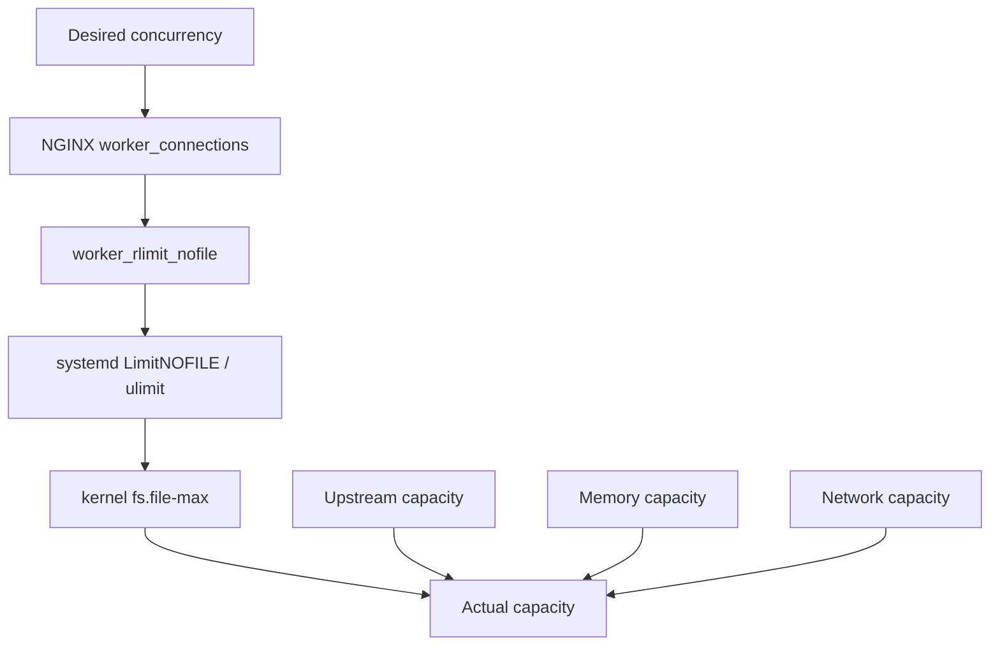

# Part 096 — Kernel and OS Tuning for NGINX

> Goal part ini: memahami OS/kernel tuning yang benar-benar memengaruhi NGINX, tanpa cargo-cult sysctl.

NGINX berjalan di atas kernel. Worker NGINX memang event-driven, tetapi ia tetap bergantung pada:

- process limits,
- file descriptors,
- socket queues,
- TCP state machine,
- listen backlog,
- ephemeral ports,
- filesystem dan page cache,
- disk scheduler/storage latency,
- cgroup/container limits,
- CPU scheduling,
- NUMA topology,
- network interface dan NIC queues.

Kesalahan umum:

```text
“Tambahkan sysctl tuning dari blog internet, restart, selesai.”
```

Itu berbahaya.

OS tuning bukan ritual. OS tuning adalah proses menyelaraskan tiga hal:

1. workload NGINX,
2. batas kernel/host/container,
3. kapasitas upstream dan dependency.

---

## 1. Prinsip utama OS tuning

### Prinsip 1 — Tune boundary yang terbukti menjadi bottleneck

Jangan menaikkan semuanya.

Contoh:

- Jika FD exhaustion terjadi, tune file descriptor limit.
- Jika listen queue overflow terjadi, tune backlog dan accept capacity.
- Jika outbound upstream connection gagal karena ephemeral port exhaustion, tune port range/reuse strategy/keepalive/NAT path.
- Jika disk cache lambat, tune storage layout, filesystem, dan cache/temp paths.
- Jika CPU imbalance, tune worker count/affinity only if evidence supports it.

### Prinsip 2 — NGINX limit dan OS limit harus cocok

NGINX config tidak bisa melampaui OS limit.



Raising only one layer creates misleading config.

### Prinsip 3 — Bigger queues are not always safer

Queue besar dapat mengurangi connection drops, tetapi juga bisa menambah tail latency.

Antrian adalah buffer. Buffer menyembunyikan overload sementara, bukan menambah kapasitas service.

### Prinsip 4 — Container limit is real limit

Jika NGINX berjalan di container, host terlihat besar tetapi cgroup bisa kecil.

Yang harus dicek:

```bash
cat /sys/fs/cgroup/cpu.max 2>/dev/null || true
cat /sys/fs/cgroup/memory.max 2>/dev/null || true
cat /sys/fs/cgroup/pids.max 2>/dev/null || true
cat /proc/self/limits
```

---

## 2. File descriptor model

NGINX memakai file descriptor untuk:

- client sockets,
- upstream sockets,
- listening sockets,
- open static files,
- log files,
- cache files,
- temp files,
- event mechanism resources,
- DNS resolver sockets,
- module-specific files/sockets.

### 2.1 NGINX-level directives

```nginx
worker_processes auto;
worker_rlimit_nofile 200000;

events {
    worker_connections 32768;
}
```

Important:

```text
worker_processes × worker_connections != guaranteed client capacity
```

For reverse proxy traffic, a single user request can require both a client socket and upstream socket.

### 2.2 systemd limit

For package-based deployments, systemd often owns the actual process limit.

Check:

```bash
systemctl show nginx --property=LimitNOFILE
cat /proc/$(pgrep -o nginx)/limits | grep 'open files'
```

Override:

```ini
# /etc/systemd/system/nginx.service.d/override.conf
[Service]
LimitNOFILE=200000
```

Apply:

```bash
sudo systemctl daemon-reload
sudo systemctl restart nginx
```

### 2.3 kernel global file limit

Check:

```bash
sysctl fs.file-max
cat /proc/sys/fs/file-nr
```

Interpretation of `/proc/sys/fs/file-nr`:

```text
allocated unused maximum
```

If global file table is exhausted, not only NGINX suffers.

### 2.4 Sizing FD limit

Rough model:

```text
fd_needed = client_connections
          + upstream_connections
          + upstream_idle_keepalive
          + open_files
          + logs
          + cache/temp activity
          + 20-30% safety margin
```

Example:

```text
client connections:        40,000
active upstream sockets:   25,000
idle upstream keepalive:    5,000
files/log/cache/temp:       5,000
margin 25%:                18,750
---------------------------------
recommended:               93,750+
```

Set process limit higher than recommendation, but do not forget memory and backend capacity.

---

## 3. Worker process and CPU scheduling

### 3.1 `worker_processes auto`

For most production systems:

```nginx
worker_processes auto;
```

This is usually the right starting point.

But “one worker per CPU” is not always optimal when:

- container CPU quota is smaller than visible host CPUs,
- heavy WAF/module memory makes too many workers expensive,
- CPU pinning/NUMA topology matters,
- workload is mostly I/O-bound and constrained elsewhere,
- Kubernetes pod CPU limits throttle workers.

Check visible CPU and cgroup quota:

```bash
nproc
lscpu
cat /sys/fs/cgroup/cpu.max 2>/dev/null || true
cat /sys/fs/cgroup/cpu.stat 2>/dev/null || true
```

In cgroup v2, `cpu.max` format:

```text
quota period
```

Example:

```text
200000 100000
```

means roughly 2 CPUs.

If NGINX sees 32 host CPUs but container has 2 CPU quota, `worker_processes auto` behavior must be validated in your runtime/version/distribution.

### 3.2 Worker CPU affinity

Manual affinity can help in specialized high-throughput environments, but it is not first-line tuning.

Reasons to avoid early affinity:

- Kubernetes scheduler may move containers.
- CPU quota can throttle anyway.
- NUMA topology may be unknown.
- IRQ affinity may dominate network packet distribution.
- Wrong pinning can make imbalance worse.

Investigate first:

```bash
ps -o pid,psr,pcpu,cmd -C nginx
mpstat -P ALL 1
cat /proc/interrupts | head -40
```

Use affinity only when you can prove worker imbalance and you control host topology.

---

## 4. Listen backlog and accept queues

When clients connect, kernel queues connection attempts before NGINX accepts them.

Important layers:


### 4.1 NGINX listen backlog

```nginx
server {
    listen 443 ssl backlog=65535;
}
```

The effective backlog is also bounded by kernel settings.

### 4.2 Kernel `somaxconn`

Check:

```bash
sysctl net.core.somaxconn
```

Set via sysctl file:

```ini
# /etc/sysctl.d/99-nginx.conf
net.core.somaxconn = 65535
```

Apply:

```bash
sudo sysctl --system
```

### 4.3 SYN backlog

Check:

```bash
sysctl net.ipv4.tcp_max_syn_backlog
```

Potential tuning:

```ini
net.ipv4.tcp_max_syn_backlog = 65535
```

But large backlog alone does not solve application overload. It delays rejection.

### 4.4 Detect listen queue overflow

```bash
nstat -az | egrep 'ListenOverflows|ListenDrops|Syncookies|TCPReqQFull'
ss -ltn sport = :443
```

If listen overflows rise during traffic spikes:

- NGINX workers may not accept fast enough,
- CPU may be saturated,
- worker count may be too low,
- backlog too small,
- SYN flood/attack may be happening,
- downstream app does not matter yet because connection cannot enter NGINX.

---

## 5. Ephemeral ports and outbound upstream connections

Reverse proxy creates outbound connections to upstreams unless reusing keepalive.

Each outbound TCP connection uses:

```text
source_ip:source_port -> destination_ip:destination_port
```

If NGINX opens many short-lived connections to the same upstream tuple, ephemeral ports can become a boundary.

Check range:

```bash
sysctl net.ipv4.ip_local_port_range
```

Typical output:

```text
32768 60999
```

That gives around 28k local ports per source IP per destination tuple.

### 5.1 Symptoms

- connect failures under high churn,
- many `TIME-WAIT` sockets,
- `$upstream_connect_time` increases,
- `connect() failed` errors,
- NAT gateway exhaustion if traffic leaves host/VPC path.

Diagnostics:

```bash
ss -tan state time-wait | wc -l
ss -tan state syn-sent | wc -l
ss -tan dst <upstream_ip>:<port> | awk '{print $1}' | sort | uniq -c
sar -n TCP,ETCP 1
```

### 5.2 Better first fix: upstream keepalive

Before tuning port range, reduce churn:

```nginx
upstream api_backend {
    server 10.0.1.10:8080;
    server 10.0.1.11:8080;
    keepalive 256;
}

location /api/ {
    proxy_http_version 1.1;
    proxy_set_header Connection "";
    proxy_pass http://api_backend;
}
```

### 5.3 Port range tuning

```ini
net.ipv4.ip_local_port_range = 10240 65535
```

But do not treat this as universal fix.

Also consider:

- source IP sharding,
- more upstream endpoints,
- keepalive,
- avoiding NAT bottlenecks,
- backend accept queue,
- connection pooling at app layer,
- HTTP/2 upstream if applicable and supported by architecture.

---

## 6. TCP TIME_WAIT, reuse, and dangerous myths

Many `TIME-WAIT` sockets are not automatically bad. `TIME-WAIT` is part of TCP correctness.

Do not blindly tune TCP state behavior because a dashboard shows many TIME_WAIT sockets.

Ask:

1. Are connections failing?
2. Is ephemeral port range exhausted?
3. Is NAT device exhausted?
4. Is upstream keepalive disabled?
5. Are clients/upstreams closing connections aggressively?
6. Is traffic pattern short-lived by design?

Safer levers first:

- enable upstream keepalive where appropriate,
- reduce unnecessary connection churn,
- increase upstream endpoint diversity,
- increase ephemeral port range if proven needed,
- avoid NAT bottleneck for high-volume east-west traffic.

---

## 7. Network buffers and socket memory

You will see tuning advice like:

```ini
net.core.rmem_max = ...
net.core.wmem_max = ...
net.ipv4.tcp_rmem = ...
net.ipv4.tcp_wmem = ...
```

These can matter for high bandwidth-delay-product paths or large transfers, but they are not first-line NGINX tuning for typical API workloads.

Use them only when evidence shows socket buffer limitation.

Useful probes:

```bash
ss -tin sport = :443 | head -40
sar -n DEV,TCP,ETCP 1
ip -s link
etstat -s | egrep -i 'buffer|retrans|listen|reset|timeout'
```

If retransmits are high, increasing buffers may hide but not fix packet loss.

---

## 8. `sendfile`, page cache, and static files

NGINX static file performance is heavily shaped by Linux page cache and file I/O path.

Relevant NGINX directives:

```nginx
sendfile on;
tcp_nopush on;
tcp_nodelay on;
open_file_cache max=20000 inactive=60s;
open_file_cache_valid 120s;
open_file_cache_min_uses 2;
open_file_cache_errors on;
```

OS implications:

- Frequently accessed static assets should be served from page cache.
- Cold cache tests are different from warm cache tests.
- Disk latency matters during cold start or cache miss.
- Container overlay filesystems may behave differently from host-mounted volumes.
- `sendfile` can reduce user-space copy overhead, but always test with your TLS/filesystem/container combination.

Inspect page cache indirectly:

```bash
free -h
vmtouch /srv/www 2>/dev/null || true
sar -B 1
```

Do not clear page cache in production to “test fairly”.

---

## 9. Disk and filesystem tuning

NGINX disk I/O comes from:

- access logs,
- error logs,
- static files,
- proxy temp files,
- client body temp files,
- FastCGI/uWSGI/SCGI temp files,
- proxy cache,
- cache loader/manager.

### 9.1 Separate high-risk paths

Recommended conceptual split:

```text
/var/log/nginx          logs
/var/cache/nginx        proxy cache
/var/lib/nginx/tmp      proxy/client temp files
/srv/www                static assets
```

Better: separate filesystem/volume when workload is heavy.

Why?

- cache filling disk should not stop logging,
- upload temp pressure should not kill cache,
- log spike should not break file serving,
- static assets should not compete with temp writes.

### 9.2 Monitor inode, not only bytes

```bash
df -h
df -i
find /var/cache/nginx -type f | wc -l
```

Small-object cache can exhaust inodes before bytes.

### 9.3 `use_temp_path=off`

For proxy cache:

```nginx
proxy_cache_path /var/cache/nginx/api
    levels=1:2
    keys_zone=api_cache:100m
    max_size=20g
    inactive=1h
    use_temp_path=off;
```

`use_temp_path=off` keeps temporary cache write files in the same directory tree as the cache path. This can avoid cross-filesystem rename/copy cost.

### 9.4 Logging pressure

Logging can be a bottleneck.

Options:

- reduce log fields only after preserving RCA needs,
- conditional logging for noisy low-value endpoints,
- buffer logs carefully,
- ship logs asynchronously,
- use local disk as buffer before remote shipping,
- avoid synchronous remote log path on critical request thread.

Example conditional health check suppression:

```nginx
map $uri $loggable {
    default 1;
    /healthz 0;
}

access_log /var/log/nginx/access.json main_json if=$loggable;
```

Do not suppress logs needed for incident reconstruction.

---

## 10. Memory, cgroups, and OOM safety

### 10.1 Container memory limit

Check:

```bash
cat /sys/fs/cgroup/memory.max 2>/dev/null || true
cat /sys/fs/cgroup/memory.current 2>/dev/null || true
cat /sys/fs/cgroup/memory.events 2>/dev/null || true
```

If `memory.max` is small, NGINX may be OOM-killed even if host memory looks fine.

### 10.2 Common memory consumers

| Consumer | Cause |
|---|---|
| connection state | high concurrent clients/upstreams |
| proxy buffers | response buffering |
| request body buffers | uploads |
| header buffers | large headers/cookies |
| cache metadata | `keys_zone` size |
| modules | WAF, njs, Lua, dynamic modules |
| TLS | session cache, cert/key handling, OpenSSL state |
| OS page cache | static/cache files |

### 10.3 Avoid swap dependency

For latency-sensitive edge nodes, swapping worker memory is usually catastrophic.

Check:

```bash
vmstat 1
free -h
cat /proc/swaps
```

If swap activity appears during traffic, reduce memory pressure or raise memory limit. Do not rely on swap as normal operating mode.

---

## 11. CPU, IRQs, NIC queues, and packet processing

At high traffic, packet processing can become CPU-bound outside NGINX.

Inspect:

```bash
mpstat -P ALL 1
cat /proc/interrupts | egrep 'eth|ens|eno|mlx|ixgbe|ena' | head -40
ethtool -l eth0 2>/dev/null || true
ethtool -S eth0 2>/dev/null | head -80 || true
```

Potential issues:

- one CPU handles most NIC interrupts,
- RSS not configured or not available,
- softirq saturation,
- packet drops at NIC or kernel,
- cloud instance network cap,
- conntrack/NAT overhead.

NGINX tuning cannot fix NIC queue imbalance by itself.

---

## 12. Conntrack and NAT path

If NGINX sits behind or in front of NAT/firewall/ Kubernetes iptables path, conntrack can be a hidden boundary.

Symptoms:

- intermittent connect failures,
- packet drops with low NGINX CPU,
- NAT gateway port exhaustion,
- high conntrack table usage,
- Kubernetes node-level network bottleneck.

Check Linux conntrack if applicable:

```bash
sysctl net.netfilter.nf_conntrack_max 2>/dev/null || true
cat /proc/sys/net/netfilter/nf_conntrack_count 2>/dev/null || true
cat /proc/sys/net/netfilter/nf_conntrack_max 2>/dev/null || true
```

Do not raise conntrack blindly. Ask whether traffic should bypass NAT or use more direct routing.

---

## 13. Safe sysctl baseline template

This is not universal. Treat it as a review starting point, not a paste-and-pray config.

```ini
# /etc/sysctl.d/99-nginx-edge.conf

# Larger accept queue ceiling. Effective only when app/listen backlog also aligns.
net.core.somaxconn = 65535

# Larger SYN backlog for high connection rate environments.
net.ipv4.tcp_max_syn_backlog = 65535

# Wider outbound ephemeral port range for high-churn reverse proxy workloads.
net.ipv4.ip_local_port_range = 10240 65535

# Global file table. Must align with process limits and host capacity.
fs.file-max = 1000000
```

Apply:

```bash
sudo sysctl --system
```

Validate:

```bash
sysctl net.core.somaxconn \
       net.ipv4.tcp_max_syn_backlog \
       net.ipv4.ip_local_port_range \
       fs.file-max
```

What this does **not** solve:

- upstream slowness,
- backend connection pool exhaustion,
- disk I/O saturation,
- TLS CPU saturation,
- bad cache key,
- retry storms,
- WAF CPU cost,
- Kubernetes service routing bottlenecks,
- cloud load balancer limits.

---

## 14. systemd production baseline

```ini
# /etc/systemd/system/nginx.service.d/override.conf
[Service]
LimitNOFILE=200000
TasksMax=infinity
```

Then:

```bash
sudo systemctl daemon-reload
sudo systemctl restart nginx
systemctl show nginx --property=LimitNOFILE --property=TasksMax
cat /proc/$(pgrep -o nginx)/limits
```

Caution:

- `TasksMax` usually not a bottleneck for NGINX itself because worker process count is modest.
- FD limit matters much more.
- Restart may be required for process limit changes; reload is not always enough because master process inherited old limits.

---

## 15. NGINX config baseline aligned with OS

```nginx
user nginx;
worker_processes auto;
worker_rlimit_nofile 200000;

events {
    worker_connections 32768;
    multi_accept off;
}

http {
    sendfile on;
    tcp_nopush on;
    tcp_nodelay on;

    keepalive_timeout 30s;
    keepalive_requests 1000;

    client_header_timeout 10s;
    client_body_timeout 30s;
    send_timeout 30s;

    access_log /var/log/nginx/access.json main_json;
    error_log  /var/log/nginx/error.log warn;
}
```

Notes:

- `multi_accept on` can improve accepting bursts but may hurt fairness; do not enable blindly.
- `accept_mutex` default behavior changed historically; verify current version and workload before tuning.
- `keepalive_timeout` too high can retain many idle connections.
- `keepalive_requests` bounds reuse lifecycle and resource retention.

---

## 16. Kubernetes/container-specific OS tuning

In Kubernetes, an NGINX pod may not be allowed to tune host sysctl freely.

Important boundaries:

- pod CPU request/limit,
- pod memory request/limit,
- file descriptor limit from container runtime,
- node-level sysctl,
- Service/load balancer path,
- conntrack table,
- CNI plugin behavior,
- readiness/liveness probes,
- ingress controller reload behavior.

Check inside pod:

```bash
cat /proc/self/limits
cat /sys/fs/cgroup/cpu.max 2>/dev/null || true
cat /sys/fs/cgroup/memory.max 2>/dev/null || true
ss -s
```

Check node if allowed:

```bash
sysctl net.core.somaxconn
sysctl net.ipv4.tcp_max_syn_backlog
cat /proc/sys/net/netfilter/nf_conntrack_count
cat /proc/sys/net/netfilter/nf_conntrack_max
```

Anti-pattern:

```text
Set NGINX worker_connections to 100k inside a pod with 256Mi memory and tiny CPU limit.
```

Container limits must be part of capacity planning.

---

## 17. Cloud load balancer and proxy chain limits

NGINX is often not the first or last hop.

Path example:


Each hop may have:

- idle timeout,
- max header size,
- TLS policy,
- HTTP/2 behavior,
- proxy protocol support,
- connection reuse behavior,
- request body limit,
- health check behavior,
- rate limit,
- log sampling.

OS tuning NGINX cannot override cloud load balancer connection limits or NAT gateway limits.

For production review, document every hop:

```md
| Hop | Idle timeout | Header limit | Body limit | Protocol | Real IP mechanism | Health check |
|---|---:|---:|---:|---|---|---|
| CDN | | | | | | |
| Cloud LB | | | | | | |
| NGINX | | | | | | |
| App LB | | | | | | |
| App | | | | | | |
```

---

## 18. Rollout method for OS tuning

OS tuning can impact the whole host.

Use canary method:

1. Pick one node/instance.
2. Capture baseline.
3. Apply one sysctl/process limit change.
4. Restart/reload only as required.
5. Run synthetic and real canary traffic.
6. Compare:
   - p95/p99,
   - error rate,
   - CPU,
   - memory,
   - disk,
   - retransmits,
   - listen drops,
   - FD usage,
   - connection states,
   - upstream health.
7. Roll out gradually.
8. Keep rollback file.

Rollback example:

```bash
sudo mv /etc/sysctl.d/99-nginx-edge.conf /etc/sysctl.d/99-nginx-edge.conf.disabled
sudo sysctl --system
sudo systemctl restart nginx
```

For systemd limit rollback:

```bash
sudo rm /etc/systemd/system/nginx.service.d/override.conf
sudo systemctl daemon-reload
sudo systemctl restart nginx
```

---

## 19. OS tuning checklist

### File descriptors

```bash
cat /proc/$(pgrep -o nginx)/limits | grep 'open files'
cat /proc/sys/fs/file-nr
lsof -p <worker_pid> | wc -l
```

Question:

- Is FD limit above expected peak plus margin?
- Do upstream sockets double FD demand?
- Are logs/cache/temp files included?

### Accept queues

```bash
nstat -az | egrep 'ListenOverflows|ListenDrops|Syncookies'
ss -ltn sport = :80
ss -ltn sport = :443
```

Question:

- Are listen drops increasing during spikes?
- Is backlog aligned with `somaxconn`?
- Is CPU/worker accept speed the real boundary?

### Ephemeral ports

```bash
sysctl net.ipv4.ip_local_port_range
ss -tan state time-wait | wc -l
ss -tan state syn-sent | wc -l
```

Question:

- Is upstream keepalive enabled?
- Is port exhaustion real or only TIME_WAIT visible?
- Is NAT in path?

### Disk

```bash
iostat -xz 1
df -h
df -i
pidstat -d -p $(pidof nginx | tr ' ' ',') 1
```

Question:

- Are logs/cache/temp isolated?
- Is disk await high?
- Are inodes enough?
- Is cache on suitable volume?

### Memory

```bash
free -h
vmstat 1
cat /sys/fs/cgroup/memory.events 2>/dev/null || true
```

Question:

- Is NGINX hitting container memory limit?
- Is swap active?
- Are buffers/cache zones too large?
- Are long-lived connections accumulating?

### Network

```bash
sar -n DEV,TCP,ETCP 1
ip -s link
nstat -az | egrep 'Retrans|Reset|Timeout|Drop|Overflow'
```

Question:

- Is link saturated?
- Are retransmits high?
- Are NIC drops occurring?
- Is cloud instance network cap reached?

---

## 20. Things not to do

### Do not paste giant sysctl recipes

Many recipes were written for different kernels, workloads, NICs, or cloud environments.

### Do not disable TCP correctness features casually

TCP state handling exists for correctness. Shortening state lifetimes blindly can create rare, severe bugs.

### Do not increase every buffer

Bigger buffers can increase memory use and worsen OOM risk.

### Do not set unlimited everything

Unlimited FD, memory, logs, cache, and connections can turn overload into host-level failure.

### Do not tune NGINX beyond upstream capacity

If backend can handle 5k concurrent requests, allowing NGINX to send 50k concurrent upstream requests is not resilience.

### Do not ignore p99

Average latency hides queueing and saturation.

---

## 21. Minimal safe starting profile

For a medium production reverse proxy, a conservative starting point might be:

```nginx
worker_processes auto;
worker_rlimit_nofile 100000;

events {
    worker_connections 16384;
}

http {
    sendfile on;
    tcp_nopush on;
    tcp_nodelay on;

    keepalive_timeout 30s;
    keepalive_requests 1000;

    client_header_timeout 10s;
    client_body_timeout 30s;
    send_timeout 30s;
}
```

Systemd:

```ini
[Service]
LimitNOFILE=100000
```

Sysctl:

```ini
net.core.somaxconn = 32768
net.ipv4.tcp_max_syn_backlog = 32768
net.ipv4.ip_local_port_range = 10240 65535
fs.file-max = 500000
```

But this is not “best practice” universally. It is merely a starting profile that must be validated against:

- traffic,
- memory,
- CPU,
- upstream capacity,
- cloud LB behavior,
- deployment substrate,
- SLO.

---

## 22. Final mental model

NGINX OS tuning is not about making numbers large.

It is about alignment:

```text
NGINX config limit
<= process limit
<= kernel/host/container capacity
<= upstream capacity
<= SLO and overload policy
```

When these limits are aligned, NGINX fails predictably.

When they are not aligned, NGINX fails mysteriously:

- 502/504 without clear cause,
- random connect failures,
- OOM kills,
- disk full incidents,
- p99 spikes,
- cache storms,
- SYN drops,
- NAT exhaustion,
- app overload caused by proxy retry.

Production tuning is less about “maximum performance” and more about making the edge boring under pressure.

That is the goal.

---

## References

- NGINX Core Module: `worker_processes`, `worker_rlimit_nofile`, `worker_connections`, `accept_mutex`, `multi_accept`, and event loop directives.
- NGINX HTTP Core Module: `sendfile`, `tcp_nopush`, `tcp_nodelay`, `keepalive_timeout`, static serving and buffering-related directives.
- NGINX Proxy Module: proxy buffering, temp files, upstream timeout and connection behavior.
- NGINX Upstream Module: upstream keepalive and upstream timing variables.
- NGINX/F5 tuning guidance: NGINX and Linux settings that can affect performance, with the warning that tuning is workload-specific.
- Linux kernel documentation and runtime inspection tools: `sysctl`, `ss`, `sar`, `nstat`, `iostat`, `vmstat`, `pidstat`, cgroup files.
