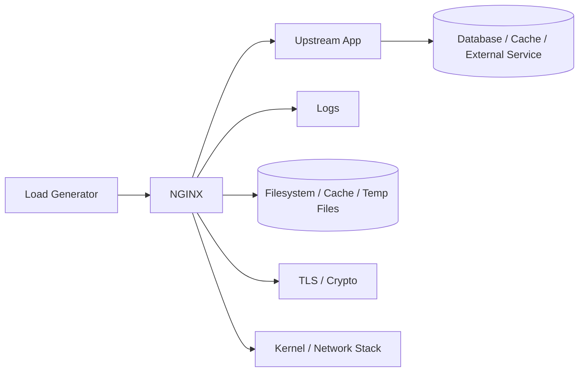
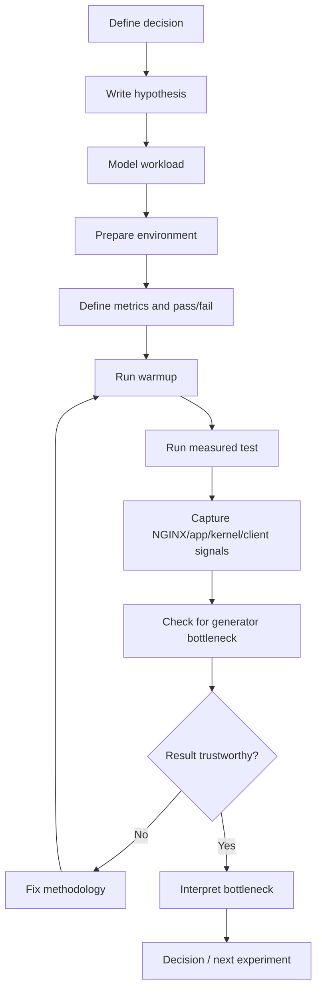

# Part 097 — Benchmarking Methodology: wrk, vegeta, k6, Flame Graph, and False Confidence

Benchmarking NGINX is not the act of running `wrk -t8 -c1000 -d60s https://example.com` and pasting the result into a document. That is only traffic generation.

A real benchmark answers a narrower question:

> Under a specific workload, on a specific deployment shape, with specific upstream behavior, what resource saturates first, what happens to latency before saturation, what failure mode appears after saturation, and what configuration or architectural decision follows from the evidence?

If a benchmark cannot drive a decision, it is a demo.

This part is about building benchmark discipline. The goal is not to worship numbers. The goal is to avoid being fooled by numbers.

NGINX can look impossibly fast in a synthetic benchmark because a trivial static response exercises a small part of the system. The same deployment can collapse when TLS, logging, upstream latency, disk-based cache, header size, client keepalive, request body buffering, and retry behavior are added. A production-grade benchmark must make those dimensions explicit.

## What this part gives you

By the end, you should be able to:

1. define a benchmark question that maps to a production decision;
2. build workload models instead of random request storms;
3. choose when to use `wrk`, `vegeta`, `k6`, `curl`, packet capture, or profiling;
4. read latency distribution without being tricked by averages;
5. separate client bottleneck, NGINX bottleneck, upstream bottleneck, kernel bottleneck, and network bottleneck;
6. run failure-mode benchmarks, not only happy-path throughput tests;
7. produce a benchmark report that another engineer can reproduce and challenge.

This part assumes you already understand the previous performance and observability material:

- Part 091: access/error logs;
- Part 092: correlation and trace context;
- Part 093: `stub_status` and metrics boundary;
- Part 095: CPU/memory/disk/network performance model;
- Part 096: kernel/OS tuning.

## Benchmarking is a controlled experiment

A useful benchmark has five components:

| Component | Question |
|---|---|
| Hypothesis | What do we believe will happen? |
| Workload | What traffic shape exercises the system? |
| Environment | Where is it running, and what is intentionally fixed? |
| Metrics | What signals decide pass/fail? |
| Decision | What will we change if the result confirms or rejects the hypothesis? |

Bad benchmark:

```txt
Run wrk against NGINX and see how many RPS we get.
```

Better benchmark:

```txt
Hypothesis:
  Enabling upstream keepalive will reduce backend connection churn and improve p95 latency
  for the /api/read route at 2,000 RPS with 20 ms upstream service time.

Workload:
  90% GET /api/read
  10% GET /api/profile
  64 concurrent clients per load generator
  15-minute steady-state run after 3-minute warmup

Metrics:
  client p50/p95/p99 latency
  NGINX request_time and upstream_response_time
  backend active connections
  backend CPU
  NGINX worker CPU
  502/504/499 rate

Decision:
  Roll out keepalive if p95 improves by >= 15%, error rate does not increase,
  and backend connection churn drops by >= 50%.
```

The benchmark is not just a number; it is a falsifiable operational claim.

## The benchmark target is not “NGINX”

When people say “benchmark NGINX”, they often mean one of several very different systems.



A result can be limited by:

- load generator CPU;
- load generator ephemeral ports;
- network bandwidth;
- NGINX worker CPU;
- TLS handshake cost;
- access log I/O;
- cache disk I/O;
- upstream connection pool;
- upstream CPU;
- backend database;
- kernel file descriptor limit;
- `worker_connections`;
- SYN backlog;
- conntrack;
- container CPU quota;
- DNS resolution;
- retry amplification.

A top-level number like “100k requests/sec” is meaningless until you know which of those constraints was active.

## Classify benchmark type first

There are at least seven useful benchmark categories.

| Type | Purpose | Example |
|---|---|---|
| Microbenchmark | Exercise one primitive | static file with/without `sendfile` |
| Component benchmark | Test one NGINX role | reverse proxy with fixed upstream delay |
| Integration benchmark | Test NGINX + backend | API gateway route set |
| Capacity benchmark | Find safe operating envelope | maximum RPS before SLO breach |
| Soak test | Find time-dependent degradation | 6-hour cache/temp/log pressure run |
| Spike test | Test sudden load increase | 10x traffic burst over 30 seconds |
| Failure benchmark | Test behavior under broken dependency | upstream timeout, disk full, cert reload failure |

Do not mix them casually.

A microbenchmark can justify a tuning change. It cannot prove production readiness.

A soak test can reveal memory/disk/log issues. It cannot determine precise peak RPS unless workload is controlled.

A failure benchmark can prove graceful degradation. It should not be used as a throughput comparison.

## The core benchmark loop

Use this loop for every meaningful benchmark.



The important step is `Result trustworthy?`. Most benchmark mistakes happen because the engineer trusts the first successful run.

## Benchmark invariant: never trust a single signal

For NGINX, correlate at least four perspectives:

1. **client-side result**: latency, throughput, errors as observed by the caller;
2. **NGINX logs**: `$request_time`, `$upstream_response_time`, `$upstream_status`, `$upstream_addr`, `$upstream_cache_status`;
3. **NGINX process/host metrics**: CPU, memory, FD, network, disk, accept queue;
4. **upstream metrics**: app latency, active connections, CPU, DB latency.

If client p99 latency increases but `$upstream_response_time` stays flat, the extra time is likely before upstream completion or on the client/network side.

If `$upstream_response_time` increases together with app p99, upstream is likely slow.

If `$request_time` increases while `$upstream_response_time` stays flat and response body is large, look at client download speed, buffering, send timeout, bandwidth, and logging.

If error rate increases only on the load generator while NGINX logs do not show corresponding requests, the generator is likely saturated or network limited.

## Build a workload model

A workload model describes traffic in dimensions that matter to NGINX.

### Request mix

Do not test only `/`.

Example:

```yaml
routes:
  - name: static_hashed_asset
    method: GET
    path: /assets/app.8f3a1c.js
    weight: 45
    expected_status: 200
    body_size: 180KB
    cache_policy: immutable

  - name: api_read
    method: GET
    path: /api/v1/cases/123
    weight: 35
    expected_status: 200
    upstream_service_time: 20ms
    cache_policy: no-store

  - name: api_write
    method: POST
    path: /api/v1/cases/123/actions/escalate
    weight: 5
    expected_status: 202
    request_body: 4KB
    retry_allowed: false

  - name: spa_fallback
    method: GET
    path: /case/123
    weight: 10
    expected_status: 200
    internal_redirect: /index.html

  - name: not_found
    method: GET
    path: /unknown
    weight: 5
    expected_status: 404
```

This matters because NGINX cost differs by route:

- static file with `sendfile` is cheap;
- proxied dynamic API depends on upstream;
- upload route consumes body buffers/temp disk;
- cache HIT avoids upstream;
- cache MISS may stampede upstream;
- WebSocket holds connection slots;
- gRPC uses HTTP/2 streams;
- TLS handshake load differs from keepalive load.

### Connection model

Requests per second is not enough. Capture connection behavior:

| Dimension | Why it matters |
|---|---|
| Client keepalive on/off | Affects accept rate, TLS handshakes, CPU, FD churn |
| HTTP/1.1 vs HTTP/2 | Affects connection count and multiplexing |
| TLS session reuse | Affects handshake CPU |
| Request rate per connection | Affects `stub_status` interpretation |
| Long-lived connections | Affects `worker_connections` and memory |
| Slow clients | Affect `$request_time`, `send_timeout`, and worker resources |

A benchmark using one connection model may not represent production at all.

### Body size model

For reverse proxy and cache benchmarks, define body sizes.

| Payload | NGINX risk |
|---|---|
| Small request/response | CPU, syscall, accept rate |
| Large response | bandwidth, sendfile, buffering, client speed |
| Large upload | body buffering, temp disk, backpressure |
| Streaming response | buffering off, long read timeout |
| Many headers | buffer size, request smuggling boundary |

### Time model

A realistic benchmark includes:

- warmup period;
- measured steady-state period;
- cooldown/cleanup;
- repeated runs;
- spike phase if relevant;
- failure injection window if relevant.

Example:

```txt
0-3 min     warmup
3-18 min    steady load at 2,000 RPS
18-23 min   spike to 4,000 RPS
23-28 min   return to 2,000 RPS
28-33 min   kill one upstream instance
33-45 min   observe recovery
```

This is more useful than a 10-second hero benchmark.

## Common tools and what they are good for

### `curl`

Use `curl` for correctness and debugging, not load.

Good for:

- checking headers;
- checking TLS;
- validating redirects;
- checking cache HIT/MISS;
- testing range requests;
- isolating one route;
- reproducing 502/504 behavior.

Examples:

```bash
curl -vkI https://app.example.com/
curl -sS -D - https://app.example.com/assets/app.js -o /dev/null
curl -sS -H 'X-Debug-Route: canary' https://app.example.com/api/health
curl -sS --http2 -D - https://app.example.com/api/health
```

Do not use `curl` loops as a serious benchmark.

### `wrk`

`wrk` is useful for high-throughput HTTP benchmarking from a single machine. Its official README describes it as capable of generating significant load on a single multi-core CPU, using a multithreaded design and scalable event notification systems such as epoll and kqueue.

Good for:

- simple high-RPS tests;
- static serving tests;
- reverse proxy throughput tests;
- quick comparison between config variants;
- Lua-scripted request generation.

Weaknesses:

- limited scenario modelling compared with k6;
- easy to overload the generator;
- not ideal for complex user journeys;
- results can be misleading if latency distribution and errors are ignored.

Basic example:

```bash
wrk -t8 -c512 -d5m --latency https://app.example.com/api/health
```

Interpretation discipline:

- `-t`: load generator threads;
- `-c`: open connections;
- `-d`: duration;
- `--latency`: latency distribution;
- RPS only matters if errors and latency are acceptable.

### Lua scripting with `wrk`

A minimal route-mix script:

```lua
-- routes.lua
math.randomseed(os.time())

local routes = {
  { path = "/assets/app.8f3a1c.js", weight = 45 },
  { path = "/api/v1/cases/123", weight = 35 },
  { path = "/case/123", weight = 10 },
  { path = "/unknown", weight = 10 },
}

local total = 0
for _, r in ipairs(routes) do
  total = total + r.weight
end

request = function()
  local x = math.random(total)
  local acc = 0
  for _, r in ipairs(routes) do
    acc = acc + r.weight
    if x <= acc then
      return wrk.format("GET", r.path)
    end
  end
end
```

Run:

```bash
wrk -t8 -c512 -d10m --latency -s routes.lua https://app.example.com
```

This is better than a single-path benchmark, but still not a full user-journey test.

### `vegeta`

`vegeta` is useful when you want fixed-rate attack style testing. It is often better than pure concurrency-based testing when you want to know how the system behaves at a given arrival rate.

Example target file:

```txt
GET https://app.example.com/api/v1/cases/123
GET https://app.example.com/assets/app.8f3a1c.js
POST https://app.example.com/api/v1/cases/123/actions/escalate
Content-Type: application/json
@payload.json
```

Example run:

```bash
vegeta attack -duration=10m -rate=2000/s -targets=targets.txt \
  | tee results.bin \
  | vegeta report

vegeta plot results.bin > plot.html
```

Use fixed-rate tests for capacity envelopes:

```txt
500 RPS  -> pass
1000 RPS -> pass
1500 RPS -> pass
2000 RPS -> p95 breach
2500 RPS -> 502/504 starts
```

The useful output is not only the maximum. It is the shape of degradation.

### `k6`

`k6` is useful for scripted scenarios, staged load, thresholds, and performance tests closer to product/user flows. Grafana k6 documents thresholds as pass/fail criteria over metrics such as `http_req_failed` and `http_req_duration`.

Example:

```javascript
import http from 'k6/http';
import { check, sleep } from 'k6';

export const options = {
  stages: [
    { duration: '3m', target: 200 },
    { duration: '10m', target: 200 },
    { duration: '3m', target: 400 },
    { duration: '5m', target: 400 },
    { duration: '2m', target: 0 },
  ],
  thresholds: {
    http_req_failed: ['rate<0.001'],
    http_req_duration: ['p(95)<250', 'p(99)<800'],
  },
};

export default function () {
  const res = http.get('https://app.example.com/api/v1/cases/123', {
    headers: {
      'X-Request-ID': `bench-${__VU}-${__ITER}`,
    },
  });

  check(res, {
    'status is 200': (r) => r.status === 200,
  });

  sleep(1);
}
```

Use `k6` when the benchmark needs scenario logic, ramping, thresholds, or team-readable scripts.

### Flame graphs and profiling

A flame graph is not a load test. It is a way to investigate where CPU time is going during load.

Use profiling when:

- CPU is saturated;
- latency increases with CPU;
- you need to know whether cost is TLS, gzip, logging, copy, kernel, app, or module code;
- a config change unexpectedly increases CPU.

For NGINX Open Source, profiling usually happens at OS/process level, for example with Linux `perf`, eBPF tools, or platform profilers.

Example workflow:

```bash
# Find worker PIDs
pgrep -af 'nginx: worker process'

# Record CPU profile during benchmark
sudo perf record -F 99 -p <worker_pid> -g -- sleep 60

# Inspect report
sudo perf report
```

Flame graphs are most useful when compared:

```txt
baseline config flame graph
vs
new TLS/compression/cache config flame graph
```

Do not start with flame graphs. Start with metrics and hypothesis. Use profiling once you know which resource is suspicious.

## Latency: averages lie first

Average latency is almost always the least useful number.

Example:

```txt
Request count: 1,000,000
999,000 requests: 20 ms
1,000 requests: 5,000 ms

Average roughly: 25 ms
p99.9: 5,000 ms
```

The average looks healthy; some users are waiting five seconds.

Track at least:

- p50;
- p90;
- p95;
- p99;
- p99.9 when volume is large enough;
- max only as a clue, not a sole metric;
- error rate;
- timeout rate;
- retry rate.

For NGINX, compare:

| Client metric | NGINX log variable | Interpretation |
|---|---|---|
| End-to-end latency | `$request_time` | Time from first byte read from client to log write after response sent |
| Upstream latency | `$upstream_response_time` | Time receiving response from upstream |
| Upstream connect | `$upstream_connect_time` | TCP/TLS connect to upstream |
| Upstream header | `$upstream_header_time` | Time to first upstream response header |
| Status | `$status`, `$upstream_status` | Edge status vs upstream status |

A basic benchmark log format:

```nginx
log_format bench escape=json
  '{'
    '"ts":"$time_iso8601",'
    '"request_id":"$request_id",'
    '"remote_addr":"$remote_addr",'
    '"host":"$host",'
    '"method":"$request_method",'
    '"uri":"$uri",'
    '"status":$status,'
    '"bytes_sent":$bytes_sent,'
    '"request_time":$request_time,'
    '"upstream_addr":"$upstream_addr",'
    '"upstream_status":"$upstream_status",'
    '"upstream_connect_time":"$upstream_connect_time",'
    '"upstream_header_time":"$upstream_header_time",'
    '"upstream_response_time":"$upstream_response_time",'
    '"cache_status":"$upstream_cache_status",'
    '"http2":"$http2",'
    '"http3":"$http3"'
  '}';
```

The client tells you what users see. NGINX tells you where edge time went.

## Coordinated omission

Coordinated omission happens when the load generator waits for a response before sending the next request, so the test sends fewer requests during slow periods. That can hide latency spikes.

Bad mental model:

```txt
The system slowed down, but the test also sent less traffic,
so latency did not look as bad as production would.
```

Fixed-rate tools and careful workload design help expose this.

A useful capacity test asks:

> At exactly 2,000 requests/sec arrival rate, what happens to latency and errors?

Not merely:

> With 512 clients looping as fast as possible, what number appears?

Concurrency-driven tests are not wrong, but you must understand what they measure.

## Little’s Law for sanity checking

Little’s Law:

```txt
L = λ × W
```

Where:

- `L` = average number of requests/connections in the system;
- `λ` = arrival rate;
- `W` = average time in system.

Example:

```txt
arrival rate = 2,000 requests/sec
average latency = 100 ms = 0.1 sec
expected in-flight requests = 2,000 × 0.1 = 200
```

If your benchmark claims 2,000 RPS with 10 concurrent clients and 100 ms latency, the math does not fit.

Use this to catch impossible benchmark interpretations.

## Benchmarking static files

Static file benchmark variables:

- file size distribution;
- hot vs cold OS page cache;
- `sendfile` on/off;
- gzip dynamic vs precompressed;
- TLS on/off;
- access log on/off;
- disk type;
- number of files;
- cache headers;
- client download speed.

Example static benchmark matrix:

| Case | Purpose |
|---|---|
| hot 10 KB file over HTTP | syscall/connection baseline |
| hot 200 KB file over HTTPS | TLS + sendfile throughput |
| cold many files | disk metadata/page cache behavior |
| gzip dynamic | CPU compression cost |
| gzip_static | precompressed asset behavior |
| slow client | connection retention and send timeout |

Do not compare `sendfile` performance using a file that is fully cached in the OS page cache and then generalize to cold disk behavior.

## Benchmarking reverse proxy

Reverse proxy benchmark variables:

- upstream service time;
- upstream concurrency limit;
- upstream keepalive on/off;
- `proxy_buffering` on/off;
- response body size;
- timeout values;
- retry policy;
- upstream failure mode;
- header size;
- request body size.

A controlled upstream stub is useful.

Example Node.js upstream stub:

```javascript
import http from 'http';

const server = http.createServer((req, res) => {
  const url = new URL(req.url, 'http://localhost');
  const delay = Number(url.searchParams.get('delay') || '20');
  const size = Number(url.searchParams.get('size') || '1024');

  setTimeout(() => {
    res.writeHead(200, {
      'Content-Type': 'application/json',
      'Content-Length': size,
    });
    res.end(JSON.stringify({ ok: true }).padEnd(size, ' '));
  }, delay);
});

server.listen(8080);
```

This lets you isolate NGINX behavior from app complexity.

Example NGINX config variant:

```nginx
upstream app_backend {
    zone app_backend 64k;
    server 127.0.0.1:8080 max_fails=2 fail_timeout=10s;
    keepalive 64;
}

server {
    listen 8081;

    access_log /var/log/nginx/bench.access.log bench;
    error_log  /var/log/nginx/bench.error.log warn;

    location /api/ {
        proxy_http_version 1.1;
        proxy_set_header Connection "";
        proxy_set_header Host $host;
        proxy_set_header X-Request-ID $request_id;

        proxy_connect_timeout 1s;
        proxy_send_timeout 5s;
        proxy_read_timeout 5s;

        proxy_pass http://app_backend;
    }
}
```

Run with and without upstream keepalive. Compare:

- backend active TCP connections;
- `$upstream_connect_time`;
- p95/p99 latency;
- worker CPU;
- errors under backend restart.

## Benchmarking cache

Cache benchmarks must separate:

- cold cache;
- warm cache;
- mixed HIT/MISS;
- revalidation;
- stale serve;
- cache lock behavior;
- purge/invalidation behavior;
- disk pressure.

Example test phases:

```txt
Phase 1: cold fill
  Request 100k unique cacheable URLs.

Phase 2: hot read
  Request same 100k URLs with Zipf-like popularity.

Phase 3: stampede
  Expire one hot key and send 5k concurrent requests.

Phase 4: origin failure
  Stop origin and verify stale behavior.

Phase 5: disk pressure
  Push cache beyond max_size and observe manager cleanup.
```

Minimal cache log fields:

```nginx
log_format cachebench escape=json
  '{'
    '"ts":"$time_iso8601",'
    '"uri":"$uri",'
    '"status":$status,'
    '"cache":"$upstream_cache_status",'
    '"request_time":$request_time,'
    '"upstream_response_time":"$upstream_response_time",'
    '"bytes_sent":$bytes_sent'
  '}';
```

Cache benchmark pass/fail example:

```yaml
cache_benchmark_goal:
  hot_hit_ratio: ">= 0.95"
  p95_hot_hit_latency: "< 30ms"
  stampede_origin_requests_per_key: "<= 1 during lock window"
  origin_down_behavior: "serve STALE for cacheable read routes"
  private_route_cache_status: "always BYPASS or empty"
```

## Benchmarking TLS

TLS benchmark variables:

- TLS version;
- cipher suite;
- RSA vs ECDSA certificate;
- handshake vs keepalive;
- session reuse;
- OCSP stapling;
- HTTP/2 ALPN;
- HTTP/3/QUIC separately;
- client CPU.

Do not compare TLS configs with persistent keepalive only. Handshake cost may disappear.

A basic separation:

| Test | Measures |
|---|---|
| New connection each request | handshake-heavy path |
| Keepalive requests | steady data path |
| Session resumption | middle ground |
| HTTP/2 multiplexing | stream concurrency path |
| Large response | encryption throughput |

Use `openssl s_time` only for narrow TLS experiments. Use workload tools for application-level impact.

## Benchmarking upload and request bodies

Upload path variables:

- body size;
- `client_max_body_size`;
- `client_body_buffer_size`;
- temp directory location;
- `proxy_request_buffering`;
- upstream read speed;
- client upload speed;
- disk free space;
- retry policy.

Example failure benchmark:

```txt
Hypothesis:
  Large uploads will not consume root filesystem because client_body_temp_path
  is isolated on a monitored volume with capacity guard.

Test:
  100 concurrent 500 MB uploads with upstream slowed to 5 MB/s.

Observe:
  temp volume usage
  NGINX worker memory
  413/499/502/504 rate
  client upload latency
  upstream active requests
```

The important result may be “we fail with 413 early” or “we shed safely”, not “we maximize throughput”.

## Benchmarking WebSocket/SSE

Long-lived connection tests should track:

- active connections;
- memory per connection;
- worker connection limit;
- heartbeat interval;
- idle timeout;
- disconnect behavior;
- deploy/reload behavior;
- backend connection count.

A WebSocket/SSE benchmark is often a capacity test for connections, not request rate.

Example target:

```yaml
websocket_capacity:
  target_active_connections: 100000
  message_rate_per_connection: 0.01/sec
  heartbeat_interval: 30s
  reconnect_spike: 20% clients reconnect within 60s
```

This benchmark is meaningless if you only run HTTP GET loops.

## Benchmarking gRPC

gRPC over NGINX adds HTTP/2 and stream semantics.

Track:

- unary vs streaming RPC;
- concurrent streams per connection;
- max message size;
- `grpc_read_timeout`;
- upstream HTTP/2 capability;
- gRPC status vs HTTP status;
- retry at client vs proxy;
- flow control behavior.

Do not judge gRPC readiness from a single unary health check.

## Client-side bottleneck detection

The load generator can be the bottleneck.

Check on generator:

```bash
mpstat -P ALL 1
sar -n DEV 1
sar -n TCP,ETCP 1
ss -s
ulimit -n
cat /proc/sys/net/ipv4/ip_local_port_range
```

Symptoms of generator bottleneck:

- generator CPU is saturated;
- generator network egress maxed;
- many connection errors before reaching NGINX;
- latency distribution changes when adding another generator;
- NGINX CPU is low while client reports high latency;
- NGINX logs fewer requests than generator claims attempted.

A benchmark should report generator health.

## NGINX-side bottleneck detection

During benchmark, capture:

```bash
# Process and CPU
pidstat -p $(pgrep -d, nginx) 1
mpstat -P ALL 1

# Connections and sockets
ss -s
ss -tan state established '( sport = :443 )' | wc -l

# File descriptors
ls /proc/$(pgrep -n nginx)/fd | wc -l

# Disk I/O
iostat -xz 1

# Network
sar -n DEV,TCP,ETCP 1

# NGINX status
curl -s http://127.0.0.1/nginx_status
```

Interpretation examples:

| Symptom | Likely area |
|---|---|
| high worker CPU, low upstream time | TLS/gzip/logging/static processing |
| high iowait | cache/temp/log disk |
| active connections near limit | `worker_connections`, long-lived clients, slow clients |
| accepts != handled | connection/resource limit |
| high `$upstream_connect_time` | backend connect pool, network, DNS, backend accept queue |
| high `$upstream_header_time` | backend app latency |
| high `$request_time` but low upstream time | client slow download, buffering, large response |

## Upstream bottleneck detection

Do not blame NGINX until upstream evidence is captured.

For backend app:

- active requests;
- thread pool usage;
- event loop lag;
- GC pauses;
- DB connection pool saturation;
- error rate;
- p95/p99 handler time;
- inbound connection count;
- response size distribution.

For database/cache:

- connection pool wait;
- query latency;
- lock wait;
- cache miss rate;
- CPU/I/O saturation.

NGINX can amplify upstream weakness through retry, connection churn, buffering, or cache stampede. But the benchmark must prove where time is spent.

## Reproducible benchmark environment

Every serious benchmark should record:

```yaml
environment:
  nginx_version: "1.x.y"
  build_flags: "nginx -V output"
  os: "Ubuntu 24.04 / kernel x.y.z"
  instance_type: "..."
  cpu: "..."
  memory: "..."
  disk: "..."
  network: "..."
  container_limits: "cpu/memory/pids"
  config_commit: "git sha"
  app_commit: "git sha"
  benchmark_tool: "wrk/k6/vegeta version"
  date: "2026-07-07"
```

Capture NGINX build/config:

```bash
nginx -V 2>&1 | tee nginx-version.txt
nginx -T 2>&1 | tee nginx-config.txt
```

Capture kernel limits:

```bash
ulimit -n
sysctl net.core.somaxconn net.ipv4.tcp_max_syn_backlog net.ipv4.ip_local_port_range
```

A benchmark result without environment metadata is not reproducible.

## Warmup and cold-start effects

Warmup matters because production systems have caches and pools.

Warmup affects:

- OS page cache;
- NGINX open file cache;
- proxy cache;
- upstream JIT/runtime warmup;
- JVM JIT;
- DB buffer cache;
- connection pools;
- TLS session cache;
- DNS cache;
- branch prediction and CPU frequency scaling.

Separate cold-start and warm-state results.

Example report:

```txt
Cold cache:
  p95 = 320 ms
  origin RPS = 2,000
  cache HIT = 0%

Warm cache:
  p95 = 28 ms
  origin RPS = 150
  cache HIT = 92%
```

Both are true. They answer different questions.

## Repeated runs and confidence

Run each benchmark multiple times.

At minimum:

```txt
baseline run 1
baseline run 2
baseline run 3
candidate run 1
candidate run 2
candidate run 3
```

Compare distributions, not just one maximum.

If results vary widely, your environment is noisy or uncontrolled. Investigate before drawing conclusions.

Possible noise sources:

- shared cloud neighbors;
- CPU frequency scaling;
- background cron/logrotate;
- GC cycle timing;
- cache eviction;
- autoscaling events;
- network jitter;
- noisy load generator;
- container CPU throttling.

## Error budget benchmark criteria

A production benchmark should have pass/fail criteria.

Example:

```yaml
slo_test:
  duration: 30m
  load: 2000_rps
  route_mix: production_read_heavy
  pass:
    availability: ">= 99.95% successful responses"
    p95_latency: "<= 250ms"
    p99_latency: "<= 800ms"
    nginx_worker_cpu: "<= 70% sustained"
    upstream_cpu: "<= 75% sustained"
    cache_disk_free: ">= 20%"
    502_rate: "<= 0.01%"
    504_rate: "<= 0.01%"
    499_rate: "investigate if > baseline + 0.05%"
```

Do not define success after seeing the result.

## Benchmarking config changes

When comparing two NGINX configs:

1. change one major variable at a time;
2. keep workload identical;
3. keep environment identical;
4. run baseline and candidate close together;
5. capture config diff;
6. capture repeated runs;
7. verify correctness, not only performance.

Example config experiment:

```txt
Experiment: enable proxy_buffering for API read route

Expected:
  Lower upstream connection retention under slow clients.

Risk:
  Higher memory/disk temp usage.

Measure:
  p95 request_time
  p95 upstream_response_time
  temp file usage
  backend active connections
  NGINX disk I/O
  499 rate
```

A performance improvement that breaks streaming correctness is not an improvement.

## Failure-mode benchmarks

Do not only benchmark healthy systems.

Failure scenarios for NGINX:

| Scenario | What to observe |
|---|---|
| upstream process killed | 502/504, retry behavior, recovery time |
| upstream slow response | timeout, queue growth, p99 |
| upstream accepts TCP but hangs | read timeout, connection retention |
| DNS resolver unavailable | dynamic upstream failure behavior |
| cache disk full | MISS/HIT behavior, error log, temp file behavior |
| log disk slow/full | worker blocking risk, error log |
| certificate file invalid | reload failure and rollback |
| config invalid | `nginx -t` and deployment gate |
| one NGINX worker killed | master respawn behavior |
| backend returns malformed headers | 502 behavior |
| client disconnects | 499 and upstream cancellation behavior |

Example failure benchmark schedule:

```txt
00:00 start benchmark at 70% target capacity
05:00 kill one upstream instance
10:00 restore upstream
15:00 inject 2s upstream delay on 10% of requests
20:00 stop origin cache dependency
25:00 stop benchmark
```

Success is not “no errors”. Success is bounded, understood, and recoverable failure.

## False confidence patterns

### Pattern 1: Testing only `/health`

`/health` is usually cheap and not representative.

Better:

- include heavy read route;
- include write route;
- include static assets;
- include error route;
- include cacheable and non-cacheable route;
- include long-tail response sizes.

### Pattern 2: Ignoring 499

`499` means client closed the connection before NGINX finished the response. In benchmarks, high 499 can mean client timeout is too aggressive, generator is broken, network is overloaded, or users would have abandoned.

Do not hide 499 from benchmark reports.

### Pattern 3: Measuring only NGINX and not upstream

If upstream is saturated, NGINX will look slow. That does not mean the proxy config is wrong.

### Pattern 4: Comparing HTTP to HTTPS

TLS changes CPU and handshake behavior. Compare like with like.

### Pattern 5: Running from localhost only

Localhost removes network behavior and may exaggerate performance.

Useful for microbenchmarks. Dangerous for capacity claims.

### Pattern 6: Not checking the load generator

A saturated generator can make the server look better or worse depending on failure mode.

### Pattern 7: Trusting maximum RPS

The maximum RPS before total failure is less useful than safe RPS under SLO.

### Pattern 8: Ignoring reload/deploy behavior

A config that benchmarks well but fails safe reload/rollback is not production-ready.

### Pattern 9: Not testing cold cache

Warm cache hides origin pressure and fill behavior.

### Pattern 10: Benchmarking without logs

If production logs are enabled, benchmark with realistic logging. Logging has cost.

## A complete benchmark report template

Use this structure.

```md
# Benchmark Report: <name>

## Decision
What decision this benchmark supports.

## Hypothesis
What we expected.

## Environment
NGINX version, build flags, instance type, OS, kernel, limits, topology.

## Config
Config commit, relevant snippets, diff from baseline.

## Workload
Routes, weights, methods, body sizes, connection model, TLS/HTTP version.

## Tools
wrk/k6/vegeta versions, generator host shape, generator health.

## Method
Warmup, duration, repetitions, failure injection, sampling.

## Results
Latency distribution, throughput, errors, NGINX metrics, upstream metrics, host metrics.

## Bottleneck Analysis
What saturated first and why.

## Correctness Checks
Headers, cache policy, auth, retry safety, status codes.

## Decision
Ship / reject / run next experiment.

## Risks
What this benchmark did not cover.

## Raw Artifacts
Logs, command outputs, dashboard links, config snapshots.
```

The most important section is “what this benchmark did not cover”. Good engineers write the boundary of evidence.

## Example benchmark: upstream keepalive

### Hypothesis

Upstream keepalive reduces `$upstream_connect_time`, backend connection churn, and p95 latency for read-heavy API traffic.

### Baseline config

```nginx
upstream app_backend {
    server 10.0.10.11:8080;
    server 10.0.10.12:8080;
}

location /api/ {
    proxy_pass http://app_backend;
}
```

### Candidate config

```nginx
upstream app_backend {
    zone app_backend 64k;
    server 10.0.10.11:8080;
    server 10.0.10.12:8080;
    keepalive 128;
}

location /api/ {
    proxy_http_version 1.1;
    proxy_set_header Connection "";
    proxy_pass http://app_backend;
}
```

### Workload

```yaml
load:
  duration: 20m
  warmup: 3m
  rate: 2000_rps
  routes:
    - GET /api/v1/cases/123: 80
    - GET /api/v1/cases/123/history: 15
    - POST /api/v1/cases/123/actions/viewed: 5
  body_size:
    response_p50: 4KB
    response_p95: 50KB
```

### Metrics

```yaml
client:
  - p50/p95/p99 latency
  - error rate
nginx:
  - request_time
  - upstream_connect_time
  - upstream_response_time
  - upstream_status
backend:
  - active TCP connections
  - CPU
  - request latency
host:
  - NGINX worker CPU
  - network
  - FD count
```

### Expected interpretation

If keepalive works:

- `$upstream_connect_time` should drop;
- backend connection churn should drop;
- p95 may improve if connection setup was material;
- total RPS may not change if backend handler time dominates.

If p95 does not improve but connection churn drops, the change can still be valuable operationally.

## Example benchmark: cache lock

### Hypothesis

`proxy_cache_lock on` prevents hot-key origin stampede when a cached item expires.

### Test

```bash
# Warm key
curl -sS https://edge.example.com/api/catalog/hot-key > /dev/null

# Wait until close to expiry or force cache namespace bump

# Fire concurrent requests
wrk -t8 -c2000 -d30s --latency https://edge.example.com/api/catalog/hot-key
```

### Observe

- origin request count for hot key;
- `$upstream_cache_status` values;
- p95/p99 client latency;
- NGINX error log;
- cache lock timeout behavior.

### Expected

Without lock:

```txt
Many MISS requests hit origin simultaneously.
```

With lock:

```txt
One request fills cache; others wait, use stale, or pass depending on config.
```

## Example benchmark: overload shedding

### Hypothesis

`limit_req` protects upstream from overload and causes explicit 429 responses before backend latency collapses.

### Config

```nginx
limit_req_zone $binary_remote_addr zone=api_ip:20m rate=20r/s;

location /api/ {
    limit_req zone=api_ip burst=40 nodelay;
    limit_req_status 429;
    proxy_pass http://app_backend;
}
```

### Test

```bash
vegeta attack -duration=5m -rate=5000/s -targets=api-targets.txt \
  | tee overload.bin \
  | vegeta report
```

### Pass criteria

```yaml
pass:
  upstream_cpu: "does not exceed 85% sustained"
  upstream_p99: "does not exceed pre-limit collapse threshold"
  edge_429: "expected and visible"
  edge_502_504: "near zero"
```

The benchmark succeeds even if many requests are rejected, because the decision is about preserving service stability.

## Benchmark governance

In mature teams, benchmarks are treated like engineering artifacts.

Recommended governance:

- benchmark scripts live in repository;
- route mixes are reviewed;
- pass/fail thresholds are explicit;
- configs are versioned;
- raw results are stored;
- dashboards are linked;
- benchmark environment is reproducible;
- benchmark is run before risky edge changes;
- incident learnings update scenarios.

A benchmark that cannot be rerun is an anecdote.

## Checklist before trusting a benchmark

Use this checklist before using a result in an architecture decision.

```txt
[ ] Did we define the decision before running the test?
[ ] Did we define pass/fail criteria before seeing the result?
[ ] Is the route mix representative of the decision?
[ ] Are body sizes realistic?
[ ] Is TLS/HTTP version realistic?
[ ] Is logging enabled as production would be?
[ ] Is the load generator healthy?
[ ] Did we capture NGINX logs/metrics?
[ ] Did we capture upstream metrics?
[ ] Did we capture host/kernel metrics?
[ ] Did we run warmup separately from measured duration?
[ ] Did we repeat the test?
[ ] Did we test failure behavior?
[ ] Did we explain what the benchmark does not cover?
[ ] Can another engineer reproduce it from the report?
```

## Key mental model

Benchmarking is not about finding the biggest number. It is about finding the boundary between safe operation and uncontrolled degradation.

For NGINX, the useful benchmark result usually sounds like this:

```txt
At 2,000 RPS with production-like route mix and TLS enabled,
this edge tier keeps p95 below 250 ms and p99 below 800 ms,
with worker CPU below 70%, upstream CPU below 75%, no retry amplification,
and safe behavior when one upstream instance fails.

At 2,500 RPS, p99 breaches before CPU saturates because upstream queue time rises.
The next bottleneck is backend concurrency, not NGINX worker capacity.
```

That is an engineering conclusion. It tells you what to do next.

## Rujukan resmi dan bacaan lanjut

- NGINX logging and timing variables: https://docs.nginx.com/nginx/admin-guide/monitoring/logging/
- NGINX upstream timing variables: https://nginx.org/en/docs/http/ngx_http_upstream_module.html
- NGINX `stub_status`: https://nginx.org/en/docs/http/ngx_http_stub_status_module.html
- wrk official repository: https://github.com/wg/wrk
- Grafana k6 thresholds documentation: https://grafana.com/docs/k6/latest/using-k6/thresholds/
- Brendan Gregg flame graphs: https://www.brendangregg.com/flamegraphs.html
