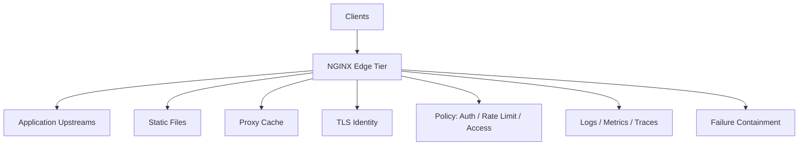

# Part 098 — Capacity Planning and SLO Design for Edge Tier

Capacity planning for NGINX is not “how many requests per second can one box handle?”

That question is too flat. It hides the actual engineering problem:

> How much traffic can this edge tier safely serve while preserving the user-facing contract, protecting upstream dependencies, surviving expected failures, and leaving enough headroom for deploys, spikes, cache misses, certificate rotation, and partial outage?

A capacity number without an SLO is just trivia.

A strong capacity plan connects:

- user-facing reliability target;
- route-specific latency budget;
- error budget;
- workload shape;
- NGINX resource envelope;
- upstream resource envelope;
- failure-mode behavior;
- scaling and rollback rules.

This part gives you the mental model and practical method for designing that plan.

## What this part gives you

By the end, you should be able to:

1. define SLOs for an NGINX edge tier without pretending all routes are equal;
2. convert latency/error targets into capacity envelopes;
3. identify saturation points before they become incidents;
4. decide headroom intentionally instead of guessing;
5. model cache HIT/MISS capacity separately;
6. design overload and load-shedding behavior;
7. define autoscaling signals that do not oscillate or scale on the wrong metric;
8. write a capacity plan that survives architecture review.

## The edge tier has multiple jobs

NGINX often sits where traffic first enters a system. That means it has several jobs at once.



Each job consumes capacity differently.

| Job | Main capacity dimension |
|---|---|
| TLS termination | CPU, handshake rate, session cache |
| Static file serving | network, page cache, disk metadata, sendfile |
| Reverse proxy | upstream latency, connection pool, buffering |
| Load balancing | upstream availability, retries, queueing |
| Cache | disk, memory metadata, HIT/MISS ratio, origin fill |
| Rate limiting | shared memory zone, key cardinality, policy cost |
| Logging | disk/network I/O, JSON serialization cost |
| Long-lived connections | worker connections, memory, FD |
| Uploads | temp disk, request body buffering, upstream speed |

A capacity plan that only says “RPS” ignores most of the edge tier.

## Define service classes first

Do not create one SLO for every request through NGINX. Split traffic into service classes.

Example:

| Service class | Examples | User expectation | Primary risk |
|---|---|---|---|
| Static immutable assets | JS, CSS, images | very fast, cacheable | bandwidth/cache/storage |
| HTML shell | SPA `index.html` | fast, fresh enough | stale deploy, bad redirect |
| Public read API | catalog/search/read endpoints | low latency | upstream saturation/cache miss |
| Authenticated read API | case/profile/user data | correctness/privacy | auth/cache leakage |
| Write API | create/update/escalate | correctness over speed | duplicate write/retry |
| Streaming | SSE/WebSocket/gRPC stream | stable connection | connection capacity/timeouts |
| Upload/download | files, reports, media | throughput and reliability | temp disk/bandwidth |
| Admin/internal | dashboards, metrics | protected availability | access control bypass |

Each service class gets a different SLO and capacity model.

## SLI, SLO, and error budget in edge terms

An SLI is the measurement. An SLO is the target. Error budget is the allowed failure.

For NGINX, good SLIs include:

- successful response rate by route/service class;
- p95/p99 `$request_time` by route;
- upstream failure rate by route;
- 502/503/504 rate;
- 499 rate as separate client-abandonment signal;
- cache HIT ratio for cacheable classes;
- stale-serve rate for degradation classes;
- TLS handshake error rate;
- active connections vs capacity;
- overload rejection rate (`429`, `503`) as explicit policy.

Example SLO:

```yaml
service_class: public_read_api
window: 30d
slo:
  availability: 99.95%
  latency:
    p95_request_time: <= 250ms
    p99_request_time: <= 800ms
  correctness:
    5xx_rate_excluding_policy_429: <= 0.05%
  notes:
    429 from documented rate limit is excluded from availability but tracked separately.
```

Do not hide policy rejections. A 429 may be intentional, but users still experience it.

## Do not treat all 5xx equally

At the NGINX edge, status codes have different operational meaning.

| Status | Common meaning | Capacity interpretation |
|---|---|---|
| 500 | generated by upstream/app or internal error | app or gateway bug |
| 502 | bad gateway, upstream protocol/connect failure | upstream health/connect/proxy boundary |
| 503 | service unavailable, overload/manual block | capacity or policy event |
| 504 | upstream timeout | upstream slow or timeout too short/long |
| 429 | rate limited | explicit load shedding/abuse control |
| 499 | client closed request | user impatience, client timeout, network, or benchmark artifact |

A capacity plan should decide which statuses count against which objective.

Example:

```yaml
availability_sli:
  good:
    - 2xx
    - 3xx_expected
    - 404_expected_for_public_unknown_routes
  bad:
    - 500
    - 502
    - 503_unplanned
    - 504
  separately_tracked:
    - 429_policy
    - 499_client_closed
```

Be careful: excluding 429 from availability does not mean unlimited 429 is acceptable. It means the SLO must track it separately.

## Latency budget decomposition

A user-facing latency SLO should be decomposed.


For NGINX logs:

| Budget component | Signal |
|---|---|
| Total edge time | `$request_time` |
| Upstream connect | `$upstream_connect_time` |
| Upstream first byte | `$upstream_header_time` |
| Upstream full response | `$upstream_response_time` |
| Cache status | `$upstream_cache_status` |
| Edge status | `$status` |
| Upstream status | `$upstream_status` |

Example budget for public read API:

```yaml
public_read_api_latency_budget:
  p95_total_request_time: 250ms
  components:
    edge_routing_policy: 5ms
    upstream_connect: 10ms
    upstream_processing_to_header: 150ms
    response_transfer: 50ms
    buffer: 35ms
```

This is not exact physics; it is a contract for investigation.

If p95 total becomes 500 ms and upstream response is 450 ms, you know where to go.

If upstream response is 50 ms but request time is 500 ms, look at client transfer, buffering, slow clients, large bodies, or logging.

## Capacity envelope, not capacity point

A single maximum RPS number is fragile. Use an envelope.

Example:

```yaml
edge_capacity_envelope:
  workload: public_read_api_v3
  instance_shape: cX.large_equivalent
  nginx_replicas: 4
  safe_operating_region:
    rps: 0-8000
    p95: <= 250ms
    p99: <= 800ms
    edge_cpu: <= 65%
    upstream_cpu: <= 70%
    5xx: <= 0.05%
  warning_region:
    rps: 8000-10000
    p95: <= 350ms
    p99: <= 1200ms
    edge_cpu: 65-80%
  unsafe_region:
    rps: "> 10000"
    symptoms:
      - p99 rises non-linearly
      - upstream queue grows
      - retry amplification begins
```

Capacity planning is about the shape of degradation, not only the cliff.

## Saturation point vs SLO breach point

The system often breaches SLO before hardware saturates.

Example:

```txt
Edge CPU saturation: 90% at 12,000 RPS
SLO p95 breach: 8,500 RPS
Upstream queue begins: 8,800 RPS
502/504 appear: 10,500 RPS
```

Your capacity is not 12,000 RPS. Your safe capacity is below the first SLO breach, with headroom.

Production capacity should be based on:

```txt
safe_capacity = min(SLO_breach_threshold, saturation_threshold, failure_recovery_threshold) × safety_factor
```

The safety factor is where headroom enters.

## Headroom is not waste

Headroom covers uncertainty.

Reasons you need headroom:

- traffic spikes;
- cache miss storms;
- deploy/reload overlap;
- one node unavailable;
- TLS handshake burst;
- backend partial outage;
- log pipeline slowdown;
- noisy neighbor/cloud variance;
- certificate renewal/reload;
- long-lived connection accumulation;
- retry amplification;
- sudden bot/abuse traffic;
- failover between AZ/regions.

Example headroom policy:

```yaml
headroom_policy:
  normal_target_utilization:
    nginx_worker_cpu: <= 60%
    network_egress: <= 60%
    cache_disk: <= 70%
    file_descriptors: <= 50%
    worker_connections: <= 50%
  during_single_node_loss:
    nginx_worker_cpu: <= 75%
    p95_latency: within_slo
    5xx_rate: within_slo
```

A system running at 85% CPU in normal state may look efficient until one instance disappears.

## N+1 and failure-aware capacity

If you run `N` edge nodes, the tier should often survive losing one node.

```txt
required_per_node_capacity = peak_load / (N - 1)
```

Example:

```txt
peak load = 8,000 RPS
nodes = 4
survive one node loss = 8,000 / 3 = 2,667 RPS per remaining node
```

If each node can safely serve only 2,200 RPS under SLO, four nodes are not enough for N+1 resilience.

You either need:

- more nodes;
- larger nodes;
- lower peak load through cache/CDN;
- stricter load shedding;
- different SLO;
- upstream scaling;
- traffic segmentation.

## Route-level capacity

A route that consumes 20x more upstream time should not be averaged with cheap routes.

Example route capacity table:

| Route class | Weight | p95 upstream | Cacheable | Capacity risk |
|---|---:|---:|---|---|
| static asset | 45% | none | yes | bandwidth/cache |
| public read | 35% | 80 ms | maybe | upstream CPU |
| authenticated read | 10% | 120 ms | dangerous | auth/upstream |
| write | 5% | 200 ms | no | duplicate write/db |
| report download | 5% | 500 ms | private | bandwidth/temp |

If report downloads spike from 5% to 30%, the old capacity envelope no longer applies.

Capacity must be tied to workload mix.

## Cache-aware capacity planning

Cache changes capacity non-linearly.

Let:

```txt
client_rps = 10,000
cache_hit_ratio = 90%
origin_rps = client_rps × (1 - hit_ratio)
origin_rps = 10,000 × 0.10 = 1,000
```

If HIT ratio drops to 70%:

```txt
origin_rps = 10,000 × 0.30 = 3,000
```

A 20 percentage-point HIT-ratio drop triples origin load.

This is why cache capacity planning needs separate SLOs:

```yaml
cache_slo:
  static_assets:
    hit_ratio: ">= 98%"
    p95_hit_latency: "<= 30ms"
  public_catalog:
    hit_ratio: ">= 85%"
    stale_on_origin_error: true
  authenticated_api:
    shared_cache_allowed: false
```

Capacity plan for cache must include:

- HIT/MISS ratio;
- MISS origin capacity;
- cold cache fill behavior;
- hot key expiration behavior;
- cache lock behavior;
- disk size/inode capacity;
- purge/invalidation storm;
- stale behavior during origin outage.

## TLS-aware capacity planning

TLS capacity has two dimensions:

1. handshake rate;
2. encrypted data throughput.

Keepalive-heavy traffic may have low handshake rate. Bot traffic or short-lived clients may have high handshake rate.

Track:

- new TLS connections/sec;
- session reuse ratio;
- handshake errors;
- CPU per worker;
- HTTP/2 multiplexing effect;
- certificate type;
- ECDSA/RSA mix;
- OCSP stapling behavior;
- HTTP/3/QUIC separately.

Capacity example:

```yaml
tls_capacity:
  normal:
    requests_per_connection_p50: 20
    tls_handshakes_per_second: 500
  spike:
    requests_per_connection_p50: 2
    tls_handshakes_per_second: 5000
  risk:
    - CPU rises even if RPS is flat
    - accept queue grows
    - handshake latency increases
```

Do not capacity-plan TLS using only warm keepalive traffic.

## Long-lived connection capacity

For WebSocket/SSE/gRPC streaming, capacity is often active connections, not RPS.

Capacity formula:

```txt
connection_capacity_per_node = min(worker_connections_limit, fd_limit, memory_limit, upstream_connection_limit, backend_stream_limit)
```

But `worker_connections` is not the whole story. Each proxied connection may consume:

- client socket FD;
- upstream socket FD;
- memory buffers;
- TLS state;
- application backend resources;
- heartbeat traffic;
- log/metric cardinality.

Example long-lived service SLO:

```yaml
sse_slo:
  active_connections: 50000_per_region
  successful_connection_duration_p95: ">= 30m"
  unexpected_disconnect_rate: "<= 0.1% per 5m"
  reconnect_spike_survival: "20% clients reconnect within 60s"
  p95_event_delivery_lag: "<= 2s"
```

A benchmark with high RPS and short requests does not prove this.

## Upload/download capacity

Uploads consume a different envelope:

- request body buffers;
- temp disk;
- upstream bandwidth;
- upstream read speed;
- client upload time;
- timeout settings;
- AV/scanning pipeline if present;
- object storage latency.

Example capacity model:

```yaml
upload_capacity:
  max_body_size: 500MB
  concurrent_uploads_safe: 200
  average_upload_size: 50MB
  p95_upload_duration: 60s
  temp_disk_required:
    formula: concurrent_uploads × p95_body_size × buffering_factor
    example: 200 × 100MB × 1.2 = 24GB
  safety:
    temp_disk_alert: 70%
    temp_disk_shed: 85%
```

If `proxy_request_buffering on`, NGINX may store request bodies before sending to upstream. That must be planned.

## Logging capacity

Logs are not free.

Log volume estimate:

```txt
log_bytes_per_request = 900 bytes
rps = 10,000
log_write_rate = 900 × 10,000 = 9,000,000 bytes/sec ≈ 9 MB/s
per_day = 9 MB/s × 86,400 ≈ 777 GB/day
```

If you log large headers or JSON with many fields, cost increases.

Plan:

- log disk throughput;
- log shipping bandwidth;
- retention cost;
- sampling policy for noisy routes;
- privacy redaction;
- error log volume during incidents;
- backpressure behavior when log pipeline is slow.

Do not benchmark with logging disabled if production logging is enabled.

## Rate limiting as capacity contract

Rate limiting is not only security. It is a capacity boundary.

Example:

```nginx
limit_req_zone $binary_remote_addr zone=api_per_ip:50m rate=20r/s;
limit_req_zone $http_authorization zone=api_per_token:100m rate=100r/s;

server {
    location /api/ {
        limit_req zone=api_per_ip burst=40 nodelay;
        limit_req zone=api_per_token burst=200;
        limit_req_status 429;
        proxy_pass http://app_backend;
    }
}
```

Capacity decision questions:

- Is the key fair behind NAT?
- Can attackers create high-cardinality keys and exhaust shared memory?
- Does limit apply before expensive auth or after?
- Are 429s documented to clients?
- Are retries from clients going to amplify load?
- Is there a different policy for webhooks/callbacks?

A capacity plan should specify what traffic is rejected first when overloaded.

## Overload ladder

Design an overload ladder before incidents.

Example:

```yaml
overload_ladder:
  level_0_normal:
    action: none
  level_1_warning:
    trigger: nginx_worker_cpu > 65% for 10m or p95 > 80% budget
    action:
      - alert team
      - freeze risky deploys
  level_2_protect_upstream:
    trigger: upstream_queue_or_p99_rising
    action:
      - reduce retry budget
      - enable stricter rate limits for low-priority routes
      - serve stale cache where safe
  level_3_shed_non_critical:
    trigger: p99 breach + upstream saturation
    action:
      - return 503/429 for expensive optional routes
      - disable report generation
      - protect write path
  level_4_emergency:
    trigger: cascading failure risk
    action:
      - maintenance page for non-critical surfaces
      - manual traffic shift
      - bypass broken dependency
```

This is where NGINX shines as a policy edge: it can reject, route, serve stale, or isolate traffic before the application fully collapses.

## Autoscaling signals

Autoscaling on RPS alone is weak.

Better signals depend on role.

### Reverse proxy API edge

Scale on:

- worker CPU;
- active connections;
- p95/p99 request time;
- upstream connect/response time;
- 5xx rate;
- backend saturation.

Avoid scaling only on:

- total RPS;
- request count without route mix;
- average CPU across too many nodes;
- latency caused by upstream bottleneck if adding NGINX nodes will not help.

### Static asset edge

Scale on:

- network egress;
- worker CPU for TLS/compression;
- active connections;
- disk I/O if cold files;
- error rate.

### Cache edge

Scale on:

- HIT ratio;
- MISS origin load;
- cache disk usage;
- cache disk I/O;
- worker CPU;
- active connections;
- p95 HIT and MISS latency separately.

### Long-lived connection edge

Scale on:

- active connections;
- FD usage;
- memory;
- reconnect rate;
- backend stream capacity;
- event delivery lag.

## Autoscaling anti-patterns

### Anti-pattern 1: scaling NGINX for upstream bottleneck

If upstream is saturated, adding NGINX nodes may increase pressure.

Symptom:

```txt
NGINX CPU low
$upstream_response_time high
backend CPU high
DB pool saturated
```

Action:

- shed load;
- scale backend;
- improve cache;
- reduce retries;
- protect expensive routes.

### Anti-pattern 2: scaling on average CPU

Average CPU hides hot workers/nodes.

Use per-node and percentile signals.

### Anti-pattern 3: scaling too late

If scale-out takes 5 minutes and traffic spike kills p99 in 60 seconds, autoscaling does not save the incident.

You need headroom, pre-warming, or load shedding.

### Anti-pattern 4: scaling causes cache cold-start

Adding cache nodes can reduce HIT ratio temporarily. That may increase origin load exactly during a spike.

Mitigate with:

- origin shield;
- warmup;
- consistent hashing where appropriate;
- stale cache;
- rate limiting MISS storms.

## Capacity model from benchmark data

Use benchmark results to build a model.

Example benchmark table:

| RPS | p95 | p99 | CPU | 5xx | Upstream p95 | Notes |
|---:|---:|---:|---:|---:|---:|---|
| 2,000 | 80ms | 180ms | 25% | 0% | 60ms | healthy |
| 4,000 | 120ms | 300ms | 42% | 0% | 90ms | healthy |
| 6,000 | 180ms | 600ms | 61% | 0.01% | 140ms | warning |
| 8,000 | 260ms | 1100ms | 73% | 0.03% | 230ms | p95 breach |
| 10,000 | 600ms | 3000ms | 82% | 0.5% | 520ms | unsafe |

If SLO is p95 <= 250 ms and p99 <= 800 ms, safe capacity is below 8,000 RPS. With headroom, maybe 6,000 RPS.

Decision:

```yaml
safe_capacity_per_tier:
  measured_slo_breach: 8000_rps
  selected_normal_capacity: 6000_rps
  headroom: 25%
  reason:
    - p99 warning starts at 6000-8000
    - upstream latency becomes nonlinear
    - need N+1 failure tolerance
```

## Capacity planning with Little’s Law

Use Little’s Law as a sanity check:

```txt
L = λ × W
```

Example:

```txt
RPS = 5,000
average request time = 100 ms = 0.1 sec
expected in-flight requests = 500
```

For upstream:

```txt
upstream RPS = 5,000
average upstream response time = 80 ms
expected active upstream requests = 400
```

If backend pool has only 200 worker threads and no async handling, you are likely queueing.

For long-lived connections:

```txt
new connections/sec = 100
average connection duration = 30 minutes = 1800 sec
active connections = 100 × 1800 = 180,000
```

This is why connection duration matters.

## Edge tier sizing worksheet

Use this for a first-pass plan.

```yaml
traffic:
  peak_rps: 10000
  peak_tls_handshakes_per_sec: 2000
  active_websocket_connections: 50000
  p95_response_size: 64KB
  p95_upload_size: 20MB

workload_mix:
  static_assets: 45%
  public_read_api: 35%
  authenticated_api: 10%
  write_api: 5%
  downloads_uploads: 5%

slo:
  public_read_api_p95: 250ms
  write_api_p95: 500ms
  availability: 99.95%

benchmark_result_per_node:
  safe_rps_under_slo: 2500
  safe_tls_handshakes_per_sec: 600
  safe_active_connections: 30000
  safe_network_egress: 700Mbps

resilience:
  survive_one_node_loss: true
  desired_headroom: 30%
```

Sizing RPS:

```txt
nodes_for_rps = ceil(peak_rps / safe_rps_per_node)
nodes_for_n_plus_1 = nodes_for_rps + 1
```

With numbers:

```txt
ceil(10000 / 2500) = 4
N+1 => 5 nodes
```

But also check TLS and connections:

```txt
tls nodes = ceil(2000 / 600) = 4 -> N+1 = 5
websocket nodes = ceil(50000 / 30000) = 2 -> N+1 = 3
```

Final minimum is max of all dimensions:

```txt
max(5, 5, 3) = 5 nodes
```

Then apply deployment topology/AZ spread.

## AZ and region capacity

For multi-AZ deployment, capacity must survive uneven traffic distribution.

Example:

```yaml
region:
  az_count: 3
  nodes_per_az: 2
  total_nodes: 6
  peak_rps: 12000
  safe_node_rps: 2500
```

Normal:

```txt
12000 / 6 = 2000 RPS per node
```

Lose one AZ:

```txt
remaining nodes = 4
12000 / 4 = 3000 RPS per node
```

If safe node capacity is 2,500 RPS, this design cannot survive AZ loss under peak load without shedding, scaling, or traffic reduction.

Decide explicitly:

```yaml
az_failure_policy:
  option_a: provision enough for full AZ loss
  option_b: shed non-critical routes during AZ loss
  option_c: rely on regional traffic shift
  option_d: accept degraded SLO
```

Do not leave this implicit.

## Deployment and reload capacity

Reloads can temporarily run old and new workers together while old workers drain.

Plan for:

- memory during reload overlap;
- long-lived connections delaying old worker exit;
- config reload frequency;
- certificate rotation;
- log reopen;
- container rolling update surge/unavailable settings;
- Kubernetes Ingress rollout effects.

Example Kubernetes deployment capacity:

```yaml
rolling_update:
  replicas: 6
  maxUnavailable: 1
  maxSurge: 1
  minimum_available_during_rollout: 5
  peak_rps: 10000
  required_safe_per_pod: 2000_rps
```

If each pod safely handles 1,700 RPS, rollout can breach SLO even if steady state looks fine.

## Retry budget capacity

Retries consume capacity.

If 2% of requests are retried once:

```txt
client_rps = 10000
retry_rate = 2%
extra_upstream_rps = 200
```

If upstream is already slow, retries can amplify overload.

Retry capacity policy:

```yaml
retry_budget:
  read_routes:
    max_retry_attempts: 1
    max_retry_rate_alert: 1%
  write_routes:
    proxy_retry_after_request_sent: false
  overload_mode:
    reduce_retries: true
    prefer_fast_failure: true
```

For NGINX, this maps to careful `proxy_next_upstream`, `proxy_next_upstream_tries`, timeout design, and method-specific policy.

## Capacity for shared memory zones

NGINX shared memory zones are finite:

- `limit_req_zone`;
- `limit_conn_zone`;
- upstream `zone`;
- cache `keys_zone`;
- SSL session cache.

Plan key cardinality.

Example:

```nginx
limit_req_zone $binary_remote_addr zone=api_ip:50m rate=20r/s;
```

Questions:

- How many unique client IPs can appear in the window?
- What happens behind NAT?
- Can attackers create many unique keys?
- How do we alert on zone exhaustion symptoms?

For cache `keys_zone`, plan by number of cached keys, not only disk size.

```yaml
cache_zone_plan:
  expected_cached_objects: 2_000_000
  avg_object_size: 40KB
  cache_disk_needed: 80GB_plus_overhead
  keys_zone_needed: validate_with_nginx_docs_and_load_test
```

The exact metadata capacity depends on NGINX version/build and feature set. Test with your build.

## Capacity and observability contract

A capacity plan that cannot be observed is wishful thinking.

Required dashboard sections:

### Edge overview

- request rate by service class;
- status rate by class;
- p50/p95/p99 `$request_time`;
- NGINX worker CPU;
- active connections;
- accepted/handled requests;
- network egress;
- disk I/O;
- error log rate.

### Upstream health

- `$upstream_status` distribution;
- `$upstream_connect_time` p95/p99;
- `$upstream_header_time` p95/p99;
- `$upstream_response_time` p95/p99;
- retry count inference;
- upstream instance distribution;
- backend CPU/latency/queue.

### Cache

- HIT/MISS/BYPASS/STALE/UPDATING rates;
- HIT ratio by route;
- MISS origin RPS;
- cache disk used/free;
- cache temp file usage;
- cache lock symptoms;
- stale serve count.

### Protection

- 429 rate by limiter/key class;
- limit zone cardinality symptoms;
- 403/401 rates;
- mTLS failures;
- WAF/security block rate if applicable.

### Long-lived

- active WebSocket/SSE/gRPC streams;
- disconnect rate;
- reconnect rate;
- event delivery lag;
- worker connection usage.

## Alert design

Alert on symptoms that require action.

Bad alert:

```txt
RPS > 10,000
```

Better alert:

```yaml
alert: EdgeLatencyBudgetBurn
condition:
  public_read_api_p95_request_time > 250ms for 10m
  and request_rate > 500_rps
severity: page
runbook:
  - check upstream_response_time
  - check cache_hit_ratio
  - check worker_cpu
  - check 5xx and retry rate
```

Good capacity alerts map to runbooks.

Examples:

| Alert | Meaning | First response |
|---|---|---|
| p95 request time budget burn | user-facing degradation | decompose edge/upstream/cache |
| upstream connect time high | connection/backend accept issue | check backend/listener/network |
| cache HIT ratio drop | origin load risk | check purge/deploy/key change |
| worker CPU > 80% sustained | edge CPU saturation | scale edge or reduce CPU features |
| active connections > 80% | connection capacity risk | check long-lived/slow clients |
| 502/504 rate > threshold | upstream/proxy failure | inspect upstream status/timing |
| 429 sudden spike | limiter triggered | check abuse vs legitimate spike |
| accepted != handled | resource limit | check worker_connections/FD |

## SLO burn rate for edge

For a 30-day 99.95% availability SLO:

```txt
error budget = 0.05% of requests
```

If traffic is 1 billion requests/month:

```txt
allowed bad requests = 500,000/month
```

Burn rate asks how fast you are consuming that budget.

Example:

```txt
normal error budget per hour ≈ monthly_budget / 720
500,000 / 720 ≈ 694 bad requests/hour
```

If you see 10,000 bad requests in an hour, you are burning far faster than budget.

For NGINX, burn-rate alerts should be segmented by service class. A burst of 404s on random bots should not page the same way as 504s on write API.

## Policy: graceful degradation before collapse

The edge tier should degrade in controlled ways:

| Class | Degradation strategy |
|---|---|
| static assets | serve cached/immutable |
| HTML shell | serve last known good if safe |
| public read API | serve stale cache if correctness allows |
| authenticated read | fail closed or degraded limited response |
| write API | avoid duplicate writes; prefer clear failure |
| expensive reports | shed/queue/return retry-after |
| admin | preserve for incident response |
| bots/abuse | reject early |

NGINX primitives:

- `limit_req`;
- `limit_conn`;
- `proxy_cache_use_stale`;
- route-specific timeout;
- retry policy;
- `map`-based kill switch;
- default server sinkhole;
- `return 503` for non-critical routes;
- maintenance page;
- upstream backup;
- header/cookie/tenant-based routing.

The capacity plan should say what gets protected first.

## Example SLO and capacity design: regulatory case platform

Assume a regulatory case management system.

Service classes:

```yaml
service_classes:
  public_portal_static:
    examples: JS/CSS/assets
  public_submission_api:
    examples: form submission, evidence upload
  officer_case_read_api:
    examples: case detail, history, timeline
  officer_case_write_api:
    examples: escalate, assign, approve, close
  reporting_export:
    examples: PDF/CSV reports
  admin_ops:
    examples: health, metrics, control plane
```

SLOs:

```yaml
slo:
  public_submission_api:
    availability: 99.95%
    p95: 400ms_excluding_large_upload_body_transfer
    p99: 1500ms
    duplicate_write_tolerance: zero

  officer_case_read_api:
    availability: 99.9%
    p95: 300ms
    p99: 1000ms

  officer_case_write_api:
    availability: 99.9%
    p95: 700ms
    retry_policy: no_proxy_retry_after_request_sent

  reporting_export:
    availability: 99.0%
    p95: 10s
    overload_policy: shed_before_core_workflows

  admin_ops:
    availability: 99.9%
    access: mTLS_or_private_network
```

Capacity policy:

```yaml
capacity_policy:
  protect_first:
    - public_submission_api
    - officer_case_write_api
    - admin_ops
  shed_first:
    - reporting_export
    - non-critical search suggestions
    - anonymous expensive filters
  cache_when_safe:
    - public_static_assets
    - read-only public reference data
  never_shared_cache:
    - officer case data
    - user-specific decisions
    - evidence download without signed identity-bound URL
```

NGINX config sketch:

```nginx
map $uri $service_class {
    default                         unknown;
    ~^/assets/                      static_asset;
    ~^/api/public/submissions       public_submission;
    ~^/api/officer/cases/.*/actions officer_write;
    ~^/api/officer/cases            officer_read;
    ~^/api/reports                  reporting_export;
    ~^/admin/                       admin_ops;
}

map $service_class $route_timeout {
    default             10s;
    static_asset         5s;
    public_submission   30s;
    officer_write       15s;
    reporting_export   120s;
}

map $service_class $shed_low_priority {
    default 0;
    reporting_export 1;
}
```

The details vary, but the principle is stable: capacity policy should be encoded in route classes, not hidden in human memory.

## Capacity review questions

Ask these in architecture review.

### Workload

```txt
What is peak RPS by service class?
What is peak active connection count?
What is request/response body size distribution?
What is cache HIT ratio during normal and cold states?
What is TLS handshake rate?
What is route mix during incidents or retries?
```

### SLO

```txt
Which status codes count as bad?
Are 499 and 429 tracked separately?
What are p95 and p99 targets by service class?
What is the error budget window?
What is excluded, and why?
```

### Capacity

```txt
What saturates first?
Where is the first SLO breach?
How much headroom remains at peak?
Can the tier survive one node/AZ loss?
What happens during rollout?
What happens during cold cache?
What happens during upstream partial failure?
```

### Safety

```txt
What traffic is shed first?
Which routes can serve stale?
Which routes must fail closed?
What retries are allowed?
How do we prevent duplicate writes?
How do we detect retry amplification?
```

### Observability

```txt
Can we decompose latency into edge vs upstream?
Can we see cache HIT/MISS by route?
Can we see limiter rejections by class?
Can we see active connections and FD pressure?
Can we see upstream instance distribution?
Can we explain 502/504/499 quickly?
```

If the answer is “no” to observability questions, capacity numbers are not operationally useful.

## Capacity plan template

Use this as a reusable internal artifact.

```md
# NGINX Edge Capacity Plan: <service / environment>

## Scope
What traffic this plan covers.

## Service Classes
Table of route classes, examples, criticality, cacheability, retry policy.

## SLOs
Availability and latency objectives by class.

## Traffic Model
Peak RPS, active connections, body sizes, TLS handshakes, route mix.

## Architecture
Topology, replicas, AZ/region spread, upstreams, cache layers.

## Benchmark Evidence
Benchmark reports, environment, workload, safe envelope, saturation point.

## Capacity Envelope
Safe RPS/connections/bandwidth per node and per tier.

## Headroom Policy
Normal utilization targets and failure-mode targets.

## Failure Scenarios
Node loss, AZ loss, upstream slow/down, cache cold, deploy/reload, log pipeline slow.

## Overload Policy
Shed order, stale policy, retry reduction, kill switches, maintenance responses.

## Autoscaling Policy
Signals, thresholds, cooldowns, scale limits, prewarming.

## Observability
Dashboards, alerts, log fields, runbooks.

## Risks and Unknowns
What is not proven yet.

## Review Date
When this plan must be revisited.
```

A capacity plan is not static. It should change when workload, traffic, architecture, or SLO changes.

## When to revisit capacity

Revisit capacity after:

- major NGINX version upgrade;
- new TLS/HTTP/3 setting;
- route mix changes;
- new large upload/download feature;
- cache key or TTL change;
- new auth layer;
- WAF/security module enablement;
- increased logging fields;
- new upstream framework/runtime;
- infrastructure instance type change;
- Kubernetes deployment/Ingress change;
- incident involving latency/error/capacity;
- traffic growth above forecast;
- new regulatory/compliance retention/logging requirement.

Capacity plans rot. Treat them as living engineering documents.

## Key mental model

Capacity planning is the bridge between performance and reliability.

Performance asks:

```txt
How fast can the system go?
```

Reliability asks:

```txt
How safely can the system behave when reality is worse than expected?
```

For NGINX, a good capacity conclusion sounds like this:

```txt
The edge tier can safely serve 8,000 RPS for the current route mix
with p95 <= 250 ms and p99 <= 800 ms while keeping worker CPU below 65%.

With one node unavailable, remaining nodes stay within SLO up to 7,200 RPS.
Above that, we must shed reporting_export and anonymous expensive search first.

The first unsafe signal is upstream_response_time p99, not NGINX CPU.
Scaling NGINX alone will not solve that condition; the overload ladder reduces retries,
serves stale public cache where safe, and protects write routes from duplicate execution.
```

That is not a number. It is an operating model.

## Rujukan resmi dan bacaan lanjut

- NGINX logging and timing variables: https://docs.nginx.com/nginx/admin-guide/monitoring/logging/
- NGINX upstream module variables and upstream behavior: https://nginx.org/en/docs/http/ngx_http_upstream_module.html
- NGINX `stub_status` metrics: https://nginx.org/en/docs/http/ngx_http_stub_status_module.html
- NGINX rate limiting module: https://nginx.org/en/docs/http/ngx_http_limit_req_module.html
- Google SRE workbook, alerting on SLOs: https://sre.google/workbook/alerting-on-slos/
- Grafana k6 thresholds: https://grafana.com/docs/k6/latest/using-k6/thresholds/
