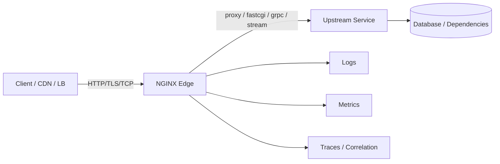
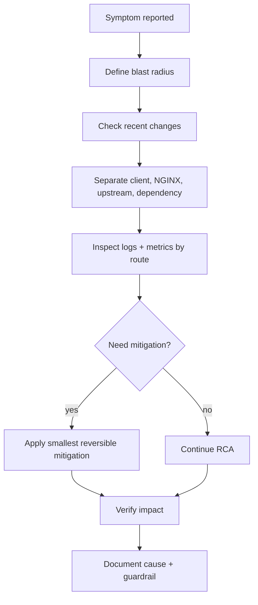
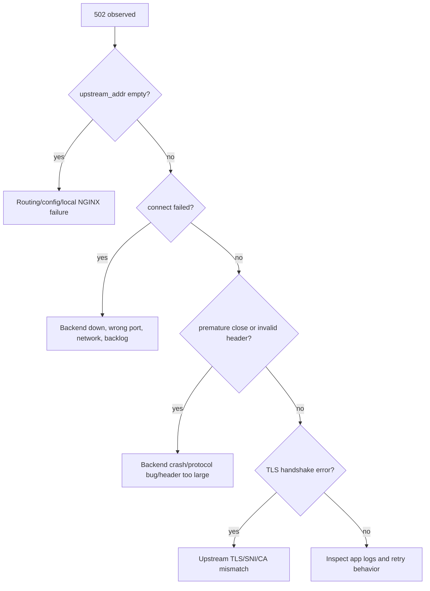

# Part 099 — Common Incidents and Playbooks

NGINX incident response is not about memorizing error codes. It is about reconstructing the request lifecycle under stress.

A production incident usually looks like this:

```txt
client sees error or latency
→ edge logs a status
→ upstream status/timing may or may not exist
→ error log adds lower-level reason
→ metrics show whether this is isolated, systemic, or capacity-related
→ config/history explains why the behavior changed
```

The important skill is knowing which layer had ownership of the failure.

NGINX is often blamed because it is the component returning the visible response. But NGINX can be:

- the failing component,
- the messenger of an upstream failure,
- the component intentionally rejecting traffic,
- the component exposing a client-side timeout,
- or the only component with enough telemetry to prove what actually happened.

This part is a field guide for production incidents. It does not replace prior parts. It ties them together into operational playbooks.

---

## 1. Incident mental model

Think of every NGINX incident as a broken contract between these parties:



The first question is not “what config should I change?”

The first question is:

> Which contract failed?

| Contract | Typical symptom | Primary evidence |
|---|---|---|
| Client → NGINX | 400, 408, 413, 414, 431, 499, TLS handshake issue | access log, error log, TLS log, client/CDN logs |
| NGINX routing | wrong backend, 404, unexpected redirect, cache leak | `$server_name`, `$host`, `$uri`, `$request_uri`, route labels |
| NGINX → upstream | 502, 503, 504, high upstream time | `$upstream_*`, error log, upstream metrics |
| Cache contract | stale/wrong/private response, stampede | `$upstream_cache_status`, cache key, origin headers |
| Runtime/OS | connection refused, dropped accepts, disk full, FD exhaustion | error log, `stub_status`, `ss`, `lsof`, `df`, systemd/journal |
| Change management | reload failure, partial rollout, config drift | deployment logs, `nginx -T`, git diff, CI result |

The mistake during incidents is jumping directly from symptom to tuning.

For example:

```txt
504 → increase proxy_read_timeout
```

This is often wrong. A 504 means NGINX did not receive a timely response from the proxied layer within its configured timeout. Increasing the timeout may reduce visible 504s while increasing queueing, memory use, open connections, and client-visible latency. Sometimes the correct fix is to shed load faster, reduce retries, fix upstream saturation, or fail a route closed.

---

## 2. Minimum telemetry needed before an incident

Do not wait for an incident to add useful logs.

Your NGINX access log should let you answer:

- Which route/server handled the request?
- What client identity did NGINX believe?
- What upstream did NGINX choose?
- Did NGINX retry another upstream?
- How long did connection, header, and full response take?
- Was the response from cache?
- Did rate limiting or auth policy affect it?
- Was this request correlated to an application trace?

A good baseline log format:

```nginx
log_format edge_json escape=json
  '{'
    '"ts":"$time_iso8601",'
    '"request_id":"$request_id",'
    '"traceparent":"$http_traceparent",'
    '"remote_addr":"$remote_addr",'
    '"realip_remote_addr":"$realip_remote_addr",'
    '"xff":"$http_x_forwarded_for",'
    '"host":"$host",'
    '"server_name":"$server_name",'
    '"scheme":"$scheme",'
    '"method":"$request_method",'
    '"uri":"$uri",'
    '"request_uri":"$request_uri",'
    '"status":$status,'
    '"bytes_sent":$bytes_sent,'
    '"request_length":$request_length,'
    '"request_time":$request_time,'
    '"upstream_addr":"$upstream_addr",'
    '"upstream_status":"$upstream_status",'
    '"upstream_connect_time":"$upstream_connect_time",'
    '"upstream_header_time":"$upstream_header_time",'
    '"upstream_response_time":"$upstream_response_time",'
    '"upstream_cache_status":"$upstream_cache_status",'
    '"limit_req_status":"$limit_req_status",'
    '"http2":"$http2",'
    '"http3":"$http3",'
    '"user_agent":"$http_user_agent",'
    '"referer":"$http_referer"'
  '}';

access_log /var/log/nginx/access.json edge_json;
error_log  /var/log/nginx/error.log warn;
```

Use route labels. They remove ambiguity:

```nginx
map $uri $route_name {
    default                     unknown;
    ~^/api/orders/              api_orders;
    ~^/api/payments/            api_payments;
    ~^/assets/                  static_assets;
}
```

Then include it in logs:

```nginx
'"route":"$route_name",'
```

A system without route labels forces you to reverse-engineer routing from URI patterns during the worst possible moment.

---

## 3. The incident triage loop

Use the same first five steps for almost every NGINX incident.



### Step 1 — Define blast radius

Ask:

- Is it one route, one host, one region, one tenant, one upstream pool, or all traffic?
- Is it new traffic only or long-lived connections too?
- Is it cache HIT traffic, MISS traffic, or both?
- Is it one client type, one CDN POP, one ASN, one mobile network?

Fast commands:

```bash
# Status distribution from recent logs.
jq -r '.status' /var/log/nginx/access.json | sort | uniq -c | sort -nr

# Error rate by route.
jq -r 'select(.status >= 500) | [.route, .status] | @tsv' /var/log/nginx/access.json \
  | sort | uniq -c | sort -nr | head

# Upstream errors by upstream address.
jq -r 'select(.status >= 500) | [.upstream_addr, .upstream_status] | @tsv' /var/log/nginx/access.json \
  | sort | uniq -c | sort -nr | head
```

### Step 2 — Check recent changes

Most incidents are not random.

Check:

```bash
# Current effective config.
nginx -T > /tmp/nginx.effective.$(date +%s).conf

# Validate syntax.
nginx -t

# Recent reloads and service events.
journalctl -u nginx --since "2 hours ago"

# Recent package/container version changes.
nginx -V
```

Questions:

- Was there a config reload?
- Was there a certificate renewal?
- Did upstream deploy?
- Did DNS/service discovery change?
- Did a CDN/LB health check change?
- Did a new route go live?
- Did traffic pattern change due to campaign, bot, batch job, or retry storm?

### Step 3 — Separate NGINX time from upstream time

Use timing variables:

| Variable | Meaning in incident triage |
|---|---|
| `$request_time` | total time from first client byte to log write |
| `$upstream_connect_time` | time to establish upstream connection |
| `$upstream_header_time` | time to receive upstream response header |
| `$upstream_response_time` | time to receive full upstream response |
| `$upstream_status` | status returned by upstream attempts |
| `$upstream_addr` | selected upstream attempts |

Interpretation examples:

| Pattern | Likely direction |
|---|---|
| high `$request_time`, empty `$upstream_*` | client upload/slow client/NGINX local/static/rate-limit/TLS |
| high connect time | upstream network, SYN backlog, DNS, backend accept queue, firewall |
| low connect time, high header time | upstream app queue, DB dependency, CPU, lock contention |
| high response time, header time low | large response, slow upstream body, slow client, buffering/temp file |
| multiple upstream values | retry occurred; inspect idempotency and duplicate side effects |

### Step 4 — Read the error log with context

Access log shows the shape. Error log often gives the mechanism.

Common patterns:

```txt
connect() failed (111: Connection refused) while connecting to upstream
upstream timed out (110: Connection timed out) while reading response header from upstream
upstream prematurely closed connection while reading response header from upstream
no live upstreams while connecting to upstream
client intended to send too large body
open() "..." failed (13: Permission denied)
SSL_do_handshake() failed
```

Do not grep the error log without correlating route/time/request ID. Generic error-log counts can mislead when multiple incidents overlap.

---

## 4. Playbook: 502 Bad Gateway

A 502 usually means NGINX was acting as a gateway/proxy and received an invalid, impossible, or failed response condition from the next hop.

It does not automatically mean “NGINX is down”.

### Common causes

| Cause | Evidence |
|---|---|
| upstream process down | `connect() failed (111: Connection refused)` |
| wrong upstream port | all requests fail to same upstream address |
| backend closes connection early | `upstream prematurely closed connection` |
| invalid HTTP response from backend | error log mentions invalid header/status |
| TLS mismatch to upstream | SSL handshake errors while connecting upstream |
| FastCGI/PHP-FPM socket issue | `connect() to unix:/... failed` |
| upstream killed by OOM/restart | app logs, Kubernetes events, systemd logs |
| NGINX cannot resolve dynamic name | resolver errors |

### First queries

```bash
# Find 502s with upstream detail.
jq -r 'select(.status == 502) | [.ts, .route, .host, .uri, .upstream_addr, .upstream_status, .upstream_connect_time, .upstream_header_time, .upstream_response_time] | @tsv' \
  /var/log/nginx/access.json | tail -100

# Error log around the incident.
grep -E "upstream|connect\(\)|prematurely|invalid|SSL_do_handshake" /var/log/nginx/error.log | tail -200

# Confirm upstream socket reachability from NGINX host/container.
curl -sv --connect-timeout 2 http://10.0.10.15:8080/healthz

# Check local listening sockets if upstream is local.
ss -lntp
```

### Decision tree



### Mitigations

Prefer reversible mitigations:

1. remove bad upstream from rotation,
2. route traffic to known-good pool,
3. disable canary,
4. reduce retry amplification,
5. serve stale cache if route is safe,
6. increase timeout only after proving the upstream is healthy-but-slower and the client budget allows it.

Example upstream kill switch:

```nginx
map $http_x_force_stable $api_pool {
    default       api_canary;
    "1"           api_stable;
}

location /api/ {
    proxy_pass http://$api_pool;
}
```

Emergency config should already exist. During an incident is too late to invent the kill switch.

### Anti-patterns

Do not blindly:

```nginx
proxy_next_upstream error timeout http_500 http_502 http_503 http_504 non_idempotent;
```

This can duplicate writes. If `POST /payments` reached upstream and the connection died before NGINX got a response, retrying another backend can create duplicate business effects unless the operation is idempotent by key.

---

## 5. Playbook: 504 Gateway Timeout

A 504 means NGINX did not receive a timely response from upstream within the configured timeout boundary.

The important question is where the wait happened.

### Timing patterns

| Pattern | Meaning |
|---|---|
| `connect_time` high | backend accept/network path problem |
| `connect_time` low, `header_time` high | app did not produce headers quickly |
| `header_time` low, `response_time` high | backend produced headers but body was slow/large |
| multiple upstream attempts | retries consumed request budget |
| 504 only on cache MISS | origin/shield problem; cache HIT masks it |

### First queries

```bash
jq -r 'select(.status == 504) | [.ts, .route, .upstream_addr, .upstream_status, .upstream_connect_time, .upstream_header_time, .upstream_response_time, .request_time] | @tsv' \
  /var/log/nginx/access.json | tail -100

grep -E "upstream timed out|while connecting|while reading response header|while reading upstream" \
  /var/log/nginx/error.log | tail -100
```

### Timeout ownership

| Directive | What it bounds |
|---|---|
| `proxy_connect_timeout` | TCP connection establishment to upstream |
| `proxy_send_timeout` | time between write operations while sending request to upstream |
| `proxy_read_timeout` | time between read operations while reading response from upstream |
| `send_timeout` | time between write operations to client |
| `client_body_timeout` | time between read operations from client body |

The subtle point: `proxy_read_timeout` is not necessarily total response time. It is a timeout between successive read operations. Streaming endpoints can live for a long time if they keep sending data within the interval.

### Mitigation ladder

1. Check if only one route is affected.
2. Check upstream saturation and dependency latency.
3. Disable canary or route to stable pool.
4. Reduce concurrency via rate/connection limiting if the upstream is collapsing.
5. Serve stale cache where correctness allows.
6. Increase timeout only if the business operation legitimately needs more time and all upstream dependencies can support the increased concurrency.

Bad fix:

```nginx
proxy_read_timeout 600s;
```

Better route-specific policy:

```nginx
location /api/reports/export/ {
    proxy_connect_timeout 2s;
    proxy_send_timeout    30s;
    proxy_read_timeout    300s;
    proxy_pass http://reports_backend;
}

location /api/checkout/ {
    proxy_connect_timeout 1s;
    proxy_send_timeout    5s;
    proxy_read_timeout    10s;
    proxy_pass http://checkout_backend;
}
```

A checkout route and an export route do not deserve the same timeout.

---

## 6. Playbook: 499 Client Closed Request

A 499 is logged by NGINX when the client closes the connection before NGINX sends the response.

It is not automatically an error in NGINX.

Common causes:

- browser navigation away,
- mobile network drop,
- CDN/load balancer timeout shorter than NGINX/upstream timeout,
- client-side timeout in SDK,
- upstream latency causing client to give up,
- streaming endpoint without heartbeat,
- large upload/download interrupted.

### Key diagnostic idea

Compare 499 with upstream timing.

| Pattern | Likely cause |
|---|---|
| 499 with high upstream header time | client gave up while app was slow |
| 499 with high request time but empty upstream | slow upload/client disconnected before proxying |
| 499 spike after frontend release | client timeout or abort behavior changed |
| 499 spike from one CDN/POP/ASN | network/client-side path issue |
| 499 + upstream continued processing | app may still be doing expensive abandoned work |

Queries:

```bash
jq -r 'select(.status == 499) | [.ts, .route, .request_time, .upstream_addr, .upstream_status, .upstream_response_time, .user_agent] | @tsv' \
  /var/log/nginx/access.json | tail -200

# Distribution by route.
jq -r 'select(.status == 499) | .route' /var/log/nginx/access.json | sort | uniq -c | sort -nr
```

### Mitigation

If clients time out earlier than NGINX/upstream, align timeout budgets:

```txt
client timeout < CDN timeout < NGINX timeout < app/dependency timeout
```

But this is not always ideal. For many APIs, the correct design is:

```txt
client request → quick accept → async job → polling/webhook/result retrieval
```

Do not force synchronous HTTP to carry long-running business workflows unless the UX and reliability model justify it.

---

## 7. Playbook: latency spike

Latency incidents are harder than obvious 5xx incidents because the system is still “working”.

Break latency into phases:

```txt
client upload
+ NGINX routing / local work
+ upstream connect
+ upstream queue/app/dependency until headers
+ upstream body
+ NGINX buffering/temp file/cache/compression
+ client download
```

### First split

```bash
jq -r '[.route, .status, .request_time, .upstream_connect_time, .upstream_header_time, .upstream_response_time, .upstream_cache_status] | @tsv' \
  /var/log/nginx/access.json | tail -1000 > /tmp/nginx-latency.tsv
```

If you have metrics, group by route and status:

| Question | Signal |
|---|---|
| Is latency only MISS? | `$upstream_cache_status` |
| Is connect slow? | `$upstream_connect_time` |
| Is app slow before headers? | `$upstream_header_time` |
| Is body/download slow? | compare header vs response vs request time |
| Is NGINX saturated? | active connections, accepts vs handled, CPU, FD, disk IO |
| Is client slow? | high request time but upstream response time low |

### Common causes

| Cause | Evidence |
|---|---|
| upstream thread/worker pool saturated | header time rises, app queue metrics rise |
| DB slow | app traces show dependency time |
| cache miss storm | HIT ratio falls, origin RPS rises |
| disk temp files | IO wait, temp path growth, buffering logs |
| TLS CPU pressure | CPU rises, handshake metrics, new connections spike |
| logging bottleneck | disk IO, log flush latency, blocked writes |
| retry amplification | multiple upstream statuses/addresses per request |
| slow clients | request time high, upstream response time low |

### Mitigation options

| Symptom | Mitigation |
|---|---|
| upstream saturated | shed load, reduce retries, route to stable pool, scale upstream |
| cache stampede | enable cache lock/stale, short-term cache bypass only if origin can survive |
| slow client download | buffering, sendfile/static tuning, CDN, lower large response concurrency |
| connection churn | keepalive, HTTP/2, upstream keepalive, tune FD/backlog after proof |
| expensive endpoint | route-specific limit, async design, pagination, response size cap |

Do not tune global worker settings before proving NGINX is the bottleneck.

---

## 8. Playbook: cache poisoning or private data leakage

Cache incidents are dangerous because they can be silent and user-visible at scale.

### Symptoms

- user receives another user's data,
- response differs by `Authorization` or cookie but cache key does not,
- admin response appears publicly,
- wrong language/currency/tenant returned,
- cache HIT where route should be private,
- sudden HIT ratio improvement after a deploy that changed headers.

### Immediate containment

1. Disable cache for affected route.
2. Bypass cache for authenticated traffic.
3. Rotate cache namespace if needed.
4. Purge/invalidate affected keys if supported.
5. Preserve logs and representative cached responses for RCA.

Emergency route-level disable:

```nginx
location /api/private/ {
    proxy_cache off;
    add_header Cache-Control "no-store" always;
    proxy_pass http://api_backend;
}
```

Emergency namespace bump:

```nginx
proxy_cache_key "v20260707a|$scheme|$host|$request_method|$uri|$is_args$args";
```

This does not delete old cache files immediately. It stops using the old namespace.

### RCA checklist

Check:

- Was `Authorization` included in cache key or used as `proxy_no_cache`?
- Was `Cookie` ignored accidentally?
- Was tenant identity included in key?
- Was `Host` trusted and normalized?
- Was `Vary` respected or ignored?
- Did upstream emit `Set-Cookie`?
- Did NGINX override origin cache headers?
- Did a new route inherit cache from a parent `location`?
- Did query normalization collapse distinct requests?
- Did `proxy_ignore_headers` disable an important origin guard?

Safer baseline for APIs:

```nginx
map $http_authorization $has_authorization {
    default 1;
    ""      0;
}

map $http_cookie $has_cookie {
    default 1;
    ""      0;
}

location /api/ {
    proxy_cache api_cache;
    proxy_no_cache     $has_authorization $has_cookie;
    proxy_cache_bypass $has_authorization $has_cookie;
    proxy_pass http://api_backend;
}
```

The rule is simple:

> If the response depends on identity, either do not put it in shared cache or prove identity is part of the cache identity function.

---

## 9. Playbook: certificate expiry or TLS handshake failure

TLS incidents often look like total outage because the HTTP request never reaches the application.

### Symptoms

- browsers report expired certificate,
- clients report handshake failure,
- health checks fail on HTTPS but backend is healthy,
- only some clients fail after TLS policy change,
- HTTP/2 or HTTP/3 downgrade/failure after config change,
- mTLS clients fail after CA rotation.

### Fast checks

```bash
# Certificate presented by NGINX.
openssl s_client -connect example.com:443 -servername example.com -showcerts </dev/null

# Expiry only.
echo | openssl s_client -connect example.com:443 -servername example.com 2>/dev/null \
  | openssl x509 -noout -issuer -subject -dates

# Protocol support.
openssl s_client -connect example.com:443 -servername example.com -tls1_2 </dev/null
openssl s_client -connect example.com:443 -servername example.com -tls1_3 </dev/null

# NGINX effective SSL config.
nginx -T | grep -E "ssl_certificate|ssl_protocols|ssl_ciphers|ssl_verify_client|ssl_trusted_certificate"
```

### Common causes

| Cause | Evidence |
|---|---|
| cert expired | `notAfter` in past |
| wrong cert selected | SNI/default server mismatch |
| missing intermediate | clients fail but some browsers may recover |
| key/cert mismatch | reload fails or SSL startup error |
| renewal succeeded but reload failed | cert file updated, NGINX still serving old cert |
| HSTS mistake | browser forced HTTPS even after rollback |
| mTLS CA rotation | client cert no longer trusted |
| overly strict TLS policy | old clients fail after protocol/cipher change |

### Mitigation

- Restore last known-good certificate and reload.
- Use correct fullchain order: leaf first, then intermediates.
- Roll back TLS policy if compatibility broke.
- For mTLS, separate CA rotation from `ssl_verify_client on` rollout.
- For HSTS, never jump to long `max-age` and `includeSubDomains` before proving every subdomain is HTTPS-safe.

Reload safely:

```bash
nginx -t && nginx -s reload
```

Then verify externally, not only locally:

```bash
openssl s_client -connect example.com:443 -servername example.com </dev/null 2>/dev/null \
  | openssl x509 -noout -subject -issuer -dates
```

---

## 10. Playbook: reload failure or bad config deploy

NGINX reload is designed to be safe when used properly: validate config, start new workers, gracefully retire old workers. But deployment automation can still fail.

### Failure modes

| Failure | Result |
|---|---|
| syntax invalid | reload rejected; old workers continue |
| certificate/key file invalid | reload rejected or SSL context fails |
| included file missing | reload rejected |
| port already in use | reload rejected/start failure |
| config valid but semantically wrong | reload succeeds, traffic breaks |
| partial config generated | reload may succeed with missing routes/default behavior |
| external secret path missing | reload rejected or route fails later |

### Required deployment invariant

A deploy is not complete after `nginx -s reload`.

It is complete only after:

```txt
config generated
→ nginx -t passed
→ reload command returned success
→ service still has master + workers
→ smoke tests passed through real listener
→ key logs/metrics normal
```

### Safe deployment script skeleton

```bash
#!/usr/bin/env bash
set -euo pipefail

NEW_CONF_DIR="/etc/nginx/generated"
BACKUP="/var/backups/nginx/nginx.$(date +%Y%m%d%H%M%S).conf"

nginx -T > "$BACKUP"
nginx -t
nginx -s reload
sleep 1

# Smoke test through local listener.
curl -fsS -H 'Host: example.com' http://127.0.0.1/healthz >/dev/null
curl -fsS -H 'Host: example.com' http://127.0.0.1/api/edge-health >/dev/null
```

### Rollback

Rollback is not “edit until it works”.

Rollback should be deterministic:

```bash
cp /etc/nginx/previous-known-good.conf /etc/nginx/nginx.conf
nginx -t && nginx -s reload
```

If a reload failed and old workers are still serving, do not restart NGINX blindly. A restart can turn a rejected reload into a full outage.

---

## 11. Playbook: disk full — logs, temp files, cache

NGINX can fail locally even when upstream is healthy.

Disk pressure sources:

- access logs,
- error logs,
- proxy temp files,
- client body temp files,
- FastCGI/uWSGI temp files,
- cache files,
- core dumps,
- container writable layer.

### Symptoms

- 500/502 on uploads or large proxied responses,
- cache write failures,
- log write errors,
- worker stalls from IO pressure,
- container evicted due to ephemeral storage,
- sudden latency spike on buffered responses.

### Commands

```bash
df -h
df -i
du -xh /var/log/nginx | sort -h | tail
du -xh /var/cache/nginx | sort -h | tail
du -xh /var/lib/nginx | sort -h | tail
lsof +L1 | grep nginx
```

`lsof +L1` catches deleted log files still held open by a process.

### Mitigation

- Rotate/compress logs.
- Reopen logs after rotation: `nginx -s reopen`.
- Reduce temporary file generation by route only after understanding buffering consequences.
- Cap cache with `max_size` and `min_free`.
- Move cache/temp/log to separate volumes.
- In containers, avoid writing large cache/temp to the image writable layer.

Example cache path with guardrails:

```nginx
proxy_cache_path /var/cache/nginx/api
    levels=1:2
    keys_zone=api_cache:100m
    max_size=20g
    min_free=5g
    inactive=30m
    use_temp_path=off;
```

---

## 12. Playbook: file descriptor or connection exhaustion

NGINX is event-driven, but it is still bounded by file descriptors, worker connections, kernel backlog, upstream sockets, and process limits.

### Symptoms

- `accept4() failed (24: Too many open files)`,
- `socket() failed (24: Too many open files)`,
- `accepts` much greater than `handled`,
- new connections fail while existing ones continue,
- high `Waiting` connections,
- high upstream connect failures,
- WebSocket/SSE consuming connection budget.

### Checks

```bash
nginx -T | grep -E "worker_processes|worker_connections|worker_rlimit_nofile"
cat /proc/$(cat /run/nginx.pid)/limits | grep -i "open files"
ss -s
ss -ant state established '( sport = :443 or sport = :80 )' | wc -l
curl -s http://127.0.0.1/nginx_status
```

### Capacity model

Maximum theoretical client connections is roughly:

```txt
worker_processes × worker_connections
```

But this is not the real safe limit because each proxied request may also consume upstream sockets, files, cache/temp files, logs, and memory.

For reverse proxy workloads, budget like this:

```txt
client connections
+ active upstream connections
+ idle upstream keepalive connections
+ open files/logs/cache
+ temporary files
+ DNS resolver sockets
```

### Mitigation

- Raise systemd `LimitNOFILE` and OS limits.
- Set `worker_rlimit_nofile` where needed.
- Increase `worker_connections` only with FD and memory budget.
- Reduce long-lived connection concurrency with route-specific controls.
- Add upstream keepalive to reduce churn, but account for idle upstream sockets.
- Use connection limiting for expensive routes.

Do not change only one layer. FD capacity is a stack.

---

## 13. Playbook: DNS or service discovery incident

DNS-related incidents are often misdiagnosed as upstream instability.

### Symptoms

- one deployment target still sends to old IP,
- dynamic `proxy_pass` fails with resolver error,
- Kubernetes service changed but NGINX did not pick it up,
- intermittent connection refused after pod rotation,
- only new workers see new DNS result,
- variable-based upstream behaves differently from static upstream.

### Checks

```bash
# Effective config.
nginx -T | grep -E "resolver|proxy_pass|upstream|resolve"

# Resolve from NGINX runtime environment.
getent hosts api.service.local
nslookup api.service.local

# Compare DNS and upstream attempts.
jq -r 'select(.status >= 500) | [.ts, .route, .upstream_addr, .upstream_status] | @tsv' /var/log/nginx/access.json | tail
```

### Typical root causes

| Cause | Fix direction |
|---|---|
| static upstream resolved only at config load | reload on DNS change or use supported dynamic resolution pattern |
| no `resolver` for variable proxy pass | configure trusted resolver |
| resolver points outside cluster/VPC | use correct local DNS resolver |
| TTL too long/too short | align with service discovery behavior |
| keepalive holds old backend connections | tune keepalive/drain/reload behavior |
| DNS name resolves to unhealthy IPs | fix service discovery source, not NGINX only |

### Guardrail

Avoid putting untrusted user-controlled values into dynamic `proxy_pass`. That is a direct SSRF risk.

Bad:

```nginx
location /fetch/ {
    proxy_pass http://$arg_url;
}
```

Better:

```nginx
map $arg_target $safe_origin {
    default "";
    docs    docs_backend;
    api     api_backend;
}

location /fetch/ {
    if ($safe_origin = "") { return 400; }
    proxy_pass http://$safe_origin;
}
```

Even this should be reviewed carefully. Dynamic upstream resolution is powerful and dangerous.

---

## 14. Playbook: unexpected 404/403/static file incident

Static incidents usually come from path semantics, permissions, or location matching.

### Symptoms

- SPA deep links return 404,
- `/assets/app.js` returns HTML,
- hidden files are served,
- correct file exists but NGINX returns 403,
- `alias` route returns 404 unexpectedly,
- directory index forbidden,
- tenant A sees tenant B asset.

### Checks

```bash
nginx -T | sed -n '/server_name example.com/,/}/p'
namei -l /srv/www/app/current/index.html
curl -i -H 'Host: example.com' http://127.0.0.1/assets/app.js
curl -i -H 'Host: example.com' http://127.0.0.1/.git/config
```

### Root-cause map

| Symptom | Likely cause |
|---|---|
| file exists but 403 | directory execute bit missing, user mismatch, SELinux/AppArmor |
| route returns wrong file | `root`/`alias` mismatch |
| SPA API returns HTML | fallback too broad |
| hidden file exposed | deny rule missing or lower-priority location |
| wrong tenant asset | path-based tenant isolation failure |
| directory listing | `autoindex on` or missing index behavior |

### Safe SPA pattern

```nginx
location /assets/ {
    try_files $uri =404;
    expires 1y;
    add_header Cache-Control "public, max-age=31536000, immutable" always;
}

location /api/ {
    proxy_pass http://api_backend;
}

location / {
    try_files $uri $uri/ /index.html;
    add_header Cache-Control "no-store" always;
}
```

Never let SPA fallback swallow API, assets, or private routes.

---

## 15. Playbook: rate limiting false positive or abuse spike

Rate limiting incidents have two shapes:

1. real abuse not being blocked,
2. legitimate users being blocked.

Both are production incidents.

### Evidence

```bash
jq -r 'select(.status == 429) | [.ts, .route, .remote_addr, .realip_remote_addr, .limit_req_status, .user_agent] | @tsv' \
  /var/log/nginx/access.json | tail -200
```

### Common causes of false positives

| Cause | Explanation |
|---|---|
| NAT concentration | many users share one IP |
| bad Real IP config | all clients appear as load balancer IP |
| key too broad | limiting by IP when user/API key is better |
| burst too small | short legitimate bursts rejected |
| shared route policy | login, webhook, and API routes use same limit |
| health checks counted | internal checks consume quota |

### Safer rollout

Use dry-run first:

```nginx
limit_req_zone $binary_remote_addr zone=api_ip:20m rate=10r/s;

server {
    limit_req_dry_run on;

    location /api/ {
        limit_req zone=api_ip burst=50 nodelay;
        proxy_pass http://api_backend;
    }
}
```

Log `$limit_req_status` and inspect would-have-blocked traffic before enforcing.

---

## 16. Playbook: WebSocket, SSE, or gRPC incident

Long-lived protocols break differently from short HTTP requests.

### WebSocket symptoms

- connects fail immediately,
- disconnects after 60 seconds,
- works locally but fails behind NGINX,
- only idle sessions drop,
- clients reconnect storm.

Check:

```nginx
proxy_http_version 1.1;
proxy_set_header Upgrade $http_upgrade;
proxy_set_header Connection $connection_upgrade;
proxy_read_timeout 1h;
```

Use a `map` for `Connection`:

```nginx
map $http_upgrade $connection_upgrade {
    default upgrade;
    ""      close;
}
```

### SSE symptoms

- events arrive in batches,
- first event delayed,
- stream closes after timeout,
- proxy buffering hides streaming.

Check:

```nginx
location /events/ {
    proxy_buffering off;
    proxy_read_timeout 1h;
    proxy_pass http://sse_backend;
}
```

The upstream should send heartbeats. A silent stream will hit idle read timeouts.

### gRPC symptoms

- HTTP/2 missing,
- wrong `grpc_pass` scheme,
- gRPC status not visible in HTTP status alone,
- header/trailer behavior confusing dashboards.

Check:

```nginx
server {
    listen 443 ssl http2;

    location /package.Service/ {
        grpc_read_timeout 60s;
        grpc_send_timeout 60s;
        grpc_pass grpc://grpc_backend;
    }
}
```

Observe both NGINX status and application-level gRPC status.

---

## 17. Playbook: Kubernetes/Ingress-related incident

When NGINX runs as an Ingress Controller or edge gateway in Kubernetes, there are extra failure layers:

- Ingress object,
- controller config/annotations,
- generated NGINX config,
- Service/endpoints,
- Pod readiness,
- NetworkPolicy,
- node local network,
- cloud load balancer,
- TLS secret.

### Questions

- Did the controller receive and apply the object?
- Did the Service have ready endpoints?
- Did an annotation change behavior globally?
- Did TLS secret rotate?
- Did pod readiness lag behind traffic routing?
- Did cloud LB health check path differ from NGINX health path?

### Debug path

```bash
kubectl describe ingress <name>
kubectl get endpointslice -l kubernetes.io/service-name=<svc>
kubectl describe svc <svc>
kubectl logs deploy/<nginx-controller> --since=1h
kubectl exec deploy/<nginx-controller> -- nginx -T | less
```

Do not debug Kubernetes Ingress purely from YAML. Always inspect the generated runtime configuration when possible.

---

## 18. Incident response templates

### 18.1 Initial incident note

```md
## Incident
- Title:
- Start time:
- Detected by:
- User impact:
- Affected hosts/routes/regions/tenants:
- Current status:

## Evidence
- Error rate:
- Latency:
- Top statuses:
- Top upstreams:
- Recent changes:

## Working hypothesis
-

## Mitigation
-

## Next action
-
```

### 18.2 NGINX RCA template

```md
## Summary
What happened, in one paragraph.

## Impact
Who was affected and for how long.

## Timeline
- T0:
- Detection:
- Mitigation:
- Recovery:

## Technical cause
Which contract failed: client→NGINX, NGINX routing, NGINX→upstream, cache, TLS, OS/runtime, or deploy.

## Why it was not caught earlier
Missing test, missing alert, missing log field, weak rollout, unclear ownership.

## What worked
-

## What failed
-

## Corrective actions
| Action | Owner | Due | Type |
|---|---|---|---|
| | | | prevent/detect/mitigate |
```

### 18.3 Config change review checklist

Before merging NGINX config:

- Does every new route have an owner?
- Does every new proxy route have timeout policy?
- Does every new cache route have cache key and privacy review?
- Does every new auth route protect spoofed headers?
- Does every new redirect have loop test?
- Does every new location have matching-order test?
- Does every new upstream have retry/idempotency decision?
- Does every new TLS setting have compatibility plan?
- Does every new rate limit have dry-run data?
- Does every new include file fail closed if absent?

---

## 19. A compact incident decision matrix

| Symptom | First evidence | Most likely boundary | First mitigation |
|---|---|---|---|
| 502 spike | error log + `$upstream_status` | upstream/protocol | remove bad upstream or rollback backend/canary |
| 504 spike | upstream timing | upstream latency/timeout | shed load, route stable, fix upstream; avoid blind timeout increase |
| 499 spike | client + request timing | client timeout/path | align timeout budget, reduce backend latency, add heartbeat |
| 429 spike | `$limit_req_status` | rate policy/key | inspect dry-run/keys; adjust route-specific limits |
| cache leak | cache status + key | cache identity | disable cache for route, namespace bump, purge if available |
| TLS failure | `openssl s_client` | cert/SNI/protocol | restore cert/policy, reload, verify externally |
| reload failed | `nginx -t`, journal | deploy/config | do not restart blindly; keep old workers, fix config |
| latency only MISS | cache status | origin/cache | cache lock/stale/shield/origin scale |
| high connect time | upstream connect time | network/accept queue | backend health, backlog, network, scale |
| disk full | `df`, error log | local runtime | rotate logs, cap cache, move temp/cache volumes |
| accepts > handled | stub_status | resource limit | FD/worker limits, backlog, connection budget |

---

## 20. Final mental model

In mature teams, NGINX incidents are not handled by hero debugging. They are handled by prepared evidence and reversible controls.

The mature pattern is:

```txt
observe precisely
→ classify boundary
→ mitigate with smallest reversible change
→ prove recovery
→ perform RCA
→ add guardrail
```

NGINX should not be treated as a mysterious black box at the edge.

It is a deterministic traffic machine. Most incidents become tractable when you log the right identity, route, upstream, timing, cache, and policy signals before the incident happens.

The next part turns this field guide into a production lab.
