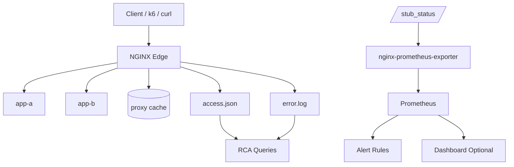

# Part 100 — Observability Production Lab

This lab turns the previous observability and incident-response parts into a working production-style setup.

The goal is not to build the fanciest monitoring stack. The goal is to build an observability contract that can answer production questions quickly:

- Is NGINX alive?
- Is it accepting and handling connections?
- Which routes are failing?
- Which upstreams are failing?
- Is latency in NGINX, the network, or the upstream application?
- Are cache HIT/MISS/STALE/BYPASS patterns expected?
- Are rate limits protecting the system or hurting legitimate users?
- Can we detect failure before users report it?
- Can an on-call engineer run a drill and explain the result?

This part is a lab, but the design is intentionally production-shaped.

---

## 1. Target architecture



The lab uses four observability layers:

| Layer | Purpose |
|---|---|
| JSON access logs | request-level truth for RCA |
| error logs | mechanism-level NGINX/runtime errors |
| `stub_status` | lightweight connection/request counters |
| Prometheus alert rules | early detection and production guardrails |

This lab deliberately separates logs from metrics.

Metrics answer:

```txt
Is something happening?
```

Logs answer:

```txt
What exactly happened to this class of request?
```

You need both.

---

## 2. Project layout

Create this directory:

```txt
nginx-observability-lab/
├── docker-compose.yml
├── nginx/
│   ├── nginx.conf
│   └── conf.d/
│       └── edge.conf
├── prometheus/
│   ├── prometheus.yml
│   └── alerts.yml
├── app/
│   ├── Dockerfile
│   └── app.py
├── load/
│   └── smoke.js
└── scripts/
    ├── smoke.sh
    ├── incident-502.sh
    ├── incident-504.sh
    ├── incident-cache.sh
    └── rca.sh
```

The lab uses Docker Compose for repeatability. The same design maps to VM, Kubernetes, ECS, Nomad, or bare metal.

---

## 3. Application backend

Create `app/app.py`:

```python
import os
import time
import uuid
from flask import Flask, request, jsonify, make_response

app = Flask(__name__)
INSTANCE = os.getenv("INSTANCE", "app")

@app.route("/healthz")
def healthz():
    return jsonify({"status": "ok", "instance": INSTANCE})

@app.route("/api/ok")
def ok():
    return jsonify({
        "ok": True,
        "instance": INSTANCE,
        "request_id": request.headers.get("X-Request-ID"),
        "traceparent": request.headers.get("traceparent"),
    })

@app.route("/api/slow")
def slow():
    delay = float(request.args.get("delay", "2"))
    time.sleep(delay)
    return jsonify({"ok": True, "delay": delay, "instance": INSTANCE})

@app.route("/api/error")
def error():
    code = int(request.args.get("code", "500"))
    return jsonify({"ok": False, "code": code, "instance": INSTANCE}), code

@app.route("/api/cacheable")
def cacheable():
    response = make_response(jsonify({
        "ok": True,
        "instance": INSTANCE,
        "value": str(uuid.uuid4()),
    }))
    response.headers["Cache-Control"] = "public, max-age=30"
    return response

@app.route("/api/private")
def private():
    response = make_response(jsonify({
        "ok": True,
        "instance": INSTANCE,
        "user": request.headers.get("Authorization", "anonymous"),
        "value": str(uuid.uuid4()),
    }))
    response.headers["Cache-Control"] = "no-store"
    response.headers["Set-Cookie"] = "session=demo; HttpOnly; Secure; SameSite=Lax"
    return response

if __name__ == "__main__":
    app.run(host="0.0.0.0", port=8080)
```

Create `app/Dockerfile`:

```dockerfile
FROM python:3.12-alpine
WORKDIR /app
RUN pip install --no-cache-dir flask
COPY app.py /app/app.py
EXPOSE 8080
CMD ["python", "/app/app.py"]
```

The app intentionally includes:

- healthy endpoint,
- normal endpoint,
- slow endpoint,
- error endpoint,
- cacheable endpoint,
- private endpoint that must not be cached.

This gives us enough behavior to test observability without depending on a real business application.

---

## 4. Docker Compose

Create `docker-compose.yml`:

```yaml
services:
  nginx:
    image: nginx:1.27-alpine
    container_name: nginx-edge
    ports:
      - "8080:80"
    volumes:
      - ./nginx/nginx.conf:/etc/nginx/nginx.conf:ro
      - ./nginx/conf.d:/etc/nginx/conf.d:ro
      - nginx-cache:/var/cache/nginx
      - nginx-logs:/var/log/nginx
    depends_on:
      - app-a
      - app-b

  app-a:
    build: ./app
    container_name: app-a
    environment:
      - INSTANCE=app-a

  app-b:
    build: ./app
    container_name: app-b
    environment:
      - INSTANCE=app-b

  nginx-exporter:
    image: nginx/nginx-prometheus-exporter:1.4.2
    container_name: nginx-exporter
    command:
      - "--nginx.scrape-uri=http://nginx/nginx_status"
    ports:
      - "9113:9113"
    depends_on:
      - nginx

  prometheus:
    image: prom/prometheus:v2.55.1
    container_name: prometheus
    ports:
      - "9090:9090"
    volumes:
      - ./prometheus/prometheus.yml:/etc/prometheus/prometheus.yml:ro
      - ./prometheus/alerts.yml:/etc/prometheus/alerts.yml:ro

volumes:
  nginx-cache:
  nginx-logs:
```

Version pinning is intentional. In real production, image versions belong to your dependency governance process.

---

## 5. NGINX main config

Create `nginx/nginx.conf`:

```nginx
user nginx;
worker_processes auto;

events {
    worker_connections 4096;
}

http {
    include       /etc/nginx/mime.types;
    default_type  application/octet-stream;

    # JSON log format for request-level RCA.
    log_format edge_json escape=json
      '{'
        '"ts":"$time_iso8601",'
        '"request_id":"$request_id",'
        '"traceparent":"$http_traceparent",'
        '"remote_addr":"$remote_addr",'
        '"realip_remote_addr":"$realip_remote_addr",'
        '"xff":"$http_x_forwarded_for",'
        '"host":"$host",'
        '"server_name":"$server_name",'
        '"route":"$route_name",'
        '"scheme":"$scheme",'
        '"method":"$request_method",'
        '"uri":"$uri",'
        '"request_uri":"$request_uri",'
        '"status":$status,'
        '"bytes_sent":$bytes_sent,'
        '"request_length":$request_length,'
        '"request_time":$request_time,'
        '"upstream_addr":"$upstream_addr",'
        '"upstream_status":"$upstream_status",'
        '"upstream_connect_time":"$upstream_connect_time",'
        '"upstream_header_time":"$upstream_header_time",'
        '"upstream_response_time":"$upstream_response_time",'
        '"upstream_cache_status":"$upstream_cache_status",'
        '"limit_req_status":"$limit_req_status",'
        '"user_agent":"$http_user_agent"'
      '}';

    access_log /var/log/nginx/access.json edge_json;
    error_log  /var/log/nginx/error.log warn;

    # Route labels are observability infrastructure.
    map $uri $route_name {
        default              unknown;
        /healthz             edge_health;
        /nginx_status        nginx_status;
        ~^/api/ok            api_ok;
        ~^/api/slow          api_slow;
        ~^/api/error         api_error;
        ~^/api/cacheable     api_cacheable;
        ~^/api/private       api_private;
    }

    map $http_authorization $has_authorization {
        default 1;
        ""      0;
    }

    proxy_cache_path /var/cache/nginx/api
        levels=1:2
        keys_zone=api_cache:20m
        max_size=200m
        inactive=10m
        use_temp_path=off;

    limit_req_zone $binary_remote_addr zone=api_ip:10m rate=20r/s;
    limit_conn_zone $binary_remote_addr zone=conn_ip:10m;

    include /etc/nginx/conf.d/*.conf;
}
```

Important design decisions:

1. The log format includes both client and upstream timing.
2. Route labels are explicit.
3. Cache status is included even for non-cache routes, so dashboards can reuse one schema.
4. Rate limit status is logged, not hidden.
5. `stub_status` is exposed separately and must not be confused with request-level telemetry.

---

## 6. NGINX edge config

Create `nginx/conf.d/edge.conf`:

```nginx
upstream app_pool {
    zone app_pool 64k;
    server app-a:8080 max_fails=2 fail_timeout=10s;
    server app-b:8080 max_fails=2 fail_timeout=10s;
    keepalive 32;
}

server {
    listen 80 default_server;
    server_name _;

    # Lightweight edge health. Does not prove upstream health.
    location = /healthz {
        access_log off;
        return 200 "nginx ok\n";
    }

    # Metrics endpoint. In production, restrict by network, mTLS, or internal listener.
    location = /nginx_status {
        stub_status;
        access_log off;
        allow 127.0.0.1;
        allow 172.16.0.0/12;
        allow 10.0.0.0/8;
        allow 192.168.0.0/16;
        deny all;
    }

    location /api/ {
        limit_req zone=api_ip burst=100 nodelay;
        limit_conn conn_ip 100;

        proxy_http_version 1.1;
        proxy_set_header Connection "";
        proxy_set_header Host $host;
        proxy_set_header X-Request-ID $request_id;
        proxy_set_header X-Forwarded-For $proxy_add_x_forwarded_for;
        proxy_set_header X-Forwarded-Proto $scheme;
        proxy_set_header traceparent $http_traceparent;

        proxy_connect_timeout 1s;
        proxy_send_timeout    10s;
        proxy_read_timeout    10s;

        proxy_next_upstream error timeout http_502 http_503 http_504;
        proxy_next_upstream_tries 2;
        proxy_next_upstream_timeout 3s;

        proxy_pass http://app_pool;
    }

    location /api/slow {
        proxy_http_version 1.1;
        proxy_set_header Connection "";
        proxy_set_header Host $host;
        proxy_set_header X-Request-ID $request_id;
        proxy_set_header X-Forwarded-For $proxy_add_x_forwarded_for;
        proxy_set_header X-Forwarded-Proto $scheme;

        proxy_connect_timeout 1s;
        proxy_send_timeout    5s;
        proxy_read_timeout    3s;

        proxy_pass http://app_pool;
    }

    location /api/cacheable {
        proxy_http_version 1.1;
        proxy_set_header Connection "";
        proxy_set_header Host $host;
        proxy_set_header X-Request-ID $request_id;
        proxy_set_header X-Forwarded-For $proxy_add_x_forwarded_for;
        proxy_set_header X-Forwarded-Proto $scheme;

        proxy_cache api_cache;
        proxy_cache_key "$scheme|$host|$request_method|$uri|$is_args$args";
        proxy_cache_valid 200 30s;
        proxy_cache_lock on;
        proxy_cache_use_stale error timeout updating http_500 http_502 http_503 http_504;
        proxy_cache_background_update on;

        add_header X-Cache-Status $upstream_cache_status always;

        proxy_pass http://app_pool;
    }

    location /api/private {
        proxy_http_version 1.1;
        proxy_set_header Connection "";
        proxy_set_header Host $host;
        proxy_set_header X-Request-ID $request_id;
        proxy_set_header X-Forwarded-For $proxy_add_x_forwarded_for;
        proxy_set_header X-Forwarded-Proto $scheme;
        proxy_set_header Authorization $http_authorization;

        proxy_cache off;
        add_header Cache-Control "no-store" always;
        add_header X-Cache-Status "DISABLED" always;

        proxy_pass http://app_pool;
    }
}
```

This is intentionally not a perfect universal config. It is an observability lab config.

The important property is that every route has visible behavior.

---

## 7. Prometheus config

Create `prometheus/prometheus.yml`:

```yaml
global:
  scrape_interval: 15s
  evaluation_interval: 15s

rule_files:
  - /etc/prometheus/alerts.yml

scrape_configs:
  - job_name: prometheus
    static_configs:
      - targets: ["prometheus:9090"]

  - job_name: nginx
    static_configs:
      - targets: ["nginx-exporter:9113"]
```

Create `prometheus/alerts.yml`:

```yaml
groups:
  - name: nginx-edge
    rules:
      - alert: NginxExporterDown
        expr: up{job="nginx"} == 0
        for: 1m
        labels:
          severity: critical
        annotations:
          summary: "NGINX exporter is down"
          description: "Prometheus cannot scrape nginx-prometheus-exporter. Metrics visibility is degraded."

      - alert: NginxConnectionHandlingProblem
        expr: increase(nginx_connections_accepted[5m]) - increase(nginx_connections_handled[5m]) > 0
        for: 2m
        labels:
          severity: warning
        annotations:
          summary: "NGINX accepted more connections than it handled"
          description: "This may indicate worker_connections or file descriptor pressure."

      - alert: NginxHighActiveConnections
        expr: nginx_connections_active > 1000
        for: 5m
        labels:
          severity: warning
        annotations:
          summary: "High active connections on NGINX"
          description: "Check long-lived connections, slow clients, upstream latency, and FD budget."

      - alert: NginxNoRequests
        expr: rate(nginx_http_requests_total[5m]) == 0
        for: 5m
        labels:
          severity: info
        annotations:
          summary: "NGINX has no observed requests"
          description: "This may be normal in a lab, but in production it may indicate traffic path or scrape issue."
```

These are intentionally simple. `stub_status` cannot provide route-level status codes or upstream latency. That information comes from logs or richer NGINX Plus/API metrics.

A production Prometheus setup should usually combine:

- NGINX exporter metrics,
- host/container metrics,
- application metrics,
- log-derived metrics,
- synthetic checks.

---

## 8. Smoke script

Create `scripts/smoke.sh`:

```bash
#!/usr/bin/env bash
set -euo pipefail

BASE="${BASE:-http://localhost:8080}"

echo "== health =="
curl -fsS "$BASE/healthz"

echo "== api ok =="
curl -fsS -H "traceparent: 00-4bf92f3577b34da6a3ce929d0e0e4736-00f067aa0ba902b7-01" \
  "$BASE/api/ok" | jq .

echo "== cache miss/hit =="
curl -fsSI "$BASE/api/cacheable" | grep -i 'x-cache-status\|cache-control\|http/'
curl -fsSI "$BASE/api/cacheable" | grep -i 'x-cache-status\|cache-control\|http/'

echo "== private must not be cached =="
curl -fsSI -H "Authorization: Bearer demo" "$BASE/api/private" \
  | grep -i 'x-cache-status\|cache-control\|set-cookie\|http/'

echo "== nginx status =="
curl -fsS "$BASE/nginx_status"

echo "== exporter =="
curl -fsS http://localhost:9113/metrics | grep -E 'nginx_connections_active|nginx_http_requests_total' | head
```

Make executable:

```bash
chmod +x scripts/*.sh
```

Run:

```bash
docker compose up --build -d
./scripts/smoke.sh
```

Expected cache behavior:

```txt
first /api/cacheable  → MISS
second /api/cacheable → HIT
/api/private          → DISABLED / no-store
```

---

## 9. Log inspection script

Create `scripts/rca.sh`:

```bash
#!/usr/bin/env bash
set -euo pipefail

CONTAINER="${CONTAINER:-nginx-edge}"
LOG="/var/log/nginx/access.json"

echo "== last 20 access logs =="
docker exec "$CONTAINER" sh -c "tail -20 $LOG" | jq .

echo "== status distribution =="
docker exec "$CONTAINER" sh -c "cat $LOG" \
  | jq -r '.status' | sort | uniq -c | sort -nr

echo "== route/status distribution =="
docker exec "$CONTAINER" sh -c "cat $LOG" \
  | jq -r '[.route, .status] | @tsv' | sort | uniq -c | sort -nr

echo "== upstream timing sample =="
docker exec "$CONTAINER" sh -c "cat $LOG" \
  | jq -r '[.ts, .route, .status, .request_time, .upstream_addr, .upstream_status, .upstream_connect_time, .upstream_header_time, .upstream_response_time, .upstream_cache_status] | @tsv' \
  | tail -30

echo "== recent error log =="
docker exec "$CONTAINER" sh -c "tail -100 /var/log/nginx/error.log"
```

Run:

```bash
./scripts/rca.sh
```

This script is intentionally crude. In production, this logic belongs in your log platform, but every engineer should still understand the raw fields.

---

## 10. k6 load script

Create `load/smoke.js`:

```javascript
import http from 'k6/http';
import { sleep, check } from 'k6';

export const options = {
  stages: [
    { duration: '15s', target: 10 },
    { duration: '30s', target: 10 },
    { duration: '15s', target: 0 },
  ],
  thresholds: {
    http_req_failed: ['rate<0.05'],
    http_req_duration: ['p(95)<500'],
  },
};

export default function () {
  const base = __ENV.BASE || 'http://localhost:8080';
  const res = http.get(`${base}/api/ok`, {
    headers: {
      traceparent: '00-4bf92f3577b34da6a3ce929d0e0e4736-00f067aa0ba902b7-01',
    },
  });

  check(res, {
    'status is 200': (r) => r.status === 200,
  });

  sleep(1);
}
```

Run if k6 is installed:

```bash
k6 run load/smoke.js
```

Or use Docker:

```bash
docker run --rm -i --network host grafana/k6 run - < load/smoke.js
```

For production thinking, do not benchmark only `/api/ok`. Use service-class workloads:

- cacheable GET,
- non-cacheable GET,
- write route,
- slow route,
- large response,
- long-lived stream,
- error path.

---

## 11. Incident drill: 502 bad gateway

Create `scripts/incident-502.sh`:

```bash
#!/usr/bin/env bash
set -euo pipefail

echo "Stopping app-a and app-b to force upstream failure..."
docker compose stop app-a app-b

set +e
for i in $(seq 1 5); do
  curl -sS -o /dev/null -w "status=%{http_code} time=%{time_total}\n" http://localhost:8080/api/ok
  sleep 1
done
set -e

echo "Inspect logs:"
./scripts/rca.sh

echo "Recovering..."
docker compose start app-a app-b
```

Expected observations:

- access logs show 502 or 504 depending on connection behavior,
- `$upstream_addr` shows attempted upstreams,
- error log shows connection failure or no live upstreams,
- `stub_status` alone does not explain root cause.

RCA question:

> Did NGINX fail, or did NGINX correctly report that upstream was unavailable?

The correct answer should be supported by log fields, not opinion.

---

## 12. Incident drill: 504 timeout

Create `scripts/incident-504.sh`:

```bash
#!/usr/bin/env bash
set -euo pipefail

for delay in 1 2 4 6; do
  echo "== delay=$delay =="
  curl -sS -o /dev/null -w "status=%{http_code} total=%{time_total}\n" \
    "http://localhost:8080/api/slow?delay=$delay" || true
  sleep 1
done

./scripts/rca.sh
```

Expected behavior:

- delay below `proxy_read_timeout` succeeds,
- delay above timeout returns gateway timeout,
- access logs show high upstream timing,
- error log mentions upstream timed out while reading response header.

RCA question:

> Was the timeout caused by NGINX CPU, network connect, or app header latency?

You should answer with:

- `$upstream_connect_time`,
- `$upstream_header_time`,
- `$upstream_response_time`,
- error log message.

---

## 13. Incident drill: cache behavior

Create `scripts/incident-cache.sh`:

```bash
#!/usr/bin/env bash
set -euo pipefail

BASE="http://localhost:8080"

echo "== cacheable route =="
for i in $(seq 1 5); do
  curl -sSI "$BASE/api/cacheable" | grep -i 'http/\|x-cache-status\|cache-control'
  sleep 1
done

echo "== private route =="
for i in $(seq 1 3); do
  curl -sSI -H "Authorization: Bearer user-$i" "$BASE/api/private" \
    | grep -i 'http/\|x-cache-status\|cache-control\|set-cookie'
  sleep 1
done

./scripts/rca.sh
```

Expected behavior:

- first cacheable request likely `MISS`, next `HIT`,
- private route is never stored in cache,
- logs show cache status per request.

RCA question:

> Can you prove from logs that authenticated/private traffic was not served from shared cache?

If not, your observability contract is incomplete.

---

## 14. Metrics interpretation

Check `stub_status`:

```bash
curl -s http://localhost:8080/nginx_status
```

Example shape:

```txt
Active connections: 1 
server accepts handled requests
 100 100 250 
Reading: 0 Writing: 1 Waiting: 0
```

Interpretation:

| Field | Meaning |
|---|---|
| Active | current active client connections, including waiting |
| accepts | accepted client connections total |
| handled | handled connections total |
| requests | handled client requests total |
| Reading | connections where NGINX is reading request header |
| Writing | connections where NGINX is writing response |
| Waiting | idle keepalive connections |

Useful ratios:

```txt
requests per connection = requests / handled
connection handling gap = accepts - handled
```

If `accepts - handled` grows, suspect connection/resource limits.

If `Waiting` is high, it may simply be keepalive. Do not panic unless it is tied to FD pressure, memory pressure, or connection exhaustion.

---

## 15. What `stub_status` cannot tell you

`stub_status` is useful but limited.

It does not tell you:

- status code distribution,
- route-level latency,
- upstream response time,
- upstream retry count,
- cache HIT/MISS,
- rate limit decisions,
- TLS protocol/cipher distribution,
- which tenant/user/path is affected,
- whether a specific backend is failing.

This is why request logs remain mandatory.

A production anti-pattern:

```txt
We have NGINX metrics, therefore we can debug NGINX incidents.
```

Better:

```txt
We have metrics for detection and structured logs for explanation.
```

---

## 16. Dashboard design

A useful NGINX dashboard has sections, not a pile of charts.

### 16.1 Edge health

- exporter up,
- NGINX active connections,
- accepts vs handled,
- request rate,
- error log rate if collected,
- reload/restart events.

### 16.2 Traffic quality

Requires log-derived metrics unless using richer instrumentation:

- RPS by route,
- 4xx/5xx by route,
- 499 rate,
- 429 rate,
- request size/response size distribution.

### 16.3 Upstream health

From logs:

- upstream status distribution,
- upstream connect time p95/p99,
- upstream header time p95/p99,
- upstream response time p95/p99,
- retry attempts per route,
- top failing upstream address.

### 16.4 Cache

From logs:

- HIT/MISS/BYPASS/STALE/UPDATING/REVALIDATED rate,
- HIT ratio by route,
- origin request rate,
- stale serve count,
- cache lock wait symptoms,
- private route cache status should be disabled/bypass only.

### 16.5 Policy

From logs:

- rate limit status,
- auth failures,
- mTLS verification result if logged,
- denied CIDR/geo policy,
- CORS/preflight volume.

### 16.6 Capacity

From metrics + host telemetry:

- CPU,
- memory/RSS,
- FD usage,
- disk usage and inode usage,
- cache volume usage,
- network throughput,
- connection states,
- container cgroup throttling.

---

## 17. Alerting rules by failure class

Alerts should map to action.

Bad alert:

```txt
NGINX error detected
```

Better alert:

```txt
High 504 rate on route api_slow for 5 minutes; upstream_header_time p95 increased; check app queue/dependency latency.
```

### 17.1 Detection alerts

| Alert | Source | Action |
|---|---|---|
| exporter down | Prometheus | restore metrics path |
| accepts > handled | stub_status | inspect FD/worker limits |
| active connections high | stub_status + host | check long-lived/slow/upstream |
| 5xx rate high by route | logs | inspect upstream/error log |
| 504 rate high | logs | inspect timeout/upstream latency |
| 499 rate high | logs | inspect client timeout/backend latency |
| cache HIT ratio collapse | logs | inspect cache key/origin/cache manager |
| private route cache HIT | logs | emergency disable cache |
| 429 spike | logs | inspect rate limit false positive/abuse |
| certificate expiry soon | synthetic/cert exporter | renew/reload/verify |

### 17.2 Alert thresholds

Use route-specific thresholds.

A background export endpoint and checkout endpoint should not share the same latency/error threshold.

Example policy:

| Route class | Error alert | Latency alert |
|---|---|---|
| checkout/write | 5xx > 1% for 5m | p95 > 500ms for 10m |
| read API | 5xx > 2% for 5m | p95 > 800ms for 10m |
| reporting/export | 5xx > 5% for 10m | p95 > 30s for 15m |
| static assets | 5xx > 0.5% for 5m | p95 > 200ms for 10m |

The threshold should reflect user impact and business criticality.

---

## 18. Synthetic checks

Metrics and logs tell you what happened to real traffic. Synthetic checks tell you whether critical paths work even before users hit them.

Minimum synthetic checks:

```bash
curl -fsS https://example.com/healthz
curl -fsS https://example.com/api/edge-health
curl -fsSI https://example.com/assets/app.js | grep -i cache-control
curl -fsSI https://example.com/api/private | grep -i 'cache-control: no-store'
openssl s_client -connect example.com:443 -servername example.com </dev/null
```

Synthetic checks should verify contracts:

- expected status,
- expected headers,
- expected TLS certificate/SNI,
- expected cache behavior,
- expected redirect behavior,
- expected auth failure mode,
- expected mTLS behavior where applicable.

Do not only check `/healthz`. A green health endpoint can hide broken routing, broken TLS, broken cache, and broken auth.

---

## 19. Production hardening for observability endpoints

Never expose `/nginx_status` publicly.

Options:

1. bind metrics to internal listener only,
2. restrict by source CIDR,
3. require mTLS,
4. expose through sidecar only,
5. scrape over private network,
6. use Kubernetes NetworkPolicy/SecurityGroup/firewall.

Example internal listener:

```nginx
server {
    listen 127.0.0.1:8081;
    server_name localhost;

    location = /nginx_status {
        stub_status;
        access_log off;
    }
}
```

Then configure exporter:

```bash
nginx-prometheus-exporter --nginx.scrape-uri=http://127.0.0.1:8081/nginx_status
```

In containers, `127.0.0.1` means the same container. If exporter is a sidecar or separate container, use the appropriate container network path and protect it at network policy level.

---

## 20. Log governance

NGINX logs often contain sensitive data.

Do not log blindly:

- full query string if it can contain tokens,
- `Authorization`,
- cookies,
- session IDs,
- PII in path/query,
- full request body,
- internal-only headers that reveal topology.

Prefer:

- route labels,
- request IDs,
- tenant IDs only if safe and governed,
- hashed user IDs if needed,
- truncated user agent if storage is a concern,
- explicit redaction in log pipeline.

Example: avoid logging raw `$args` globally. Use `$uri` and carefully selected normalized fields.

If you must log query strings for debugging, do it temporarily and with a data-handling plan.

---

## 21. Observability acceptance tests

A production NGINX service should have tests for observability, not only functionality.

### 21.1 Log schema test

After a smoke request, assert log fields exist:

```bash
docker exec nginx-edge sh -c 'tail -1 /var/log/nginx/access.json' \
  | jq -e '
      has("ts") and
      has("request_id") and
      has("route") and
      has("status") and
      has("request_time") and
      has("upstream_status") and
      has("upstream_response_time")
    '
```

### 21.2 Cache contract test

```bash
curl -fsSI http://localhost:8080/api/cacheable | grep -i 'x-cache-status'
curl -fsSI http://localhost:8080/api/private | grep -i 'cache-control: no-store'
```

### 21.3 Metrics scrape test

```bash
curl -fsS http://localhost:9113/metrics | grep nginx_http_requests_total
```

### 21.4 Reload safety test

```bash
docker exec nginx-edge nginx -t
docker exec nginx-edge nginx -s reload
curl -fsS http://localhost:8080/healthz
```

### 21.5 Error-path test

```bash
curl -sS -o /dev/null -w '%{http_code}\n' http://localhost:8080/api/error?code=500
./scripts/rca.sh
```

The error path must be observable before production.

---

## 22. Common lab exercises

### Exercise 1 — Identify upstream latency

Run:

```bash
curl -sS -o /dev/null -w 'status=%{http_code} total=%{time_total}\n' \
  'http://localhost:8080/api/slow?delay=2'
./scripts/rca.sh
```

Answer:

- Which field shows upstream delay?
- Did connect time increase?
- Did header time increase?
- Did full response time differ from header time?

### Exercise 2 — Prove cache HIT

Run:

```bash
curl -i http://localhost:8080/api/cacheable
curl -i http://localhost:8080/api/cacheable
./scripts/rca.sh
```

Answer:

- Which request was MISS?
- Which request was HIT?
- Was upstream called for the HIT?

### Exercise 3 — Rate limit visibility

Generate load:

```bash
for i in $(seq 1 300); do
  curl -sS -o /dev/null http://localhost:8080/api/ok &
done
wait
./scripts/rca.sh
```

Answer:

- Were any requests delayed or rejected?
- Does `$limit_req_status` show useful information?
- Is the key appropriate for this traffic?

### Exercise 4 — Upstream failure

Run:

```bash
./scripts/incident-502.sh
```

Answer:

- Did both upstreams fail?
- Did NGINX retry?
- What did error log say?
- What would be the safest mitigation in production?

---

## 23. Production runbook: first five minutes

When an alert fires:

```txt
1. Identify affected host/route/status.
2. Check whether NGINX metrics show global resource pressure.
3. Check logs grouped by route and upstream.
4. Check recent deploy/config/cert/DNS changes.
5. Apply smallest reversible mitigation if user impact is ongoing.
```

Concrete commands:

```bash
# Metrics reachability.
curl -fsS http://nginx-exporter:9113/metrics | head

# NGINX status.
curl -fsS http://nginx/nginx_status

# Effective config.
nginx -T > /tmp/nginx.effective.conf

# Config validation.
nginx -t

# Recent errors.
tail -200 /var/log/nginx/error.log

# Recent failing requests.
jq -r 'select(.status >= 500) | [.ts, .route, .status, .upstream_addr, .upstream_status, .request_time, .upstream_response_time] | @tsv' \
  /var/log/nginx/access.json | tail -100
```

---

## 24. Production runbook: mitigation examples

### 24.1 Disable canary

```nginx
map $http_x_canary $api_pool {
    default app_stable;
}
```

Reload:

```bash
nginx -t && nginx -s reload
```

### 24.2 Disable cache for a private route

```nginx
location /api/private/ {
    proxy_cache off;
    add_header Cache-Control "no-store" always;
    proxy_pass http://app_pool;
}
```

### 24.3 Serve stale cache during origin failure

```nginx
proxy_cache_use_stale error timeout updating http_500 http_502 http_503 http_504;
proxy_cache_background_update on;
proxy_cache_lock on;
```

Use only when stale content is correct for the route.

### 24.4 Reduce retry amplification

```nginx
proxy_next_upstream error timeout http_502 http_503 http_504;
proxy_next_upstream_tries 2;
proxy_next_upstream_timeout 2s;
```

Do not enable retry for non-idempotent writes unless the application has an idempotency contract.

### 24.5 Shed load for expensive route

```nginx
limit_req_zone $binary_remote_addr zone=exports:10m rate=1r/s;

location /api/reports/export/ {
    limit_req zone=exports burst=5 nodelay;
    proxy_pass http://reports_backend;
}
```

Load shedding is often better than letting the whole upstream collapse.

---

## 25. Lab cleanup

```bash
docker compose down -v
```

This removes containers and volumes, including cache/log volumes.

---

## 26. What this lab should teach

By the end of this lab, you should be able to look at a single NGINX request log and explain:

```txt
who sent it,
which route handled it,
what NGINX returned,
which upstream was selected,
whether retry happened,
how long each phase took,
whether cache was involved,
whether rate limiting was involved,
and what evidence is missing.
```

That last part matters.

Top-tier operational engineering is not pretending every answer is available. It is knowing when the observability contract is insufficient and improving it before the next incident.

Phase 8 is now complete. The next phase moves from observing NGINX to deploying and governing it as platform infrastructure.
