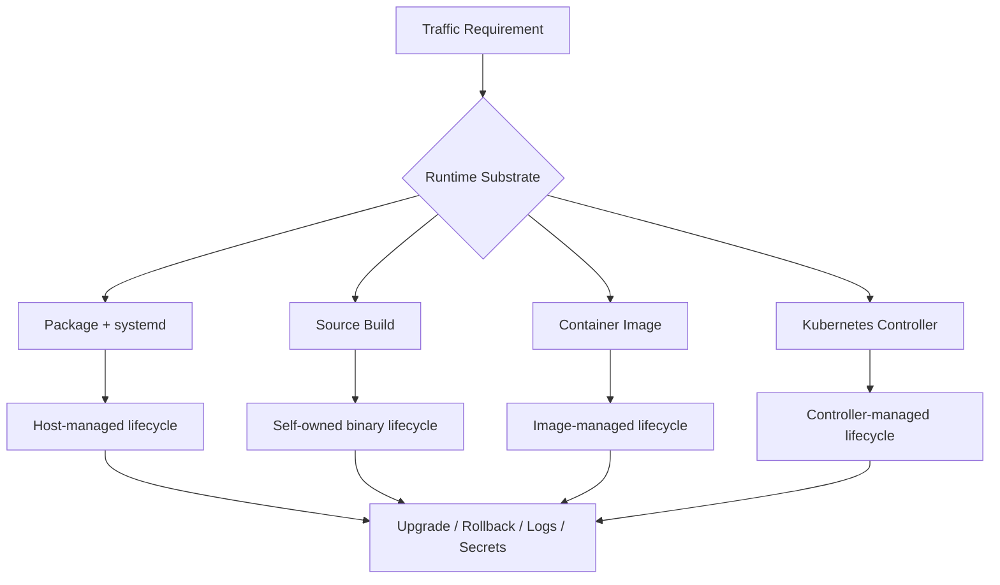

# Part 101 — systemd, Packages, and Container Images

> Goal: setelah part ini, kamu bisa memilih cara menjalankan NGINX secara defensible: package/systemd, build from source, container image, atau kombinasi. Bukan berdasarkan selera, tapi berdasarkan upgrade path, module boundary, rollback, observability, dan failure mode.

NGINX production bukan hanya `nginx.conf`. Ia adalah satu unit runtime yang terdiri dari:

1. binary NGINX,
2. module yang ikut dibangun atau dimuat,
3. file konfigurasi,
4. secret/certificate,
5. process supervisor,
6. filesystem layout,
7. log pipeline,
8. release/rollback mechanism,
9. security patch workflow.

Kalau kamu hanya mengelola file config, kamu belum mengelola NGINX. Kamu hanya mengelola sebagian kecil dari risk surface.

---

## 1. Deployment substrate adalah bagian dari arsitektur

Pertanyaan yang benar bukan:

> “NGINX sebaiknya di-install pakai apt atau Docker?”

Pertanyaan yang benar:

> “NGINX ini bagian dari control plane apa, failure domain apa, dan harus di-upgrade/rollback dengan mekanisme apa?”

Ada empat substrate umum:

| Substrate | Cocok untuk | Risiko utama |
|---|---|---|
| OS package + systemd | VM/bare metal edge, stable ops, long-running host | drift, package repo mismatch, manual config sprawl |
| Source build | module custom, patch khusus, eksperimen advanced | upgrade berat, CVE patch manual, reproducibility risk |
| Container image | immutable config/runtime, Kubernetes, platform CI/CD | wrong signal handling, ephemeral filesystem, config templating trap |
| Managed ingress/gateway | Kubernetes/platform abstraction | annotation sprawl, controller-specific behavior, hidden defaults |

Mental modelnya:



Substrate menentukan bagaimana kamu menjawab pertanyaan production:

- Siapa yang restart NGINX kalau process mati?
- Siapa yang rotate log?
- Bagaimana config diuji sebelum apply?
- Bagaimana certificate masuk?
- Bagaimana module dependency dikontrol?
- Bagaimana CVE ditambal?
- Bagaimana rollback dilakukan saat config valid tapi behavior salah?

---

## 2. Package + systemd: default production yang boring dan kuat

Untuk VM/bare metal, package resmi + systemd biasanya paling mudah dipertanggungjawabkan.

Kenapa?

- Package manager menangani file ownership.
- systemd menangani process supervision.
- Log path dan service unit predictable.
- Upgrade bisa masuk workflow OS patching.
- Security team biasanya sudah punya mekanisme audit untuk package.

Typical layout:

```txt
/etc/nginx/nginx.conf
/etc/nginx/conf.d/*.conf
/etc/nginx/snippets/*.conf
/var/log/nginx/access.log
/var/log/nginx/error.log
/var/cache/nginx/
/usr/sbin/nginx
/lib/systemd/system/nginx.service
```

### 2.1 Jangan anggap semua package sama

`nginx` dari distro repository, NGINX official repository, vendor image, dan custom package bisa punya perbedaan:

- versi binary,
- build flags,
- module statically compiled,
- dynamic module availability,
- default config,
- service unit,
- user/group,
- log path,
- SELinux/AppArmor profile,
- OpenSSL version,
- QUIC/HTTP/3 support.

Checklist audit binary:

```bash
nginx -V 2>&1 | tr ' ' '\n' | sort
```

Cari:

```txt
--prefix=
--conf-path=
--error-log-path=
--http-log-path=
--pid-path=
--lock-path=
--modules-path=
--with-http_ssl_module
--with-http_v2_module
--with-stream
--with-stream_ssl_module
--with-stream_ssl_preread_module
--with-debug
--with-http_slice_module
--with-http_stub_status_module
```

`nginx -V` adalah inventory runtime. Simpan output-nya sebagai artifact build atau audit record.

### 2.2 systemd lifecycle

Untuk package/systemd, operasi normal harus lewat systemd:

```bash
sudo systemctl status nginx
sudo systemctl reload nginx
sudo systemctl restart nginx
sudo journalctl -u nginx --since "1 hour ago"
```

Tetapi validasi config tetap lewat NGINX binary:

```bash
sudo nginx -t
sudo nginx -T
```

Prinsip:

- `nginx -t` untuk syntax/semantic validation.
- `nginx -T` untuk dump effective config, berguna untuk audit dan debugging include.
- `systemctl reload nginx` untuk apply reload lewat service manager.
- `systemctl restart nginx` hanya saat perlu process restart, bukan default deploy path.

NGINX reload dengan HUP akan memvalidasi config baru, mencoba membuka log/listen socket baru, lalu rollback ke config lama bila apply gagal. Jika sukses, master membuat worker baru dan meminta worker lama shutdown gracefully.

### 2.3 systemd hardening yang realistis

NGINX butuh akses ke:

- port bind,
- certificate/key,
- config,
- log,
- cache/temp path,
- upstream network,
- DNS resolver,
- optional UNIX socket.

Hardening systemd harus dimulai dari kebutuhan itu, bukan copy-paste.

Contoh override:

```ini
# /etc/systemd/system/nginx.service.d/override.conf
[Service]
LimitNOFILE=200000
Restart=on-failure
RestartSec=2s

# hardening candidates; test carefully
NoNewPrivileges=true
PrivateTmp=true
ProtectSystem=full
ProtectHome=true
ReadWritePaths=/var/log/nginx /var/cache/nginx /run /run/nginx
```

Jangan aktifkan `ProtectSystem=strict` sebelum memastikan:

- cache path writable,
- temp upload path writable,
- pid path writable,
- log path writable,
- certificate renewal path readable,
- dynamic module path readable.

### 2.4 File descriptor budget

NGINX capacity sering mentok bukan karena CPU, tapi FD.

Rough model:

```txt
required_fd ≈ client_connections
            + upstream_connections
            + listen_sockets
            + open_log_files
            + cached_open_files
            + temp/cache files
            + safety_margin
```

Di systemd, shell `ulimit` tidak cukup. Gunakan service limit:

```ini
[Service]
LimitNOFILE=200000
```

Lalu sinkronkan dengan NGINX:

```nginx
worker_processes auto;
worker_rlimit_nofile 200000;

events {
    worker_connections 32768;
}
```

Invariant:

> `worker_processes * worker_connections` tidak boleh lebih besar dari limit FD efektif tanpa alasan dan kapasitas OS yang sesuai.

---

## 3. Source build: powerful, tapi ownership-nya penuh

Build from source masuk akal bila kamu butuh:

- module yang tidak ada di package,
- build flag tertentu,
- debug binary,
- patch internal,
- reproducible custom distribution,
- test HTTP/3/QUIC dengan dependency tertentu,
- third-party module yang dikontrol ketat.

Tetapi konsekuensinya besar:

- kamu owner patch CVE,
- kamu owner compatibility OpenSSL/PCRE/zlib,
- kamu owner module ABI,
- kamu owner systemd unit,
- kamu owner logrotate,
- kamu owner upgrade test matrix,
- kamu owner rollback binary.

### 3.1 Build manifest wajib ada

Jangan pernah punya binary custom tanpa manifest.

Minimal:

```yaml
nginx:
  version: 1.30.3
  source_sha256: "..."
  configure_args:
    - --prefix=/usr/local/nginx
    - --conf-path=/etc/nginx/nginx.conf
    - --with-http_ssl_module
    - --with-http_v2_module
    - --with-stream
    - --with-stream_ssl_module
    - --with-stream_ssl_preread_module
    - --with-http_stub_status_module
  dependencies:
    openssl: "..."
    pcre2: "..."
    zlib: "..."
  modules:
    - name: ngx_brotli
      source: "..."
      commit: "..."
  built_at: "2026-07-07T00:00:00+07:00"
```

### 3.2 Reproducible build pipeline

Source build harus dibuat oleh CI, bukan laptop engineer.

Pipeline:


Artifact bisa berbentuk:

- `.deb`/`.rpm`,
- container image,
- tarball internal,
- VM image layer.

Yang penting: binary dan config deployment tidak liar.

### 3.3 Dynamic module risk

Dynamic module membuat deployment fleksibel, tetapi tetap punya compatibility risk.

Checklist:

- module dibangun terhadap versi NGINX yang sama,
- module path jelas,
- `load_module` berada di top-level config,
- startup test memverifikasi module load,
- rollback binary juga rollback module,
- module license/security review jelas.

Contoh:

```nginx
load_module modules/ngx_http_js_module.so;
load_module modules/ngx_stream_js_module.so;
```

Failure mode:

```txt
nginx: [emerg] module "/etc/nginx/modules/xxx.so" is not binary compatible
```

Ini bukan runtime warning. Ini startup/reload failure.

---

## 4. Container image: immutable runtime, bukan excuse untuk config chaos

Container NGINX cocok untuk:

- Kubernetes,
- ephemeral platform,
- immutable deployment,
- CI/CD-controlled config,
- self-contained lab/reproduction,
- sidecar/pod-level gateway,
- static asset image.

Tetapi container juga sering disalahgunakan:

- mount config liar dari host,
- generate config saat startup tanpa validation,
- run as root tanpa perlu,
- log ke file di ephemeral filesystem,
- reload process tidak jelas,
- certificate renewal tidak sinkron,
- PID 1/signal behavior salah.

### 4.1 Prinsip image production

Image NGINX production sebaiknya menjawab:

1. binary dari mana?
2. module apa saja?
3. config baked atau mounted?
4. secret/cert dari mana?
5. log ke stdout/stderr atau file?
6. health check apa?
7. bagaimana reload?
8. bagaimana graceful shutdown?
9. siapa owner patch image?
10. bagaimana rollback tag/digest?

### 4.2 Jangan deploy tag mutable tanpa digest control

Bad:

```yaml
image: nginx:latest
```

Better:

```yaml
image: nginx:1.30.3-alpine
```

Stronger:

```yaml
image: nginx@sha256:<digest>
```

Tag membantu manusia. Digest membantu supply-chain correctness.

### 4.3 Minimal Dockerfile untuk static assets

```dockerfile
FROM nginx:1.30.3-alpine

COPY nginx.conf /etc/nginx/nginx.conf
COPY conf.d/ /etc/nginx/conf.d/
COPY dist/ /usr/share/nginx/html/

RUN nginx -t

EXPOSE 8080
CMD ["nginx", "-g", "daemon off;"]
```

Catatan:

- `daemon off;` membuat NGINX tetap foreground sebagai container main process.
- `RUN nginx -t` memvalidasi build-time config.
- Runtime masih perlu smoke test karena environment/cert/volume bisa berbeda.

### 4.4 Non-root container

Port 80/443 biasanya butuh privilege binding. Di container/Kubernetes kamu bisa:

- expose port internal 8080/8443,
- biarkan Service/LoadBalancer map ke 80/443,
- run worker sebagai non-root,
- gunakan read-only root filesystem bila memungkinkan.

Contoh:

```nginx
pid /tmp/nginx.pid;

worker_processes auto;

events { worker_connections 4096; }

http {
    client_body_temp_path /tmp/client_temp;
    proxy_temp_path       /tmp/proxy_temp;
    fastcgi_temp_path     /tmp/fastcgi_temp;
    uwsgi_temp_path       /tmp/uwsgi_temp;
    scgi_temp_path        /tmp/scgi_temp;

    server {
        listen 8080;
        root /usr/share/nginx/html;
        location / { try_files $uri $uri/ /index.html; }
    }
}
```

Filesystem invariant:

> Jika container filesystem read-only, semua path yang NGINX tulis harus diarahkan ke writable volume/tmpfs.

### 4.5 Logs di container

Container pattern umum:

```nginx
access_log /dev/stdout main_json;
error_log  /dev/stderr warn;
```

Jangan diam-diam log ke `/var/log/nginx/*.log` di ephemeral container kecuali ada sidecar/agent/volume yang sengaja mengambilnya.

### 4.6 Startup templating official image

Official NGINX Docker image mendukung template melalui `/etc/nginx/templates` yang diproses sebelum NGINX start. Ini berguna, tetapi jangan jadikan alasan menaruh business logic di shell startup.

Contoh:

```nginx
# /etc/nginx/templates/default.conf.template
server {
    listen ${NGINX_PORT};
    server_name ${NGINX_HOST};

    location / {
        proxy_pass http://${UPSTREAM_HOST}:${UPSTREAM_PORT};
    }
}
```

Risiko:

- missing env menghasilkan config invalid atau lebih buruk: config valid tapi salah,
- escaping buruk,
- secret masuk log,
- variable NGINX dan variable shell tertukar,
- startup berbeda antar environment.

Tambahkan entrypoint guard:

```sh
set -eu
: "${NGINX_PORT:?required}"
: "${NGINX_HOST:?required}"
: "${UPSTREAM_HOST:?required}"
: "${UPSTREAM_PORT:?required}"
nginx -t
exec nginx -g 'daemon off;'
```

### 4.7 Reload di container

Ada dua model:

#### Model A — immutable restart

Config berubah berarti image/configmap berubah, pod/container diganti.

Cocok untuk:

- Kubernetes Deployment,
- static assets,
- config generated by CI,
- GitOps.

#### Model B — in-place reload

Kirim HUP/reload ke process berjalan.

Cocok untuk:

- VM/systemd,
- long-lived edge node,
- certificate renewal local,
- NGINX Plus dynamic operations tertentu.

Di Kubernetes, in-place reload bisa dilakukan oleh controller/sidecar, tapi jangan membuat ad-hoc HTTP endpoint untuk reload tanpa security boundary.

---

## 5. Config delivery patterns

Ada empat pola utama.

### 5.1 Baked config

Config masuk image.

Pros:

- immutable,
- mudah rollback,
- mudah audit,
- cocok untuk static site/app edge.

Cons:

- environment-specific config butuh image berbeda atau templating,
- secret tidak boleh baked,
- update cert/config perlu redeploy image.

### 5.2 Mounted config

Config masuk via volume/ConfigMap.

Pros:

- fleksibel,
- cocok untuk platform/k8s,
- tidak perlu rebuild image.

Cons:

- drift risk,
- reload orchestration perlu jelas,
- config bisa berubah tanpa artifact immutable,
- bad config bisa mematahkan startup.

### 5.3 Generated config

Config dihasilkan dari registry/model.

Pros:

- scalable untuk banyak route/tenant,
- enforce invariant,
- review bisa dilakukan di source model.

Cons:

- generator menjadi critical system,
- bug generator bisa berdampak luas,
- perlu golden tests.

### 5.4 Dynamic runtime API

Beberapa kemampuan dynamic tersedia di NGINX Plus/commercial boundary.

Pros:

- update upstream tanpa full reload,
- useful untuk high-churn service discovery.

Cons:

- state/config split,
- audit perlu ekstra,
- rollback lebih kompleks,
- feature boundary harus jelas.

---

## 6. Certificate and secret delivery

Jangan desain NGINX deployment tanpa menjawab secret lifecycle.

### 6.1 VM/systemd

Common pattern:

```txt
/etc/letsencrypt/live/example.com/fullchain.pem
/etc/letsencrypt/live/example.com/privkey.pem
```

Deploy hook:

```bash
nginx -t && systemctl reload nginx
```

Checklist:

- key permission minimal,
- renewal hook validasi config,
- expiry alert,
- rollback cert path,
- default server certificate aman,
- no private key in artifact logs.

### 6.2 Container/Kubernetes

Common pattern:

- TLS secret mounted as volume,
- cert-manager rotates secret,
- controller reloads NGINX,
- pod watches file changes, atau controller regenerates config.

Risiko:

- secret updated tapi NGINX belum reload,
- symlink/atomic update tidak sesuai expectation,
- pod restarted tanpa cert ready,
- multi-cert SNI mismatch.

Invariant:

> Certificate rotation is not complete until NGINX has loaded the new certificate and external probe confirms the served certificate changed.

---

## 7. Upgrade strategy

Upgrade NGINX bukan hanya versi angka. Upgrade mengubah:

- parser config,
- directive defaults,
- module behavior,
- OpenSSL behavior,
- TLS protocol defaults,
- HTTP/2/HTTP/3 behavior,
- bug/security fixes,
- deprecated directive warnings.

### 7.1 Upgrade ring


At each stage:

```bash
nginx -V
nginx -t
nginx -T > effective-nginx.conf
curl smoke endpoints
check access/error logs
check cert served
check cache status
check upstream status
```

### 7.2 Rollback strategy

Rollback harus mencakup:

- binary/package/image,
- config,
- dynamic modules,
- certificates if related,
- generated config schema,
- runtime flags/env.

Jangan cuma rollback `nginx.conf` kalau problem berasal dari image/module/OpenSSL.

---

## 8. Recommended decision matrix

| Situation | Recommended substrate |
|---|---|
| Single VM reverse proxy | Official package + systemd |
| Enterprise bare-metal edge | Package/systemd or internal RPM/DEB |
| Kubernetes ingress | NGINX Ingress Controller / Gateway Fabric / managed ingress |
| App-specific sidecar gateway | Container image |
| Static frontend assets | Container image with baked assets/config |
| Multi-tenant static hosting VM | Package/systemd + generated config |
| Need custom module | Reproducible source build → internal package/image |
| Need active health checks/dynamic upstream API | Evaluate NGINX Plus or alternative control plane |
| Need high-churn service discovery | Kubernetes/controller pattern or carefully designed resolver strategy |

---

## 9. Production deployment checklist

```txt
[ ] nginx -V captured and stored
[ ] binary version pinned
[ ] module list known
[ ] config effective dump available
[ ] config passes nginx -t in CI and target environment
[ ] logs go to expected pipeline
[ ] certificate/key delivery tested
[ ] reload/restart path tested
[ ] rollback path tested
[ ] health check endpoint defined
[ ] smoke test covers server_name/SNI/path/upstream/cache
[ ] FD limits sized
[ ] writable paths explicit
[ ] default server catches unknown host
[ ] security headers tested
[ ] CVE patch workflow defined
[ ] image/package digest or version pinned
[ ] alert exists for reload failure/startup failure
```

---

## 10. Failure modes

| Symptom | Likely cause | First checks |
|---|---|---|
| `systemctl reload nginx` fails | invalid config, missing cert, port conflict | `nginx -t`, journal, error log |
| container exits immediately | bad config, missing env, read-only path | `docker logs`, `nginx -t`, file permissions |
| config works in CI but not prod | missing mounted secret/path/module | `nginx -V`, `nginx -T`, volume inspect |
| cert renewed but old cert served | no reload, wrong cert path, default server | `openssl s_client`, logs, reload hook |
| high 502 after deploy | upstream env mismatch, DNS, keepalive, proxy_pass path | access log `$upstream_*`, error log |
| cannot bind port 80 | non-root, missing capability, port already used | process list, container port, systemd capabilities |
| logs missing | log path wrong, stdout not used, permission | `nginx -T`, filesystem, collector config |
| rollback did not fix | module/binary/env changed too | artifact diff, image digest, `nginx -V` |

---

## 11. Reference implementation: package/systemd deploy script

```bash
#!/usr/bin/env bash
set -euo pipefail

release_dir="/opt/nginx-releases/$1"
current_link="/etc/nginx/current"
backup_link="/etc/nginx/previous"

if [[ ! -d "$release_dir" ]]; then
  echo "missing release dir: $release_dir" >&2
  exit 1
fi

sudo ln -sfn "$(readlink -f "$current_link" || true)" "$backup_link" || true
sudo ln -sfn "$release_dir" "$current_link"

sudo nginx -t -c /etc/nginx/current/nginx.conf
sudo systemctl reload nginx

sleep 2
curl -fsS http://127.0.0.1/healthz >/dev/null

echo "deployed $release_dir"
```

Rollback:

```bash
sudo ln -sfn "$(readlink -f /etc/nginx/previous)" /etc/nginx/current
sudo nginx -t -c /etc/nginx/current/nginx.conf
sudo systemctl reload nginx
```

Important: this pattern assumes your `nginx.service` starts NGINX with `-c /etc/nginx/current/nginx.conf` or the default config includes that path. Do not invent symlink release layout without aligning systemd unit and NGINX config path.

---

## 12. What top engineers internalize

The deployment substrate is not boring plumbing. It is the control surface for every production guarantee.

Top-level invariant:

> You do not have a production NGINX deployment until binary, modules, config, certs, process lifecycle, logs, reload, rollback, and patch workflow are all versioned or operationally controlled.

NGINX itself is stable and fast. Most production incidents come from the system around it:

- untracked config drift,
- wrong module assumptions,
- broken cert reload,
- container filesystem surprises,
- systemd limits,
- mutable image tags,
- untested generated config,
- rollback that only rolls back half the state.

Deployment architecture decides whether NGINX is a reliable edge component or a hidden source of operational entropy.

---

## References

- NGINX Docs — Installing NGINX Open Source: https://docs.nginx.com/nginx/admin-guide/installing-nginx/installing-nginx-open-source/
- NGINX Docs — Control NGINX Processes at Runtime: https://docs.nginx.com/nginx/admin-guide/basic-functionality/runtime-control/
- NGINX.org — Controlling nginx: https://nginx.org/en/docs/control.html
- NGINX.org — Command-line parameters: https://nginx.org/en/docs/switches.html
- NGINX.org — Building nginx from Sources: https://nginx.org/en/docs/configure.html
- Docker Hub — Official nginx image: https://hub.docker.com/_/nginx
