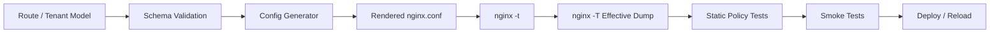
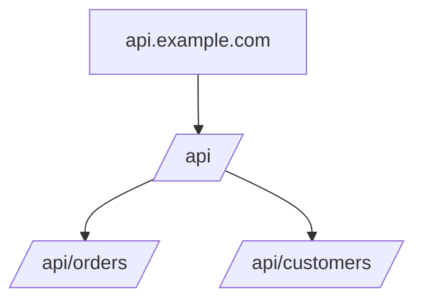
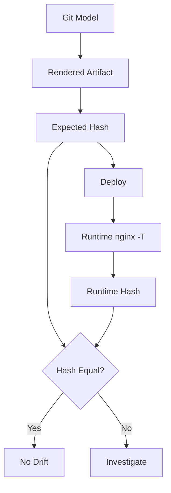

# Part 102 — Config Generation, Templating, and Validation

> Goal: setelah part ini, kamu bisa mendesain workflow konfigurasi NGINX yang scalable, reviewable, testable, dan rollbackable. Fokusnya bukan “pakai template engine apa”, tapi bagaimana config menjadi artifact yang aman.

NGINX config adalah bahasa deklaratif dengan side effect besar. Satu baris salah bisa:

- membuka route internal ke publik,
- mengubah cache key dan membocorkan data user,
- menghapus security header karena inheritance,
- membuat regex location override route penting,
- mengubah `proxy_pass` URI semantics,
- menyebabkan reload gagal karena cert missing,
- membuat redirect loop,
- membuat retry menggandakan request non-idempotent,
- membuat NGINX tetap running dengan config lama sementara tim mengira deploy sukses.

Config generation bukan convenience. Untuk sistem besar, config generation adalah safety system.

---

## 1. Config sebagai compiled artifact

Cara berpikir yang kuat:

```txt
source model --> generator --> nginx config --> nginx -t --> smoke test --> deploy
```

Jangan langsung menulis NGINX config besar sebagai source of truth bila sistemnya punya banyak tenant/route/service.

Lebih aman:

- manusia mengedit model kecil yang typed/validated,
- generator menghasilkan NGINX config deterministik,
- CI memvalidasi output,
- deploy memakai artifact yang sudah diuji.



Invariant:

> Production NGINX config should be treated like compiled code, not like mutable server notes.

---

## 2. Source of truth design

A generated config system needs a source model. Example:

```yaml
routes:
  - id: orders-api
    host: api.example.com
    path_prefix: /orders/
    upstream: orders-service
    auth: external
    rate_limit: api-standard
    cache: none
    retry_policy: idempotent-only
    timeout_profile: api-standard

  - id: assets
    host: static.example.com
    path_prefix: /
    root: /srv/static/current
    cache: immutable-assets
    security_headers: strict-static

upstreams:
  - id: orders-service
    servers:
      - address: orders-1.internal:8080
      - address: orders-2.internal:8080
    keepalive: 64

rate_limits:
  - id: api-standard
    key: client_identity
    rate: 20r/s
    burst: 100
    mode: delay
```

The model should describe intent, not NGINX syntax.

Bad model:

```yaml
nginx_snippet: |
  location /orders/ {
    proxy_pass http://orders;
  }
```

Better model:

```yaml
path_prefix: /orders/
upstream: orders-service
uri_policy: preserve_prefix
```

Raw snippets are escape hatches. Treat them as privileged operations requiring stricter review.

---

## 3. Why manual config does not scale

Manual NGINX config works when:

- few routes,
- few engineers,
- low change rate,
- low compliance burden,
- simple rollback.

It fails when:

- hundreds of routes,
- many teams,
- tenant-specific policy,
- generated certs,
- service discovery,
- repeated snippets,
- frequent canaries,
- platform ownership split.

Manual sprawl symptoms:

```txt
conf.d/
  team-a.conf
  team-a-new.conf
  team-a-final.conf
  team-a-hotfix.conf
  old-do-not-delete.conf
  copy-of-prod.conf
  temporary.conf
```

This is not configuration management. It is sediment.

---

## 4. Template engine is not the core problem

You can use:

- Jinja2,
- Helm templates,
- Go templates,
- Jsonnet,
- CUE,
- Dhall,
- CueLang + generator,
- Terraform templates,
- Kustomize,
- custom code generator.

The engine is secondary. The invariants matter more.

A safe generator must be:

1. deterministic,
2. schema-validated,
3. tested,
4. diff-friendly,
5. idempotent,
6. explicit about defaults,
7. explicit about feature boundaries,
8. capable of producing effective artifacts,
9. able to fail closed,
10. auditable.

---

## 5. Templating hazards

### 5.1 String escaping

NGINX config syntax is not YAML, JSON, shell, or JavaScript. Escaping mistakes matter.

Danger:

```nginx
server_name {{ host }};
```

If `host` is not validated, you can render invalid or dangerous config.

Validate host:

```txt
^[a-z0-9]([a-z0-9-]{0,61}[a-z0-9])?(\.[a-z0-9]([a-z0-9-]{0,61}[a-z0-9])?)*$
```

Do not merely escape. Validate the domain-specific shape.

### 5.2 Regex injection

Bad:

```nginx
location ~ {{ user_supplied_regex }} {
    proxy_pass http://backend;
}
```

A route owner should not be able to inject arbitrary regex unless your platform explicitly supports it and tests it.

Prefer exact/prefix route model:

```yaml
path_prefix: /api/v1/orders/
```

Generate:

```nginx
location ^~ /api/v1/orders/ {
    proxy_pass http://orders_backend;
}
```

### 5.3 `proxy_pass` slash trap

Do not let templates produce ambiguous URI behavior.

Bad:

```nginx
location {{ path }} {
    proxy_pass http://{{ upstream }}{{ upstream_path }};
}
```

The presence/absence of trailing slash changes URI replacement semantics.

Make URI policy explicit:

```yaml
uri_policy: preserve_original_uri
```

or:

```yaml
uri_policy: strip_prefix
strip_prefix: /api/orders/
upstream_prefix: /
```

Then generator emits known patterns.

### 5.4 Header inheritance trap

`add_header` and `proxy_set_header` have inheritance behavior that surprises people.

Bad generator behavior:

```nginx
http {
    add_header X-Frame-Options DENY always;

    server {
        location /api/ {
            add_header X-Request-Class api always;
        }
    }
}
```

Depending on directive inheritance, defining header at lower level can shadow inherited headers if not repeated or if inheritance semantics are not explicitly managed.

Generator should emit complete header block per policy scope, not rely on accidental inheritance.

### 5.5 `if` generation

Avoid generating `if` inside `location` unless the generator encodes a known-safe pattern.

Prefer:

```nginx
map $http_origin $cors_origin {
    default "";
    "https://app.example.com" $http_origin;
}
```

Over many runtime `if` blocks.

---

## 6. Schema validation before rendering

Example JSON Schema-ish constraints:

```yaml
route:
  required:
    - id
    - host
    - path_prefix
    - upstream
  constraints:
    id: "^[a-z0-9][a-z0-9-]{1,62}$"
    host: valid_dns_name
    path_prefix: starts_with_slash
    upstream: existing_upstream_id
    timeout_profile: existing_timeout_profile
    rate_limit: existing_rate_limit_id_or_none
```

Semantic validation:

- no duplicate host/path ownership,
- no overlapping route unless priority explicit,
- no regex route before prefix route without justification,
- no public route to internal upstream,
- no cache policy on authenticated route unless allowlisted,
- no `Access-Control-Allow-Origin: *` with credentials,
- no `proxy_cache` with `Set-Cookie` unless blocked,
- no mTLS optional route without enforcement variable,
- no unsafe retry on non-idempotent route,
- no generated upstream with zero servers unless backup/fallback explicit.

Validation should fail before rendering NGINX config.

---

## 7. Static policy tests on rendered config

After render, inspect generated config.

Examples:

```bash
# no accidental default catch-all proxy
! grep -R "server_name _;.*proxy_pass" build/nginx.conf

# every public TLS server has HSTS policy marker
grep -R "Strict-Transport-Security" build/nginx.conf

# no wildcard CORS with credentials
! grep -R "Access-Control-Allow-Origin \*" build/nginx.conf || exit 1
```

Better: parse the model rather than grep config, but grep-style tests still catch regressions cheaply.

---

## 8. `nginx -t` is necessary but not sufficient

`nginx -t` catches:

- syntax error,
- unknown directive,
- invalid context,
- missing certificate file,
- module not loaded,
- invalid parameters,
- some duplicate/conflict cases.

It does not prove:

- route correctness,
- security policy correctness,
- cache key safety,
- CORS correctness,
- upstream reachability,
- SNI behavior,
- redirect correctness,
- expected default server behavior,
- app-level auth semantics,
- performance/capacity.

Therefore pipeline must include:

```txt
schema validation
+ render
+ nginx -t
+ nginx -T capture
+ static policy tests
+ smoke tests
+ canary
```

---

## 9. Effective config dump

`nginx -T` is underused. It prints effective config, including included files.

Use it to create deploy artifact:

```bash
nginx -T -c "$PWD/build/nginx.conf" > build/effective-nginx.conf
```

Store:

```txt
build/effective-nginx.conf
build/nginx-version.txt
build/generator-version.txt
build/source-model.yaml
build/policy-test-result.json
```

This makes incident review easier:

> “What config did NGINX actually load?”

not:

> “What config do we think Git had?”

---

## 10. Smoke testing generated config

Smoke tests should verify externally visible behavior.

Minimum suite:

```bash
#!/usr/bin/env bash
set -euo pipefail

base="http://127.0.0.1:8080"

curl -fsS -H 'Host: api.example.com' "$base/healthz"
curl -fsS -H 'Host: static.example.com' "$base/assets/app.abc123.js"

# unknown host should not proxy to real app
status=$(curl -s -o /dev/null -w '%{http_code}' -H 'Host: unknown.example.com' "$base/")
test "$status" = "444" -o "$status" = "404"

# protected admin route should reject unauthenticated request
status=$(curl -s -o /dev/null -w '%{http_code}' -H 'Host: admin.example.com' "$base/admin/")
test "$status" = "401" -o "$status" = "403"

# HTTP to HTTPS redirect should be canonical
status=$(curl -s -o /dev/null -w '%{http_code}' -H 'Host: app.example.com' "$base/")
test "$status" = "301" -o "$status" = "308"
```

For container test:

```bash
docker run --rm -d --name nginx-test -p 8080:8080 my-nginx-candidate
trap 'docker rm -f nginx-test' EXIT
sleep 1
./smoke.sh
```

---

## 11. Golden tests for generator

Generator should have golden output tests.

Example:

```txt
testdata/
  simple-api.input.yaml
  simple-api.expected.conf
  static-site.input.yaml
  static-site.expected.conf
  cors.input.yaml
  cors.expected.conf
  cache-private.input.yaml
  cache-private.expected.conf
```

Test flow:

```bash
generator render testdata/simple-api.input.yaml > actual.conf
diff -u testdata/simple-api.expected.conf actual.conf
nginx -t -c "$PWD/actual.conf"
```

Golden tests are not enough, but they catch accidental output changes.

---

## 12. Property-style tests for route overlap

Route collision is common in generated systems.

Example model:

```yaml
routes:
  - id: api-root
    host: api.example.com
    path_prefix: /api/
  - id: order-api
    host: api.example.com
    path_prefix: /api/orders/
```

This is not necessarily wrong, but priority must be explicit.

Generator should model route tree:



Validation rule:

```txt
If route A is prefix of route B on same host,
then either:
  - both map to same policy family, or
  - explicit priority/ownership exists, or
  - reject config.
```

---

## 13. Drift control

There are two forms of drift:

### 13.1 Source drift

Git/model says one thing; rendered artifact says another.

Fix:

- render in CI,
- commit or publish rendered artifact,
- compare hash,
- sign build.

### 13.2 Runtime drift

Deployed NGINX runs config not matching expected artifact.

Fix:

```bash
nginx -T > /tmp/runtime-effective.conf
sha256sum /tmp/runtime-effective.conf
```

Compare with expected artifact.

In Kubernetes:

- compare ConfigMap/Secret hash annotations,
- compare pod image digest,
- expose config generation version label,
- restart/reload controller must record last applied hash.

Drift detection model:



---

## 14. Reload safety in generated systems

Reload pipeline:

```bash
render config
nginx -t -c build/nginx.conf
copy config atomically
nginx -s reload
verify smoke endpoint
verify version/hash endpoint/log marker
```

Do not copy partial config into active include directory.

Bad:

```bash
cp generated/*.conf /etc/nginx/conf.d/
nginx -s reload
```

If process is interrupted, config directory can be half-updated.

Better:

```bash
release="/etc/nginx/releases/$(date +%Y%m%d%H%M%S)"
mkdir -p "$release"
cp -r generated/* "$release/"
ln -sfn "$release" /etc/nginx/current
nginx -t -c /etc/nginx/current/nginx.conf
nginx -s reload
```

Or use image immutability and rollout replacement.

---

## 15. Config ownership model

Large orgs need route ownership.

Example:

```yaml
route:
  id: payments-api
  owner_team: payments-platform
  pager: payments-oncall
  data_classification: financial
  public: true
  auth_required: true
  change_approval: security-required
```

Why this matters:

- incident routing,
- compliance review,
- expired route cleanup,
- cache/privacy policy,
- rate limit exceptions,
- certificate ownership,
- migration planning.

Config without ownership becomes infrastructure debt.

---

## 16. Change classes

Not all config changes are equal.

| Change | Risk | Required gate |
|---|---:|---|
| Add static asset route | Low | schema + smoke |
| Add API reverse proxy | Medium | schema + auth/rate review |
| Change cache key | High | security + privacy review |
| Enable CORS credentials | High | security review |
| Add wildcard host | High | platform/security review |
| Change default server | High | broad smoke/canary |
| Enable retry for POST | Critical | architecture review |
| Add raw NGINX snippet | Critical | senior/platform approval |
| Change TLS/HSTS preload | Critical | staged rollout |

Implement these as policy, not tribal memory.

---

## 17. Raw snippet policy

Raw snippets are sometimes necessary. They are also dangerous.

Snippet classes:

```yaml
snippet_policy:
  disabled_by_default: true
  allowed_contexts:
    - server
    - location
  forbidden_directives:
    - proxy_pass
    - root
    - alias
    - rewrite
    - return
    - ssl_certificate
    - ssl_certificate_key
    - add_header
  approval_required: platform-security
```

Alternative: expose safe high-level features instead of raw snippets.

Instead of:

```yaml
snippet: |
  add_header X-Robots-Tag "noindex" always;
```

Expose:

```yaml
robots_policy: noindex
```

Generator emits known-safe config.

---

## 18. Generated config layout

A generated layout should be readable.

Example:

```txt
build/nginx/
  nginx.conf
  generated/
    00-maps.conf
    10-upstreams.conf
    20-servers/
      api.example.com.conf
      static.example.com.conf
    30-policies/
      rate-limits.conf
      cache-zones.conf
  snippets/
    proxy-common.conf
    security-headers.conf
```

Each generated file should include metadata comments:

```nginx
# generated-by: nginx-platform-generator 2.4.1
# source-model-sha256: 5c9e...
# route-id: orders-api
# owner: payments-platform
# do-not-edit: true
```

Comments do not affect runtime but improve incident response.

---

## 19. Include order as contract

Include order can change behavior.

Bad:

```nginx
include conf.d/*.conf;
```

This relies on filename ordering. It can be acceptable only if naming convention is strict.

Better:

```nginx
include generated/00-maps.conf;
include generated/10-upstreams.conf;
include generated/20-servers/*.conf;
```

Invariant:

> Include order must be deterministic and documented.

---

## 20. Policy-as-code examples

### 20.1 Authenticated routes must not use public cache

Pseudo-policy:

```rego
package nginx.policy

deny[msg] {
  route := input.routes[_]
  route.auth != "none"
  route.cache == "public"
  msg := sprintf("authenticated route %s cannot use public cache", [route.id])
}
```

### 20.2 CORS credentials cannot use wildcard origin

```rego
deny[msg] {
  route := input.routes[_]
  route.cors.credentials == true
  route.cors.allow_origin == "*"
  msg := sprintf("route %s uses wildcard CORS with credentials", [route.id])
}
```

### 20.3 POST retry is forbidden by default

```rego
deny[msg] {
  route := input.routes[_]
  route.retry_policy.includes_non_idempotent == true
  not route.approvals[_] == "architecture-review"
  msg := sprintf("route %s enables non-idempotent retry without approval", [route.id])
}
```

---

## 21. Generated observability

Generator should emit observability labels.

Example:

```nginx
map $host$request_uri $route_id {
    default "unknown";
    ~^api\.example\.com/api/orders/ "orders-api";
}

log_format main_json escape=json
  '{'
    '"time":"$time_iso8601",'
    '"route_id":"$route_id",'
    '"status":$status,'
    '"request_time":$request_time,'
    '"upstream_addr":"$upstream_addr",'
    '"upstream_status":"$upstream_status"'
  '}';
```

But beware: route labelling by `$request_uri` can be expensive/fragile for large configs. Prefer generated labels inside specific locations when possible:

```nginx
location ^~ /api/orders/ {
    set $route_id orders-api;
    proxy_pass http://orders_backend;
}
```

---

## 22. Config version visibility

Expose a safe internal endpoint:

```nginx
server {
    listen 127.0.0.1:8081;
    server_name localhost;

    location = /nginx-config-version {
        default_type application/json;
        return 200 '{"config_sha":"5c9e...","generated_by":"nginx-platform-generator 2.4.1"}\n';
    }
}
```

Do not expose sensitive config details publicly.

Useful for:

- smoke tests,
- canary confirmation,
- incident debugging,
- drift detection.

---

## 23. Multi-environment promotion

Avoid “render independently per env with hidden differences”.

Better:

```txt
dev model + env overlay --> rendered dev artifact
staging model + env overlay --> rendered staging artifact
prod model + env overlay --> rendered prod artifact
```

Diff the intent:

```bash
diff -u build/staging/model.normalized.yaml build/prod/model.normalized.yaml
```

Diff the rendered config:

```bash
diff -u build/staging/effective-nginx.conf build/prod/effective-nginx.conf
```

Expected differences should be explainable:

- hostnames,
- upstream addresses,
- cert paths,
- rate limits maybe stricter/looser,
- cache TTL maybe different,
- logging verbosity,
- feature flags.

Unexpected differences should block promotion.

---

## 24. Canarying generated config

Config canary is not just upstream canary.

You can canary:

- one edge node,
- one AZ,
- one region,
- one tenant,
- one hostname,
- one route family,
- one client cohort.

Config canary checks:

```txt
[ ] reload success
[ ] no error log spike
[ ] unknown host still blocked
[ ] 2xx/3xx/4xx distribution unchanged or expected
[ ] 499/502/504 not spiking
[ ] upstream latency unchanged
[ ] cache HIT ratio expected
[ ] security headers present
[ ] cert served correctly
[ ] route_id logs populated
```

---

## 25. Incident rollback for generated config

Rollback flow:

```bash
current=$(readlink -f /etc/nginx/current)
previous=$(readlink -f /etc/nginx/previous)

ln -sfn "$previous" /etc/nginx/current
nginx -t -c /etc/nginx/current/nginx.conf
nginx -s reload
curl -fsS http://127.0.0.1:8081/nginx-config-version
```

If rollback fails, likely shared dependency changed:

- cert file removed,
- module removed,
- binary upgraded,
- path permission changed,
- upstream DNS changed,
- env var missing.

This is why config artifact alone is not the whole runtime artifact.

---

## 26. Minimal generator architecture

A pragmatic generator can be small.

```txt
cmd/nginxgen
internal/model
internal/schema
internal/policy
internal/render
internal/golden
internal/smoke
```

Render API:

```go
func Render(model Model) (RenderedConfig, error) {
    normalized, err := Normalize(model)
    if err != nil { return RenderedConfig{}, err }

    if err := ValidateSchema(normalized); err != nil { return RenderedConfig{}, err }
    if err := ValidatePolicy(normalized); err != nil { return RenderedConfig{}, err }

    return RenderTemplates(normalized)
}
```

Key idea:

> Templating is the last step, not the first step.

---

## 27. Anti-pattern catalog

| Anti-pattern | Why it fails |
|---|---|
| Humans edit generated files | source of truth splits |
| Raw snippets everywhere | platform cannot enforce invariants |
| `include *.conf` without naming contract | order-dependent behavior |
| `nginx -t` only | syntax-valid unsafe config still deploys |
| Missing effective config artifact | incident review guesses runtime state |
| No route owner | no one owns risk/incident |
| Hidden env substitution | config differs across runtime silently |
| Mutable Docker tag | rollback/forensics ambiguous |
| Direct prod SSH hotfix | drift and audit failure |
| One giant config file | review and ownership collapse |
| Copy-paste CORS/cache headers | privacy/security regression |
| No default server test | unknown host may hit real app |
| Regex routes without priority rules | route shadowing |

---

## 28. Production checklist

```txt
[ ] source model is schema validated
[ ] generator is deterministic
[ ] generated config is not manually edited
[ ] raw snippets disabled or governed
[ ] route ownership exists
[ ] route overlap detection exists
[ ] cache/auth/CORS/retry policies validated
[ ] include order deterministic
[ ] nginx -t runs in CI
[ ] nginx -T artifact stored
[ ] smoke tests cover host/path/SNI/default server
[ ] config hash visible internally
[ ] canary rollout exists
[ ] rollback artifact exists
[ ] runtime drift detection exists
[ ] generated logs include route/service ownership labels
[ ] certificate/secret path validation included
[ ] module/binary version captured
```

---

## 29. What top engineers internalize

NGINX config generation is not about reducing typing. It is about preserving invariants under scale.

The mature path is:

```txt
manual config
  -> structured snippets
  -> generated config from typed model
  -> policy-as-code
  -> effective config artifact
  -> drift detection
  -> canary/rollback automation
```

The key mental shift:

> NGINX config is an executable artifact at the traffic boundary. Treat it with the same rigor as application code, but with stricter rollback and policy controls because its blast radius is broader.

If config can change routing, identity, cache, TLS, or retry semantics, then config is architecture.

---

## References

- NGINX.org — Command-line parameters: https://nginx.org/en/docs/switches.html
- NGINX.org — Controlling nginx: https://nginx.org/en/docs/control.html
- NGINX.org — Beginner's Guide / configuration structure: https://nginx.org/en/docs/beginners_guide.html
- NGINX.org — Proxy module: https://nginx.org/en/docs/http/ngx_http_proxy_module.html
- NGINX.org — Headers module: https://nginx.org/en/docs/http/ngx_http_headers_module.html
- NGINX.org — Map module: https://nginx.org/en/docs/http/ngx_http_map_module.html
- Docker Hub — Official nginx image templating behavior: https://hub.docker.com/_/nginx
