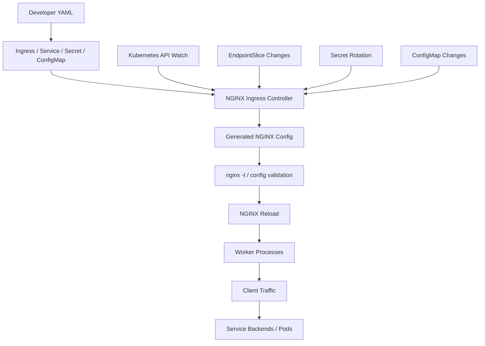
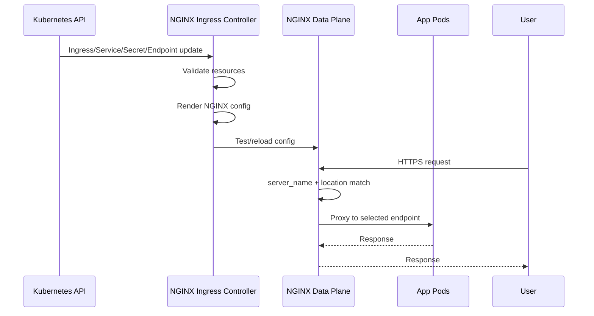
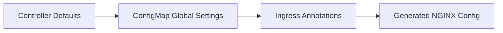
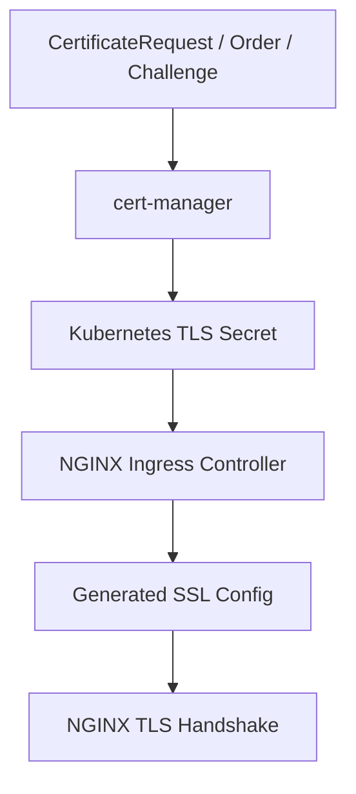
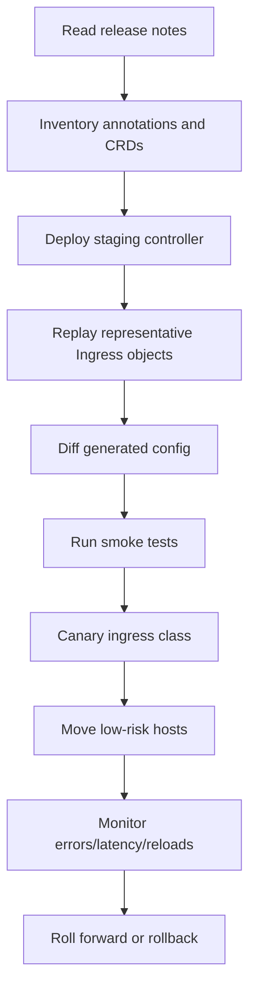

# Part 103 — NGINX Ingress Controller In Action

This part moves NGINX from a server you configure directly into a **Kubernetes-managed edge data plane**.

The dangerous mental shift is this:

> In Kubernetes, you usually do not edit `nginx.conf` directly. You declare Kubernetes resources, and a controller compiles those resources into NGINX configuration.

That single sentence explains most production mistakes with Ingress.

People debug the generated NGINX as if the YAML were the runtime. It is not. YAML is the **source model**. NGINX config is the **compiled artifact**. The running NGINX workers are the **data plane**. The controller is the **compiler + reconciler**.



If you remember only one invariant from this chapter:

> Ingress correctness is not just whether Kubernetes accepted the object. It is whether the controller accepted it, generated the expected NGINX config, reloaded safely, and routed traffic to healthy endpoints with the intended policy.

---

## 1. What Problem Ingress Solves

Kubernetes `Service` gives stable in-cluster addressing. It does not automatically solve public edge traffic.

A typical application needs:

- public DNS name,
- TLS termination,
- host/path routing,
- request size limits,
- timeout policy,
- WebSocket/gRPC support,
- rate limits,
- real client IP handling,
- logging and metrics,
- safe reload when pods change,
- isolation between teams.

Ingress provides a Kubernetes API shape for this. An Ingress Controller implements that API and turns it into runtime behavior.

NGINX Ingress Controller is one implementation. In this part, “NGINX Ingress Controller” refers to **F5 NGINX Ingress Controller**, not the separate community `ingress-nginx` project maintained under the Kubernetes GitHub organization. Both use NGINX concepts, but their annotations, templates, implementation details, and support model differ.

Do not mix their documentation blindly.

---

## 2. Control Plane vs Data Plane

The controller has two major roles.

### Control plane role

It watches Kubernetes resources:

- `Ingress`,
- `Service`,
- `EndpointSlice` / endpoint data,
- `Secret`,
- `ConfigMap`,
- optional CRDs such as `VirtualServer`, `VirtualServerRoute`, `TransportServer`, and policies depending on installation.

Then it validates the model, generates NGINX configuration, and reloads NGINX.

### Data plane role

NGINX accepts traffic and executes the generated config:

- listen on HTTP/HTTPS/TCP/UDP ports,
- terminate TLS,
- select virtual host,
- match paths,
- proxy to upstream pods,
- apply buffer/timeout/header/rate/auth policies,
- emit logs and metrics.

The data plane does not care that the source was YAML. By the time a request arrives, the runtime is still NGINX.



Production debugging must always ask:

1. Was the Kubernetes object accepted?
2. Did the controller accept it?
3. Did it render the expected config?
4. Did NGINX reload successfully?
5. Did endpoint discovery produce the intended upstreams?
6. Did request matching choose the intended route?
7. Did the backend accept the proxy contract?

---

## 3. Minimal Ingress Model

A minimal Ingress routes a host/path to a Service.

```yaml
apiVersion: networking.k8s.io/v1
kind: Ingress
metadata:
  name: orders-api
  namespace: apps
spec:
  ingressClassName: nginx
  rules:
    - host: orders.example.com
      http:
        paths:
          - path: /
            pathType: Prefix
            backend:
              service:
                name: orders-api
                port:
                  number: 8080
```

This looks simple. Under the hood, the controller needs to compile it into something conceptually similar to:

```nginx
server {
    listen 80;
    server_name orders.example.com;

    location / {
        proxy_pass http://upstream_apps_orders_api_8080;
    }
}
```

But production config is never that small. It also includes:

- generated upstream names,
- endpoint lists,
- health/failure settings,
- forwarded headers,
- timeouts,
- buffers,
- TLS blocks,
- default servers,
- status endpoints,
- snippets or generated global config,
- reload-safe structure.

The key point: **Ingress is an abstraction over generated NGINX**, not a replacement for understanding NGINX.

---

## 4. IngressClass and Controller Ownership

In clusters with multiple ingress controllers, `ingressClassName` determines who owns the resource.

```yaml
spec:
  ingressClassName: nginx
```

Without clear class ownership, you can get:

- two controllers attempting to configure the same host,
- one controller ignoring the object,
- TLS Secret interpreted by the wrong controller,
- DNS pointing to the wrong load balancer,
- route working in staging but ignored in production.

Production invariant:

> Every Ingress must have an explicit class, and every class must map to one operational owner.

Recommended review checklist:

```yaml
# Good: explicit ownership
spec:
  ingressClassName: public-nginx

# Risky: relying on cluster defaults
spec:
  rules:
    - host: api.example.com
```

Use naming to encode traffic zone:

- `public-nginx`,
- `private-nginx`,
- `admin-nginx`,
- `partner-nginx`,
- `internal-mtls-nginx`.

Do not treat one shared ingress controller as the universal edge. Different zones often need different trust, TLS, WAF, rate, log, and network policies.

---

## 5. Service and Endpoint Semantics

An Ingress routes to a Service. The Service routes to pods selected by labels.

```yaml
apiVersion: v1
kind: Service
metadata:
  name: orders-api
  namespace: apps
spec:
  selector:
    app: orders-api
  ports:
    - name: http
      port: 8080
      targetPort: 8080
```

The actual backend set is derived from pod readiness and endpoint resources.

Common production bug:

> The Ingress is correct, but the Service has no endpoints.

Debug flow:

```bash
kubectl -n apps get ingress orders-api
kubectl -n apps describe ingress orders-api
kubectl -n apps get svc orders-api -o wide
kubectl -n apps get endpoints orders-api
kubectl -n apps get endpointslice -l kubernetes.io/service-name=orders-api
kubectl -n apps get pods -l app=orders-api -o wide
kubectl -n apps describe pod -l app=orders-api
```

Failure matrix:

| Symptom | Likely cause | Check |
|---|---|---|
| 404 from ingress | host/path mismatch or wrong controller | Ingress rules, class, generated config |
| 502 | upstream connection failed | endpoints, pod port, app listener, NetworkPolicy |
| 503 | no endpoints or service unavailable | Service selector, readiness, endpoints |
| 504 | upstream accepted but did not respond in time | app latency, timeout, pod overload |
| Works inside cluster, fails via ingress | edge policy mismatch | host, TLS, headers, body size, protocol |

---

## 6. ConfigMap vs Annotation: Scope Matters

NGINX Ingress Controller exposes global and per-resource customization.

The practical distinction:

- **ConfigMap**: global controller/NGINX behavior.
- **Annotations**: per-Ingress behavior.

The dangerous part is that they may overlap. A per-Ingress annotation can override a global ConfigMap setting for that resource.



Production rule:

> Put platform defaults in ConfigMap. Put route-specific exceptions in annotations. Treat annotations as privileged because they modify generated NGINX behavior.

Example timeout annotations:

```yaml
apiVersion: networking.k8s.io/v1
kind: Ingress
metadata:
  name: reports-api
  namespace: apps
  annotations:
    nginx.org/proxy-connect-timeout: "3s"
    nginx.org/proxy-read-timeout: "60s"
    nginx.org/proxy-send-timeout: "60s"
spec:
  ingressClassName: public-nginx
  rules:
    - host: reports.example.com
      http:
        paths:
          - path: /
            pathType: Prefix
            backend:
              service:
                name: reports-api
                port:
                  number: 8080
```

Review questions:

1. Why is this route different from the platform default?
2. Is the annotation allowed by policy?
3. Is the value bounded?
4. Does it change retry/body/header/cache/auth behavior?
5. Does the application owner understand the consequence?

Annotations are convenient. They are also a policy bypass if governance is weak.

---

## 7. Path Matching: Kubernetes Semantics vs NGINX Semantics

Ingress path matching is declared using Kubernetes `pathType`:

- `Exact`,
- `Prefix`,
- `ImplementationSpecific`.

NGINX internally still has location matching behavior.

The controller maps Kubernetes intent to generated NGINX locations. You must reason about both layers.

Example:

```yaml
paths:
  - path: /api
    pathType: Prefix
    backend:
      service:
        name: api
        port:
          number: 8080
  - path: /
    pathType: Prefix
    backend:
      service:
        name: web
        port:
          number: 8080
```

Expected behavior:

- `/api` goes to `api`,
- `/api/orders` goes to `api`,
- `/` goes to `web`,
- `/docs` goes to `web`.

Risky behavior emerges when teams add rewrites, regex-like expectations, trailing slash assumptions, or `ImplementationSpecific` semantics.

Bad mental model:

> “Path `/api` means only `/api`.”

Better mental model:

> `Prefix` means path tree ownership. Exact route ownership must be explicit.

Safer review rules:

- Use `Exact` for health or admin endpoints that must not match subpaths.
- Use `Prefix` for path trees.
- Avoid `ImplementationSpecific` unless your platform contract defines it.
- Document rewrite behavior beside the route.
- Test path variants: no slash, slash, subpath, encoded path, duplicate slash.

---

## 8. TLS Termination with Secrets

TLS termination commonly uses a Kubernetes Secret:

```yaml
apiVersion: v1
kind: Secret
metadata:
  name: orders-tls
  namespace: apps
type: kubernetes.io/tls
data:
  tls.crt: <base64-fullchain>
  tls.key: <base64-private-key>
```

Ingress references it:

```yaml
spec:
  tls:
    - hosts:
        - orders.example.com
      secretName: orders-tls
  rules:
    - host: orders.example.com
      http:
        paths:
          - path: /
            pathType: Prefix
            backend:
              service:
                name: orders-api
                port:
                  number: 8080
```

TLS operational invariants:

- Secret must exist in the same namespace as the Ingress unless the controller offers a specific cross-namespace mechanism.
- Certificate SAN must match host.
- Full chain must be correct.
- Private key must match certificate.
- Controller must reload after Secret update.
- DNS/load balancer must point to the ingress data plane.
- Default certificate behavior must be intentional.

Debug:

```bash
kubectl -n apps get secret orders-tls -o yaml
kubectl -n apps describe ingress orders-api
openssl s_client -connect orders.example.com:443 -servername orders.example.com -showcerts </dev/null
curl -vk https://orders.example.com/
```

Failure matrix:

| Symptom | Likely cause |
|---|---|
| default certificate served | SNI host mismatch, wrong IngressClass, Secret not loaded |
| expired certificate | cert-manager/ACME failure, Secret not rotated, stale data plane |
| TLS handshake failure | bad key/cert pair, unsupported protocol/cipher, LB path issue |
| HTTP works, HTTPS fails | missing TLS block, wrong load balancer port, Secret problem |

---

## 9. cert-manager Integration Boundary

Many clusters use cert-manager to automate certificates.

Ingress often includes issuer annotations:

```yaml
metadata:
  annotations:
    cert-manager.io/cluster-issuer: letsencrypt-prod
spec:
  tls:
    - hosts:
        - orders.example.com
      secretName: orders-tls
```

But separate the responsibilities:

- cert-manager obtains and renews the certificate,
- Kubernetes stores it in a Secret,
- the Ingress Controller reads the Secret,
- NGINX presents it during TLS handshake.

Do not debug all TLS problems as “NGINX problem”. Follow the chain.



Checklist:

```bash
kubectl -n apps get certificate
kubectl -n apps describe certificate orders-tls
kubectl -n apps get challenge,order
kubectl -n apps get secret orders-tls
kubectl -n nginx-ingress logs deploy/nginx-ingress
```

---

## 10. Forwarded Headers and Real Client IP

In Kubernetes, traffic often traverses:

```text
client -> cloud load balancer -> node / service -> ingress pod -> app pod
```

The app needs the correct client identity and scheme.

Typical headers:

- `X-Forwarded-For`,
- `X-Real-IP`,
- `X-Forwarded-Proto`,
- `X-Forwarded-Host`,
- `Forwarded`,
- `X-Request-ID`.

The trust boundary is critical.

Bad pattern:

```text
App trusts whatever X-Forwarded-For the client sent.
```

Good pattern:

```text
Ingress strips or normalizes untrusted forwarded headers and emits trusted values based on the immediate connection or trusted load balancer metadata.
```

Production questions:

1. Does the cloud load balancer preserve client IP?
2. Is `externalTrafficPolicy: Local` needed and supported?
3. Is PROXY protocol used?
4. Is the ingress controller configured to trust only expected LB CIDRs?
5. Does the app trust only the ingress hop?
6. Are spoofed inbound headers overwritten?

If the answer is unclear, audit/rate-limit/security logs may be wrong.

---

## 11. Request Body Size and Uploads

Default request body limits often surprise teams.

Example annotation:

```yaml
metadata:
  annotations:
    nginx.org/client-max-body-size: "50m"
```

Do not set one giant global body size. Classify routes:

| Route class | Suggested policy |
|---|---|
| JSON API | small body limit, usually 1-5 MB |
| file upload | explicit large limit, longer timeout |
| webhook | bounded, provider-specific limit |
| public form | small limit, strong abuse control |
| internal admin import | private ingress class, explicit limit |

Large body handling interacts with:

- temp disk,
- buffering,
- timeout,
- app memory,
- retry safety,
- abuse control,
- WAF inspection.

Checklist:

- Is upload route isolated?
- Is temp storage sized?
- Are logs and metrics tagging large body routes?
- Is request buffering behavior intended?
- Is direct-to-object-storage better?

---

## 12. Timeouts and Buffering

Ingress defaults are platform decisions. Application owners should not discover them during incidents.

Route policy should specify:

- connect timeout,
- send timeout,
- read timeout,
- keepalive behavior,
- body buffering,
- response buffering,
- retry behavior,
- max body size.

Example:

```yaml
metadata:
  annotations:
    nginx.org/proxy-connect-timeout: "3s"
    nginx.org/proxy-read-timeout: "30s"
    nginx.org/proxy-send-timeout: "30s"
```

Mental model:

- connect timeout protects the edge from unreachable backends,
- read timeout protects the edge from silent slow backends,
- send timeout protects upstream write stalls,
- client timeout protects edge resources from slow clients,
- retry policy can amplify load if not bounded.

Timeout anti-pattern:

```text
A team asks for 10-minute read timeout because one endpoint is slow.
```

Better design:

- make endpoint asynchronous,
- return job ID,
- poll status or use callback,
- isolate long-running path,
- set explicit route-specific timeout,
- monitor in-flight request count.

---

## 13. WebSocket and SSE

NGINX Ingress Controller can support WebSocket-style long-lived connections, but you must model them differently from normal APIs.

WebSocket/SSE traits:

- long-lived connections,
- low request rate but high connection count,
- different timeout needs,
- poor fit for aggressive buffering,
- different load balancing effects,
- larger impact during rollout/drain.

Review checklist:

- Does the route need long read timeout?
- Is buffering disabled where required?
- Is connection count capacity planned?
- Does deployment drain long-lived sessions safely?
- Are sticky sessions required?
- Are 499/connection resets monitored?

Failure pattern:

```text
WebSocket works in local cluster test, fails behind cloud LB after 60 seconds.
```

Usually this means the effective timeout is at another layer:

- cloud load balancer idle timeout,
- ingress read timeout,
- app heartbeat interval,
- client timeout,
- NAT gateway idle timeout.

You need a timeout ladder, not one isolated setting.

---

## 14. gRPC Ingress

gRPC requires HTTP/2 semantics at the client edge and compatible upstream behavior.

A minimal gRPC Ingress often needs protocol-specific annotation depending on controller features and version:

```yaml
metadata:
  annotations:
    nginx.org/grpc-services: "grpc-backend"
spec:
  tls:
    - hosts:
        - grpc.example.com
      secretName: grpc-tls
  rules:
    - host: grpc.example.com
      http:
        paths:
          - path: /
            pathType: Prefix
            backend:
              service:
                name: grpc-backend
                port:
                  number: 50051
```

The exact annotation and support boundary must be verified against the installed controller version.

Operational considerations:

- HTTP/2 on TLS listener,
- `Content-Type: application/grpc`,
- gRPC deadlines vs NGINX timeouts,
- streaming RPCs,
- body/message size,
- upstream protocol selection,
- logs mapping HTTP status vs gRPC status,
- retry safety.

Do not treat gRPC as JSON-over-HTTP. Its failure signals and streaming behavior are different.

---

## 15. TCP and UDP Exposure

F5 NGINX Ingress Controller supports TCP and UDP applications in addition to HTTP-style Ingress routing. This is useful for protocols like:

- raw TCP services,
- PostgreSQL/MySQL-like workloads,
- Redis-like workloads,
- MQTT,
- DNS/UDP-style services,
- syslog-style UDP traffic.

But exposing L4 services through an Ingress Controller is an architectural decision.

Questions:

1. Should database-like traffic be public at all?
2. Is client identity preserved?
3. Is TLS terminated or passed through?
4. Is PROXY protocol required?
5. Is connection-level load balancing acceptable?
6. Are readiness and drain semantics correct?
7. Is a dedicated internal LB safer?

A platform should usually maintain separate public HTTP, private HTTP, and private L4 ingress classes or deployments.

---

## 16. Snippets and Custom Templates

Snippets and custom templates are powerful because they let you escape the standard abstraction.

They are also dangerous.

Snippet risk:

- team injects raw NGINX config,
- platform invariant is bypassed,
- generated config becomes harder to reason about,
- upgrades break hidden assumptions,
- one tenant can affect shared edge behavior,
- security policy becomes unenforceable.

Custom template risk:

- you fork the compiler output,
- upstream controller upgrades become harder,
- subtle generated config changes are missed,
- support/debugging becomes specialized.

Use snippets as an exception path, not a normal route configuration mechanism.

Recommended governance:

```text
Default: snippets disabled.
Exception: platform-owned namespaces only.
Review: security + platform approval.
Testing: generated config diff + nginx -t + smoke test.
Lifecycle: expiration date and owner.
```

If many teams need snippets for the same thing, the platform probably needs a first-class policy abstraction.

---

## 17. Generated Config Debugging

When the behavior is surprising, inspect the generated NGINX config.

Common approaches depend on installation, but the workflow is stable:

```bash
kubectl -n nginx-ingress get pods
kubectl -n nginx-ingress exec -it deploy/nginx-ingress -- nginx -T
kubectl -n nginx-ingress logs deploy/nginx-ingress
kubectl -n nginx-ingress describe pod <controller-pod>
```

Look for:

- server block for the host,
- location block for the path,
- upstream block for the service,
- TLS certificate references,
- timeout and buffer directives,
- headers forwarded to backend,
- custom snippets,
- default server behavior.

Debugging invariant:

> If you cannot explain the generated `server`, `location`, and `upstream` blocks, you do not yet understand the production behavior.

---

## 18. Observability Contract

Ingress observability must answer:

- Which host/path was requested?
- Which Kubernetes namespace/service handled it?
- Which upstream endpoint was selected?
- How long did the request spend at edge vs upstream?
- Was the request retried?
- Was it rejected by edge policy?
- Did the client disconnect?
- Was TLS negotiated successfully?
- Which Ingress object owned the route?

Recommended log fields:

```text
request_id
remote_addr
realip_remote_addr
host
request_method
uri
status
request_time
upstream_addr
upstream_status
upstream_connect_time
upstream_header_time
upstream_response_time
ingress_namespace
ingress_name
service_name
ssl_protocol
ssl_cipher
http_user_agent
```

A platform edge should expose dashboards by:

- ingress class,
- namespace,
- service,
- host,
- route class,
- status family,
- upstream failure reason,
- latency percentile,
- request volume,
- active connections,
- reload events.

Alerting should separate:

- edge config/reload problems,
- backend failure,
- endpoint absence,
- TLS/certificate expiry,
- ingress controller crash/restart,
- cloud load balancer health check failure,
- abuse/rate-limit spikes.

---

## 19. Security Model

Ingress is a shared security boundary.

Common attack/misconfiguration surfaces:

- wildcard host takeover,
- rogue Ingress claiming someone else's host,
- overly broad TLS wildcard cert,
- snippet injection,
- unsafe forwarded headers,
- admin path exposed via public class,
- missing body limits,
- unbounded timeouts,
- path rewrite exposing unintended backend routes,
- cross-namespace Secret reference if enabled improperly,
- default backend leaking diagnostic info,
- stale host after application decommission.

Platform guardrails:

1. Admission policy for allowed hosts.
2. Namespace-to-domain ownership mapping.
3. Explicit `ingressClassName` required.
4. Snippets disabled by default.
5. Annotation allowlist and value bounds.
6. Default TLS/security headers at platform layer.
7. Body/timeouts bounded by route class.
8. Public/private/admin ingress classes separated.
9. Generated config diff during CI/CD where possible.
10. Route inventory and stale host detection.

Host ownership policy example:

```yaml
apiVersion: admissionregistration.k8s.io/v1
kind: ValidatingAdmissionPolicy
metadata:
  name: ingress-host-ownership
spec:
  # Pseudocode-style placeholder.
  # In real clusters, implement with CEL, OPA Gatekeeper, Kyverno, or platform admission.
  validations:
    - expression: "object.spec.ingressClassName != ''"
      message: "Ingress must declare ingressClassName"
```

---

## 20. Deployment Topologies

### Single public ingress controller

Good for small clusters.

```text
Internet -> Cloud LB -> NGINX Ingress Controller -> Services
```

Pros:

- simple,
- cheap,
- fewer moving parts.

Cons:

- weak isolation,
- shared blast radius,
- annotation conflicts,
- one policy set for all apps.

### Multiple ingress classes

```text
Internet -> public-nginx  -> public apps
VPN      -> private-nginx -> internal apps
Admin    -> admin-nginx   -> admin apps
Partner  -> partner-nginx -> partner APIs
```

Pros:

- better trust boundary,
- separate TLS/rate/WAF/log policy,
- safer upgrades,
- blast radius reduction.

Cons:

- more LB cost,
- more operational complexity,
- requires stronger platform ownership.

### Dedicated controller per critical domain

Useful when a domain has special needs:

- high traffic,
- mTLS,
- WAF,
- strict compliance,
- long-lived connections,
- specialized log retention,
- separate upgrade cadence.

---

## 21. Upgrade and Rollback Strategy

Ingress Controller upgrade is not just a pod image update. It can change:

- generated NGINX config shape,
- supported annotations,
- default values,
- validation behavior,
- CRD versions,
- NGINX base version,
- module availability,
- metrics labels,
- log format behavior,
- TLS/protocol support.

Safe upgrade flow:



Rollback requirement:

- previous image available,
- previous Helm values/manifests available,
- CRD downgrade risks understood,
- config backup/diff available,
- DNS/LB rollback path understood,
- certificate Secret compatibility preserved.

Do not upgrade shared ingress controllers casually.

---

## 22. Ingress vs VirtualServer vs Gateway API

Standard Ingress is intentionally limited.

It handles common HTTP routing, but advanced behavior often relies on annotations or controller-specific CRDs.

F5 NGINX Ingress Controller also supports richer CRDs such as `VirtualServer` and `VirtualServerRoute` in many deployments. These can provide more explicit NGINX-like routing models than annotation-heavy Ingress.

Gateway API, covered in Part 104, is the broader Kubernetes direction for a more role-oriented networking API.

Decision matrix:

| Need | Better fit |
|---|---|
| Simple host/path routing | Standard Ingress |
| NGINX-specific advanced routing | VirtualServer / annotations |
| Multi-team platform ownership | Gateway API |
| Explicit listener + route separation | Gateway API |
| Cross-namespace route attachment policy | Gateway API |
| Portable advanced routing model | Gateway API where supported |
| Legacy cluster compatibility | Ingress |

Do not rewrite a working Ingress platform just because Gateway API exists. But new platform designs should evaluate Gateway API seriously.

---

## 23. End-to-End Example

### Application

```yaml
apiVersion: apps/v1
kind: Deployment
metadata:
  name: orders-api
  namespace: apps
spec:
  replicas: 3
  selector:
    matchLabels:
      app: orders-api
  template:
    metadata:
      labels:
        app: orders-api
    spec:
      containers:
        - name: app
          image: ghcr.io/example/orders-api:1.0.0
          ports:
            - containerPort: 8080
          readinessProbe:
            httpGet:
              path: /ready
              port: 8080
            periodSeconds: 5
          livenessProbe:
            httpGet:
              path: /live
              port: 8080
            periodSeconds: 10
---
apiVersion: v1
kind: Service
metadata:
  name: orders-api
  namespace: apps
spec:
  selector:
    app: orders-api
  ports:
    - name: http
      port: 8080
      targetPort: 8080
```

### Ingress

```yaml
apiVersion: networking.k8s.io/v1
kind: Ingress
metadata:
  name: orders-api
  namespace: apps
  annotations:
    nginx.org/proxy-connect-timeout: "3s"
    nginx.org/proxy-read-timeout: "30s"
    nginx.org/proxy-send-timeout: "30s"
    nginx.org/client-max-body-size: "2m"
spec:
  ingressClassName: public-nginx
  tls:
    - hosts:
        - orders.example.com
      secretName: orders-tls
  rules:
    - host: orders.example.com
      http:
        paths:
          - path: /
            pathType: Prefix
            backend:
              service:
                name: orders-api
                port:
                  number: 8080
```

### Smoke test

```bash
kubectl -n apps apply -f orders.yaml
kubectl -n apps get ingress orders-api
kubectl -n apps describe ingress orders-api
kubectl -n apps get endpoints orders-api

curl -I https://orders.example.com/health
curl -H 'Host: orders.example.com' https://<lb-ip>/health
```

### Failure drill

```bash
# Scale backend to zero.
kubectl -n apps scale deploy/orders-api --replicas=0
curl -i https://orders.example.com/

# Restore.
kubectl -n apps scale deploy/orders-api --replicas=3
kubectl -n apps rollout status deploy/orders-api
curl -i https://orders.example.com/health
```

Expected observations:

- endpoint set disappears,
- ingress returns backend error or no-endpoint behavior depending on generated config/controller behavior,
- logs show upstream failure/no live upstream,
- restoration occurs after endpoints become ready.

---

## 24. Production Review Checklist

Before approving an Ingress:

- [ ] `ingressClassName` explicit.
- [ ] Host belongs to namespace/team.
- [ ] TLS Secret exists and SAN matches host.
- [ ] Path matching behavior tested.
- [ ] Rewrite behavior documented.
- [ ] Body size bounded.
- [ ] Timeouts route-appropriate.
- [ ] Long-lived connection behavior understood.
- [ ] gRPC/WebSocket/SSE protocol-specific settings tested if used.
- [ ] Forwarded headers safe.
- [ ] Real IP trust boundary configured.
- [ ] Service has readiness-backed endpoints.
- [ ] App respects proxy contract.
- [ ] Logs include route/service/upstream fields.
- [ ] Annotations approved and bounded.
- [ ] Snippets absent or explicitly approved.
- [ ] Default backend behavior safe.
- [ ] Public/private/admin exposure class correct.
- [ ] Smoke test included in deployment.
- [ ] Rollback path known.

---

## 25. Operational Commands

```bash
# Ingress and service state
kubectl -n apps get ingress
kubectl -n apps describe ingress orders-api
kubectl -n apps get svc orders-api
kubectl -n apps get endpoints orders-api
kubectl -n apps get endpointslice -l kubernetes.io/service-name=orders-api

# Controller state
kubectl -n nginx-ingress get pods
kubectl -n nginx-ingress logs deploy/nginx-ingress --tail=200
kubectl -n nginx-ingress describe deploy nginx-ingress

# Generated config
kubectl -n nginx-ingress exec -it deploy/nginx-ingress -- nginx -T

# TLS probe
openssl s_client -connect orders.example.com:443 -servername orders.example.com -showcerts </dev/null

# HTTP probe
curl -vk https://orders.example.com/health
curl -H 'Host: orders.example.com' http://<load-balancer-ip>/health
```

---

## 26. Mental Model Summary

NGINX Ingress Controller is best understood as:

```text
Kubernetes source model -> controller compiler -> generated NGINX config -> NGINX data plane
```

The production skill is not memorizing annotations. The production skill is knowing how a Kubernetes route becomes actual NGINX behavior and where failure can enter the pipeline.

Key invariants:

1. Ingress YAML is not the runtime.
2. Controller acceptance is separate from Kubernetes API acceptance.
3. Generated NGINX config is the source of truth for traffic behavior.
4. `ConfigMap` is global policy; annotations are per-resource overrides.
5. Ingress is a shared trust boundary, not just routing glue.
6. Real IP and forwarded headers must be treated as security-sensitive.
7. Path matching, rewrites, TLS, body size, timeout, and protocol settings must be tested as a contract.
8. Upgrade changes can alter generated config and runtime behavior.

In the next part, we move from Ingress to **Gateway API** with NGINX Gateway Fabric. The important shift is role separation: infrastructure owners manage Gateways and listeners, application owners attach Routes, and policy becomes more explicit than annotation-heavy Ingress.

