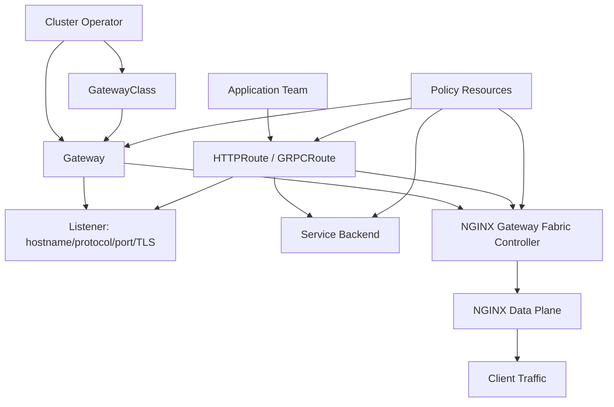
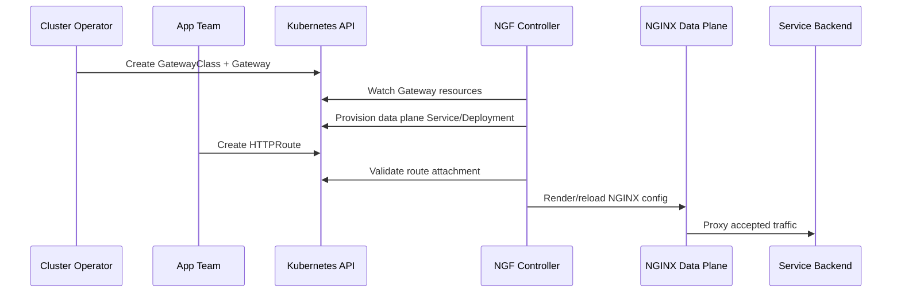
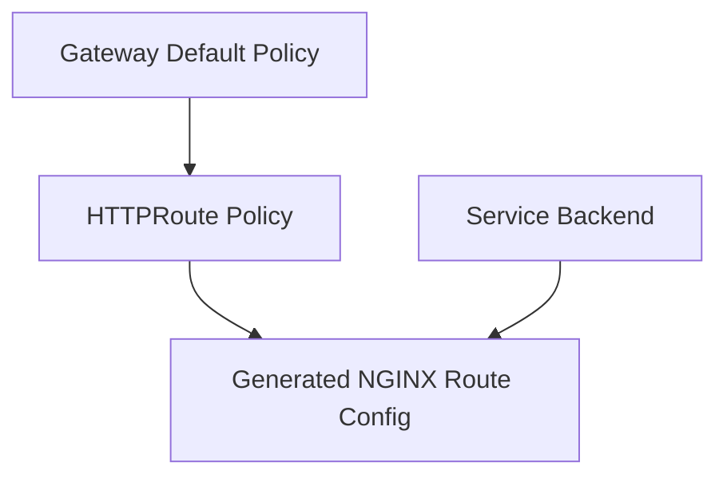
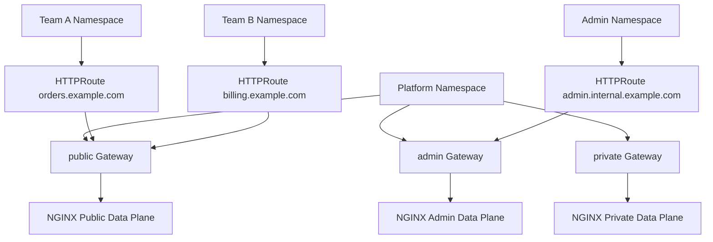

# Part 104 — NGINX Gateway Fabric and Gateway API

Ingress solved a real problem, but it grew awkward under production pressure.

Teams wanted:

- listener ownership,
- cross-namespace route attachment,
- richer matching,
- explicit route status,
- policy attachment,
- more portable traffic management,
- clearer platform/app responsibility split,
- less annotation sprawl.

Gateway API is Kubernetes' answer to that pressure.

NGINX Gateway Fabric is F5's Gateway API implementation using NGINX as the data plane.

The core mental model:

> Gateway API separates infrastructure ownership from route ownership. Platform teams publish Gateways. Application teams attach Routes. The controller compiles the accepted model into NGINX configuration.



Ingress often looks like “app team owns the edge rule”. Gateway API makes the ownership boundary explicit.

---

## 1. Why Gateway API Exists

Standard Ingress is intentionally simple:

```text
host + path -> service
```

That simplicity becomes limiting when a platform needs:

- separate listener and route ownership,
- reusable gateways,
- multiple teams sharing one listener safely,
- cross-namespace attachment with controls,
- route conditions and status,
- policy attachment without annotation overload,
- HTTP and non-HTTP routing model expansion,
- implementation conformance expectations.

Gateway API introduces a family of resources rather than one overloaded Ingress object.

Core resource roles:

| Resource | Owner | Purpose |
|---|---|---|
| `GatewayClass` | platform / cluster operator | Defines controller implementation class |
| `Gateway` | infrastructure / platform team | Defines listeners, hostnames, ports, TLS, attachment policy |
| `HTTPRoute` | app team | Defines HTTP routing from listener to Service |
| `GRPCRoute` | app team | Defines gRPC routing |
| `ReferenceGrant` | namespace owner | Allows safe cross-namespace references |
| Policy resources | platform/app depending on scope | Attach implementation-specific behavior |

This is closer to how production organizations actually work.

---

## 2. NGINX Gateway Fabric Architecture

NGINX Gateway Fabric has the familiar controller/data-plane split.

Control plane:

- watches Gateway API resources,
- validates supported fields,
- updates status conditions,
- creates or manages NGINX data plane objects,
- generates NGINX configuration,
- applies reloads safely.

Data plane:

- NGINX accepts traffic,
- terminates TLS where configured,
- routes requests based on Gateway/Route model,
- applies policies,
- proxies to Kubernetes Services.

In current NGINX Gateway Fabric architecture, a `Gateway` associated with the NGINX GatewayClass can provision an NGINX data plane deployment and Service in the Gateway namespace. This is materially different from a single pre-existing monolithic ingress deployment serving every namespace.



Production implication:

> Gateway is not only a routing object. It is also a lifecycle and ownership unit for the data plane.

---

## 3. GatewayClass

`GatewayClass` identifies the implementation.

Example shape:

```yaml
apiVersion: gateway.networking.k8s.io/v1
kind: GatewayClass
metadata:
  name: nginx
spec:
  controllerName: gateway.nginx.org/nginx-gateway-controller
```

This tells Kubernetes resources which controller should reconcile Gateways of this class.

Production invariants:

- GatewayClass names should encode operational zone if needed.
- Controller ownership must be unambiguous.
- Multiple implementations can coexist, but route ownership must be clear.
- App teams usually should not create arbitrary GatewayClasses.

Possible class taxonomy:

```text
nginx-public
nginx-private
nginx-admin
nginx-partner
nginx-mtls
```

However, do not create many classes just for aesthetics. Use separate classes when you need materially different lifecycle, data plane, security, or ownership.

---

## 4. Gateway

A `Gateway` defines one or more listeners.

```yaml
apiVersion: gateway.networking.k8s.io/v1
kind: Gateway
metadata:
  name: public-gateway
  namespace: platform-edge
spec:
  gatewayClassName: nginx
  listeners:
    - name: https
      protocol: HTTPS
      port: 443
      hostname: "*.example.com"
      tls:
        mode: Terminate
        certificateRefs:
          - kind: Secret
            name: wildcard-example-com
      allowedRoutes:
        namespaces:
          from: Selector
          selector:
            matchLabels:
              edge.example.com/public-routes: "true"
```

The Gateway says:

- what port is exposed,
- what protocol is accepted,
- which hostnames belong here,
- how TLS is handled,
- which route namespaces may attach.

This is much stronger than Ingress because listener ownership and route attachment policy are explicit.

Gateway review checklist:

- [ ] Class is correct.
- [ ] Namespace owner is platform/infrastructure team.
- [ ] Listener names are stable and meaningful.
- [ ] Hostname scope is not overly broad.
- [ ] TLS certificate references are controlled.
- [ ] `allowedRoutes` is explicit.
- [ ] Public/private/admin boundaries are separated.
- [ ] Data plane Service type and exposure are intentional.
- [ ] Status conditions are monitored.

---

## 5. HTTPRoute

An `HTTPRoute` attaches application routing to a Gateway listener.

```yaml
apiVersion: gateway.networking.k8s.io/v1
kind: HTTPRoute
metadata:
  name: orders-route
  namespace: apps
spec:
  parentRefs:
    - name: public-gateway
      namespace: platform-edge
      sectionName: https
  hostnames:
    - orders.example.com
  rules:
    - matches:
        - path:
            type: PathPrefix
            value: /
      backendRefs:
        - name: orders-api
          port: 8080
```

The route says:

- attach to this Gateway listener,
- handle this hostname,
- match these paths/headers/methods/query params where supported,
- send to these Services.

This is cleaner than annotation-heavy Ingress because the route intent is structurally represented.

---

## 6. Route Attachment and Acceptance

Gateway API resources expose status conditions.

A route existing in Kubernetes does not imply it is attached or accepted.

Debug:

```bash
kubectl -n apps get httproute orders-route -o yaml
kubectl -n apps describe httproute orders-route
kubectl -n platform-edge describe gateway public-gateway
```

Look for conditions such as:

- accepted,
- programmed,
- resolved references,
- attached routes,
- listener readiness,
- unsupported value/field,
- hostname conflict,
- cross-namespace reference problem.

Production invariant:

> Treat Gateway/Route status conditions as first-class deployment signals.

A CD pipeline should not say “deployed” just because `kubectl apply` succeeded. It should wait for relevant Gateway API status conditions.

---

## 7. Hostname Ownership

Gateway API can still suffer host conflicts if governance is weak.

Example problem:

```text
Team A creates HTTPRoute for api.example.com.
Team B also creates HTTPRoute for api.example.com.
```

The implementation must resolve behavior based on Gateway API rules and supported semantics, but operationally this is a governance failure.

Policy should enforce:

- namespace-to-domain ownership,
- unique host claim registry,
- route attachment permissions,
- review for wildcard hosts,
- expiration/decommission process.

Recommended ownership model:

```text
platform-edge namespace owns Gateway.
app namespace owns HTTPRoute.
central registry maps host -> namespace/team.
admission policy blocks unowned hostnames.
```

---

## 8. Listener-Level vs Route-Level Policy

Gateway API encourages policy attachment.

Instead of burying everything in annotations, implementation-specific policy resources can attach to:

- Gateway,
- Route,
- Service,
- sometimes other supported target refs depending on implementation.

NGINX Gateway Fabric includes custom policies for NGINX-specific capabilities not covered by core Gateway API. Examples include policies for rate limiting, proxy settings, client settings, observability, and snippets depending on version/support.

Mental model:

```text
Gateway policy = platform default / listener-wide behavior
Route policy   = application-specific behavior
Service policy = backend-specific behavior
```

Precedence must be understood for every policy type.

Example conceptual hierarchy:



Governance rule:

> Platform teams define bounded defaults; application teams may request route-specific exceptions only through explicit policy objects with status and review.

---

## 9. Proxy Settings Policy

For an API route, app behavior determines timeout and buffering needs.

Conceptual policy dimensions:

- connect timeout,
- read timeout,
- send timeout,
- request body size,
- buffering,
- header behavior,
- retry behavior,
- keepalive behavior.

In an annotation-heavy Ingress world, these become string annotations on the Ingress.

In Gateway API + implementation policies, they can be explicit resources.

Example conceptual shape:

```yaml
apiVersion: gateway.nginx.org/v1alpha1
kind: ProxySettingsPolicy
metadata:
  name: orders-proxy-policy
  namespace: apps
spec:
  targetRefs:
    - group: gateway.networking.k8s.io
      kind: HTTPRoute
      name: orders-route
  # Actual fields depend on installed NGF version.
  # Validate against the CRD schema in your cluster.
```

Do not copy arbitrary examples without checking your installed CRDs:

```bash
kubectl explain proxysettingspolicy.spec --recursive
kubectl get crd | grep gateway.nginx.org
```

The source of truth is the CRD installed in your cluster.

---

## 10. RateLimitPolicy

Rate limiting is a good fit for policy attachment because it is both application-specific and platform-sensitive.

A route may need:

- per-client rate limit,
- per-token rate limit,
- global route limit,
- dry-run rollout,
- custom rejection status,
- burst control,
- logs/metrics.

Conceptual pattern:

```yaml
apiVersion: gateway.nginx.org/v1alpha1
kind: RateLimitPolicy
metadata:
  name: orders-rate-limit
  namespace: apps
spec:
  targetRefs:
    - group: gateway.networking.k8s.io
      kind: HTTPRoute
      name: orders-route
  # Actual fields are version-specific; inspect CRD schema.
```

Review checklist:

- What key is being limited?
- Is client IP trustworthy?
- Is NAT/shared proxy considered?
- Is the limit per route or global?
- Is dry-run available/used?
- What status code is returned?
- Are rejected requests observable?
- Does the app/client retry and amplify traffic?

Rate limiting is not only a security feature. It is also overload control.

---

## 11. Client Settings Policy

Client-side settings can include body size, header limits, timeouts, and other request intake controls depending on implementation support.

These settings belong near the Gateway/Route boundary because they determine what the edge accepts from the internet or from internal clients.

Route classes:

| Route class | Client settings pattern |
|---|---|
| JSON API | small body, normal timeout, strict headers |
| Upload API | larger body, isolated route, abuse protection |
| Webhook | provider-specific body/timeout, strong logs |
| SSE/WebSocket | long read, connection capacity planning |
| Admin | private Gateway, mTLS/auth, strict allowlist |

Policy anti-pattern:

```text
One global huge body size because one upload route needs it.
```

Correct pattern:

```text
Small global default + explicit upload route policy + monitoring.
```

---

## 12. SnippetsFilter Boundary

NGINX Gateway Fabric can expose snippet-like extension points depending on version and configuration. This is powerful and dangerous.

Snippets are effectively raw NGINX escape hatches.

Use them only when:

- the behavior cannot be represented by supported Gateway API or policy resources,
- platform/security team approves,
- generated config is tested,
- the snippet has an owner and expiry,
- upgrade compatibility is reviewed.

Risk model:

| Risk | Description |
|---|---|
| Policy bypass | Raw NGINX can bypass platform defaults |
| Blast radius | Bad snippet can break route or listener |
| Upgrade fragility | Generated config context may change |
| Security exposure | Headers, auth, proxying can be altered |
| Debug complexity | Runtime behavior no longer obvious from route model |

If many teams need snippets, create a real policy abstraction instead.

---

## 13. Advanced HTTP Routing

Gateway API `HTTPRoute` supports richer matching than basic Ingress, depending on implementation/version.

Common matching dimensions:

- hostname,
- path prefix/exact/regular expression where supported,
- method,
- headers,
- query parameters,
- filters such as redirects/rewrites/header modification where supported.

Example:

```yaml
apiVersion: gateway.networking.k8s.io/v1
kind: HTTPRoute
metadata:
  name: orders-route
  namespace: apps
spec:
  parentRefs:
    - name: public-gateway
      namespace: platform-edge
      sectionName: https
  hostnames:
    - orders.example.com
  rules:
    - matches:
        - path:
            type: PathPrefix
            value: /api
          headers:
            - name: X-Canary
              value: "true"
      backendRefs:
        - name: orders-api-canary
          port: 8080
    - matches:
        - path:
            type: PathPrefix
            value: /api
      backendRefs:
        - name: orders-api
          port: 8080
```

Important:

> Match order and conflict resolution must be verified against Gateway API semantics and implementation support.

Do not assume it behaves exactly like NGINX `location` or exactly like legacy Ingress.

---

## 14. Weighted Backends and Canary

Gateway API can express weighted backend references for traffic splitting where supported.

```yaml
rules:
  - matches:
      - path:
          type: PathPrefix
          value: /
    backendRefs:
      - name: orders-api-v1
        port: 8080
        weight: 95
      - name: orders-api-v2
        port: 8080
        weight: 5
```

Canary review:

- Is the split stable enough for your need?
- Are sticky sessions involved?
- Are cache keys version-aware?
- Are metrics separated by version?
- Is rollback one manifest change?
- Are long-lived connections considered?
- Are non-idempotent requests safe?

Weighted routing is traffic distribution, not correctness validation. You still need app-level health, metrics, and rollback.

---

## 15. TLS in Gateway API

Gateway owns TLS listener configuration.

```yaml
listeners:
  - name: https
    protocol: HTTPS
    port: 443
    hostname: "orders.example.com"
    tls:
      mode: Terminate
      certificateRefs:
        - kind: Secret
          name: orders-tls
```

TLS operational questions:

- Which namespace contains the Secret?
- Are cross-namespace Secret refs allowed?
- Is a `ReferenceGrant` required?
- Is wildcard cert ownership controlled?
- Is listener hostname narrower than cert SAN?
- Does route hostname fit listener hostname?
- Are certificate rotations observed by the controller?
- Does the status show programmed listener?

Gateway API makes TLS ownership more visible than Ingress, but not automatically safe. Governance still matters.

---

## 16. Cross-Namespace References and ReferenceGrant

Cross-namespace references are powerful and sensitive.

Example scenarios:

- route in app namespace attaches to Gateway in platform namespace,
- Gateway references Secret in cert namespace,
- route references Service in another namespace,
- policy attaches across boundaries.

Gateway API uses `ReferenceGrant` to allow certain cross-namespace references safely.

Conceptual example:

```yaml
apiVersion: gateway.networking.k8s.io/v1beta1
kind: ReferenceGrant
metadata:
  name: allow-platform-gateway-to-cert
  namespace: certs
spec:
  from:
    - group: gateway.networking.k8s.io
      kind: Gateway
      namespace: platform-edge
  to:
    - group: ""
      kind: Secret
      name: wildcard-example-com
```

Governance rule:

> Cross-namespace reference should require consent from the namespace being referenced.

Without this, one namespace could accidentally or maliciously consume another namespace's Secret or backend.

---

## 17. GRPCRoute

Gateway API includes `GRPCRoute` for gRPC routing where supported by implementation/version.

Why it matters:

- gRPC is not just HTTP JSON.
- Method/service matching can be explicit.
- Streaming behavior affects timeout and capacity.
- HTTP status and gRPC status differ.
- Deadlines should align with edge timeouts.

Conceptual example:

```yaml
apiVersion: gateway.networking.k8s.io/v1
kind: GRPCRoute
metadata:
  name: inventory-grpc
  namespace: apps
spec:
  parentRefs:
    - name: public-gateway
      namespace: platform-edge
      sectionName: https
  hostnames:
    - inventory-grpc.example.com
  rules:
    - matches:
        - method:
            service: inventory.InventoryService
      backendRefs:
        - name: inventory-grpc
          port: 50051
```

Review checklist:

- Is HTTP/2 enabled on the listener path?
- Is backend Service port correct?
- Is upstream protocol generated as gRPC?
- Are stream timeouts appropriate?
- Are request/response sizes bounded?
- Are logs surfacing gRPC failure semantics?

---

## 18. Non-HTTP Routes

Gateway API also defines resources for non-HTTP traffic, with support depending on implementation/version/channel:

- `TCPRoute`,
- `UDPRoute`,
- `TLSRoute`.

NGINX Gateway Fabric's stated goal includes HTTP and TCP/UDP load balancer, reverse proxy, and API gateway use cases, but you must verify exact support against the installed version's Gateway API compatibility matrix.

Never assume every Gateway API resource is supported by every implementation.

Check:

```bash
kubectl get crd | grep gateway.networking.k8s.io
kubectl get crd | grep gateway.nginx.org
kubectl explain tcproute.spec --recursive
kubectl explain udproute.spec --recursive
kubectl explain tlsroute.spec --recursive
```

Operational warning:

> L4 routing is connection/session-level. HTTP route assumptions do not apply.

---

## 19. Status Conditions as a Deployment Gate

Gateway API's status model is one of its biggest operational advantages.

Useful deployment gate pattern:

```bash
kubectl wait \
  --for=condition=Accepted \
  gateway/public-gateway \
  -n platform-edge \
  --timeout=60s

kubectl wait \
  --for=condition=Accepted \
  httproute/orders-route \
  -n apps \
  --timeout=60s
```

Exact conditions vary by resource and implementation, so inspect real status:

```bash
kubectl -n platform-edge get gateway public-gateway -o yaml
kubectl -n apps get httproute orders-route -o yaml
```

Deployment should fail if:

- route not accepted,
- references unresolved,
- parent not found,
- listener not ready,
- policy not accepted,
- unsupported field used,
- backend invalid,
- route conflict exists.

This is better than blind `kubectl apply`.

---

## 20. Observability

Gateway-oriented observability should include both Kubernetes and NGINX views.

Kubernetes resource view:

- GatewayClass status,
- Gateway listener status,
- route status conditions,
- policy status,
- data plane deployment health,
- data plane Service health,
- backend endpoints.

NGINX runtime view:

- request volume,
- status code distribution,
- latency distribution,
- upstream address/status/timing,
- TLS info,
- route labels,
- reload events,
- config generation failures,
- rejected requests,
- rate limit decisions.

Recommended dimensions:

```text
gateway_namespace
gateway_name
listener_name
route_namespace
route_name
service_namespace
service_name
hostname
path_class
status_family
upstream_status
```

Without route labels, Gateway API's structural clarity is lost in logs.

---

## 21. Debugging Workflow

When traffic fails, debug in layers.

### Layer 1 — GatewayClass

```bash
kubectl get gatewayclass
kubectl describe gatewayclass nginx
```

Questions:

- Does the class exist?
- Is the controller name correct?
- Is it accepted?

### Layer 2 — Gateway

```bash
kubectl -n platform-edge get gateway
kubectl -n platform-edge describe gateway public-gateway
kubectl -n platform-edge get gateway public-gateway -o yaml
```

Questions:

- Is listener accepted?
- Is certificate reference resolved?
- Are routes attached?
- Is data plane programmed?

### Layer 3 — Route

```bash
kubectl -n apps get httproute
kubectl -n apps describe httproute orders-route
kubectl -n apps get httproute orders-route -o yaml
```

Questions:

- Is parentRef correct?
- Is route accepted?
- Are backendRefs resolved?
- Does hostname match listener?
- Is namespace allowed?

### Layer 4 — Backend

```bash
kubectl -n apps get svc orders-api
kubectl -n apps get endpoints orders-api
kubectl -n apps get endpointslice -l kubernetes.io/service-name=orders-api
kubectl -n apps get pods -l app=orders-api
```

Questions:

- Does Service exist?
- Are endpoints ready?
- Is target port correct?
- Is NetworkPolicy blocking traffic?

### Layer 5 — NGINX Data Plane

```bash
kubectl -n platform-edge get pods
kubectl -n platform-edge logs deploy/<nginx-data-plane-or-controller>
kubectl -n platform-edge exec -it <pod> -- nginx -T
```

Questions:

- Was config generated?
- Did reload succeed?
- Does generated config match intent?
- Are upstreams populated?

---

## 22. Migration from Ingress to Gateway API

Do not migrate mechanically. Migrate semantics.

Ingress object:

```yaml
apiVersion: networking.k8s.io/v1
kind: Ingress
metadata:
  name: orders
  namespace: apps
spec:
  ingressClassName: public-nginx
  tls:
    - hosts:
        - orders.example.com
      secretName: orders-tls
  rules:
    - host: orders.example.com
      http:
        paths:
          - path: /
            pathType: Prefix
            backend:
              service:
                name: orders-api
                port:
                  number: 8080
```

Gateway API equivalent shape:

```yaml
apiVersion: gateway.networking.k8s.io/v1
kind: Gateway
metadata:
  name: public-gateway
  namespace: platform-edge
spec:
  gatewayClassName: nginx
  listeners:
    - name: https
      protocol: HTTPS
      port: 443
      hostname: orders.example.com
      tls:
        mode: Terminate
        certificateRefs:
          - name: orders-tls
      allowedRoutes:
        namespaces:
          from: Selector
          selector:
            matchLabels:
              edge.example.com/public-routes: "true"
---
apiVersion: gateway.networking.k8s.io/v1
kind: HTTPRoute
metadata:
  name: orders-route
  namespace: apps
spec:
  parentRefs:
    - name: public-gateway
      namespace: platform-edge
      sectionName: https
  hostnames:
    - orders.example.com
  rules:
    - matches:
        - path:
            type: PathPrefix
            value: /
      backendRefs:
        - name: orders-api
          port: 8080
```

Migration checklist:

- [ ] Inventory Ingress objects.
- [ ] Inventory annotations.
- [ ] Classify annotations into Gateway fields, policies, or unsupported behavior.
- [ ] Define Gateway ownership model.
- [ ] Define namespace attachment policy.
- [ ] Migrate one low-risk host.
- [ ] Compare generated config and runtime behavior.
- [ ] Compare logs/metrics.
- [ ] Test TLS, redirects, rewrites, body size, timeout, headers.
- [ ] Run failure drills.
- [ ] Keep rollback path to Ingress.

---

## 23. Annotation Debt Mapping

Ingress migration usually reveals annotation debt.

Create an inventory like this:

| Annotation | Meaning | Gateway API replacement | Policy replacement | Action |
|---|---|---|---|---|
| proxy read timeout | route timeout | maybe policy | ProxySettingsPolicy | migrate |
| client body size | request intake | maybe policy | ClientSettingsPolicy | migrate |
| rewrite target | URL rewrite | HTTPRoute filter if supported | route refactor | test |
| rate limit | overload/abuse | policy | RateLimitPolicy | migrate |
| snippets | raw escape | none | SnippetsFilter maybe | remove/review |
| custom headers | header filter | HTTPRoute filter if supported | policy/snippet | migrate carefully |

This exercise is often more valuable than the migration itself because it exposes undocumented platform behavior.

---

## 24. Failure Modes

### Route exists but no traffic

Likely causes:

- route not accepted,
- wrong parentRef,
- namespace not allowed,
- hostname not covered by listener,
- listener not programmed,
- DNS points to old ingress,
- Service has no endpoints.

### TLS default certificate served

Likely causes:

- SNI does not match listener hostname,
- certificateRef unresolved,
- Secret in wrong namespace,
- missing ReferenceGrant,
- data plane not reloaded,
- DNS points to wrong Gateway.

### 404 from Gateway

Likely causes:

- hostname mismatch,
- route not attached,
- path mismatch,
- rule order/conflict,
- wrong listener sectionName.

### 502/503/504

Likely causes:

- Service/endpoint issue,
- backend port mismatch,
- NetworkPolicy,
- upstream protocol mismatch,
- timeout too low,
- backend overload.

### Policy ignored

Likely causes:

- unsupported targetRef,
- wrong namespace,
- policy not accepted,
- CRD version mismatch,
- precedence overridden by more specific policy,
- controller does not support that field.

---

## 25. Platform Design Pattern

A robust Gateway API platform often looks like this:

```text
platform-edge namespace:
  GatewayClass references NGF controller
  public Gateway
  private Gateway
  admin Gateway
  wildcard/public certs where appropriate
  platform-wide policies

app namespaces:
  HTTPRoute / GRPCRoute
  Services
  route-level policies within allowed bounds

security/admission:
  host ownership validation
  allowed parentRefs
  annotation/snippet restriction
  policy bounds
  namespace labels for route attachment

observability:
  gateway/route/service labels in logs
  status condition monitoring
  data plane metrics
  certificate expiry monitoring
```



This is the main advantage over one giant shared Ingress abstraction: the topology matches organizational trust boundaries.

---

## 26. CI/CD Validation

Gateway API manifests should be validated before they reach the cluster.

Validation stages:

1. YAML schema validation.
2. Kubernetes server-side dry-run.
3. Gateway API conformance-aware checks.
4. Host ownership check.
5. ParentRef allowlist check.
6. Policy bounds check.
7. Cross-namespace reference check.
8. Apply to staging cluster.
9. Wait for status conditions.
10. Smoke test through Gateway address.

Example deployment gate:

```bash
kubectl apply --server-side --dry-run=server -f route.yaml
kubectl apply -f route.yaml
kubectl -n apps wait --for=condition=Accepted httproute/orders-route --timeout=60s
curl -fsS https://orders.example.com/health
```

Add failure tests:

- wrong hostname,
- missing backend,
- missing Secret,
- disallowed namespace,
- invalid policy,
- service with no endpoints.

A platform is not production-ready until failure is observable and understandable.

---

## 27. Gateway API vs Ingress Decision Matrix

| Dimension | Ingress | Gateway API |
|---|---|---|
| Simplicity | Strong | Moderate |
| Legacy compatibility | Strong | Depends on cluster/implementation |
| Listener ownership | Weak | Strong |
| Cross-namespace attachment | Awkward | First-class with policy |
| Advanced routing | Annotation-heavy | More structured |
| Policy attachment | Controller-specific annotations | More explicit pattern |
| Status visibility | Limited | Stronger conditions |
| Multi-team platform model | Harder | Better |
| Portability | Basic only | Improving but implementation support matters |
| Migration cost | None if already used | Requires semantic migration |

Practical conclusion:

- Keep Ingress for simple legacy routes if stable.
- Use Gateway API for new platform designs, multi-team environments, and explicit listener/route separation.
- Do not migrate blindly if your required features are not supported by your selected implementation/version.

---

## 28. Production Checklist

Before adopting NGINX Gateway Fabric:

- [ ] Gateway API CRD version is supported.
- [ ] NGINX Gateway Fabric version is selected intentionally.
- [ ] Compatibility matrix reviewed.
- [ ] GatewayClass ownership defined.
- [ ] Gateway namespaces defined.
- [ ] Public/private/admin data planes separated where needed.
- [ ] Route attachment policy designed.
- [ ] Host ownership admission implemented.
- [ ] Certificate ownership designed.
- [ ] Cross-namespace reference model defined.
- [ ] Policy resources and precedence understood.
- [ ] Unsupported Ingress annotations inventoried.
- [ ] Generated NGINX config inspection workflow documented.
- [ ] Logs/metrics include Gateway and Route labels.
- [ ] Status conditions included in deployment pipeline.
- [ ] Upgrade/rollback plan tested.
- [ ] Failure drills performed.

---

## 29. Commands Field Guide

```bash
# Gateway API resources
kubectl get gatewayclass
kubectl get gateways -A
kubectl get httproutes -A
kubectl get grpcroutes -A
kubectl get referencegrants -A

# NGINX Gateway Fabric CRDs
kubectl get crd | grep gateway.nginx.org
kubectl explain gateway.spec --recursive
kubectl explain httproute.spec --recursive

# Gateway status
kubectl -n platform-edge describe gateway public-gateway
kubectl -n platform-edge get gateway public-gateway -o yaml

# Route status
kubectl -n apps describe httproute orders-route
kubectl -n apps get httproute orders-route -o yaml

# Backend state
kubectl -n apps get svc,endpoints,endpointslice
kubectl -n apps get pods -o wide

# Controller/data plane state
kubectl -n nginx-gateway get pods
kubectl -n nginx-gateway logs deploy/nginx-gateway
kubectl -n platform-edge get deploy,svc,pods

# Runtime probe
curl -vk https://orders.example.com/health
openssl s_client -connect orders.example.com:443 -servername orders.example.com </dev/null
```

---

## 30. Mental Model Summary

Gateway API is not “Ingress v2” in the narrow sense. It is a more explicit resource model for Kubernetes traffic management.

NGINX Gateway Fabric maps that resource model onto NGINX as the data plane.

Key invariants:

1. `GatewayClass` chooses the implementation.
2. `Gateway` owns listeners and exposure.
3. `HTTPRoute`/`GRPCRoute` own application routing.
4. Attachment is controlled and observable through status.
5. Cross-namespace reference should require explicit consent.
6. Policy attachment is better than annotation sprawl, but still implementation-specific.
7. Support depends on installed CRDs and NGF version.
8. Generated NGINX config remains the runtime truth.
9. Migration from Ingress must translate semantics, not just YAML shape.
10. Platform success depends on governance: host ownership, namespace boundaries, policy bounds, observability, and upgrade discipline.

Part 105 will close the series with a final production field guide: reference architectures, checklists, decision matrices, and failure-model shortcuts that compress all previous parts into an operational handbook.

