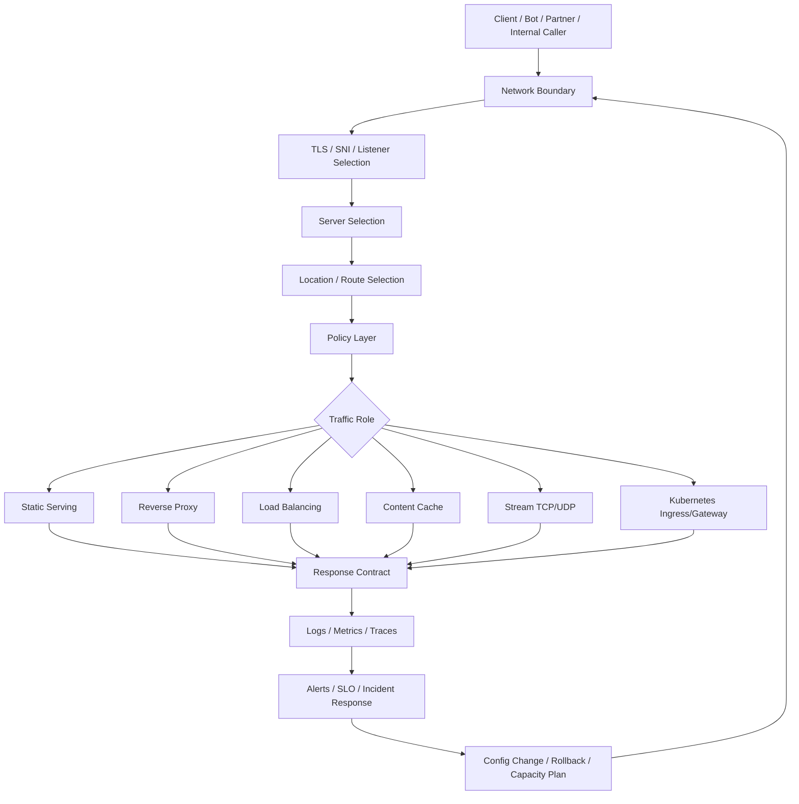
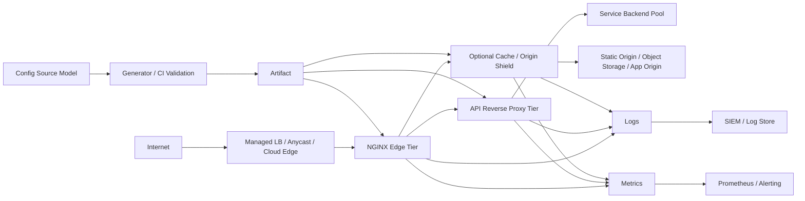
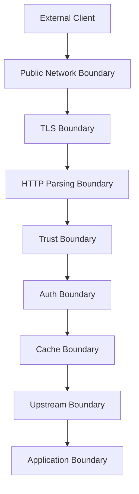
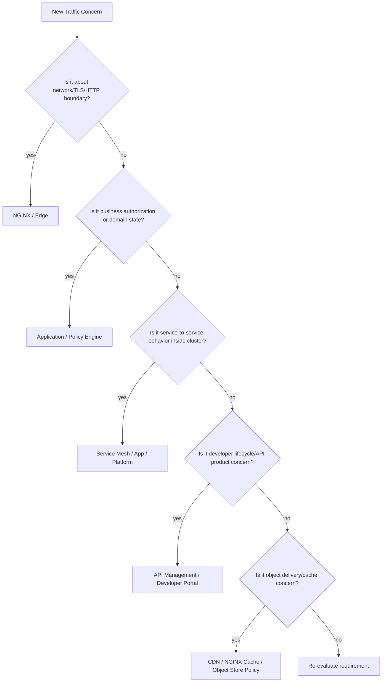
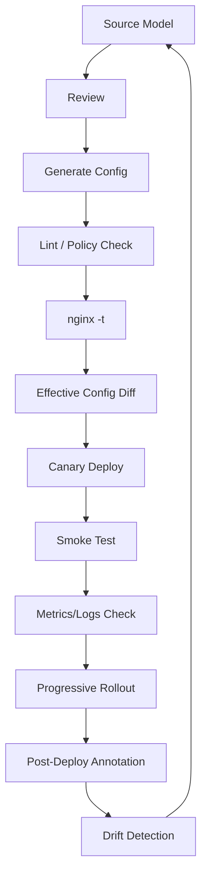
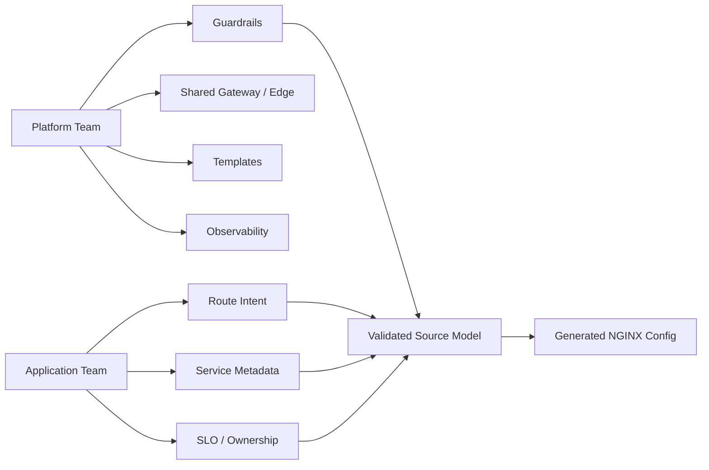
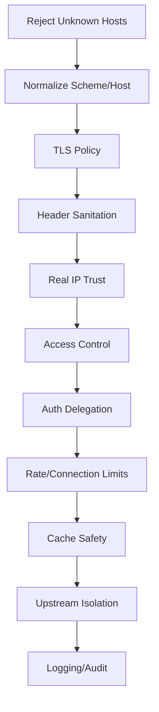

# Part 105 — Final Production Architecture Field Guide

This is the final part of the series.

The goal of this chapter is not to introduce one more directive.

The goal is to compress the whole series into a field guide you can use when you are asked:

- “Is this NGINX architecture safe for production?”
- “Where should this traffic concern live?”
- “Why did this edge incident happen?”
- “Should we use NGINX, NGINX Ingress Controller, Gateway API, a service mesh, or a managed load balancer?”
- “What is the minimum set of invariants we must preserve so this system does not collapse under load or fail open?”

NGINX is simple only when the system around it is simple.

In real systems, NGINX is often the boundary between:

- public and private networks,
- browser and service,
- TLS and cleartext,
- L7 and L4,
- human configuration and generated configuration,
- app ownership and platform ownership,
- cached and authoritative data,
- overload and collapse,
- observable incidents and blind outages.

A top-tier engineer does not treat NGINX as a pile of snippets.

A top-tier engineer treats NGINX as a programmable traffic state machine with operational constraints.



---

## 1. The One Mental Model to Keep

Everything in this series can be reduced to one model:

> NGINX receives a connection, classifies it, applies policy, transforms or forwards traffic, records what happened, and survives change.

That sentence contains six responsibilities.

| Responsibility | Production Question |
|---|---|
| Receive | Is the listener correct, reachable, safe, and capacity-planned? |
| Classify | Is traffic routed by trusted signals or attacker-controlled signals? |
| Apply policy | Are security, rate, cache, and auth decisions explicit and testable? |
| Transform/forward | Are URI, header, timeout, retry, buffering, and upstream semantics correct? |
| Record | Can we reconstruct what happened during an incident? |
| Survive change | Can config, certs, upstreams, and deployments change without uncontrolled downtime? |

Most production incidents are not caused by one missing directive.

They happen when one of these responsibilities is implicit.

Example:

- The listener works, but the default server is unsafe.
- Routing works, but depends on spoofable `X-Forwarded-For`.
- Proxying works, but retries duplicate writes.
- Caching works, but the cache key ignores authentication.
- TLS works, but certificate renewal reloads incorrectly.
- Ingress works, but annotations bypass platform guardrails.
- Metrics exist, but logs cannot explain which upstream was tried.

The final field rule:

> A production NGINX design is not complete until every traffic decision has an owner, a reason, a failure mode, a log signal, and a rollback path.

---

## 2. Production Reference Architecture

A strong NGINX architecture normally separates responsibilities into layers.

Do not force one NGINX instance to be every role unless the system is small enough that this remains understandable.



A common production layout:

1. **Cloud or network load balancer** handles regional availability, public IPs, L4 health checks, and coarse failover.
2. **NGINX edge tier** terminates TLS, normalizes host/scheme, applies global security headers, rejects invalid traffic, and forwards to internal layers.
3. **Cache/shield tier** absorbs static/dynamic cacheable traffic and protects origin from stampedes.
4. **API proxy tier** applies route-specific timeout, buffering, retry, auth delegation, and upstream selection.
5. **Service backends** own business logic and domain authorization.
6. **Observability plane** receives structured logs, metrics, alerts, and incident annotations.
7. **Config delivery plane** turns reviewed source models into validated NGINX artifacts.

This separation is not mandatory, but the responsibilities must exist somewhere.

A single instance can host multiple responsibilities for a small system.

A larger system should separate them when one responsibility changes faster, fails differently, or has different ownership.

---

## 3. Architecture Decision Matrix

Use NGINX when you need deterministic, explicit traffic handling at the edge.

Do not use NGINX as a replacement for every distributed systems primitive.

| Need | Good Fit for NGINX? | Notes |
|---|---:|---|
| TLS termination | Yes | Strong fit. Keep certificate lifecycle observable. |
| Static file serving | Yes | Strong fit. Harden filesystem exposure. |
| Reverse proxy | Yes | Strong fit. Be precise with `proxy_pass`, headers, buffering, timeout. |
| HTTP load balancing | Yes | Strong fit. Know passive vs active health check boundary. |
| Content caching | Yes | Strong fit. Cache key correctness is the hard part. |
| WebSocket/SSE proxy | Yes | Good fit. Requires long timeout and buffering discipline. |
| gRPC proxy | Yes | Good fit with HTTP/2 awareness. |
| TCP/UDP proxy | Yes | Good fit via `stream`, but fewer L7 signals. |
| Basic auth / external auth gateway | Conditional | Good for edge gating, not full domain authorization. |
| JWT validation | Conditional | Depends on edition/module/control plane. Avoid pretending string checks are cryptographic validation. |
| WAF | Conditional | Native controls help, full WAF needs dedicated module/product/process. |
| Circuit breaker | Partial | NGINX provides building blocks, not full adaptive per-route circuit breaker semantics. |
| Service discovery | Conditional | Works, but dynamic behavior differs by config style, version, and edition. |
| API management product | Partial | NGINX can implement gateway patterns; product-level developer portal/lifecycle is separate. |
| Distributed tracing | Partial | Can propagate IDs; cannot replace app instrumentation. |
| Business authorization | No | Keep domain authorization in application or dedicated policy system. |
| Database connection pool | No | NGINX can proxy TCP; it is not a DB-aware pooler. |

Decision invariant:

> Use NGINX for traffic boundary mechanics. Do not hide domain state, business authorization, or transactional correctness inside NGINX config.

---

## 4. The Boundary Map

Every NGINX design should name its boundaries.



### 4.1 Public Network Boundary

Questions:

- Which IPs/ports are exposed?
- Is port 80 intentionally open for redirect or ACME HTTP-01?
- Are UDP ports intentionally exposed for QUIC or DNS-like traffic?
- Are default servers safe?
- Is the cloud/L4 load balancer preserving client identity through PROXY protocol or headers?

Bad sign:

```nginx
server {
    listen 80;
    server_name _;
    root /var/www/html;
}
```

This turns unknown hosts into a content-serving surface.

Safer default:

```nginx
server {
    listen 80 default_server;
    server_name _;
    return 444;
}

server {
    listen 443 ssl default_server;
    server_name _;
    ssl_certificate     /etc/nginx/certs/default/fullchain.pem;
    ssl_certificate_key /etc/nginx/certs/default/privkey.pem;
    return 444;
}
```

### 4.2 TLS Boundary

Questions:

- Is TLS terminated, re-encrypted, or passed through?
- Does the backend know original scheme through a trusted header?
- Are certificates rotated without downtime?
- Is mTLS applied at the correct listener boundary?
- Is upstream TLS verified when NGINX talks HTTPS to upstream?

Core rule:

> TLS termination creates a new trust boundary. Forwarded protocol headers are only trustworthy if NGINX sets them after stripping untrusted inbound versions.

### 4.3 HTTP Parsing Boundary

Questions:

- Are invalid headers rejected?
- Are underscores allowed intentionally?
- Are Host and forwarded headers normalized?
- Are large headers/body limits explicit?
- Are HTTP/2 and HTTP/1.1 boundaries tested?

Request smuggling and cache poisoning often live here.

### 4.4 Trust Boundary

Questions:

- Which upstream hop is trusted to provide real client IP?
- Are `X-Forwarded-*` headers stripped/replaced or blindly appended?
- Is PROXY protocol accepted only from trusted L4 peers?
- Are logs recording both socket peer and effective client identity?

Core rule:

> Client identity is not a header. It is a claim transported through a trusted chain.

### 4.5 Auth Boundary

Questions:

- Does NGINX own authentication, authorization, or only auth delegation?
- Is failure closed or open?
- Are auth headers stripped before proxying?
- Are authenticated responses cache-safe?
- Are admin surfaces isolated by host/listener/network/mTLS?

### 4.6 Cache Boundary

Questions:

- What makes two responses equivalent?
- Does the cache key include every dimension that changes response body/security?
- Are private responses explicitly excluded?
- What stale behavior is allowed under origin failure?
- How is purge/invalidation controlled?

Core rule:

> Cache correctness is identity correctness.

### 4.7 Upstream Boundary

Questions:

- Are timeouts route-specific?
- Are retries safe for methods and side effects?
- Is buffering appropriate for the endpoint?
- Are upstream keepalive pools sized for backend capacity?
- Are DNS/service discovery semantics understood?

---

## 5. The Minimum Production Config Skeleton

This skeleton is intentionally conservative.

It is not complete for every system, but it shows the shape of production discipline.

```nginx
user nginx;
worker_processes auto;

error_log /var/log/nginx/error.log warn;
pid /run/nginx.pid;

worker_rlimit_nofile 200000;

events {
    worker_connections 8192;
    multi_accept off;
}

http {
    include       /etc/nginx/mime.types;
    default_type  application/octet-stream;

    server_tokens off;

    log_format main_json escape=json
      '{'
        '"ts":"$time_iso8601",'
        '"remote_addr":"$remote_addr",'
        '"realip_remote_addr":"$realip_remote_addr",'
        '"request_id":"$request_id",'
        '"host":"$host",'
        '"method":"$request_method",'
        '"uri":"$uri",'
        '"args":"$args",'
        '"status":$status,'
        '"bytes_sent":$bytes_sent,'
        '"request_time":$request_time,'
        '"upstream_addr":"$upstream_addr",'
        '"upstream_status":"$upstream_status",'
        '"upstream_connect_time":"$upstream_connect_time",'
        '"upstream_header_time":"$upstream_header_time",'
        '"upstream_response_time":"$upstream_response_time",'
        '"upstream_cache_status":"$upstream_cache_status",'
        '"http_referer":"$http_referer",'
        '"http_user_agent":"$http_user_agent"'
      '}';

    access_log /var/log/nginx/access.log main_json;

    sendfile on;
    tcp_nopush on;

    keepalive_timeout 65s;
    client_header_timeout 10s;
    client_body_timeout 30s;
    send_timeout 30s;

    client_max_body_size 10m;

    # Trust only known L4/L7 peers.
    # set_real_ip_from 10.0.0.0/8;
    # real_ip_header X-Forwarded-For;
    # real_ip_recursive on;

    map $http_upgrade $connection_upgrade {
        default upgrade;
        ''      close;
    }

    map $http_x_request_id $effective_request_id {
        default $http_x_request_id;
        ''      $request_id;
    }

    upstream app_api {
        zone app_api 64k;
        least_conn;

        server app-1.internal:8080 max_fails=2 fail_timeout=10s;
        server app-2.internal:8080 max_fails=2 fail_timeout=10s;

        keepalive 64;
    }

    server {
        listen 80 default_server;
        server_name _;
        return 444;
    }

    server {
        listen 443 ssl default_server;
        server_name _;

        ssl_certificate     /etc/nginx/certs/default/fullchain.pem;
        ssl_certificate_key /etc/nginx/certs/default/privkey.pem;

        return 444;
    }

    server {
        listen 80;
        server_name example.com;

        location /.well-known/acme-challenge/ {
            root /var/www/acme;
        }

        location / {
            return 308 https://$host$request_uri;
        }
    }

    server {
        listen 443 ssl http2;
        server_name example.com;

        ssl_certificate     /etc/nginx/certs/example/fullchain.pem;
        ssl_certificate_key /etc/nginx/certs/example/privkey.pem;

        add_header X-Content-Type-Options nosniff always;
        add_header Referrer-Policy strict-origin-when-cross-origin always;

        location /healthz {
            access_log off;
            return 200 'ok\n';
        }

        location /static/ {
            root /srv/www/example;
            try_files $uri =404;
            expires 1y;
            add_header Cache-Control "public, immutable" always;
        }

        location /api/ {
            proxy_http_version 1.1;

            proxy_set_header Host $host;
            proxy_set_header X-Request-ID $effective_request_id;
            proxy_set_header X-Forwarded-For $proxy_add_x_forwarded_for;
            proxy_set_header X-Forwarded-Proto $scheme;
            proxy_set_header X-Forwarded-Host $host;
            proxy_set_header Connection "";

            proxy_connect_timeout 2s;
            proxy_send_timeout 30s;
            proxy_read_timeout 30s;

            proxy_next_upstream error timeout http_502 http_503 http_504;
            proxy_next_upstream_tries 2;
            proxy_next_upstream_timeout 5s;

            proxy_pass http://app_api;
        }
    }
}
```

Review the skeleton by asking:

- What is the default behavior for unknown hosts?
- What identity is logged?
- What identity is forwarded?
- What happens if upstream fails before receiving the request?
- What happens if upstream fails after receiving a non-idempotent request?
- Are static paths and API paths separated?
- Can certificate renewal reload safely?
- Can the effective config be dumped and audited?

---

## 6. Configuration Review Checklist

Use this before merging NGINX config changes.

### 6.1 Listener and Host Review

- Every public port has an explicit default server.
- Unknown hosts do not route to a real tenant/app.
- HTTP-to-HTTPS redirect is host-scoped, not catch-all unsafe.
- ACME challenge path is intentionally exempted if HTTP-01 is used.
- TLS server blocks have correct `server_name`, certificate, and key.
- Wildcard hosts are backed by explicit tenant registry or map.

### 6.2 Location Review

- `location =` is used for exact control endpoints when appropriate.
- `^~` is used only when regex override must be prevented.
- Regex locations are ordered intentionally.
- `root` and `alias` are not mixed casually.
- `alias` locations have slash semantics reviewed.
- `try_files` fallback does not expose files or route API calls to SPA HTML.
- Named locations are internal-only when they should not be public.

### 6.3 Reverse Proxy Review

- `proxy_pass` slash behavior is reviewed.
- URI rewrite behavior is tested with actual request examples.
- `Host` forwarding is intentional.
- Untrusted incoming identity headers are stripped or overwritten.
- `X-Forwarded-Proto` is set from trusted NGINX state, not client input.
- `proxy_http_version 1.1` and `Connection ""` are used where upstream keepalive is intended.
- WebSocket endpoints have upgrade handling.
- SSE/token-stream endpoints have buffering and timeout reviewed.

### 6.4 Timeout Review

- Connect timeout is short.
- Read timeout is route-specific.
- Streaming endpoints have heartbeat-aware timeout.
- Upload endpoints have body timeout and size limits.
- NGINX timeout is aligned with outer LB/CDN and inner app timeout.
- Retry timeout and tries are bounded.

### 6.5 Retry Review

- Retries are limited to safe failures and safe methods.
- `non_idempotent` is not enabled unless the service has idempotency keys or duplicate-write safety.
- Upstream logs can show multiple attempts.
- Retry does not amplify overload.

### 6.6 Cache Review

- Cache key includes scheme/host/path/query and any response-changing dimensions.
- Authenticated/private routes are excluded unless explicitly proven safe.
- `Set-Cookie` behavior is tested.
- `Vary` behavior is understood.
- Cache lock and stale policy are route-specific.
- Purge/invalidation has an owner and audit trail.
- `$upstream_cache_status` is logged.

### 6.7 TLS Review

- Protocol policy is explicit.
- Certificate chain order is correct.
- Expiry monitoring exists.
- Reload hook is tested.
- HSTS rollout is staged.
- `includeSubDomains` and `preload` are not enabled casually.
- OCSP stapling failure mode is understood.
- Upstream TLS verification is enabled where required.

### 6.8 Access Control Review

- Admin endpoints are not protected only by obscurity.
- `allow`/`deny` uses effective trusted client IP.
- `geo`/`map` registries are generated or reviewed.
- External auth failure mode is fail-closed unless explicitly justified.
- mTLS is enforced at the correct listener/server boundary.

### 6.9 Observability Review

- Logs are structured.
- Logs include route/service label.
- Logs include request time and upstream timings.
- Logs include upstream address/status.
- Logs include cache status if cache is used.
- Error log level is appropriate.
- Debug logging can be scoped during incidents.
- Metrics and alerts exist for saturation, errors, latency, cache anomalies, and cert expiry.

### 6.10 Change Safety Review

- `nginx -t` is mandatory before reload.
- `nginx -T` artifact is captured in CI or deploy logs.
- Reload failure leaves old workers serving.
- Rollback artifact is available.
- Canary deploy path exists for high-risk config.
- Smoke tests hit representative routes.
- Config is generated from source model when scale demands it.

---

## 7. Decision Tree: Where Should This Concern Live?



Examples:

| Concern | Preferred Home | Why |
|---|---|---|
| HTTP→HTTPS redirect | NGINX | Boundary normalization. |
| HSTS | NGINX with staged rollout | Response security policy. |
| Request ID generation | NGINX/app shared contract | Edge can create; app must propagate. |
| Domain permission check | App/policy engine | Needs business state. |
| Rate limit public login endpoint | NGINX + app | Edge throttles; app handles account-specific logic. |
| Idempotency key enforcement | App | Must know transaction semantics. |
| Static asset immutable cache | NGINX/CDN | Edge delivery problem. |
| User dashboard cache | Usually app/browser, not shared NGINX | User-specific correctness risk. |
| gRPC routing | NGINX or mesh | Depends on ownership and topology. |
| Circuit breaker with adaptive health | App/mesh/gateway product | NGINX OSS has partial primitives only. |
| East-west mTLS | Mesh/platform | NGINX can do point solutions, mesh owns fleet-wide identity better. |

---

## 8. Anti-Patterns and Safer Alternatives

### Anti-Pattern 1 — Snippet-Driven Architecture

Bad:

```nginx
include snippets/security.conf;
include snippets/proxy.conf;
include snippets/cache.conf;
include snippets/magic.conf;
```

Nobody knows which directive wins.

Safer:

- define snippet contracts,
- keep snippets single-purpose,
- document inheritance expectations,
- dump effective config in CI,
- forbid raw snippets in multi-tenant systems unless reviewed.

### Anti-Pattern 2 — Blind `proxy_pass` Copying

Bad:

```nginx
location /api/ {
    proxy_pass http://backend/;
}
```

Maybe this strips `/api/`.

Maybe that is correct.

Maybe it breaks upstream route ownership.

Safer:

```text
Input:  /api/v1/orders
Output: /v1/orders or /api/v1/orders?
```

Write request examples beside config.

### Anti-Pattern 3 — Trusting Client-Supplied Forwarded Headers

Bad:

```nginx
proxy_set_header X-Forwarded-For $http_x_forwarded_for;
proxy_set_header X-Forwarded-Proto $http_x_forwarded_proto;
```

Safer:

```nginx
proxy_set_header X-Forwarded-For $proxy_add_x_forwarded_for;
proxy_set_header X-Forwarded-Proto $scheme;
```

And configure Real IP only for trusted upstream proxies.

### Anti-Pattern 4 — Caching Authenticated Responses Casually

Bad:

```nginx
location /api/ {
    proxy_cache api_cache;
    proxy_pass http://app_api;
}
```

Safer:

```nginx
map $http_authorization $has_authorization {
    default 1;
    ''      0;
}

location /api/public/ {
    proxy_cache api_cache;
    proxy_no_cache $has_authorization;
    proxy_cache_bypass $has_authorization;
    proxy_pass http://app_api;
}

location /api/private/ {
    proxy_no_cache 1;
    proxy_cache_bypass 1;
    proxy_pass http://app_api;
}
```

### Anti-Pattern 5 — Infinite Generous Timeouts

Bad:

```nginx
proxy_read_timeout 600s;
proxy_connect_timeout 600s;
```

Safer:

- short connect timeout,
- route-specific read timeout,
- explicit streaming endpoint exception,
- aligned app timeout,
- alert on timeout rates.

### Anti-Pattern 6 — Retrying Writes

Bad:

```nginx
proxy_next_upstream error timeout http_500 http_502 http_503 http_504 non_idempotent;
```

Safer:

- do not retry non-idempotent writes by default,
- require idempotency keys,
- log retry attempts,
- keep retry budget small.

### Anti-Pattern 7 — Default Server Serving Real App

Bad:

```nginx
server {
    listen 443 ssl default_server;
    server_name app.example.com;
    proxy_pass http://app;
}
```

Safer:

- default server rejects,
- real app has explicit `server_name`,
- unknown host is not routed.

### Anti-Pattern 8 — Treating NGINX Ingress Annotations as Free-For-All

Bad:

Application teams can add arbitrary snippets.

Safer:

- define platform-approved annotations,
- disable dangerous snippets where possible,
- move reusable behavior to templates/policies,
- validate generated config,
- use Gateway API when ownership boundaries matter.

### Anti-Pattern 9 — Debug Logging Global in Production

Bad:

```nginx
error_log /var/log/nginx/error.log debug;
```

Safer:

- debug build available in lower/staging or dedicated canary,
- scoped `debug_connection`,
- narrow time window,
- cleanup checklist.

### Anti-Pattern 10 — “It Passed `nginx -t`, Therefore It Is Safe”

`nginx -t` validates syntax and some runtime-openable resources.

It does not prove:

- route correctness,
- header trust correctness,
- cache correctness,
- auth correctness,
- retry safety,
- performance safety,
- business invariants.

Safer:

- syntax validation,
- effective config diff,
- policy lint,
- smoke tests,
- negative tests,
- canary,
- observability checks.

---

## 9. Failure Mode Catalog

### 9.1 400 Bad Request

Likely zones:

- invalid request line,
- invalid headers,
- large headers,
- Host parsing,
- HTTP/2 boundary,
- request smuggling protection.

Check:

```bash
sudo tail -f /var/log/nginx/error.log
```

Review:

- `large_client_header_buffers`,
- `ignore_invalid_headers`,
- `underscores_in_headers`,
- client library behavior,
- LB/CDN transformations.

### 9.2 401/403

Likely zones:

- Basic Auth,
- external auth subrequest,
- mTLS verification,
- `allow`/`deny`,
- `satisfy`,
- Real IP misconfiguration.

Check:

- effective `$remote_addr`,
- `$ssl_client_verify`,
- auth service status,
- access module order,
- location match.

### 9.3 404

Likely zones:

- wrong `root`/`alias`,
- wrong `try_files`,
- wrong `proxy_pass` URI replacement,
- SPA fallback not applied,
- location match unexpected.

Debug by tracing:

```text
host -> server -> location -> root/alias/proxy_pass -> upstream path
```

### 9.4 413

Likely zones:

- `client_max_body_size`,
- upload endpoint not separately configured,
- outer LB/CDN body limit,
- app limit mismatch.

### 9.5 499

Meaning:

- client closed connection before NGINX completed response.

Often caused by:

- client timeout shorter than server processing,
- mobile/network interruption,
- slow upstream,
- streaming endpoint with no heartbeat,
- LB timeout mismatch.

Do not automatically blame NGINX.

Correlate:

- `$request_time`,
- `$upstream_response_time`,
- client timeout,
- route,
- method,
- body size.

### 9.6 502

Likely zones:

- upstream connection refused,
- upstream closed prematurely,
- invalid upstream response,
- TLS verification failure to upstream,
- FastCGI/PHP-FPM param/socket issue,
- gRPC upstream mismatch.

Check:

- error log,
- `$upstream_addr`,
- `$upstream_status`,
- upstream app logs,
- DNS resolution,
- network policy/security group.

### 9.7 504

Likely zones:

- connect timeout,
- read timeout,
- upstream saturation,
- DB dependency slow behind app,
- queueing collapse.

Check:

- `$upstream_connect_time`,
- `$upstream_header_time`,
- `$upstream_response_time`,
- app latency,
- backend pool saturation,
- retry amplification.

### 9.8 Latency Spike

Classify first:

```text
client -> nginx receive -> upstream connect -> upstream header -> upstream body -> client send
```

Signals:

| Signal | Meaning |
|---|---|
| high `$request_time`, low upstream time | client send/read issue or NGINX-side buffering/output issue |
| high connect time | backend/network/connect saturation |
| high header time | app waiting before first byte |
| high response time | app/body transfer slow |
| high all upstream attempts | backend systemic issue |
| high only one upstream | bad backend instance |

### 9.9 Cache Leak

Immediate action:

- disable cache for affected route,
- rotate cache namespace or purge if safe,
- preserve logs,
- identify cache key dimensions,
- identify first poisoned response,
- confirm whether auth/cookie headers were involved,
- add negative tests.

### 9.10 Certificate Expiry

Immediate action:

- confirm active certificate served with `openssl s_client`,
- confirm file on disk,
- confirm renewal logs,
- confirm NGINX reload occurred,
- reload after validation,
- check all nodes/regions,
- add expiry alert if missing.

### 9.11 Reload Failure

Symptoms:

- deploy failed,
- old config still serving,
- new cert not loaded,
- changed route not active.

Check:

```bash
nginx -t
nginx -T | less
systemctl status nginx
journalctl -u nginx --since "30 minutes ago"
```

Remember:

> A failed reload usually protects availability but can hide configuration drift if deployment does not surface it loudly.

---

## 10. Production Operating Model

NGINX is not just config.

It needs an operating model.



### 10.1 Source of Truth

Do not let production NGINX config become handmade state.

At small scale:

- Git repository can be source of truth.
- Human-authored config is acceptable.
- `nginx -t` and smoke tests are mandatory.

At medium scale:

- Use templates.
- Use environment overlays.
- Generate repeated server/upstream blocks.
- Keep tenant/route registry structured.

At large scale:

- Use schema-validated source model.
- Generate NGINX config.
- Forbid raw snippets except approved escape hatches.
- Diff effective config.
- Track ownership and expiry metadata.

### 10.2 Change Classes

Not all NGINX changes have equal risk.

| Change | Risk | Required Controls |
|---|---:|---|
| Add static host | Medium | host default check, file hardening, smoke test |
| Add API route | Medium/high | route test, header contract, timeout, auth, logs |
| Change `proxy_pass` URI | High | path examples, upstream contract test |
| Change cache key | High | cache safety test, purge/invalidation plan |
| Enable cache for route | High | privacy review, cache status logging, negative tests |
| Change TLS protocol/cipher | High | compatibility test, canary, rollback |
| Enable HSTS preload | Very high | staged rollout, domain inventory |
| Change Real IP trust | Very high | spoofing test, log comparison |
| Enable non-idempotent retry | Very high | idempotency proof, app contract |
| Allow raw Ingress snippets | Very high | governance decision, audit |

### 10.3 Rollback Model

Rollback must be planned before rollout.

A production NGINX rollback requires:

- previous config artifact,
- previous cert/key if cert changed,
- previous generated config model,
- smoke tests for rollback,
- knowledge of cache state if cache policy changed,
- observability annotation.

Rollback is not always enough.

If a bad config cached private data, rolling back config does not erase leaked cache entries.

If HSTS preload was enabled, rollback may not be immediate.

If clients observed a redirect, browser cache may preserve behavior.

If upstream received duplicate writes due to retry, rollback does not undo business side effects.

---

## 11. Platform Engineering Model

NGINX becomes a platform when many teams depend on it.

At that point, the real problem is not syntax.

The real problem is controlled delegation.



A good platform exposes intent, not raw NGINX power.

Examples of safe inputs:

```yaml
service: payments-api
owner: payments-platform
host: api.example.com
pathPrefix: /payments/
upstream:
  service: payments-api
  port: 8080
policy:
  auth: external
  rateLimit: public-api-standard
  timeoutProfile: write-api
  retryProfile: no-write-retry
  cacheProfile: disabled
observability:
  routeLabel: payments-api-v1
```

Generated output can become NGINX config, Ingress resources, or Gateway API resources.

The platform should define approved policy profiles:

- `public-static-immutable`,
- `spa-html-no-cache`,
- `public-api-readonly`,
- `public-api-write`,
- `admin-mtls-only`,
- `websocket-long-lived`,
- `sse-streaming`,
- `grpc-standard`,
- `private-internal`,
- `cacheable-public-json`,
- `no-cache-authenticated`.

This reduces snippet sprawl and makes review meaningful.

---

## 12. Kubernetes: Ingress vs Gateway API vs Raw NGINX

### 12.1 Raw NGINX

Use raw NGINX when:

- you are outside Kubernetes,
- you need full control over NGINX config,
- traffic edge is host/VM/container based,
- config ownership is centralized,
- Kubernetes abstraction would hide too much.

### 12.2 NGINX Ingress Controller

Use NGINX Ingress Controller when:

- workloads are in Kubernetes,
- Ingress is already your platform abstraction,
- teams need host/path routing and TLS termination,
- annotations/ConfigMap model is acceptable,
- you need NGINX-specific capabilities inside Kubernetes.

Be careful with:

- annotation sprawl,
- raw snippets,
- cross-namespace assumptions,
- generated config visibility,
- upgrade compatibility,
- controller-specific behavior.

### 12.3 NGINX Gateway Fabric / Gateway API

Use Gateway API when:

- platform/app ownership boundaries matter,
- shared listeners are used by many teams,
- route attachment needs explicit status,
- you want more portable Kubernetes traffic APIs,
- policy attachment is part of the platform model,
- you are designing a new Kubernetes edge rather than preserving old Ingress assumptions.

Be careful with:

- feature maturity per implementation,
- migration from annotations,
- policy support coverage,
- route status interpretation,
- cross-namespace reference rules,
- controller upgrade plan.

### 12.4 Service Mesh

Use service mesh when:

- the concern is east-west service-to-service traffic,
- mTLS identity must be fleet-wide,
- traffic policy is per workload/service across the cluster,
- retries/circuit breaking/telemetry are sidecar/ambient responsibilities.

Do not add mesh only to solve simple north-south routing.

### 12.5 Managed Cloud Load Balancer

Use managed LB when:

- you need L4/L7 managed availability,
- global/regional failover matters,
- WAF/CDN integration is managed there,
- team does not want to operate NGINX at the edge.

Common hybrid:

```text
Cloud LB -> NGINX edge/cache/gateway -> services
```

---

## 13. Reliability Design: SLO-Oriented NGINX

NGINX reliability is not only “NGINX is up”.

A useful edge SLO may include:

- availability by route class,
- latency by route class,
- valid TLS handshakes,
- cache HIT ratio for cacheable static assets,
- upstream 5xx ratio,
- gateway-generated 5xx ratio,
- reload success rate,
- certificate expiry safety window,
- config drift absence,
- rate-limit false positive rate.

Example route classes:

| Class | Example | SLO Focus |
|---|---|---|
| Static immutable | `/assets/app.abcd.js` | high availability, cache hit, low latency |
| SPA HTML | `/` | correctness, revalidation, no stale deploy shell |
| Read API | `GET /api/products` | latency, cache safety, retry safety |
| Write API | `POST /api/orders` | no duplicate writes, bounded timeout |
| Streaming | `/events` | connection stability, heartbeat |
| Admin | `/admin` | strict access, mTLS/network policy |
| gRPC | package service | HTTP/2 correctness, status mapping |
| TCP stream | DB/protocol | connection success, identity forwarding |

Reliability rule:

> Do not use one timeout, one retry policy, one cache policy, or one rate limit for all route classes.

---

## 14. Security Model

Security with NGINX is layered.



A strong NGINX security posture includes:

- default deny/reject for unknown hosts,
- explicit TLS policy,
- staged HSTS,
- strict admin endpoint isolation,
- Real IP trust only from known proxies,
- spoofed identity header prevention,
- no casual raw snippets,
- public/private cache separation,
- route-specific request body limits,
- method restrictions where appropriate,
- CORS allowlist rather than reflection,
- access logs with enough identity context,
- secrets/certs protected by file permissions and secret management,
- automated config/cert validation.

Remember:

> NGINX can reduce attack surface, but it cannot fix broken application authorization.

---

## 15. Performance Model Summary

NGINX performance is a resource allocation problem.

| Bottleneck | Typical Symptoms | NGINX Signals | Common Levers |
|---|---|---|---|
| CPU | high CPU, TLS/compression expensive | worker CPU, latency | TLS tuning, compression policy, workers, offload |
| Memory | worker OOM, cache zone pressure | RSS, shared zone errors | buffer sizing, cache zone sizing, request limits |
| Disk | temp file slow, cache IO high | iowait, temp path growth | buffering, cache layout, disk class, log volume |
| Network | throughput cap, packet drops | retransmits, NIC metrics | keepalive, sendfile, LB/NIC tuning |
| Upstream | 502/504/latency | `$upstream_*` | capacity, timeout, retries, load balancing |
| Client | 499, slow send | `$request_time` vs upstream time | client timeout alignment, send timeout |
| FD | accept/connect errors | error log, OS metrics | `worker_connections`, ulimit, systemd limits |
| DNS | intermittent upstream failure | error log | resolver config, TTL, service discovery model |

Performance rule:

> Tune only after naming the bottleneck.

Do not cargo-cult sysctl values.

---

## 16. Cache Architecture Summary

A production cache policy needs five answers.

| Question | Example Answer |
|---|---|
| What is cacheable? | hashed static assets, public read-only catalog API |
| What is not cacheable? | authenticated API, admin, user dashboard, cart, checkout |
| What is the key? | scheme + host + normalized URI + selected vary dimensions |
| How does freshness work? | origin headers, route override, revalidation, stale-on-error |
| How is invalidation handled? | immutable URLs, namespace bump, controlled purge, TTL fallback |

Safe default:

```nginx
proxy_no_cache $http_authorization $cookie_session;
proxy_cache_bypass $http_authorization $cookie_session;
```

But do not stop there.

You also need:

- route-specific policy,
- cache status logging,
- cache poisoning tests,
- privacy tests,
- purge/invalidation owner,
- incident playbook.

---

## 17. Load Balancing Summary

NGINX load balancing answers:

- Which upstream receives the next request?
- What happens when an upstream fails?
- How many attempts are allowed?
- Which failures count?
- How is client/session stickiness handled?
- How does backend recovery happen?
- How do we observe imbalance?

The most important distinction:

> Balancing is not resilience. Resilience requires failure detection, retry safety, timeout boundaries, capacity headroom, and operational recovery.

Algorithm quick guide:

| Algorithm | Use When | Avoid When |
|---|---|---|
| round-robin | similar backends, simple traffic | heterogeneous latency/capacity |
| least_conn | long or variable request durations | active connections are misleading |
| ip_hash | simple client affinity | NAT/proxy concentration creates hotspots |
| hash consistent | key-based affinity/cache locality | key skew is high |
| weights | known capacity differences | weights are guessed and never validated |

---

## 18. Stream/L4 Summary

At Layer 4, NGINX sees connections and bytes, not HTTP semantics.

Use `stream` when:

- protocol is TCP/UDP,
- you need L4 load balancing,
- TLS passthrough is required,
- SNI routing without termination is enough,
- PROXY protocol identity needs to cross boundaries.

Do not expect:

- HTTP headers,
- path routing,
- HTTP status codes,
- request body inspection,
- content cache,
- application-level retries.

L4 production rule:

> The less NGINX can see, the more you need protocol-aware health checks, backend observability, and packet/socket-level debugging readiness.

---

## 19. Observability Summary

Minimum useful HTTP access log fields:

```text
time
request_id
remote_addr
realip_remote_addr
host
method
uri
status
request_time
upstream_addr
upstream_status
upstream_connect_time
upstream_header_time
upstream_response_time
upstream_cache_status
bytes_sent
user_agent
route_label
```

Minimum useful alert classes:

- high 5xx by route,
- high 502/504 by upstream,
- high 499 by route,
- latency SLO burn,
- upstream connect time spike,
- cache HIT ratio collapse,
- cache BYPASS anomaly,
- disk usage/temp path/cache path,
- FD/socket errors,
- reload failure,
- certificate expiry,
- NGINX process restart loop,
- worker connection saturation,
- rate limit spike.

RCA pattern:

```text
What changed?
Which route?
Which host?
Which status?
Which upstream?
Which timing phase?
Which cache state?
Which client population?
Which deploy/cert/config event?
```

---

## 20. Final Architecture Review Template

Use this template in design reviews.

```md
# NGINX Architecture Review

## 1. Scope
- System:
- Owners:
- Environments:
- Public/private exposure:
- Route classes:

## 2. Traffic Flow
- Client entry point:
- L4/load balancer:
- NGINX tier:
- Upstream services:
- Cache tier:
- Kubernetes ingress/gateway if any:

## 3. Trust Boundaries
- TLS termination:
- Real IP source:
- Forwarded headers:
- PROXY protocol:
- mTLS:

## 4. Routing
- Server selection:
- Default server behavior:
- Location rules:
- `proxy_pass` URI examples:
- Canonical redirects:

## 5. Security
- Unknown host handling:
- TLS policy:
- HSTS policy:
- Access control:
- Auth delegation:
- CORS:
- Rate/connection limit:
- WAF/native controls:

## 6. Upstream Behavior
- Upstream groups:
- Algorithm:
- Keepalive:
- Timeouts:
- Retries:
- Health checks:
- DNS/service discovery:

## 7. Cache
- Cacheable routes:
- Non-cacheable routes:
- Cache key:
- Freshness:
- Stale behavior:
- Purge/invalidation:
- Cache observability:

## 8. Observability
- Access log schema:
- Error log policy:
- Metrics:
- Alerts:
- Dashboard:
- Trace/correlation:

## 9. Deployment
- Config source:
- Validation:
- Smoke tests:
- Canary:
- Rollback:
- Drift detection:

## 10. Failure Modes
- 400:
- 401/403:
- 404:
- 413:
- 499:
- 502:
- 504:
- Cache leak:
- Cert expiry:
- Reload failure:

## 11. Open Risks
- Risk:
- Owner:
- Mitigation:
- Due date:
```

---

## 21. Maturity Roadmap

### Level 1 — Works

You have:

- basic server blocks,
- static/proxy route,
- manual config,
- basic logs,
- manual reload.

Risk:

- fragile change process,
- unknown host behavior,
- poor incident visibility.

### Level 2 — Safe Baseline

You have:

- default reject server,
- `nginx -t` before reload,
- structured logs,
- explicit timeouts,
- safe forwarded headers,
- basic monitoring,
- cert expiry alert.

Risk:

- route-specific policy still manually reviewed.

### Level 3 — Production Managed

You have:

- CI validation,
- effective config diff,
- smoke tests,
- rollback artifact,
- route classes,
- policy profiles,
- cache status logging,
- upstream observability,
- documented incident playbooks.

Risk:

- scale may create snippet/config drift.

### Level 4 — Platformized

You have:

- schema-based source model,
- generated config,
- policy-as-code,
- ownership metadata,
- canary deploy,
- drift detection,
- multi-tenant guardrails,
- dashboards by route/service/team.

Risk:

- platform abstraction may hide NGINX semantics if not documented.

### Level 5 — Adaptive and Governed

You have:

- progressive delivery,
- automated config risk classification,
- SLO-driven capacity planning,
- regular failure drills,
- cert/config/security compliance automation,
- Gateway API or equivalent ownership model where appropriate,
- clear product/platform/app responsibility boundaries.

Risk:

- governance overhead must not block emergency response.

---

## 22. What a Top 1% Engineer Actually Knows About NGINX

Not just directives.

A top-tier engineer knows:

1. **Selection semantics**: listener, server, location, URI rewrite, internal redirect.
2. **Trust semantics**: Real IP, forwarded headers, PROXY protocol, TLS boundary.
3. **Proxy semantics**: URI replacement, buffering, timeout, keepalive, retry.
4. **Cache semantics**: key, freshness, storeability, revalidation, stale, purge.
5. **Failure semantics**: 499/502/504, upstream timing, retry side effects.
6. **Change semantics**: validate, reload, drain, rollback, smoke test.
7. **Ownership semantics**: platform vs app, generated config vs raw snippet, route contracts.
8. **Observability semantics**: logs/metrics that explain the system, not just count events.

The difference between average and excellent NGINX work is not that excellent engineers know more snippets.

It is that excellent engineers know where snippets are unsafe.

---

## 23. Final Field Checklist

Before calling a NGINX system production-ready, answer yes to these:

- Unknown hosts are safe.
- Default servers are safe.
- TLS config is explicit and monitored.
- Cert renewal and reload are tested.
- Real client IP is derived only from trusted hops.
- Forwarded headers are sanitized.
- Route selection is deterministic and tested.
- `proxy_pass` URI behavior is proven with examples.
- Timeouts are route-specific.
- Retries are bounded and idempotency-aware.
- Buffering is intentional per endpoint type.
- Upload limits are explicit.
- Static file exposure is hardened.
- Cache key is reviewed for correctness.
- Private/authenticated routes are not shared-cached accidentally.
- Cache status is logged.
- Upstream status/timing/address are logged.
- Rate/connection limits are applied where needed.
- Admin surfaces have strong boundary controls.
- `nginx -t` is automated.
- Effective config can be dumped and diffed.
- Rollback artifact exists.
- Smoke tests cover critical route classes.
- Incident playbooks exist for common failures.
- Ownership metadata exists for routes/upstreams/certs.

If any answer is no, the system may still run.

It is just not yet mature.

---

## 24. Closing Model

NGINX is powerful because it is explicit.

That is also why it is dangerous.

It will do exactly what the config says, even when the config accidentally:

- trusts attacker-controlled headers,
- strips a URI prefix incorrectly,
- retries a payment write,
- caches a personalized response,
- routes unknown hosts to a tenant,
- hides upstream failure behind generic 502,
- reloads old config forever because deploy ignored `nginx -t`,
- or turns annotations into an ungoverned edge programming language.

The practical mastery path is:

```text
syntax -> semantics -> invariants -> failure modes -> operating model -> platform model
```

That is the arc of this series.

You started with NGINX as a tool.

You should now see it as an edge runtime whose behavior must be designed, reviewed, tested, observed, and evolved.

---

## References

- NGINX official site and documentation index: https://nginx.org/
- NGINX Beginner's Guide and process control: https://nginx.org/en/docs/beginners_guide.html
- NGINX command-line parameters and control signals: https://nginx.org/en/docs/switches.html and https://nginx.org/en/docs/control.html
- NGINX HTTP core module: https://nginx.org/en/docs/http/ngx_http_core_module.html
- NGINX request processing: https://nginx.org/en/docs/http/request_processing.html
- NGINX proxy module: https://nginx.org/en/docs/http/ngx_http_proxy_module.html
- NGINX upstream module: https://nginx.org/en/docs/http/ngx_http_upstream_module.html
- NGINX HTTP load balancing guide: https://nginx.org/en/docs/http/load_balancing.html
- NGINX content caching guide: https://docs.nginx.com/nginx/admin-guide/content-cache/content-caching/
- NGINX SSL module: https://nginx.org/en/docs/http/ngx_http_ssl_module.html
- NGINX HTTP/2 module: https://nginx.org/en/docs/http/ngx_http_v2_module.html
- NGINX HTTP/3 module: https://nginx.org/en/docs/http/ngx_http_v3_module.html
- NGINX QUIC/HTTP/3 guide: https://nginx.org/en/docs/quic.html
- NGINX stream core module: https://nginx.org/en/docs/stream/ngx_stream_core_module.html
- NGINX stream proxy module: https://nginx.org/en/docs/stream/ngx_stream_proxy_module.html
- NGINX stream SSL preread module: https://nginx.org/en/docs/stream/ngx_stream_ssl_preread_module.html
- NGINX logging guide: https://docs.nginx.com/nginx/admin-guide/monitoring/logging/
- NGINX stub status module: https://nginx.org/en/docs/http/ngx_http_stub_status_module.html
- F5 NGINX Ingress Controller documentation: https://docs.nginx.com/nginx-ingress-controller/
- F5 NGINX Gateway Fabric documentation: https://docs.nginx.com/nginx-gateway-fabric/

---

# Series Completion

This is **Part 105**, the final part of **Learn NGINX In Action**.

The series is complete.
